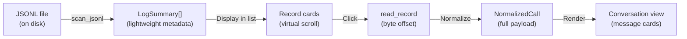
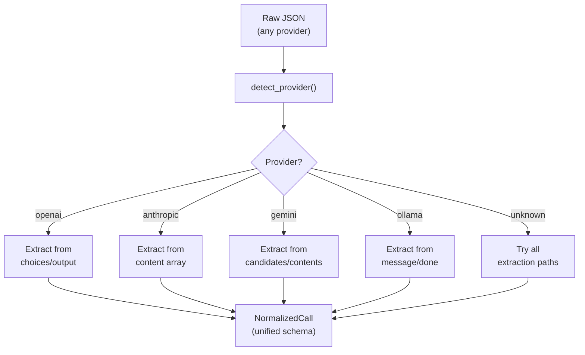
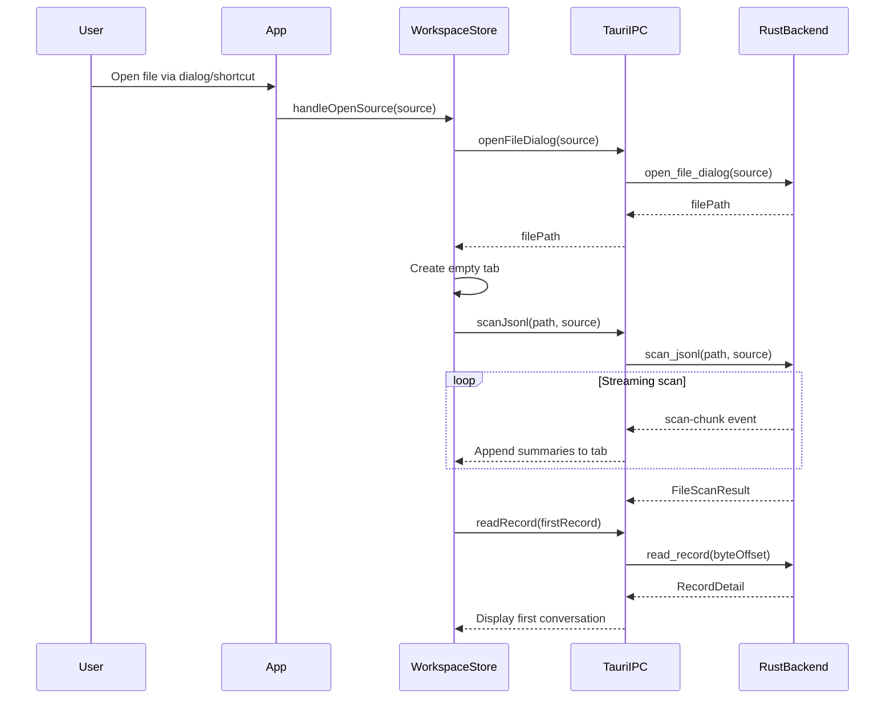
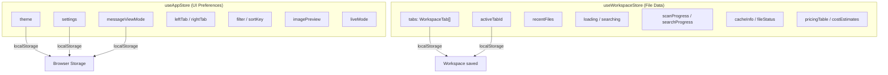
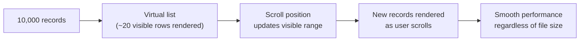

# User Guide

This guide covers every feature of PromptLens in detail. Use the links below to jump to the section you need.

## Guide Sections

| Section | Content |
|---------|---------|
| [Interface Overview](interface-overview.md) | Three-panel layout, title bar, tabs, resize handles |
| [Opening Files](opening-files.md) | Menu, keyboard shortcuts, recent files, source auto-detection |
| [Browsing Records](browsing-records.md) | Virtual list, filtering, sorting, record cards |
| [Viewing Conversations](viewing-conversations.md) | Detail view, message cards, view modes, images |
| [Tool Calls](tool-calls.md) | ToolCallCard, ToolResultCard, Tools tab in right panel |
| [Search](search.md) | FTS5 search, substring search, regex search, context windows |
| [Agent Sessions](agent-sessions.md) | Timeline, subagents, agent files for Codex/Claude Code/etc. |
| [Analytics](analytics.md) | Metrics, charts, latency histogram, cost estimation |
| [Export](export.md) | Six export formats for filtered records |
| [Settings](settings.md) | Theme, fonts, view mode preferences |
| [Keyboard Shortcuts](keyboard-shortcuts.md) | All keyboard shortcuts in a reference table |

## Core Concepts

### Records and Summaries

A **record** is a single JSON line in a JSONL file. When PromptLens scans a file, it creates a **summary** for each valid record. The summary contains extracted metadata (model, provider, tokens, latency, status) without loading the full JSON payload. This allows the record list to display quickly even for large files.

When you click a record, PromptLens reads the raw JSON at the exact byte offset, normalizes it, and displays the full conversation.



The summary type is defined in both Rust and TypeScript:

```rust
// file: src-tauri/src/types.rs:27-47
pub(crate) struct LogSummary {
    pub(crate) id: String,
    pub(crate) line_number: usize,
    pub(crate) byte_offset: u64,
    pub(crate) timestamp: Option<String>,
    pub(crate) provider: Option<String>,
    pub(crate) model: Option<String>,
    pub(crate) trace_id: Option<String>,
    pub(crate) session_id: Option<String>,
    pub(crate) request_id: Option<String>,
    pub(crate) parent_id: Option<String>,
    pub(crate) status: String,
    pub(crate) latency_ms: Option<u64>,
    pub(crate) prompt_tokens: Option<u64>,
    pub(crate) completion_tokens: Option<u64>,
    pub(crate) total_tokens: Option<u64>,
    pub(crate) has_image: bool,
    pub(crate) has_tool_call: bool,
    pub(crate) preview: Option<String>,
    pub(crate) parse_error: Option<String>,
}
```

```ts
// file: src/types.ts:3-23
export type LogSummary = {
  id: string;
  lineNumber: number;
  byteOffset: number;
  timestamp?: string;
  provider?: string;
  model?: string;
  traceId?: string;
  sessionId?: string;
  requestId?: string;
  parentId?: string;
  status: Status;
  latencyMs?: number;
  promptTokens?: number;
  completionTokens?: number;
  totalTokens?: number;
  hasImage: boolean;
  hasToolCall: boolean;
  preview?: string;
  parseError?: string;
};
```

### Provider Normalization

PromptLens automatically detects which LLM provider generated each record. It then normalizes the data into a unified schema with consistent fields. The normalization process handles multiple JSON structures from different providers:



A normalized call contains:

- `request.messages[]` -- Array of messages with `role` and `content`
- `response.messages[]` -- Response messages
- `usage` -- Token counts (prompt, completion, total)
- `error` -- Error details if the call failed

### Byte-Offset Random Access

One of PromptLens's key design decisions is byte-offset indexing. During scanning, each record's byte offset (position from the start of the file) is stored in the summary:

```rust
// file: src-tauri/src/scanner.rs
// During scanning:
byte_offset += bytes_read as u64;
// Store current_offset in summary
```

When the user selects a record, the backend seeks directly to that offset and reads only one line:

```ts
// file: src/tauri.ts:16
export function readRecord(filePath: string, byteOffset: number, lineNumber: number) {
  return invoke<RecordDetail>("read_record", { filePath, byteOffset, lineNumber });
}
```

This provides O(1) random access regardless of file size -- no need to read all preceding lines.

### Workspace Tabs

PromptLens supports opening multiple files simultaneously. Each file gets its own tab in the workspace. Each tab maintains independent state:

- Selected record
- Filter and sort order
- Search results
- Comparison baseline

Switch between tabs by clicking them. Right-click a tab for options to close, close others, or close all.

```ts
// file: src/app/types.ts:160-175
export type WorkspaceTab = {
  id: string;
  source: LogSource;
  file: FileScanResult;
  agentSession: AgentSessionResult | null;
  sessionTabs: SessionTab[];
  activeSessionTabId: string;
  providerFilter: string;
  modelFilter: string;
  statusFilter: string;
  issueOnly: boolean;
  traceFilter: string;
  lastSearchIndexed: boolean | null;
  newLineNumbers: number[];
  lastScanMs: number | null;
  lastSearchMs: number | null;
};
```

### Session Tabs

Within each workspace tab, you can open **session tabs** for subagent conversations. The "Main" tab shows the primary conversation. When you double-click a subagent in the subagent view, it opens in a new session tab.

```tsx
// file: src/app/store.ts:316-330
handleSessionTabSwitch: (sessionTabId) => {
    set((s) => ({
      tabs: s.tabs.map((tab) => {
        if (tab.id !== s.activeTabId) return tab;
        if (sessionTabId !== "main" && !tab.sessionTabs.some((st) => st.id === sessionTabId)) {
          const agentId = sessionTabId.replace(/^subagent:/, "");
          const sub = tab.agentSession?.subagentSessions.find(
            (ss) => ss.agentId === agentId
          );
          if (sub) {
            const newTab: SessionTab = {
              id: sessionTabId,
              kind: "subagent",
              label: sub.description || sub.agentType || sub.agentId,
            };
            return {
              ...tab,
              sessionTabs: [...tab.sessionTabs, newTab],
              activeSessionTabId: sessionTabId,
            };
          }
        }
        return { ...tab, activeSessionTabId: sessionTabId };
      }),
    }));
},
```

## File Loading Flow

When a file is opened, the complete loading sequence is:



## Typical Workflows

### Debugging a Failed API Call

1. Open your JSONL audit log.
2. Set the filter to "Errors" to see only failed calls.
3. Click a record to inspect the error details.
4. Check the Error tab in the right panel for the stack trace.
5. Use the JSON tab to inspect the raw request payload.

### Comparing Model Outputs

1. Open a log containing multiple models.
2. Click the compare icon on a record from model A (sets it as baseline).
3. Click a record from model B.
4. Switch to the Diff tab in the right panel to see a side-by-side comparison.

### Analyzing Token Costs

1. Open your audit log.
2. Switch to the Analytics tab.
3. Review the total cost and average cost metric cards.
4. Check the model bar chart to see which models use the most tokens.
5. Export as CSV for further analysis in a spreadsheet.

### Monitoring Live Logs

1. Open a log file that is still being written to.
2. Click the Live button to enable live mode.
3. PromptLens watches the file and automatically loads new records.
4. New records appear at the top of the list with a "New" badge.

### Inspecting Agent Sessions

1. Open an agent session file (Codex, Claude Code, etc.) using the Open menu.
2. Switch to the Timeline tab to see all events in chronological order.
3. Click any event to see details in the center panel.
4. Use the Subagents tab to see spawned subagent tasks.
5. Double-click a subagent to open its conversation in a new session tab.
6. Use the Agent Files tab to see which files the agent accessed.

## Glossary

| Term | Definition |
|------|------------|
| **Record** | A single JSON line in a JSONL file |
| **Summary** | Extracted metadata from a record (model, provider, tokens, etc.) |
| **Normalized Call** | A record normalized into PromptLens's unified schema |
| **Byte Offset** | The position of a record in the file, measured in bytes from the start |
| **FTS5** | SQLite's full-text search extension, used for content search |
| **Workspace Tab** | A tab representing an open file |
| **Session Tab** | A tab representing a subagent conversation within a workspace tab |
| **Trace** | A group of related API calls identified by trace or session ID |
| **Agent Event** | A single event in an agent session (message, tool call, etc.) |
| **Subagent** | A child agent spawned by the main agent (e.g., Claude Code Task tool) |

## Error Handling

PromptLens handles errors gracefully at every level:

| Error Type | How It's Handled |
|-----------|-----------------|
| Invalid JSON line | Flagged as `invalid_json` in summary; skipped during normalization |
| File not found | Warning banner shown with suggestion to rescan |
| File changed on disk | Warning banner shown with option to load appended records or rescan |
| Parse error | Error message shown in center panel instead of conversation |
| Network errors | Not applicable (PromptLens is fully offline) |
| Large file memory | Virtual scrolling and on-demand loading prevent memory issues |

### Incremental Scan on File Change

When PromptLens detects that the file has changed on disk (via `FileWatcher`), it offers an incremental scan that reads only the new bytes:

```ts
// file: src/app/store.ts
handleLoadAppendedRecords: async () => {
  const file = tab.file;
  const result = await scanJsonlIncremental(
    file.filePath,
    file.fileSize,
    file.summaries.length
  );
  // Append new summaries to existing tab
  get().updateActiveTab({
    file: {
      ...file,
      summaries: [...file.summaries, ...result.summaries],
      fileSize: result.fileSize,
      modified: result.modified,
    },
  });
},
```

## Application State Architecture

PromptLens uses two Zustand stores for state management:



`useAppStore` handles UI preferences that persist across sessions. `useWorkspaceStore` manages file-specific data, tab state, and async operations like scanning and searching.

## LogSource Type

PromptLens supports multiple source types for different kinds of JSONL files:

```ts
// file: src/types.ts:139
export type LogSource =
  | "audit"          // Standard LLM audit log
  | "codex"          // OpenAI Codex agent session
  | "claude_code"    // Claude Code agent session
  | "opencode"       // OpenCode agent session
  | "openclaw"       // OpenClaw agent session
  | "generic_agent"; // Generic agent JSONL
```

The source type determines which parser and adapter are used to process the file. When opening a file via the Open menu, you explicitly choose the source type. The `detectLogSource` command can also auto-detect the source from the JSON structure.

## Tab Context Menu

Right-clicking a workspace tab shows a context menu:

| Action | Description |
|--------|-------------|
| Close | Closes the tab |
| Close Others | Closes all tabs except the one right-clicked |
| Close All | Closes all tabs |

## Record Card Anatomy

Each record card in the list displays:

| Field | Source |
|-------|--------|
| Status dot | Color-coded: green (success), red (error), gray (invalid) |
| Model name | `LogSummary.model` |
| Provider | `LogSummary.provider` |
| Timestamp | `LogSummary.timestamp` |
| Preview | `LogSummary.preview` (first user message snippet) |
| Latency | `LogSummary.latencyMs` |
| Token count | `LogSummary.totalTokens` |
| Tool call icon | Shown when `LogSummary.hasToolCall` is true |
| Image icon | Shown when `LogSummary.hasImage` is true |
| Cost | Calculated from pricing table |

## Virtual Scrolling

The record list uses virtual scrolling (via `@tanstack/react-virtual`) for efficient handling of large files:



Only visible records plus a small overscan buffer are rendered to the DOM, keeping memory usage constant regardless of file size.

## Related Pages

- [Interface Overview](interface-overview.md) -- Layout and component details
- [Opening Files](opening-files.md) -- File dialog and source types
- [Browsing Records](browsing-records.md) -- Filtering, sorting, record cards
