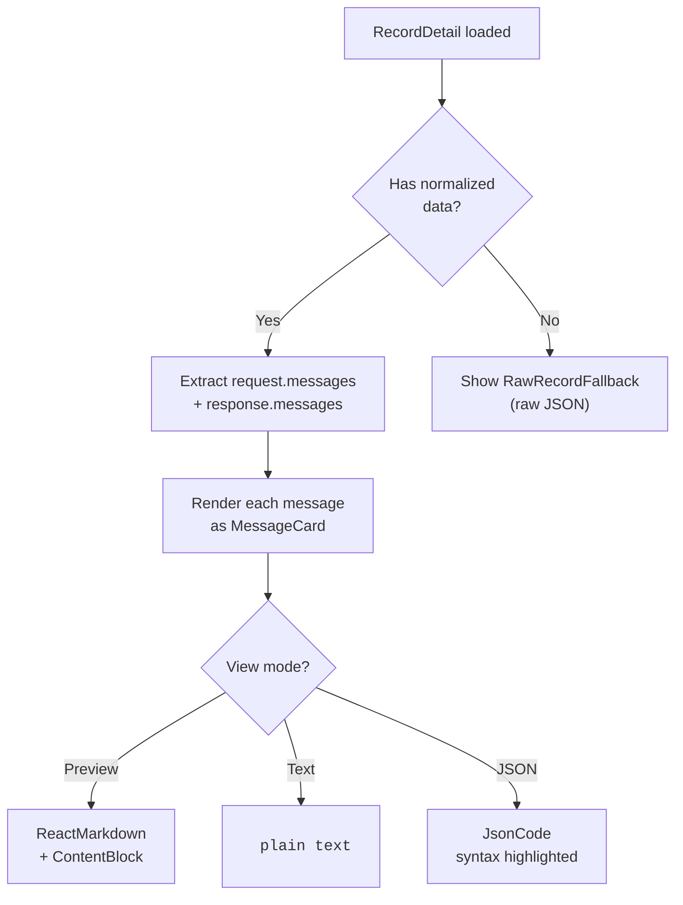

# Viewing Conversations

The center panel displays the full conversation of the selected record. It renders request and response messages as interactive cards.

## Conversation Layout

When you select a record, the center panel shows:

1. **Record header** with model, provider, line number, latency, and status.
2. **Error card** (if the record has an error).
3. **Request messages** from the LLM API request.
4. **Response messages** from the LLM API response.



```
+----------------------------------------------------------+
| gpt-4.1                                                  |
| openai · line 42 · 234ms                           [OK]  |
+----------------------------------------------------------+
| [system]                                    [Copy][Preview][Text][JSON]|
| You are a helpful assistant.                               |
+----------------------------------------------------------+
| [user]                                      [Copy][Preview][Text][JSON]|
| What is the capital of France?                             |
+----------------------------------------------------------+
| [assistant]                                 [Copy][Preview][Text][JSON]|
| The capital of France is **Paris**. It has been...         |
+----------------------------------------------------------+
```

The `DetailView` component is the entry point for the center panel. It checks for agent events, parse errors, and the presence of normalized data before rendering:

```tsx
// file: src/app/components/CenterPanel.tsx:11
export const DetailView = memo(function DetailView({
  detail, selected, agentEvent, messageViewMode,
  onMessageViewModeChange, onImagePreview,
}) {
  if (!selected) return <div className="empty-state">Select a record to inspect its request and response.</div>;
  if (!detail) return <div className="empty-state">Loading record...</div>;
  if (detail.parseError) return <div className="record-error">{detail.parseError}</div>;
  if (agentEvent) return <AgentEventDetailView event={agentEvent} detail={detail} />;

  const requestMessages = detail.normalized?.request?.messages ?? [];
  const responseMessages = detail.normalized?.response?.messages ?? [];
  // ... render messages
});
```

## Message Cards

Each message card (called `MessageCard` in the source) displays one message in the conversation, with a role indicator and action buttons:

```tsx
// file: src/app/components/CenterPanel.tsx:299
export function MessageCard({ message, viewMode, onViewModeChange, onImagePreview }) {
  const isJson = viewMode === "json";
  return (
    <article className={`message-card role-${message.role}`}>
      <div className="message-role">
        <span>{message.role}</span>
        <div className="message-actions">
          <button onClick={() => copyJson(message.raw ?? message.content)} title="Copy message">
            <Copy size={14} />
          </button>
          <button className={viewMode === "preview" ? "active" : ""} onClick={() => onViewModeChange("preview")}>
            Preview
          </button>
          <button className={viewMode === "text" ? "active" : ""} onClick={() => onViewModeChange("text")}>
            Text
          </button>
          <button className={isJson ? "active" : ""} onClick={() => onViewModeChange("json")}>
            JSON
          </button>
        </div>
      </div>
      <div className="message-content">
        {isJson ? (
          <JsonCode value={message.raw ?? message.content} />
        ) : (
          message.content.map((content, index) => (
            <ContentBlock key={index} content={content} textMode={viewMode === "text"} onImagePreview={onImagePreview} />
          ))
        )}
      </div>
    </article>
  );
}
```

### Role Styling

Each role has a distinct visual style via the CSS class `role-${message.role}`:

| Role | Visual Treatment |
|------|-----------------|
| system | Subtle background, smaller text |
| developer | Similar to system |
| user | Standard background |
| assistant | Highlighted background |
| tool | Unique styling for tool results |
| function | Legacy function call styling |

The role value comes from the `NormalizedMessage` type, populated during normalization:

```rust
// file: src-tauri/src/types.rs:240
pub(crate) struct NormalizedMessage {
    pub(crate) role: String,
    pub(crate) content: Vec<NormalizedContent>,
    pub(crate) raw: Option<Value>,
}
```

Roles are normalized by the `normalize_role()` function, ensuring consistent values across providers:

```rust
// file: src-tauri/src/adapters.rs:3
pub(crate) fn normalize_role(role: &str) -> String {
    match role {
        "system" | "developer" | "user" | "assistant" | "tool" | "function" => role.to_string(),
        "model" => "assistant".to_string(),
        _ => "unknown".to_string(),
    }
}
```

## Three View Modes

Each message card supports three view modes. The mode is shared across all cards and managed by the `messageViewMode` state in `useAppStore`.

### Preview Mode (Default)

Renders content as rich text using `react-markdown` with `remark-gfm`:

```tsx
// file: src/app/components/CenterPanel.tsx:409
if (content.type === "text") {
  if (textMode) {
    return <pre className="plain-text-block">{content.text}</pre>;
  }
  return (
    <div className="markdown">
      <ReactMarkdown remarkPlugins={[remarkGfm]}>{content.text}</ReactMarkdown>
    </div>
  );
}
```

- **Text content** is rendered as Markdown with GitHub Flavored Markdown support (tables, strikethrough, task lists)
- **Images** are shown as clickable thumbnails that open in a preview modal
- **Tool calls** are rendered as structured `ToolCallCard` components
- **Tool results** are rendered as collapsible `ToolResultCard` components

### Text Mode

Renders all text content as plain text in a `<pre>` block. No Markdown rendering. Useful for copying raw text or inspecting whitespace.

### JSON Mode

Renders the entire message object as syntax-highlighted JSON using a custom regex-based tokenizer:

```tsx
// file: src/app/analytics.ts:435
export function highlightJson(json: string) {
  return json.replace(
    /("(?:\\.|[^"\\])*")\s*:/g,
    '<span class="json-key">$1</span>:',
  );
}
```

The `JsonCode` component applies color classes for different JSON value types:

```tsx
// file: src/app/analytics.ts:442
export function jsonScalarClass(value: unknown) {
  if (typeof value === "number") return "json-number";
  if (typeof value === "boolean") return "json-boolean";
  if (value === null) return "json-null";
  return "json-string";
}
```

| Token Type | CSS Class | Color (Dark Theme) |
|------------|-----------|-------------------|
| Object key | `json-key` | Blue |
| String | `json-string` | Green |
| Boolean | `json-boolean` | Purple |
| Null | `json-null` | Gray |
| Number | `json-number` | Orange |

## Content Types

Each message contains an array of **content parts** (`NormalizedContent`). PromptLens handles five content types, defined as a Rust enum:

```rust
// file: src-tauri/src/types.rs:247
#[derive(Debug, Serialize, Deserialize)]
#[serde(tag = "type", rename_all = "snake_case")]
pub(crate) enum NormalizedContent {
    Text { text: String },
    Image { mime: Option<String>, data_url: Option<String>, base64: Option<String> },
    ToolCall { name: Option<String>, arguments: Option<Value> },
    ToolResult { name: Option<String>, result: Option<Value> },
    Unknown { raw: Value },
}
```

### Text Content

```json
{ "type": "text", "text": "Hello, how can I help?" }
```

### Image Content

```json
{
  "type": "image",
  "mime": "image/png",
  "dataUrl": "data:image/png;base64,..."
}
```

Image detection happens both in the backend (during normalization) and frontend. The backend uses the `image_detector` module to detect base64-encoded images in various formats:

```rust
// file: src-tauri/src/parser/image_detector.rs
// Detects PNG (iVBOR), JPEG (/9j/), GIF (R0lGOD), WebP (UklGR) magic bytes
// Also detects data:image/*;base64, prefix strings
```

The frontend provides `imageDataUrlFromString()` for additional image detection in content:

```tsx
// file: src/app/analytics.ts:449
export function imageDataUrlFromString(value: string): string | null {
  if (value.startsWith("data:image/")) return value;
  return null;
}
```

### Tool Call Content

```json
{
  "type": "tool_call",
  "name": "get_weather",
  "arguments": { "city": "Paris" }
}
```

### Tool Result Content

```json
{
  "type": "tool_result",
  "name": "get_weather",
  "result": { "temp": "18C", "condition": "cloudy" }
}
```

## Agent Event Detail View

When viewing agent sessions and selecting an event in the timeline, the center panel shows an **agent event detail view** with sections that adapt to the event type:

```tsx
// file: src/app/components/CenterPanel.tsx:105
function AgentEventDetailView({ event, detail }) {
  const output = rawTxtByKeys(event.raw, ["output", "stdout", "stderr", "result"]);
  const reasoning = event.eventType === "reasoning"
    ? event.text || rawTxtByKeys(event.raw, ["thinking", "summary", "reasoning"])
    : null;
  const toolInput = rawValByKeys(event.raw, ["input", "arguments", "args", "parameters"]);
  const toolResult = rawValByKeys(event.raw, ["result", "output", "content", "stdout", "stderr"]);
  // ... render sections based on event type
}
```

The `rawValByKeys` and `rawTxtByKeys` helpers recursively search nested JSON objects for keys, enabling flexible extraction across different agent formats:

```tsx
// file: src/app/analytics.ts:359
export function rawValueByKeys(obj: unknown, keys: string[]): unknown {
  if (typeof obj !== "object" || obj === null) return undefined;
  for (const key of keys) {
    if (key in (obj as Record<string, unknown>)) return (obj as Record<string, unknown>)[key];
  }
  for (const value of Object.values(obj as Record<string, unknown>)) {
    const found = rawValueByKeys(value, keys);
    if (found !== undefined) return found;
  }
  return undefined;
}
```

| Section | Content |
|---------|---------|
| **Summary grid** | Provider, model, role, status, duration, tokens, turn ID, parent ID, tool use ID, subagent type, agent ID |
| **Reasoning** | For reasoning events, shows the model's internal reasoning text |
| **Command** | For shell command events, shows the command and its output |
| **Subagent call** | For subagent events, shows subagent type, description, and prompt |
| **Tool result** | Structured output (stdout, stderr, file contents) |
| **Files** | List of file paths referenced in the event |
| **File preview** | For file read/write/edit/patch events, shows content or diff |
| **Raw event** | Full raw JSON of the event |

## Fallback: Raw Record View

If PromptLens cannot parse messages from a record (no normalized data), it falls back to a raw view that attempts to extract request and response payloads from the raw JSON:

```tsx
// file: src/app/components/CenterPanel.tsx:87
function RawRecordFallback({ detail }) {
  const request = detail.normalized?.request?.raw
    ?? rawValByKeys(detail.raw, ["request", "input", "prompt", "messages"]);
  const response = detail.normalized?.response?.raw
    ?? rawValByKeys(detail.raw, ["response", "output", "completion", "result"]);
  return (
    <div className="raw-fallback">
      <section className="agent-detail-section">
        <h2>Raw Request</h2>
        <JsonCode value={request ?? "No request payload found."} />
      </section>
      <section className="agent-detail-section">
        <h2>Raw Response</h2>
        <JsonCode value={response ?? "No response payload found."} />
      </section>
    </div>
  );
}
```

## Copying Content

| What to Copy | Method |
|-------------|--------|
| Single message | Click the copy button on the message card |
| Full record JSON | Press `Ctrl+Shift+C` |
| Text content | Switch to Text mode, manually select and copy |
| Image | Right-click the image in the preview modal |

The `Ctrl+Shift+C` shortcut copies the raw JSON of the currently selected record:

```tsx
// file: src/app/App.tsx:206
if (mod && event.shiftKey && event.key.toLowerCase() === "c") {
  event.preventDefault();
  void copyJson(detail?.raw);
}
```

## Record Loading Pipeline

When a record is selected, the frontend calls `read_record`, which seeks to the byte offset and parses a single JSON line:

```rust
// file: src-tauri/src/commands.rs:106
fn read_record(
    file_path: String,
    byte_offset: u64,
    line_number: usize,
) -> Result<RecordDetail, String> {
    let file = File::open(&file_path)?;
    let mut reader = BufReader::new(file);
    reader.seek(SeekFrom::Start(byte_offset))?;
    let mut line = String::new();
    reader.read_line(&mut line)?;
    // Parse JSON, normalize, return RecordDetail
}
```

The `RecordDetail` contains the summary, normalized call, and raw JSON:

```rust
// file: src-tauri/src/types.rs:66
pub(crate) struct RecordDetail {
    pub(crate) summary: LogSummary,
    pub(crate) normalized: Option<NormalizedCall>,
    pub(crate) raw: Option<Value>,
    pub(crate) parse_error: Option<String>,
}
```

This byte-offset seeking design means selecting any record in a multi-GB file is instantaneous -- O(1) access regardless of file size.
