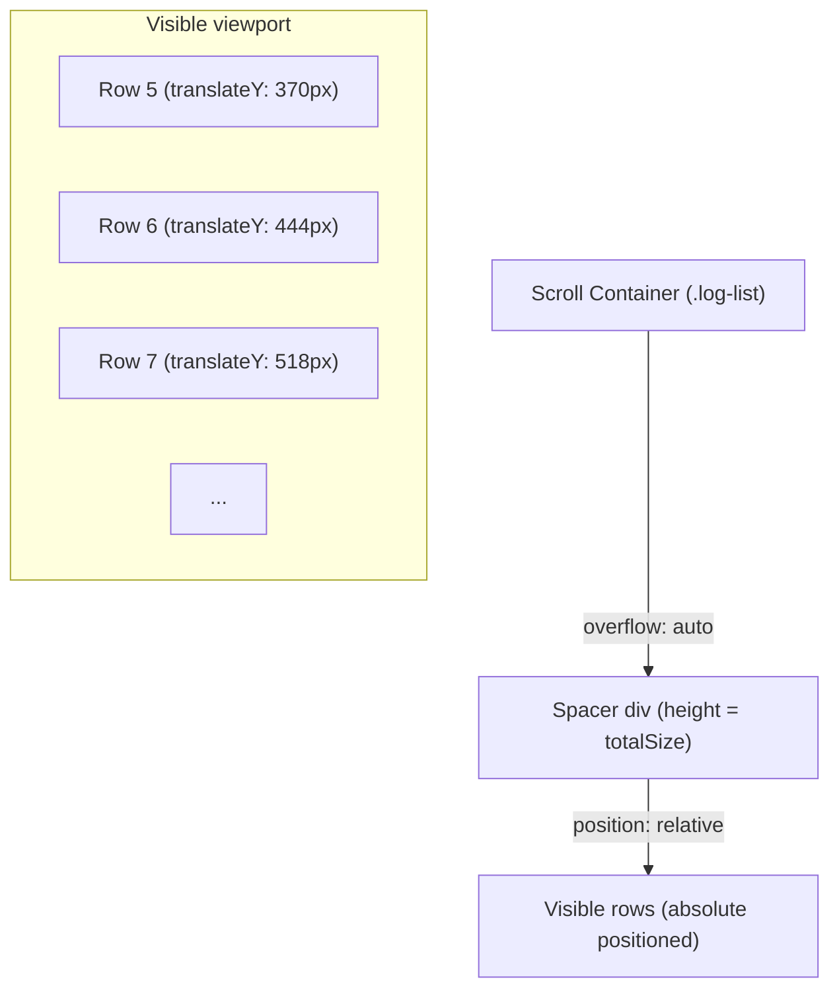
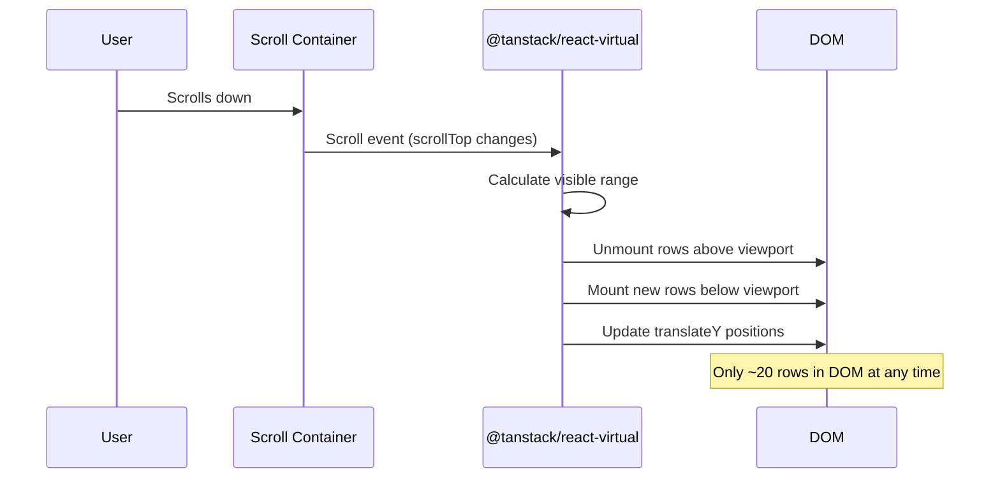
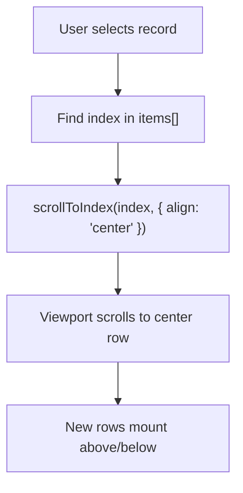
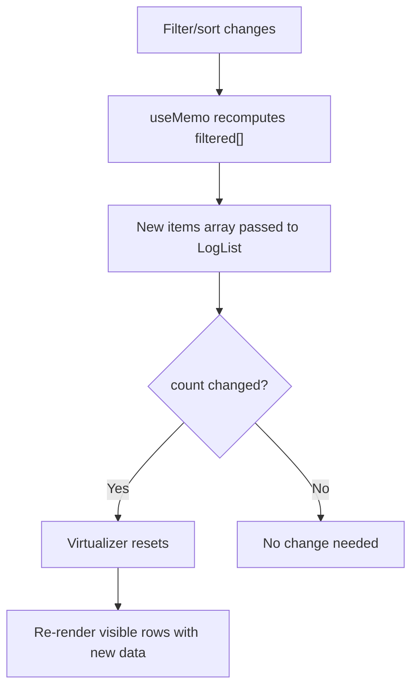
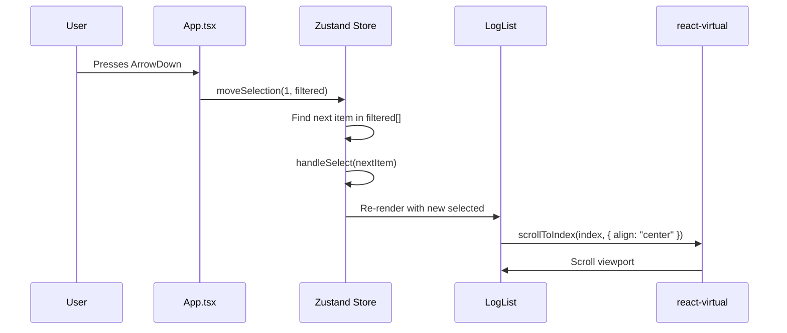

# Virtual Scrolling

PromptLens must handle JSONL files with tens of thousands of records. Rendering every record as a DOM node would freeze the browser. The solution is virtual scrolling: only the rows visible at any moment exist in the DOM.

## Why Virtual Scrolling?

A typical LLM audit log may contain 10,000-100,000 lines of JSON. Each record row in the log list has a fixed height of 74px and contains:

- Status dot, model name, timestamp (top row)
- Provider, latency, tokens, cost, icons (metadata row)
- Preview text (bottom row)

| Records | DOM Nodes (No Virtualization) | DOM Nodes (With Virtualization) | Memory Impact |
|---------|-------------------------------|--------------------------------|---------------|
| 1,000 | ~3,000 | ~60-75 | Negligible difference |
| 10,000 | ~30,000 | ~60-75 | Noticeable lag without virtualization |
| 50,000 | ~150,000 | ~60-75 | Browser freezes without virtualization |
| 100,000 | ~300,000 | ~60-75 | Unusable without virtualization |

With virtualization, only approximately 15-20 rows are mounted at any time regardless of the total count.

## Library: @tanstack/react-virtual

PromptLens uses `@tanstack/react-virtual` v3.13 (from the TanStack family). It was chosen over alternatives like `react-window` or `react-virtuoso` because:

| Library | Pros | Cons |
|---------|------|------|
| **@tanstack/react-virtual (chosen)** | Maintained by TanStack, lightweight (~3KB), flexible API, `scrollToIndex()` | Newer, smaller community |
| react-window | Mature, widely used | No dynamic heights, less flexible API |
| react-virtuoso | Auto-height, smart scrolling | Heavier (~10KB), more opinionated API |

## Implementation

The virtual list is implemented in the `LogList` component inside `src/app/components/LeftPanel.tsx`.

### Setup

```tsx
// file: src/app/components/LeftPanel.tsx:2
import { useVirtualizer } from "@tanstack/react-virtual";

function LogList({ items, selected, ... }) {
  const parentRef = useRef<HTMLDivElement | null>(null);

  const rowVirtualizer = useVirtualizer({
    count: items.length,           // Total number of items
    getScrollElement: () => parentRef.current,  // Scroll container
    estimateSize: () => 74,        // Estimated row height in px
    overscan: 10,                  // Extra rows rendered above/below viewport
  });

  return (
    <div ref={parentRef} className="log-list">
      <div style={{
        height: rowVirtualizer.getTotalSize(),  // Total scrollable height
        position: "relative",
      }}>
        {rowVirtualizer.getVirtualItems().map((virtualRow) => {
          const item = items[virtualRow.index];
          return (
            <button
              key={`${item.id}-${item.lineNumber}`}
              className="log-row"
              style={{
                transform: `translateY(${virtualRow.start}px)`,
              }}
            >
              {/* Row content */}
            </button>
          );
        })}
      </div>
    </div>
  );
}
```

### How It Works



1. A `div` is rendered as a spacer with `height` equal to `count * estimatedSize` (e.g., 50,000 * 74 = 3.7M pixels). This creates the correct scrollbar.
2. Only rows visible in the viewport (plus 10 overscan rows above and below) are rendered.
3. Each row is absolutely positioned using `transform: translateY(virtualRow.start)`.
4. As the user scrolls, `react-virtual` recalculates which rows are visible and mounts/unmounts them.



### Key Configuration

| Parameter | Value | Purpose |
|-----------|-------|---------|
| `count` | `items.length` | Total number of filtered records |
| `estimateSize` | `74` | Fixed row height matching CSS `.log-row { height: 74px }` |
| `overscan` | `10` | 10 extra rows above/below viewport for smooth scrolling |

The `overscan` value of 10 means approximately 15-25 rows are rendered at any time (5-15 visible + 10 buffer). This provides smooth scrolling without visible popping.

### Auto-Scroll to Selected Record

When a user selects a record (via click or keyboard navigation), the virtualizer scrolls to center it:

```tsx
// file: src/app/components/LeftPanel.tsx (approximate)
useEffect(() => {
  if (!selected) return;
  const index = items.findIndex((item) => isSameLine(item, selected));
  if (index >= 0) {
    rowVirtualizer.scrollToIndex(index, { align: "center" });
  }
}, [items, rowVirtualizer, selected]);
```

The `align: "center"` option scrolls the viewport so the selected row is vertically centered.



## CSS for Virtual Rows

The CSS in `src/styles/list.css` is designed to work with absolute positioning:

```css
/* file: src/styles/list.css (approximate) */
.log-list {
  height: calc(100% - 58px);  /* Fill remaining space below file header */
  overflow: auto;              /* This is the scroll container */
}

.log-row {
  position: absolute;          /* Positioned by react-virtual */
  left: 0;
  width: 100%;
  height: 74px;                /* Must match estimateSize */
  padding: 10px 14px;
  border: 0;
  border-bottom: 1px solid var(--glass-border);
  background: transparent;
  cursor: pointer;
  transition: background 120ms var(--ease);
}

.log-row:hover {
  background: var(--glass-bg-hover);
}

.log-row.selected {
  background: var(--surface-selected);
  box-shadow: inset 3px 0 0 var(--accent);
}
```

The fixed `height: 74px` on `.log-row` is critical -- it must exactly match the `estimateSize` value. If they do not match, rows will overlap or leave gaps.

### Why position: absolute + translateY?

The `position: absolute` and `transform: translateY()` approach avoids layout thrashing:

| Method | Behavior | Performance |
|--------|----------|-------------|
| **absolute + translateY (chosen)** | Each row positioned independently | No sibling recalculation |
| relative + margin-top | Rows push each other | Full relayout on mount/unmount |
| flexbox | Rows flow naturally | Expensive for 50k+ items |

With absolute positioning, mounting/unmounting a row has zero impact on sibling positions. The browser only needs to paint the changed rows without recalculating the entire list layout.

## Performance Characteristics

| Metric | Without Virtualization | With Virtualization |
|--------|----------------------|---------------------|
| DOM nodes (50k records) | ~150,000 | ~60-75 |
| Initial render | 500ms+ | &lt;50ms |
| Memory | 200MB+ | ~20MB |
| Scroll performance | Janky (dropped frames) | 60fps |
| Filter/sort | Full DOM diff | Nearly instant |

## Filter and Sort Interaction

When the user changes filters or sort order, the `items` array passed to `LogList` changes. The virtualizer automatically resets because the `count` changes:

```typescript
// In App.tsx
const filtered = useMemo(() => {
  return [...file.summaries]
    .filter((item) => { /* ... */ })
    .sort((a, b) => compareSummary(a, b, sortKey));
}, [file, filter, sortKey, query, ...]);

// Passed to LeftPanel -> LogList
<LogList items={records} ... />
```

The `LogList` component receives the filtered and sorted array. The virtualizer simply re-renders with the new count. No manual reset is needed.



## Incremental Records

When new records are appended via incremental scanning, they appear with a "New" badge and green highlight:

```tsx
const newLineSet = useMemo(() => new Set(newLineNumbers), [newLineNumbers]);

// In the row renderer
const isNew = newLineSet.has(item.lineNumber);
return (
  <button className={`log-row ${isNew ? "new-record" : ""}`}>
    {isNew ? <span className="new-badge">New</span> : null}
    {/* ... */}
  </button>
);
```

The `newLineNumbers` array is tracked per workspace tab and cleared when the user selects a new record.

## Row Structure

Each virtual row is a `<button>` element containing three visual layers:

```tsx
<button className="log-row" style={{ transform: `translateY(${virtualRow.start}px)` }}>
  <div className="row-top">
    <span className={`status-dot ${item.status}`} />   {/* Green/red dot */}
    {isNew ? <span className="new-badge">New</span> : null}
    <span className="model">{item.model}</span>         {/* Model name */}
    <span className="time">{formatTime(item.timestamp)}</span>
  </div>
  <div className="row-meta">
    <span>{item.provider}</span>                        {/* Provider name */}
    <span>{formatLatency(item.latencyMs)}</span>        {/* Latency */}
    <span>{formatTokens(item.totalTokens)}</span>       {/* Token count */}
    {cost > 0 ? <span className="cost">${cost}</span> : null}
    {item.hasImage ? <Image size={14} /> : null}        {/* Image icon */}
    {item.hasToolCall ? <Wrench size={14} /> : null}    {/* Tool icon */}
    <span className="row-compare"><GitCompare size={13} /></span>
  </div>
  <div className="preview">{item.preview}</div>         {/* Truncated text */}
</button>
```

The 74px row height is sufficient to fit all three layers plus padding.

## Keyboard Navigation

Records can be navigated with arrow keys. The `moveSelection` action in the workspace store moves the selection by +1 or -1 in the filtered array:

```typescript
// In App.tsx keyboard handler
if (event.key === "ArrowDown") {
  event.preventDefault();
  ws().moveSelection(1, filtered);
}
if (event.key === "ArrowUp") {
  event.preventDefault();
  ws().moveSelection(-1, filtered);
}
```

```typescript
// In store
moveSelection: (delta, filtered) => {
  const index = filtered.findIndex((item) => item.id === selected.id);
  const next = filtered[Math.max(0, Math.min(filtered.length - 1, index + delta))];
  if (next && next.id !== selected.id) void get().handleSelect(next);
},
```

When `handleSelect` updates the `selected` value, a `useEffect` in `LogList` fires and calls `scrollToIndex(index, { align: "center" })`.



## Limitations

| Limitation | Current Status | Potential Solution |
|-----------|---------------|-------------------|
| Fixed row height only | All rows are 74px | Dynamic heights with `measureElement` |
| No horizontal virtualization | All content rendered per row | Not needed -- rows are compact |
| No infinite scrolling | Full filtered array in memory | Cursor-based loading (backend supports via byte offsets) |
| Scroll position lost on filter | Resets to top when filter changes | Save/restore scroll position per filter state |

- **Fixed row height only**: The current implementation assumes all rows are exactly 74px. If row content height were variable, `estimateSize` would need to return measured heights.
- **No horizontal virtualization**: All content is rendered per row. For extremely wide data this is not an issue because rows are compact.
- **No infinite scrolling**: The full filtered array lives in memory. For million-record files, a cursor-based loading strategy would be needed (the Rust backend supports this via byte offsets, but the frontend does not implement it yet).
- **Scroll position lost on filter**: When a filter change causes the array to shrink, the scroll position resets to the top. The selected item may scroll out of view until the user navigates to it.
