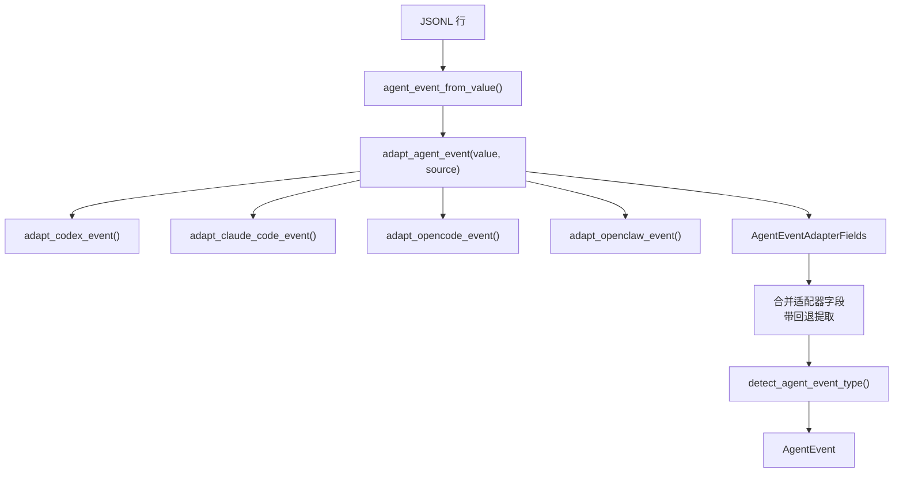
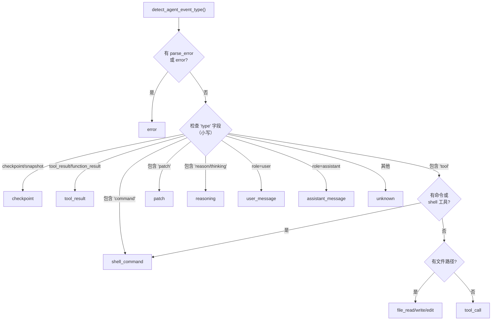
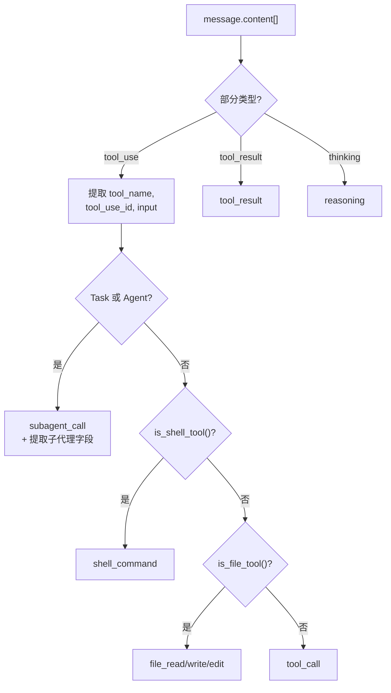

# 代理事件解析

代理事件解析将来自编码代理（Claude Code、Codex、OpenCode、OpenClaw）的 JSONL 日志转换为统一的 `AgentEvent` 结构。这与审计日志规范化不同，因为代理会话包含工具调用、文件操作、推理步骤和子代理调用，而非请求/响应对。

## 架构



## AgentEvent 字段

```rust
// file: src-tauri/src/types.rs:148
pub(crate) struct AgentEvent {
    pub(crate) id: String,
    pub(crate) event_type: String,
    pub(crate) role: Option<String>,
    pub(crate) tool_name: Option<String>,
    pub(crate) tool_use_id: Option<String>,
    pub(crate) command: Option<String>,
    pub(crate) file_paths: Vec<String>,
    pub(crate) text: Option<String>,
    pub(crate) is_error: bool,
    pub(crate) is_sidechain: bool,
    pub(crate) raw: Value,
    // ... 更多字段
}
```

## 适配器字段

每个提供者适配器返回带有可选覆盖的 `AgentEventAdapterFields` 结构体：

```rust
// file: src-tauri/src/agent_adapters.rs:9
#[derive(Debug, Default)]
pub(crate) struct AgentEventAdapterFields {
    pub(crate) role: Option<String>,
    pub(crate) tool_name: Option<String>,
    pub(crate) tool_use_id: Option<String>,
    pub(crate) command: Option<String>,
    pub(crate) file_paths: Vec<String>,
    pub(crate) text: Option<String>,
    pub(crate) event_type: Option<String>,
    pub(crate) status: Option<String>,
    pub(crate) subagent_type: Option<String>,
    pub(crate) subagent_description: Option<String>,
    pub(crate) subagent_prompt: Option<String>,
    pub(crate) is_error: bool,
}
```

适配器分发：

```rust
// file: src-tauri/src/agent_adapters.rs:74
pub(crate) fn adapt_agent_event(value: &Value, source: LogSource) -> AgentEventAdapterFields {
    let mut fields = match source {
        LogSource::Codex => adapt_codex_event(value),
        LogSource::ClaudeCode => adapt_claude_code_event(value),
        LogSource::OpenCode => adapt_opencode_event(value),
        LogSource::OpenClaw => adapt_openclaw_event(value),
        LogSource::Audit | LogSource::GenericAgent => AgentEventAdapterFields::default(),
    };
    normalize_adapter_fields(&mut fields);
    fields
}
```

## 事件类型检测树



## Claude Code 适配器

处理 Claude Code 的消息格式，含 `message.content[]` 数组：



### 特殊记录类型

| `type` 值 | 映射到 | 额外字段 |
|-----------|--------|----------|
| `file-history-snapshot` | `checkpoint` | -- |
| `queue-operation` | `checkpoint` | `status` 来自 `operation` |
| `system` | `system` | `status` 来自 `subtype`/`level` |
| `permission-mode` | `checkpoint` | `status` 来自 `permissionMode` |
| `last-prompt` | `checkpoint` | `text` 来自 `lastPrompt` |

## 工具分类

### Shell 工具

```rust
// file: src-tauri/src/agent_adapters.rs:401
pub(crate) fn is_shell_tool(tool_name: &str) -> bool {
    let lowered = tool_name.to_lowercase();
    lowered.contains("bash") || lowered.contains("shell") || lowered.contains("terminal")
        || lowered.contains("exec") || lowered.contains("command")
}
```

### 文件工具

```rust
// file: src-tauri/src/agent_adapters.rs:410
pub(crate) fn is_file_tool(tool_name: &str) -> bool {
    let lowered = tool_name.to_lowercase();
    lowered.contains("edit") || lowered.contains("patch") || lowered.contains("write")
        || lowered.contains("read") || lowered.contains("file")
}
```

### 文件事件类型映射

| 工具名包含 | 事件类型 |
|-----------|----------|
| `read` | `file_read` |
| `write` 或 `create` | `file_write` |
| `patch` 或 `edit` | `patch` |
| 其他文件工具 | `file_edit` |

## 字段提取

### 命令提取

命令通过检查多个键位置找到：

```rust
// file: src-tauri/src/agent.rs:446
pub(crate) fn agent_command(value: &Value) -> Option<String> {
    first_string(value, &["command", "cmd", "shell_command", "shellCommand", "bash", "script"])
        .or_else(|| {
            find_first_key(value, &["arguments", "args", "input", "parameters"])
                .and_then(|input| first_string(input, &["cmd", "command"]))
        })
}
```

### 文件路径提取

文件路径从 `path`、`file`、`file_path`、`filePath`、`target_file` 等 JSON 键递归收集。路径限制为 16 个。
