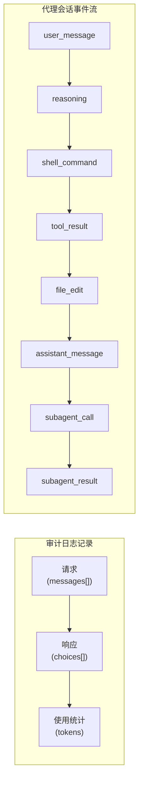
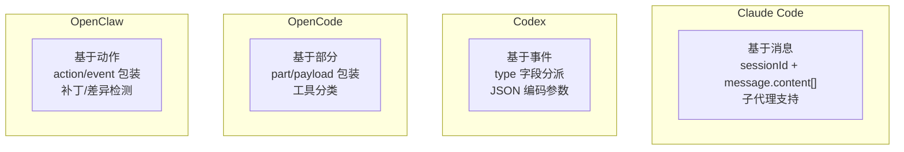
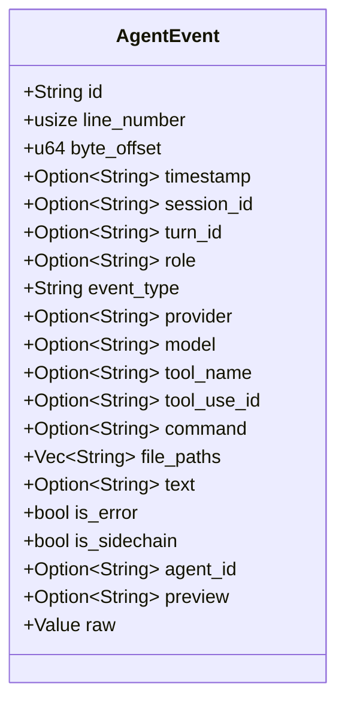
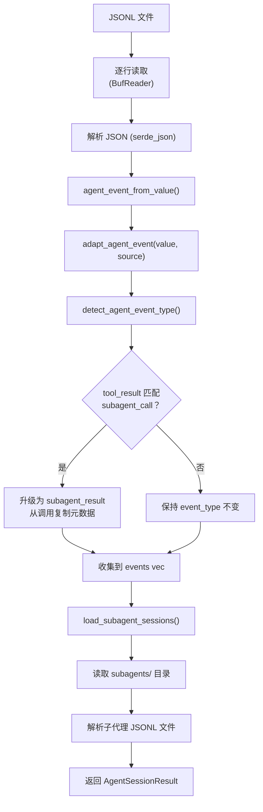
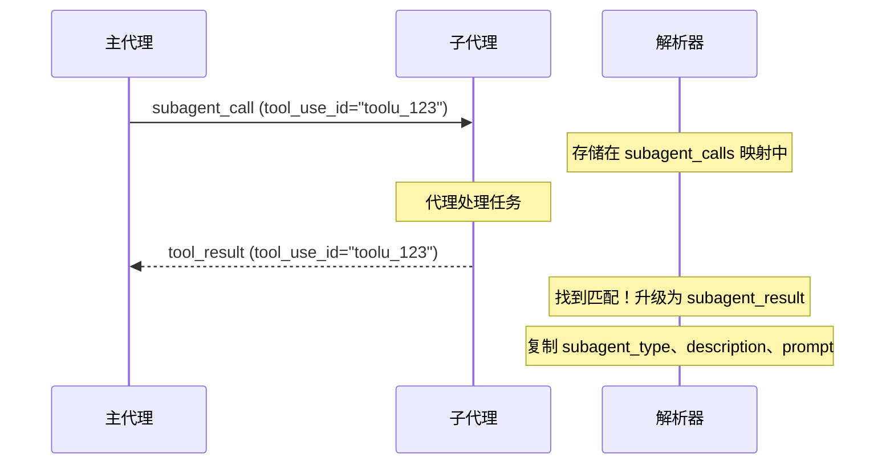
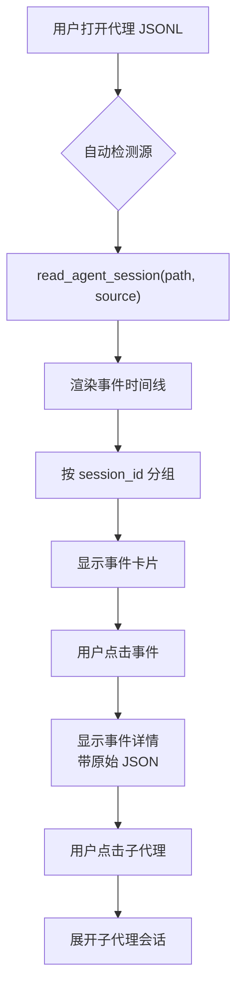

# 代理会话概述

代理会话代表由 AI 编码代理（如 Claude Code、Codex、OpenCode 和 OpenClaw）产生的活动日志。与记录请求/响应对的传统 LLM 审计日志不同，代理会话捕获自主编码任务的完整工作流：推理步骤、工具调用、文件操作、shell 命令和子代理调用。

## 审计日志 vs 代理会话



| 方面 | 审计日志 | 代理会话 |
|------|----------|----------|
| 结构 | 请求/响应对 | 顺序事件流 |
| 粒度 | 单次 API 调用 | 多步骤工作流 |
| 内容 | 消息、使用量、延迟 | 工具、文件、命令、推理 |
| 解析 | `normalize_call()` | `agent_event_from_value()` |
| Tauri 命令 | `read_record` | `read_agent_session` |
| 缓存键 | `(file_path, file_size, modified)` | `(file_path, source, file_size, modified)` |
| 输出类型 | `NormalizedCall` | `Vec<AgentEvent>` |
| UI 视图 | 对话视图 | 时间线视图 |

关键架构差异是审计日志每行 JSONL 产生单个 `NormalizedCall`（请求 + 响应 + 使用量），而代理会话产生 `AgentEvent` 对象流，其中每行代表代理工作流中的一个步骤。

## 支持的源



| 源 | 标识符 | 日志格式 | 关键信号 |
|----|--------|----------|----------|
| Claude Code | `claude_code` | 带 `sessionId` 和 `message.content[]` 的消息格式 | `sessionId` + `message` |
| Codex | `codex` | 带 `type` 字段分派的事件格式 | `exec_command` 工具 |
| OpenCode | `opencode` | 带 `part` 或 `payload` 包装的部分格式 | 字符串包含 `opencode` |
| OpenClaw | `openclaw` | 带 `action` 或 `event` 包装的动作格式 | 字符串包含 `openclaw` |

每个源在 `src-tauri/src/agent_adapters.rs` 下有专用的适配器模块，将提供商特定的 JSON 转换为通用的 `AgentEvent` 结构。

## AgentSessionResult

`read_agent_session` 命令返回：

```rust
// file: src-tauri/src/types.rs:128
pub(crate) struct AgentSessionResult {
    pub(crate) file_path: String,                    // 源文件路径
    pub(crate) source: String,                       // 检测到或指定的源
    pub(crate) total_events: usize,                  // 解析事件数
    pub(crate) sessions: Vec<String>,                // 唯一会话 ID
    pub(crate) events: Vec<AgentEvent>,              // 所有解析事件
    pub(crate) subagent_sessions: Vec<SubagentSession>, // 链接的子代理日志
}
```

`sessions` 字段包含事件流中找到的所有唯一 `session_id` 值，使前端能够按会话分组事件。

## AgentEvent 结构

会话中的每个事件表示为具有 25+ 个字段的 `AgentEvent`：



完整 Rust 结构体定义在 `src-tauri/src/types.rs:150`。值得注意的字段：

| 字段 | 用途 |
|------|------|
| `event_type` | 16 种事件类型之一（参见[事件类型](./event-types.md)） |
| `raw` | 原始 JSON 值，保留用于"原始事件"视图 |
| `file_paths` | 文件操作事件提取的文件路径 |
| `subagent_type` | 子代理类型（如 `explorer`），为 `subagent_call`/`subagent_result` 填充 |
| `is_sidechain` | 此事件是否是 sidechain（并行代理执行）的一部分 |
| `agent_id` | 将子代理事件链接到 `subagent_sessions` 中的会话 |

## 解析管道



`read_agent_events()` 中的核心解析循环：

```rust
// file: src-tauri/src/commands.rs:261
fn read_agent_events(
    reader: &mut BufReader<File>,
    source: LogSource,
    initial_line_number: usize,
    initial_byte_offset: u64,
) -> Result<ReadEventsResult, String> {
    let mut events = Vec::new();
    let mut subagent_calls: HashMap<String, AgentEvent> = HashMap::new();

    loop {
        // 读取行，解析 JSON
        let mut event = agent_event_from_value(value, line_number, byte_offset, source);

        // 链接 subagent call -> result
        if event.event_type == "tool_result" {
            if let Some(call) = event.tool_use_id.as_ref()
                .and_then(|id| subagent_calls.get(id))
            {
                event.event_type = "subagent_result".to_string();
                event.subagent_type = call.subagent_type.clone();
                event.subagent_description = call.subagent_description.clone();
                event.subagent_prompt = call.subagent_prompt.clone();
            }
        }
        if event.event_type == "subagent_call" {
            if let Some(id) = &event.tool_use_id {
                subagent_calls.insert(id.clone(), event.clone());
            }
        }

        events.push(event);
    }
    Ok((events, subagent_calls, sessions, line_number, byte_offset))
}
```

返回类型 `ReadEventsResult` 是一个元组别名，用于简洁代码：

```rust
// file: src-tauri/src/commands.rs:21
type ReadEventsResult = (
    Vec<AgentEvent>,
    HashMap<String, AgentEvent>,  // subagent_calls
    HashSet<String>,              // 唯一会话 ID
    usize,                        // 最终行号
    u64,                          // 最终字节偏移
);
```

## 事件链接

### 会话链接

具有相同 `session_id` 的事件属于同一对话。`AgentSessionResult` 中的 `sessions` 字段列出了找到的所有唯一会话 ID。

### 子代理调用/结果链接

当子代理被调用（如 Claude Code 的 `Task` 或 `Agent` 工具）时，系统通过 `tool_use_id` 将调用链接到其结果：



### 子代理会话文件

子代理可能在主会话文件旁边的 `subagents/` 目录中写入自己的 JSONL 日志文件。这些被加载为具有自己事件流的 `SubagentSession` 对象。详见[子代理会话](./subagent-sessions.md)。

## 缓存

代理会话结果缓存在 `agent_session_cache` SQLite 表中，以 `(file_path, source)` 为键。这意味着同一文件可以在不同的源解释下缓存（如 `codex` vs `claude_code`）：

```rust
// file: src-tauri/src/cache.rs:44
"CREATE TABLE IF NOT EXISTS agent_session_cache (
    file_path TEXT NOT NULL,
    source TEXT NOT NULL,
    file_size INTEGER NOT NULL,
    modified TEXT,
    payload TEXT NOT NULL,
    updated_at INTEGER NOT NULL,
    PRIMARY KEY (file_path, source)
)"
```

缓存在文件大小或修改时间更改时失效，与扫描缓存策略相同。缓存命中时，完整的 `AgentSessionResult`（包括所有事件和子代理会话）从存储的 JSON 载荷反序列化。

## 增量加载

`read_agent_session_incremental` 命令支持仅加载自上次读取以来追加的新事件：

```rust
// file: src-tauri/src/commands.rs:488
fn read_agent_session_incremental(
    file_path: String,
    from_offset: u64,
    from_line_number: usize,
    log_source: Option<String>,
) -> Result<AgentSessionIncrementalResult, String>
```

```rust
// file: src-tauri/src/types.rs:280
struct AgentSessionIncrementalResult {
    events: Vec<AgentEvent>,      // 仅新事件
    next_line_number: usize,      // 用于下次增量调用
    total_events: usize,          // 新事件计数
}
```

增量命令：
1. 定位到文件中的 `from_offset`
2. 仅读取和解析新行
3. 跨完整事件集链接子代理调用/结果
4. 用合并结果更新缓存
5. 仅返回新事件

前端 Tauri 包装器：

```typescript
// file: src/tauri.ts:78
export async function readAgentSessionIncremental(
  filePath: string,
  fromOffset: number,
  fromLineNumber: number,
  logSource: LogSource = "audit",
): Promise<AgentSessionIncrementalResult> {
  return invoke("read_agent_session_incremental", { filePath, fromOffset, fromLineNumber, logSource });
}
```

## 前端集成



每种事件类型在左面板时间线中有独特的视觉表示：
- 消息显示带角色指示器的文本内容
- Shell 命令显示带语法高亮的命令
- 文件操作显示带操作类型徽标的文件路径
- 子代理调用可展开以显示子代理的事件流

代理会话标签的可见性取决于源类型：

```tsx
// file: src/app/components/LeftPanel.tsx:135
const isAgentSession = source !== null && source !== "audit";
```

当 `isAgentSession` 为 true 时，左面板中会出现额外标签：时间线、子代理和代理文件。

## 使用场景

| 使用场景 | 代理会话如何帮助 |
|----------|-----------------|
| 调试代理行为 | 查看代理调用了哪些工具以及原因 |
| 审计文件更改 | 跟踪哪些文件被读取、写入或补丁 |
| 理解推理 | 查看代理在操作之间的思考步骤 |
| 成本分析 | 查看每个事件的令牌使用量和定价集成 |
| 复现问题 | 重放代理操作的精确序列 |
| 子代理检查 | 深入委派任务查看子代理活动 |

## 与审计日志的关系

代理会话和审计日志可以在同一 PromptLens 工作区中作为单独标签共存。关键区别是解析路径：

| 方面 | 审计日志路径 | 代理会话路径 |
|------|-------------|-------------|
| 命令 | `read_record` | `read_agent_session` |
| 解析器 | `normalize_call()` | `agent_event_from_value()` |
| 输出 | `NormalizedCall` | `AgentEvent[]` |
| 视图 | 对话视图 | 时间线视图 |
| 字段 | request/response/usage | event_type/tool_name/command/file_paths |

某些 JSONL 文件可能同时包含审计风格的记录和代理事件。`detect_log_source` 命令帮助确定使用哪种解析路径。如果自动检测识别出代理源，前端会显示确认对话框后再切换解析模式。

## 工作区标签架构

每个打开的文件在 Zustand store 中获得一个 `WorkspaceTab`。代理会话标签暴露额外的左子面板标签（时间线、子代理、代理文件），这些标签对审计日志标签是隐藏的：

```tsx
// file: src/app/components/LeftPanel.tsx:135
const isAgentSession = source !== null && source !== "audit";
```

`useWorkspaceStore` 管理所有标签状态，包括每个标签的过滤器、选择和活动会话标签 ID。在审计标签和代理标签之间切换时，左面板会自动调整哪些子标签可见：

```tsx
// file: src/app/App.tsx:181
useEffect(() => {
  const source = activeTab?.source ?? null;
  const isAgentSession = source !== null && source !== "audit";
  if (isAgentSession && (leftTab === "trace" || leftTab === "sessions")) {
    app().setLeftTab("records");
  }
}, [activeTab?.source, leftTab]);
```

## 令牌使用和费用跟踪

审计日志和代理会话都支持令牌使用跟踪。对于审计日志，令牌来自原始 JSON 中的 `usage` 字段。对于代理会话，`input_tokens` 和 `output_tokens` 在可用时按事件提取：

```rust
// file: src-tauri/src/types.rs:171
pub(crate) input_tokens: Option<u64>,
pub(crate) output_tokens: Option<u64>,
```

前端通过 `calculate_costs` Tauri 命令计算费用，使用内置定价表：

```typescript
// file: src/tauri.ts:103
export async function calculateCosts(
  requests: Array<{ model: string; prompt_tokens?: number; completion_tokens?: number }>,
): Promise<CostEstimate[]> {
  return invoke("calculate_costs", { requests });
}
```

## 代理会话的键盘快捷键

| 快捷键 | 操作 |
|--------|------|
| `Arrow Up/Down` | 在时间线中导航事件 |
| `Ctrl+F` | 聚焦搜索/过滤框 |
| `Ctrl+R` | 重新扫描活动文件 |
| `Ctrl+W` | 关闭当前标签 |
| `Ctrl+O` | 打开新文件 |
| `Ctrl+Shift+C` | 复制选中事件的原始 JSON |
