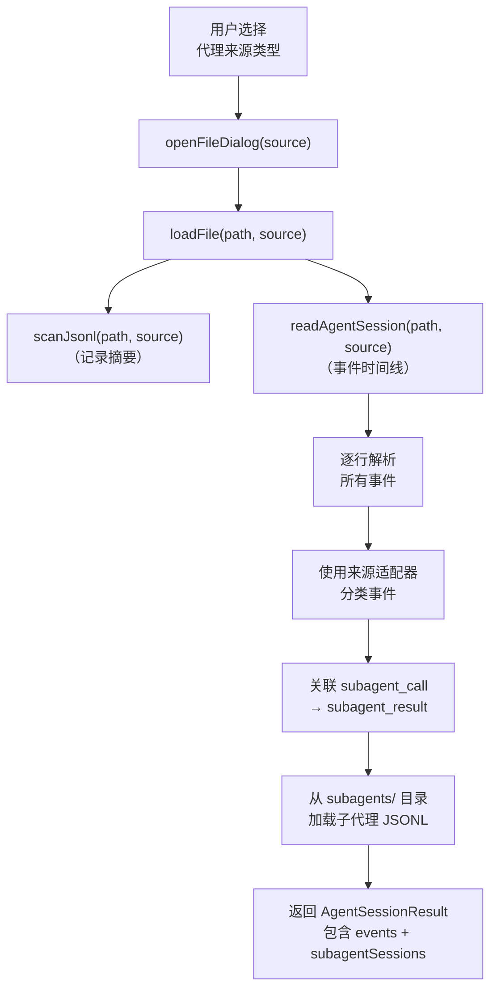
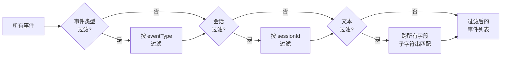
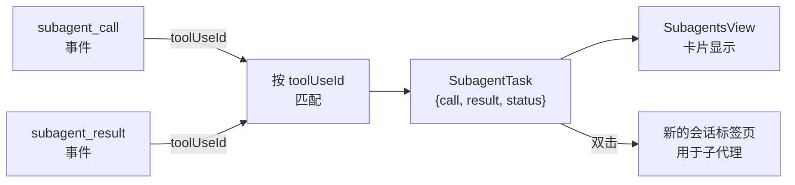
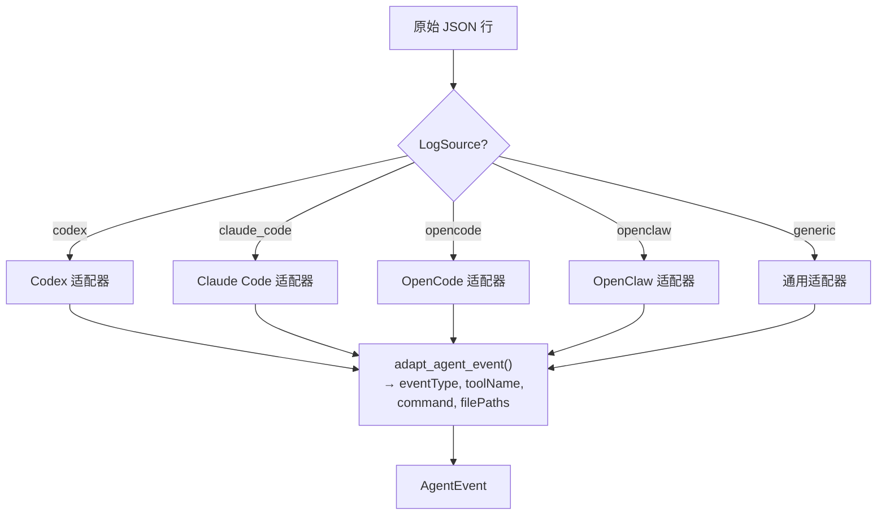
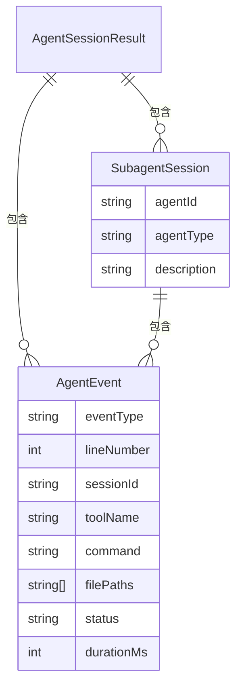
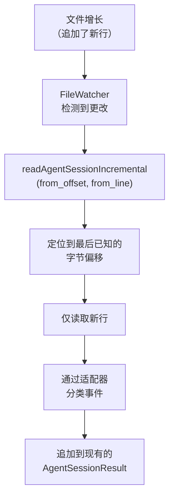
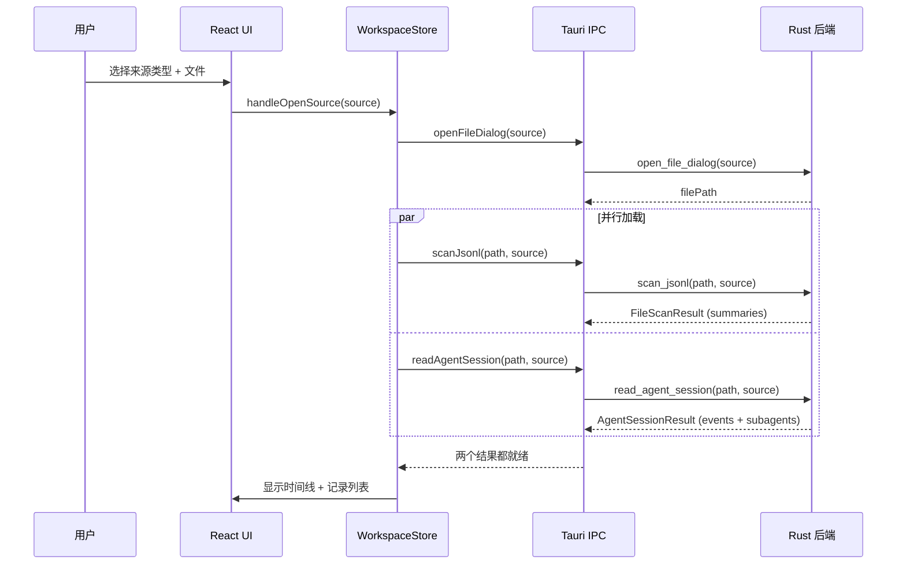

# Agent 会话

PromptLens 可以解析和显示来自 Codex、Claude Code、OpenCode、OpenClaw 和通用代理 JSONL 格式的代理会话日志。代理会话与标准审计日志不同 -- 它们包含一系列事件（消息、工具调用、文件编辑、子代理任务），而非孤立的请求/响应对。

## 打开代理会话

要打开代理会话日志：

1. 点击标题栏中的 **Open**。
2. 选择适当的来源类型（Codex Session、Claude Code Session 等）。
3. 选择您的 JSONL 文件。



## 代理事件类型

代理会话产生各种类型的事件：

| 事件类型 | 说明 | 示例 |
|---------|------|------|
| `user_message` | 来自用户的消息 | 用户提问 |
| `assistant_message` | 来自助手的消息 | 模型回复 |
| `tool_call` | 模型调用工具 | 运行 shell 命令 |
| `tool_result` | 工具调用的结果 | 命令输出 |
| `subagent_call` | 模型生成子代理 | Task 或 Agent 工具使用 |
| `subagent_result` | 子代理返回的结果 | 子代理完成 |
| `shell_command` | 执行了 shell 命令 | `npm test` |
| `file_read` | 读取了文件 | 读取源代码 |
| `file_write` | 写入了文件 | 创建新文件 |
| `patch` | 对文件应用了补丁 | 应用 diff |
| `file_edit` | 编辑了文件 | 修改源代码 |
| `checkpoint` | 创建了检查点/快照 | 保存进度 |
| `plan_update` | 代理更新了计划 | 修订方法 |
| `reasoning` | 模型的内部推理 | 思维链 |
| `error` | 发生了错误 | 工具失败 |
| `system` | 系统级事件 | 会话开始/结束 |

## 代理事件数据模型

每个代理事件从 JSON 行解析为结构化的 `AgentEvent` 对象：

```rust
// file: src-tauri/src/agent.rs:11-80
pub(crate) fn agent_event_from_value(
    value: Value,
    line_number: usize,
    byte_offset: u64,
    source: LogSource,
) -> AgentEvent {
    let timestamp = first_string(
        &value,
        &["timestamp", "created_at", "createdAt", "time", "ts", "date"],
    );
    let session_id = first_string(
        &value,
        &["session_id", "sessionId", "conversation_id", "conversationId",
          "thread_id", "threadId", "chat_id", "chatId"],
    );
    let turn_id = first_string(
        &value,
        &["turn_id", "turnId", "request_id", "requestId",
          "message_id", "messageId", "id", "uuid"],
    );
    let adapter_fields = adapt_agent_event(&value, source);
    // ...
}
```

该函数使用 `first_string()` 尝试多个 JSON 键名，支持每个代理框架使用的不同约定。

## 代理会话的左侧面板标签页

当加载代理会话时，左侧面板显示三个代理特定的标签页。

### 时间线标签页

时间线标签页按时间顺序显示所有事件，带有虚拟滚动：

```tsx
// file: src/app/components/LeftPanel.tsx:567
const rowVirtualizer = useVirtualizer({
  count: events.length,
  getScrollElement: () => listRef.current,
  estimateSize: () => 132,
  overscan: 8,
});
```

每个事件卡片显示事件类型、行号、预览、提供商、会话、令牌数、命令和文件路径。

#### 过滤时间线

| 控件 | 说明 |
|------|------|
| **事件类型下拉菜单** | 过滤到特定事件类型（如 `shell_command`、`file_write`） |
| **会话下拉菜单** | 过滤到特定会话 ID |
| **文本输入** | 跨所有事件字段的自由文本过滤 |



### 子代理标签页

子代理标签页显示会话期间生成的子代理任务。子代理任务通过将 `subagent_call` 事件与对应的 `subagent_result` 事件配对来构建：

```tsx
// file: src/app/analytics.ts:278-300
export function buildSubagentTasks(events: AgentEvent[]): SubagentTask[] {
  const resultsByToolUseId = new Map<string, AgentEvent>();
  for (const event of events) {
    if (event.eventType !== "subagent_result") continue;
    if (event.toolUseId) resultsByToolUseId.set(event.toolUseId, event);
  }
  return events
    .filter((event) => event.eventType === "subagent_call")
    .map((call): SubagentTask => {
      const result = call.toolUseId
        ? resultsByToolUseId.get(call.toolUseId)
        : undefined;
      const status = result?.status === "error"
        ? "error"
        : result
          ? "completed"
          : "running";
      return {
        id: call.toolUseId || call.id,
        type: call.subagentType || "subagent",
        description: call.subagentDescription || call.preview || call.text || "Subagent task",
        call,
        result,
        status,
      };
    });
}
```



#### 与子代理交互

| 操作 | 方法 |
|------|------|
| 查看调用详情 | 点击子代理卡片 |
| 查看结果 | 点击"Open result" |
| 展开对话 | 点击"Show conversation"以内联显示子代理的事件 |
| 在会话标签页中打开 | 双击卡片在新的会话标签页中打开子代理 |

### 代理文件标签页

代理文件标签页汇总了代理访问过的文件：

```tsx
// file: src/app/analytics.ts:308-320
export function buildAgentFileActivity(events: AgentEvent[]) {
  const map = new Map<string, AgentEvent[]>();
  for (const event of events) {
    for (const path of event.filePaths ?? []) {
      const existing = map.get(path) ?? [];
      existing.push(event);
      map.set(path, existing);
    }
  }
  return Array.from(map.entries())
    .map(([path, evts]) => ({ path, events: evts }))
    .sort((a, b) => b.events.length - a.events.length);
}
```

文件按活动次数排序（最活跃的排在最前面）。每个条目显示文件路径和访问它的事件数量。

## 提供商特定适配器

每个代理来源使用专用适配器来分类事件：

| 来源 | 适配器 | 关键分类 |
|------|--------|---------|
| **Codex** | Codex 适配器 | `reasoning`、`patch`、`checkpoint`、`shell_command`、`tool_result` |
| **Claude Code** | Claude Code 适配器 | `tool_use` -> `shell_command`/`subagent_call`，`tool_result` -> `subagent_result` |
| **OpenCode** | OpenCode 适配器 | `tool` -> `file_read`/`file_write`，`snapshot` -> `checkpoint` |
| **OpenClaw** | OpenClaw 适配器 | `action.kind` -> `patch`/`shell_command`，`tool` -> `shell_command` |
| **Generic** | 通用适配器 | 基于常见 JSON 模式自动分类 |



## 子代理会话加载

对于 Claude Code 会话，后端从主文件旁边的 `subagents/` 目录加载子代理 JSONL 文件：

```rust
// file: src-tauri/src/commands.rs:328
fn load_subagent_sessions(
    main_file_path: &Path,
    source: LogSource,
    subagent_calls: &HashMap<String, AgentEvent>,
) -> Vec<SubagentSession> {
    let session_dir = main_file_path.parent().map(|p| {
        let stem = main_file_path.file_stem()
            .map(|s| s.to_string_lossy().to_string())
            .unwrap_or_default();
        p.join(stem)
    }).filter(|d| d.is_dir());

    let subagents_dir = session_dir.join("subagents");
    // ... 从 subagents/ 读取 .jsonl 文件和 .meta.json 文件
}
```

## 代理会话数据模型



## 增量代理会话加载

对于大型代理会话，PromptLens 支持增量加载：

1. 初始加载从文件开头解析事件。
2. 如果文件增长，增量加载器仅读取新字节。
3. 新事件被分类并添加到时间线。

```rust
// file: src-tauri/src/commands.rs:487
fn read_agent_session_incremental(
    file_path: String,
    from_offset: u64,
    from_line_number: usize,
    log_source: Option<String>,
) -> Result<AgentSessionIncrementalResult, String> {
    // 定位到 from_offset，读取新事件，分类，缓存
}
```



## 代理会话分析技巧

| 技巧 | 说明 |
|------|------|
| 从时间线开始 | 按时间顺序了解代理做了什么 |
| 按事件类型过滤 | 聚焦 shell_commands 以查看运行了哪些命令 |
| 检查代理文件 | 查看哪些文件被修改以及修改了多少次 |
| 使用子代理标签页 | 了解代理如何分解复杂任务 |
| 打开子代理标签页 | 双击子代理以检查其完整对话 |
| 检查错误 | 使用问题标签页或按错误事件过滤时间线 |

## 代理会话加载序列

打开代理会话文件时的完整序列：



## AgentEvent TypeScript 类型

代理事件的 TypeScript 表示：

```ts
// file: src/types.ts
export type AgentEvent = {
  id: string;
  lineNumber: number;
  byteOffset: number;
  timestamp?: string;
  sessionId?: string;
  turnId?: string;
  parentId?: string;
  eventType: string;
  role?: string;
  toolName?: string;
  toolUseId?: string;
  command?: string;
  text?: string;
  filePaths: string[];
  status?: string;
  durationMs?: number;
  provider?: string;
  subagentType?: string;
  subagentDescription?: string;
  preview?: string;
  raw: unknown;
};
```

## SubagentSession 类型

```ts
// 概念类型
export type SubagentSession = {
  agentId: string;
  agentType: string;
  description: string;
  prompt?: string;
  events: AgentEvent[];
  metaJson?: unknown;
};
```

## 代理会话缓存

代理会话与常规扫描结果一起缓存在 SQLite 中。缓存键包括文件路径、文件大小和修改时间。当文件更改时，缓存失效并重新解析会话。

```rust
// file: src-tauri/src/cache.rs
// 代理会话使用与常规扫描不同的键进行缓存
// 缓存模式版本必须匹配才能命中缓存
pub(crate) const CACHE_SCHEMA_VERSION: i64 = 3;
```

## 按类型过滤代理事件

时间线支持按事件类型过滤。可用类型取决于代理来源：

| 来源 | 可用事件类型 |
|------|------------|
| Codex | `user_message`、`assistant_message`、`reasoning`、`patch`、`checkpoint`、`shell_command`、`tool_result`、`error`、`system` |
| Claude Code | `user_message`、`assistant_message`、`tool_call`、`tool_result`、`subagent_call`、`subagent_result`、`shell_command`、`file_read`、`file_write`、`error`、`system` |
| OpenCode | `user_message`、`assistant_message`、`tool_call`、`tool_result`、`file_read`、`file_write`、`checkpoint`、`error` |
| Generic | `user_message`、`assistant_message`、`tool_call`、`tool_result`、`shell_command`、`file_read`、`file_write`、`error`、`system` |

## 相关页面

- [工具调用](tool-calls.md) -- 工具调用渲染和规范化
- [分析](analytics.md) -- 会话分组和指标
- [打开文件](opening-files.md) -- 来源类型选择
