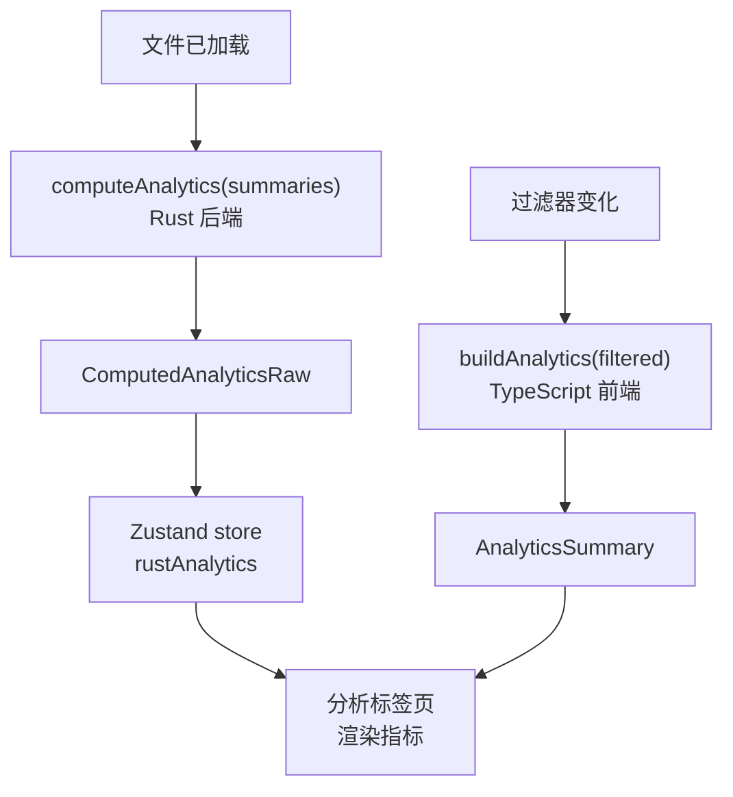
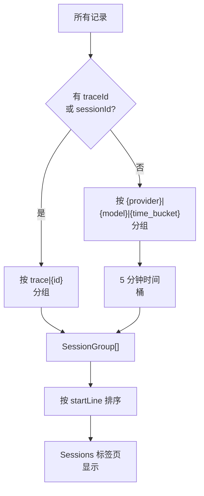

# 分析

左侧面板中的分析标签页提供日志数据的统计概览。它显示指标、图表和元数据，帮助您了解 LLM 使用模式。

## 访问分析

点击左侧面板标签栏中的条形图图标打开分析视图。分析从当前过滤后的记录计算，因此当您更改过滤器时会更新。

## 指标卡片

分析视图顶部在网格中显示关键指标：

```
+----------+----------+----------+----------+
| Records  | Errors   | P95      | P99      |
| 1,234    | 23(1.9%) | 891ms    | 2.3s     |
+----------+----------+----------+----------+
| Total    | P95      | Total    | Avg      |
| Tokens   | Tokens   | Cost     | Cost     |
| 4.5M     | 12.3k    | $12.34   | $0.01    |
+----------+----------+----------+----------+
```

| 指标 | 说明 |
|------|------|
| **Records** | 过滤后的记录数 |
| **Errors** | 错误记录的数量和百分比 |
| **P95 Latency** | 第 95 百分位响应时间 |
| **P99 Latency** | 第 99 百分位响应时间 |
| **Total Tokens** | 所有令牌计数的总和（提示 + 完成） |
| **P95 Tokens** | 每次请求的第 95 百分位令牌数 |
| **Total Cost** | 所有记录的估算成本总和 |
| **Avg Cost** | 每条记录的平均成本 |

成本指标仅在检测到的模型有定价数据时显示。

## 分析计算方式

分析在两个地方计算：

### 前端（TypeScript）

`buildAnalytics()` 从过滤后的摘要数组计算指标。当过滤器变化时即时运行：

```ts
// file: src/app/analytics.ts:52-69
export function buildAnalytics(items: LogSummary[]): AnalyticsSummary {
  const latencies = items
    .map((item) => item.latencyMs)
    .filter((value): value is number => value !== undefined);
  const tokens = items
    .map((item) => item.totalTokens)
    .filter((value): value is number => value !== undefined);
  const errors = items.filter(
    (item) => item.status === "error" || item.status === "invalid_json"
  ).length;
  return {
    total: items.length,
    success: items.filter((item) => item.status === "success").length,
    errors,
    invalid: items.filter((item) => item.status === "invalid_json").length,
    errorRate: items.length ? (errors / items.length) * 100 : 0,
    p95Latency: percentile(latencies, 0.95),
    p99Latency: percentile(latencies, 0.99),
    totalTokens: tokens.reduce((sum, value) => sum + value, 0),
    p95Tokens: percentile(tokens, 0.95),
    topModels: topCounts(items.map((item) => item.model || "unknown model")),
    topProviders: topCounts(items.map((item) => item.provider || "unknown provider")),
  };
}
```

### 后端（Rust）

`compute_analytics()` 在完整文件上运行，进行更全面的分析：

```rust
// file: src-tauri/src/analytics.rs:95-150
pub fn compute_analytics(summaries: &[LogSummary]) -> AnalyticsSummary {
    let mut latencies: Vec<f64> = summaries
        .iter()
        .filter_map(|s| s.latency_ms.map(|l| l as f64))
        .collect();
    let mut token_values: Vec<f64> = summaries
        .iter()
        .filter_map(|s| s.total_tokens.map(|t| t as f64))
        .collect();

    AnalyticsSummary {
        total: summaries.len(),
        success: summaries.iter().filter(|s| s.status == "success").count(),
        errors: summaries.iter().filter(|s| s.status == "error" || s.status == "invalid_json").count(),
        error_rate: /* ... */,
        p95_latency: percentile(&mut latencies, 0.95),
        p99_latency: percentile(&mut latencies, 0.99),
        total_tokens: summaries.iter().filter_map(|s| s.total_tokens).sum(),
        p95_tokens: percentile(&mut token_values, 0.95).map(|v| v as u64),
        top_models: top_counts(/* ... */),
        top_providers: top_counts(/* ... */),
    }
}
```

Rust 后端在文件加载和文件大小变化时被调用。结果缓存在 Zustand store 中。



### 百分位计算

前端和后端使用相同的百分位算法：

```ts
// file: src/app/analytics.ts:106-111
export function percentile(values: number[], quantile: number): number | null {
  if (!values.length) return null;
  const sorted = [...values].sort((a, b) => a - b);
  const index = Math.min(sorted.length - 1, Math.ceil(sorted.length * quantile) - 1);
  return sorted[index];
}
```

```rust
// file: src-tauri/src/analytics.rs:72-79
fn percentile(values: &mut [f64], quantile: f64) -> Option<f64> {
    if values.is_empty() { return None; }
    values.sort_by(|a, b| a.partial_cmp(b).unwrap_or(std::cmp::Ordering::Equal));
    let index = ((values.len() as f64 * quantile).ceil() as usize).min(values.len() - 1);
    Some(values[index])
}
```

## 图表

### 模型条形图

按使用次数显示顶级模型。每个条形代表一个模型名称及其请求次数。`topCounts()` 函数按频率分组和排名：

```ts
// file: src/app/analytics.ts:113-120
export function topCounts(values: string[]) {
  const counts = new Map<string, number>();
  for (const value of values) counts.set(value, (counts.get(value) ?? 0) + 1);
  return Array.from(counts.entries())
    .map(([name, count]) => ({ name, count }))
    .sort((a, b) => b.count - a.count || a.name.localeCompare(b.name))
    .slice(0, 8);
}
```

```
Models
gpt-4.1            ████████████████████  823
claude-sonnet-4-..  ████████████         312
gemini-2.5-flash    ████                  99
```

### 提供商条形图

按使用次数显示顶级提供商，使用相同的 `topCounts()` 函数和提供商名称。

```
Providers
openai     ████████████████████  823
anthropic  ████████████         312
gemini     ████                  99
```

### 延迟分布直方图

显示所有过滤后记录的响应时间分布的直方图。

```
Latency Distribution
0ms     ████████████████████  450
200ms   ████████████████      320
400ms   ████████████          210
600ms   ████████              150
800ms   ██████                100
1000ms  ████                   80
1200ms  ██                     24
```

直方图根据数据范围自动确定桶边界。当所有值相同时，显示单个条形。

## 元数据部分

在图表下方，元数据部分显示文件和当前选中记录的详细信息。

### 文件元数据

| 字段 | 示例 |
|------|------|
| File | my-audit.log |
| Path | /home/user/logs/my-audit.log |
| Size | 45.2 MB |
| Total lines | 12,345 |
| Valid | 12,300 |
| Invalid | 45 |

### 记录元数据（选中记录时）

| 字段 | 示例 |
|------|------|
| Line | 42 |
| Status | success |
| Model | gpt-4.1 |
| Provider | openai |
| Trace | trace-abc123 |
| Session | session-xyz |
| Request | req-789 |
| Latency | 234ms |
| Prompt tokens | 1,200 |
| Completion tokens | 456 |
| Total tokens | 1,656 |

### 代理事件元数据（选中代理事件时）

| 字段 | 示例 |
|------|------|
| Event type | shell_command |
| Event line | 15 |
| Provider | codex |
| Role | assistant |
| Session | session-1 |
| Turn | turn-3 |
| Tool | Bash |
| Tool use | toolu_abc123 |
| Subagent | explorer |
| Status | success |
| Duration | 3.4s |
| Files | src/app.ts, src/lib.rs |

## 问题检测

分析引擎自动检测日志数据中的潜在问题。问题按类型和严重程度分类：

```rust
// file: src-tauri/src/analytics.rs:152-225
pub fn detect_issues(summaries: &[LogSummary], analytics: &AnalyticsSummary) -> Vec<IssueRecord> {
    let latency_threshold = analytics.p95_latency.unwrap_or(0.0).max(10_000.0);
    let token_threshold = analytics.p95_tokens.unwrap_or(0) as f64;

    for summary in summaries {
        if summary.status == "invalid_json" {
            // 严重程度: "high"
        } else if summary.status == "error" {
            // 严重程度: "high"
        }
        if let Some(latency) = summary.latency_ms {
            if latency as f64 >= latency_threshold {
                // 类型: "latency", 严重程度: "medium"
            }
        }
        if let Some(tokens) = summary.total_tokens {
            if tokens as f64 >= token_threshold {
                // 类型: "tokens", 严重程度: "medium"
            }
        }
        if summary.preview.is_none() && summary.status == "success" {
            // 类型: "empty", 严重程度: "low"
        }
    }
    issues
}
```

| 类型 | 严重程度 | 说明 |
|------|---------|------|
| `error` | 高 | 记录具有错误状态 |
| `invalid` | 高 | 记录包含无效 JSON |
| `latency` | 中 | 延迟超过 P95 阈值 |
| `tokens` | 中 | 令牌数超过 P95 阈值 |
| `empty` | 低 | 响应没有文本内容 |

问题按严重程度排序（高的在前），然后按行号排序。严重程度排名使用简单的数字映射：

```ts
// file: src/app/analytics.ts:138-142
export function severityRank(severity: IssueRecord["severity"]) {
  if (severity === "high") return 3;
  if (severity === "medium") return 2;
  return 1;
}
```

在左侧面板的 **Issues** 标签页中查看所有检测到的问题。详情请参阅[浏览记录](browsing-records.md)。

## 成本估算

PromptLens 包含常见 LLM 模型的内置定价表。当您打开文件时，它会根据以下信息计算每条记录的估算成本：

- 检测到的模型名称
- 提示令牌数
- 完成令牌数

### 定价表

定价表作为 JSON 文件嵌入在 Rust 二进制文件中：

```rust
// file: src-tauri/src/pricing.rs:21
const PRICING_JSON: &str = include_str!("../pricing.json");
```

它被加载一次并缓存在 `OnceLock` 中：

```rust
// file: src-tauri/src/pricing.rs:23-27
static PRICING_TABLE: OnceLock<Vec<ModelPricing>> = OnceLock::new();

pub fn load_pricing_table() -> &'static [ModelPricing] {
    PRICING_TABLE.get_or_init(|| serde_json::from_str(PRICING_JSON).unwrap_or_default())
}
```

### 模型匹配

定价查找使用两阶段匹配策略：

```rust
// file: src-tauri/src/pricing.rs:29-47
pub fn find_pricing<'a>(model: &str, table: &'a [ModelPricing]) -> Option<&'a ModelPricing> {
    let lower = model.to_lowercase();
    // 1. 精确匹配
    if let Some(p) = table.iter().find(|p| p.model.to_lowercase() == lower) {
        return Some(p);
    }
    // 2. 子字符串匹配（最长匹配的模型名获胜）
    let mut best: Option<(&ModelPricing, usize)> = None;
    for p in table {
        let p_lower = p.model.to_lowercase();
        if lower.contains(&p_lower) {
            let len = p_lower.len();
            if best.is_none_or(|(_, blen)| len > blen) {
                best = Some((p, len));
            }
        }
    }
    best.map(|(p, _)| p)
}
```

这意味着模型为 `gpt-4.1-2025-04-14` 的记录将匹配 `gpt-4.1` 定价条目。

### 成本计算

```rust
// file: src-tauri/src/pricing.rs:49-72
pub fn calculate_cost(
    model: &str,
    prompt_tokens: Option<u64>,
    completion_tokens: Option<u64>,
    table: &[ModelPricing],
) -> CostEstimate {
    let pricing = find_pricing(model, table);
    let (input_cost, output_cost) = match pricing {
        Some(p) => (
            (input_tokens / 1_000_000.0) * p.input_per_mtok,
            (output_tokens / 1_000_000.0) * p.output_per_mtok,
        ),
        None => (0.0, 0.0),
    };
    CostEstimate {
        model: model.to_string(),
        input_cost,
        output_cost,
        total_cost: input_cost + output_cost,
        matched_pricing: pricing.map(|p| p.model.clone()),
    }
}
```

成本计算公式：

```
input_cost  = (prompt_tokens / 1,000,000) * input_per_mtok
output_cost = (completion_tokens / 1,000,000) * output_per_mtok
total_cost  = input_cost + output_cost
```

如果模型不在定价表中，成本为 $0。定价表通过 `get_pricing_table` 命令从 Rust 后端加载。

| 模型系列 | 输入成本 | 输出成本 |
|---------|---------|---------|
| GPT-4.1 | $2.00/Mtok | $8.00/Mtok |
| GPT-4.1-mini | $0.40/Mtok | $1.60/Mtok |
| Claude Sonnet 4 | $3.00/Mtok | $15.00/Mtok |
| Claude Haiku 3.5 | $0.80/Mtok | $4.00/Mtok |
| Gemini 2.5 Flash | $0.15/Mtok | $0.60/Mtok |

## 过滤选项

分析引擎还从数据中计算可用的过滤选项：

```ts
// file: src/app/analytics.ts:122-136
export function buildFilterOptions(items: LogSummary[]) {
  const providers = new Set<string>();
  const models = new Set<string>();
  const traces = new Set<string>();
  for (const item of items) {
    providers.add(item.provider || "unknown provider");
    models.add(item.model || "unknown model");
    if (item.traceId || item.sessionId)
      traces.add(item.traceId || item.sessionId || "");
  }
  return {
    providers: Array.from(providers).sort(),
    models: Array.from(models).sort(),
    traces: Array.from(traces).filter(Boolean).sort(),
  };
}
```

| 过滤器 | 来源 |
|--------|------|
| Providers | 所有记录中的唯一提供商名称 |
| Models | 所有记录中的唯一模型名称 |
| Traces | 所有记录中的唯一 trace/session ID |

这些用于填充工具栏中的下拉过滤器。Rust 后端在完整数据集上计算这些，而前端回退在过滤后的集合上计算。

## 会话分组

对于审计日志，分析引擎将记录分组为**启发式会话**，基于：

- Trace ID（如果数据中存在）
- Session ID（如果存在）
- 时间和行号的接近程度

```ts
// file: src/app/analytics.ts:13-50
export function buildSessionGroups(items: LogSummary[]): SessionGroup[] {
  const groups = new Map<string, LogSummary[]>();
  for (const item of items) {
    const stable = item.traceId || item.sessionId;
    const time = Date.parse(item.timestamp ?? "");
    const bucket = Number.isFinite(time)
      ? Math.floor(time / (5 * 60 * 1000))  // 5 分钟桶
      : Math.floor(item.lineNumber / 25);     // 基于行号的桶
    const id = stable
      ? `trace|${stable}`
      : `${provider}|${model}|${bucket}`;
    groups.set(id, [...(groups.get(id) ?? []), item]);
  }
  // ... 构建 SessionGroup 对象
}
```



每个会话组包含：

| 字段 | 说明 |
|------|------|
| ID | 唯一组标识符 |
| Label | 人类可读标签（提供商 / 模型） |
| Line range | 第一行和最后一行的行号 |
| Time range | 第一个和最后一个时间戳 |
| Provider/Model | 主要提供商和模型 |
| Record count | 组中的记录数 |
| Error count | 错误记录数 |
| Total tokens | 令牌计数总和 |
| Avg latency | 平均响应时间 |

在左侧面板的 **Sessions** 标签页中查看会话组。

## 相关页面

- [浏览记录](browsing-records.md) -- 过滤和问题标签页
- [导出](export.md) -- 导出分析数据
- [代理会话](agent-sessions.md) -- 代理特定指标
