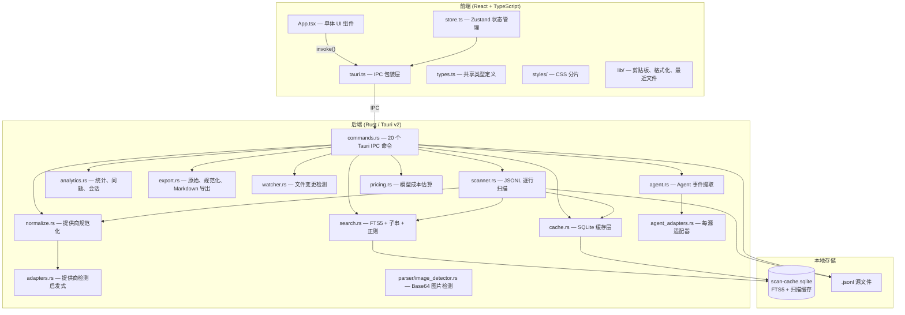
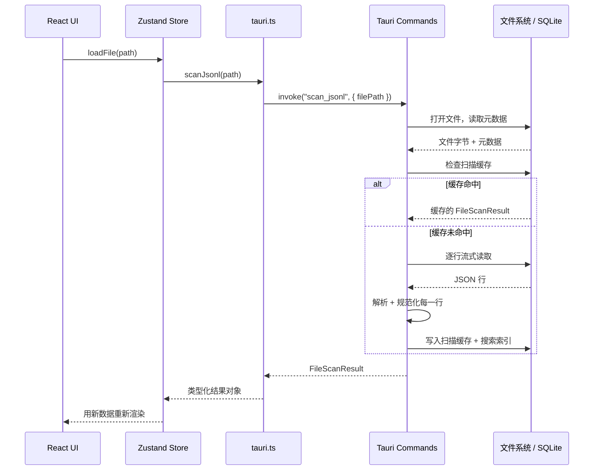
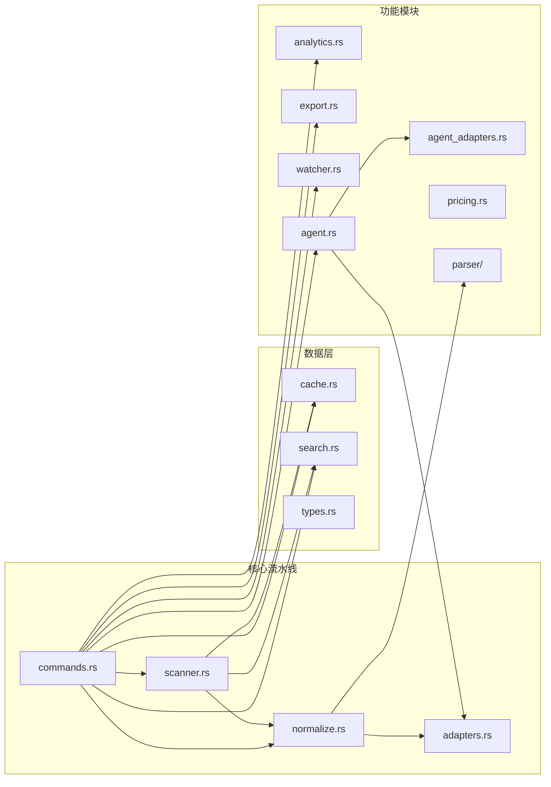
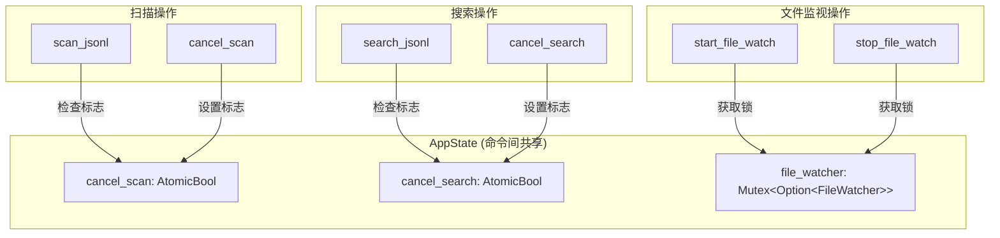
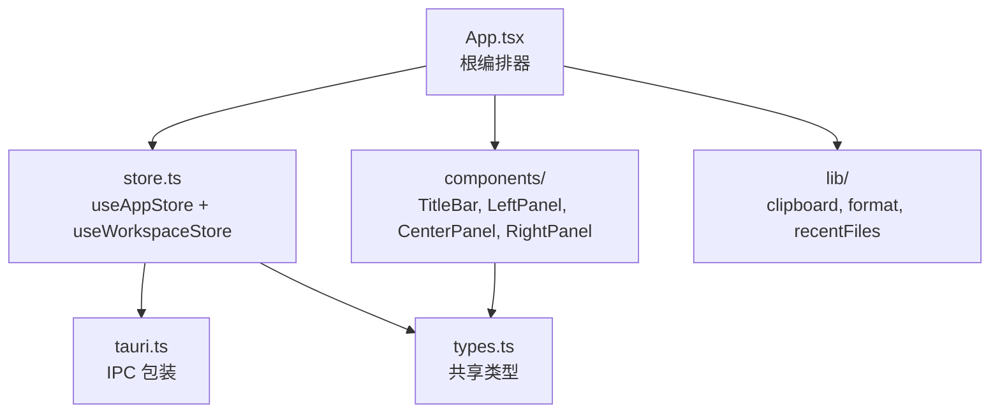
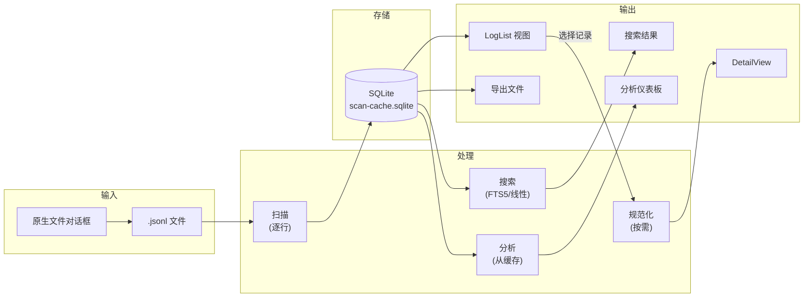
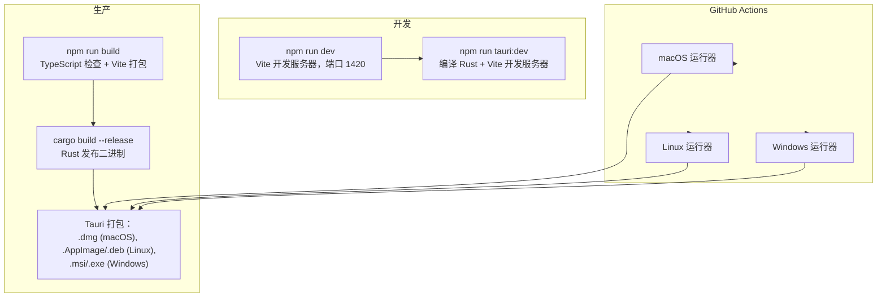

# 系统架构

PromptLens 是一个本地优先的 Tauri v2 桌面应用程序，用于查看和分析 JSONL 格式的 LLM 审计日志。它将来自 OpenAI、Anthropic、Gemini 和 Ollama 的日志规范化为统一的 schema。所有处理都在设备端完成：无网络调用，无遥测。

## 高层架构



## Tauri v2 IPC 边界

前端和后端完全通过 Tauri 的 `invoke()` IPC 机制进行通信。每个后端功能都暴露为一个 `#[tauri::command]` 函数。前端在 `tauri.ts` 中将每个命令包装为一个类型化的异步函数。



### 注册的命令

`commands.rs` 中的 `run()` 函数注册了 20 个 IPC 命令：

| 命令 | 用途 |
|------|------|
| `open_file_dialog` | 用于 `.jsonl` 文件的原生文件选择器 |
| `scan_jsonl` | 带进度事件的完整扫描 |
| `scan_jsonl_incremental` | 从字节偏移量开始的追加扫描 |
| `cancel_scan` | 设置活跃扫描的取消标志 |
| `clear_scan_cache` | 删除 SQLite 缓存文件 |
| `get_cache_info` | 返回缓存文件路径和存在状态 |
| `get_file_status` | 检查文件存在性、大小、修改时间 |
| `save_text_file` | 通过原生保存对话框保存任意文本 |
| `export_records` | 以 3 种格式导出选中记录 |
| `read_record` | 按字节偏移量寻址，规范化单条记录 |
| `read_agent_session` | 解析 agent 会话 JSONL |
| `read_agent_session_incremental` | 增量 agent 会话读取 |
| `detect_log_source` | 自动检测 agent 日志格式 |
| `search_jsonl` | 3 种模式的全文搜索 |
| `cancel_search` | 设置活跃搜索的取消标志 |
| `list_system_fonts` | 通过 `fc-list` 枚举系统字体 |
| `get_pricing_table` | 返回嵌入的模型定价数据 |
| `calculate_costs` | 估算请求的 token 成本 |
| `start_file_watch` | 通过 `notify` 监视文件变更 |
| `stop_file_watch` | 停止活跃的文件监视器 |
| `compute_analytics` | 从缓存扫描数据计算分析 |

## Rust 模块结构



### 模块职责

| 模块 | 文件 | 行数 | 职责 |
|------|------|------|------|
| `commands` | `src-tauri/src/commands.rs` | ~400 | 所有 `#[tauri::command]` 处理器。管理 `AppState`（取消标志、文件监视器互斥锁）。委托给专门模块。 |
| `scanner` | `src-tauri/src/scanner.rs` | ~200 | 带字节偏移量跟踪的逐行 JSONL 扫描。每 250 行发出 `scan-progress`，每 500 行发出 `scan-chunk` 以实现流式 UI 更新。 |
| `normalize` | `src-tauri/src/normalize.rs` | ~500 | 将原始提供商 JSON 转换为 `NormalizedCall`。提供 `summary_from_value`（轻量提取）和 `normalize_call`（完整规范化）。 |
| `adapters` | `src-tauri/src/adapters.rs` | ~60 | 通过结构化 JSON 启发式进行提供商自动检测，以及角色规范化（例如 Gemini 的 `model` 角色映射为 `assistant`）。 |
| `search` | `src-tauri/src/search.rs` | ~250 | 三种搜索模式：`substring`、`fts` 和 `regex`。FTS5 索引用于快速分词搜索。回退到线性扫描。上限 1000 条结果。 |
| `cache` | `src-tauri/src/cache.rs` | ~300 | SQLite 操作：3 张表（`scan_cache`、`agent_session_cache`、`search_index`）。缓存键为 `(file_path, file_size, modified_timestamp)`。 |
| `analytics` | `src-tauri/src/analytics.rs` | ~200 | 计算统计信息（错误率、p95/p99 延迟、token 总计），检测问题，按 trace ID 或时间窗口聚类会话。 |
| `export` | `src-tauri/src/export.rs` | ~100 | 三种导出格式：`raw_jsonl`、`normalized_jsonl`、`session_markdown`。 |
| `watcher` | `src-tauri/src/watcher.rs` | ~80 | 使用 `notify` crate 进行文件系统事件监视，500ms 防抖。向前端发出 `file-changed` 事件。 |
| `agent` | `src-tauri/src/agent.rs` | ~150 | 构建 `AgentEvent` 结构体并进行事件类型分类。通过 `tool_use_id` 映射将子 agent 调用链接到结果。 |
| `agent_adapters` | `src-tauri/src/agent_adapters.rs` | ~300 | 针对 Codex、Claude Code、OpenCode 和 OpenClaw 的每源适配器。每个从源特定 JSON 中提取角色、工具名称、命令、文件路径。 |
| `pricing` | `src-tauri/src/pricing.rs` | ~100 | 在编译时嵌入 `pricing.json`。按精确名称然后子串（最长匹配）匹配模型。计算每百万 token 成本。 |
| `parser` | `src-tauri/src/parser/image_detector.rs` | ~60 | 通过 data-URL 前缀或使用 `infer` crate 的原始 base64 内容嗅探检测 base64 图片。 |

## AppState 与并发

`AppState` 结构体是后端所有并发操作的中心协调点。它由 Tauri 管理，并在所有命令调用之间共享：

```rust
// file: src-tauri/src/types.rs:9
pub(crate) struct AppState {
    pub(crate) cancel_scan: AtomicBool,
    pub(crate) cancel_search: AtomicBool,
    pub(crate) file_watcher: Mutex<Option<crate::watcher::FileWatcher>>,
}

impl Default for AppState {
    fn default() -> Self {
        Self {
            cancel_scan: AtomicBool::new(false),
            cancel_search: AtomicBool::new(false),
            file_watcher: Mutex::new(None),
        }
    }
}
```

### 为什么使用 AtomicBool 和 Mutex？

`AtomicBool` 取消标志使用 `Relaxed` 排序，这已经足够，因为它们是在紧密循环中检查的简单布尔信号。不需要更强的排序保证（如 `SeqCst` 或 `AcqRel`），原因如下：

1. 标志只从 `false` 转换为 `true`（单向）
2. 扫描器/搜索器在紧密循环中读取它，因此可见性的延迟受一次迭代限制
3. 没有数据依赖于标志在特定指令边界处的可见性

文件监视器包装在 `Mutex` 中，因为当用户打开不同文件时它会被替换。`Mutex` 确保 `start_file_watch` 和 `stop_file_watch` 命令在访问监视器时不会竞争。



## 前端架构

React 前端使用 Zustand 进行状态管理，并组织为清晰的组件层次结构：



`App` 组件是唯一的编排点。它通过稳定的选择器从两个 Zustand store 中读取数据，使用 `useMemo` 计算派生状态，并将数据作为 props 传递下去。没有 React Context 提供者。

### 关键前端组件

| 组件 | 文件 | 行数 | 职责 |
|------|------|------|------|
| `App` | `src/app/App.tsx` | ~800 | 根编排、键盘快捷键、调整大小、事件监听器 |
| `LeftPanel` | `src/app/components/LeftPanel.tsx` | ~1060 | 8 个标签视图：记录、时间线、子 agent、文件、追踪、会话、分析、问题 |
| `CenterPanel` | `src/app/components/CenterPanel.tsx` | ~570 | 详情视图：消息卡片、Markdown 渲染、图片显示 |
| `RightPanel` | `src/app/components/RightPanel.tsx` | ~350 | 5 个标签视图：差异、工具、错误、JSON 树、原始载荷 |
| `TitleBar` | `src/app/components/TitleBar.tsx` | ~370 | macOS 风格标题栏，带菜单和设置 |
| `Workspace` | `src/app/components/Workspace.tsx` | ~130 | 标签栏和状态栏 |

## 关键设计决策

### 为什么使用单体 App 组件？

PromptLens 使用单个 `App` 组件作为编排点，而不是将状态管理分布在许多更小的组件中。这个设计选择有特定的权衡：

**优势：**
- 所有派生计算（`filtered`、`analytics`、`issues`、`sessions`）共处一地，可以共享中间结果
- 无需通过不使用数据的中间组件进行 prop drilling
- 键盘快捷键和调整大小处理器可以直接访问所有状态
- 事件监听器注册集中在一个 `useEffect` 中

**劣势：**
- `App.tsx` 文件较大（约 800 行）
- 更改编排逻辑的任何部分都需要修改此文件

这个权衡是有意的：PromptLens 是一个单用户桌面工具，不是协作 Web 应用。对于这种用例，单编排点的简单性超过了组件分解的好处。

### 字节偏移量索引

每个 `LogSummary` 都存储其在源文件中的 `byte_offset`。这使得当用户选择记录时，可以通过 `seek()` 进行 O(1) 随机访问，而无需重新读取前面的行。详见[字节偏移量索引](./byte-offset-indexing.md)。

### SQLite + FTS5 搜索

搜索索引是一个 FTS5 虚拟表，与扫描缓存一起存储在单个 SQLite 数据库中。这提供了快速的分词全文搜索，无需外部依赖。详见[搜索引擎](./search-engine.md)。

### 增量扫描

通过将当前文件大小与缓存大小进行比较来检测仅追加的文件变更。新行从最后已知的字节偏移量开始扫描，扫描缓存和搜索索引都增量追加。详见[缓存](./caching.md)。

### 提供商无关的规范化

所有支持的 LLM 提供商都规范化为通用的 `NormalizedCall` schema，带有类型化的 `NormalizedContent` 部分（text、image、tool_call、tool_result）。规范化流水线使用启发式 JSON 结构匹配，而不是显式的提供商配置。详见[提供商规范化](./provider-normalization.md)。

### 本地优先，无网络

PromptLens 不进行任何网络调用。SQLite 缓存、定价表（通过 `include_str!` 在编译时嵌入）和所有处理完全在本地进行。文件监视使用操作系统原生的 `notify` crate。

### 流式扫描事件

大文件扫描时每 250 行发送进度事件，每 500 行发送块事件，允许 UI 增量渲染结果，而不是等待整个扫描完成。`AppState` 结构体持有 `AtomicBool` 取消标志，以便用户可以中止长时间运行的操作。

## 数据流概览



## TypeScript 类型映射

`types.rs` 中的 Rust 类型由 `src/types.ts` 中的 TypeScript 类型镜像。Tauri 的 `serde` 序列化配合 `#[serde(rename_all = "camelCase")]` 自动将 Rust 的 `snake_case` 字段转换为 TypeScript 的 `camelCase`：

```rust
// file: src-tauri/src/types.rs:25
#[derive(Debug, Serialize, Deserialize, Clone)]
#[serde(rename_all = "camelCase")]
pub(crate) struct LogSummary {
    pub(crate) id: String,
    pub(crate) line_number: usize,
    pub(crate) byte_offset: u64,
    pub(crate) timestamp: Option<String>,
    pub(crate) provider: Option<String>,
    pub(crate) model: Option<String>,
    // ...
}
```

```typescript
// file: src/types.ts:3
export type LogSummary = {
  id: string;
  lineNumber: number;
  byteOffset: number;
  timestamp?: string;
  provider?: string;
  model?: string;
  // ...
};
```

| Rust (`types.rs`) | TypeScript (`types.ts`) | 关键字段 |
|-------------------|------------------------|----------|
| `LogSummary` | `LogSummary` | id, lineNumber, byteOffset, model, status, preview |
| `FileScanResult` | `FileScanResult` | filePath, summaries[], totalLines, cacheHit |
| `NormalizedCall` | `NormalizedCall` | provider, model, request, response, error, usage |
| `NormalizedMessage` | `NormalizedMessage` | role, content (NormalizedContent[]) |
| `NormalizedContent` | `NormalizedContent` | 标签联合：text, image, tool_call, tool_result |
| `SearchResult` | `SearchResult` | lineNumber, byteOffset, context |
| `SearchResponse` | `SearchResponse` | results[], truncated, cancelled, indexed |
| `RecordDetail` | `RecordDetail` | summary, normalized, raw, parseError |
| `ProgressEvent` | `ProgressEvent` | processedBytes, totalBytes, lineNumber |
| `AgentEvent` | `AgentEvent` | eventType, toolName, command, filePaths, text |
| `AgentSessionResult` | `AgentSessionResult` | events[], sessions[], subagentSessions[] |

## 构建和部署

PromptLens 使用 Tauri v2 的构建系统：



### 关键依赖

**Rust：**

| Crate | 用途 |
|-------|------|
| `tauri` v2 | 桌面应用框架 |
| `rusqlite` (bundled + fts5) | 支持 FTS5 的 SQLite |
| `serde` / `serde_json` | JSON 序列化 |
| `notify` | 文件系统事件监视 |
| `rfd` | 原生文件对话框 |
| `regex` | 正则表达式搜索 |
| `infer` | 图片的 MIME 类型检测 |
| `base64` | Base64 编码/解码 |
| `dirs` | 平台特定数据目录 |
| `chrono` / `time` | 时间戳解析 |

**前端：**

| 包 | 用途 |
|---|------|
| `react` | UI 框架 |
| `zustand` | 状态管理 |
| `@tauri-apps/api` | Tauri IPC 绑定 |
| `@tanstack/react-virtual` | 虚拟滚动 |
| `react-markdown` | Markdown 渲染 |
| `lucide-react` | 图标 |
| `vite` | 构建工具和开发服务器 |
