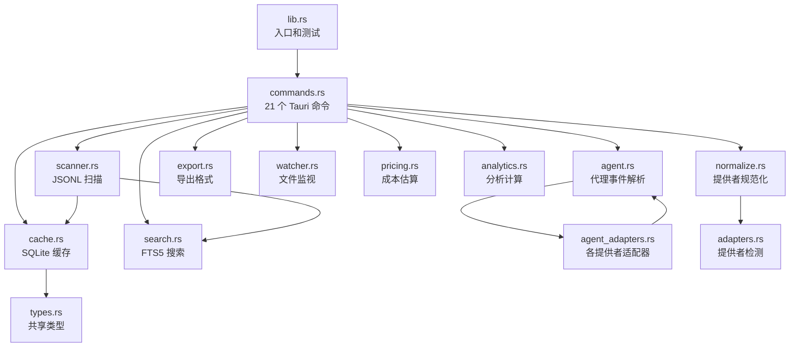
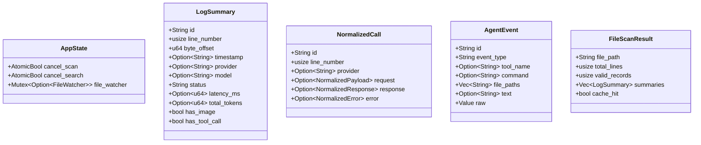
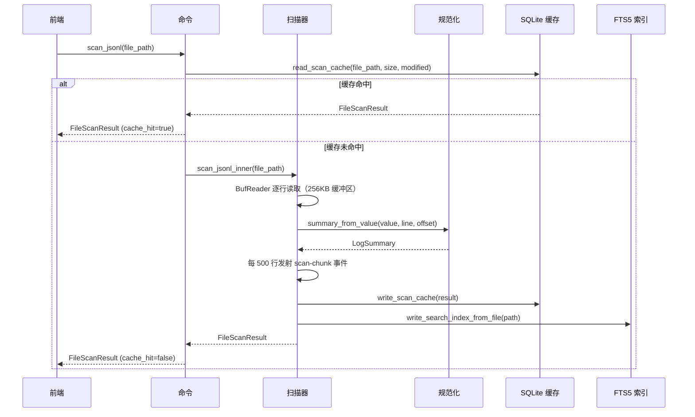

# 后端架构

PromptLens 后端是基于 **Tauri v2** 构建的 Rust 应用程序，负责处理 JSONL 日志扫描、规范化、缓存、搜索和代理会话解析。它通过 Tauri IPC 命令与 React 前端进行通信。

## 模块结构

后端在 `src-tauri/src/` 下组织为 14 个模块：



### 模块职责

| 模块 | 大小 | 用途 |
|------|------|------|
| `lib.rs` | ~26k 字节 | 入口点、19 个测试用例、模块声明 |
| `commands.rs` | ~20k 字节 | 所有 21 个 `#[tauri::command]` 函数、Tauri 应用构建器 |
| `normalize.rs` | ~22k 字节 | 提供者规范化、内容部分解析、摘要提取 |
| `agent.rs` | ~18k 字节 | 代理事件类型检测、字段提取、源检测 |
| `agent_adapters.rs` | ~17k 字节 | Codex、Claude Code、OpenCode、OpenClaw 适配器 |
| `analytics.rs` | ~15k 字节 | 分析摘要、问题检测、会话分组 |
| `search.rs` | ~9k 字节 | FTS5 索引、子串/正则/FTS 搜索及回退 |
| `types.rs` | ~9k 字节 | 所有共享 Rust 结构体和枚举 |
| `scanner.rs` | ~8k 字节 | 全量和增量 JSONL 扫描 |
| `cache.rs` | ~8k 字节 | 扫描和会话缓存的 SQLite 读写 |
| `pricing.rs` | ~3.5k 字节 | 18 个模型的代币成本估算 |
| `export.rs` | ~3.6k 字节 | JSONL、规范化 JSONL 和 Markdown 导出 |
| `adapters.rs` | ~1.8k 字节 | 提供者检测启发式和角色规范化 |
| `watcher.rs` | ~1.8k 字节 | 通过 `notify` crate 监视文件变更 |
| `parser/image_detector.rs` | ~1.7k 字节 | Base64 和 data-URL 图片检测 |

## 依赖关系

| Crate | 版本 | 用途 |
|-------|------|------|
| `tauri` | 2.x | 桌面应用框架，支持 IPC |
| `serde` | 1.0 | 带派生宏的序列化 |
| `serde_json` | 1.0 | JSON 解析和 `Value` 操作 |
| `rusqlite` | 0.32 | 内置 FTS5 的 SQLite 数据库 |
| `notify` | 7.0 | 跨平台文件系统监视 |
| `regex` | 1.x | 正则表达式搜索模式 |
| `base64` | 0.22 | Base64 图片解码 |
| `infer` | 0.19 | 从魔术字节检测文件类型 |
| `dirs` | 6.0 | 平台特定数据目录解析 |
| `rfd` | 0.15 | 原生文件对话框（打开/保存） |
| `time` | 0.3 | ISO 8601 / RFC 3339 时间戳解析 |
| `tempfile` | 3.x | 仅测试用临时文件创建 |

## 关键类型



## 应用状态管理

`AppState` 结构体持有由 Tauri 依赖注入系统管理的全局可变状态。通过 `AppState::default()` 初始化，并通过 `tauri::Builder::manage()` 注册。

```rust
// file: src-tauri/src/types.rs:9
pub(crate) struct AppState {
    pub(crate) cancel_scan: AtomicBool,
    pub(crate) cancel_search: AtomicBool,
    pub(crate) file_watcher: Mutex<Option<crate::watcher::FileWatcher>>,
}
```

| 字段 | 类型 | 用途 |
|------|------|------|
| `cancel_scan` | `AtomicBool` | 中断正在运行的扫描的标志 |
| `cancel_search` | `AtomicBool` | 中断正在运行的搜索的标志 |
| `file_watcher` | `Mutex<Option<FileWatcher>>` | 用于实时更新的活动文件监视 |

## 数据流



## 命令注册

所有 21 个命令在 `commands.rs` 的 `run()` 函数中注册：

```rust
// file: src-tauri/src/commands.rs:592
pub fn run() {
    tauri::Builder::default()
        .manage(AppState::default())
        .invoke_handler(tauri::generate_handler![
            open_file_dialog, scan_jsonl, scan_jsonl_incremental,
            cancel_scan, clear_scan_cache, get_cache_info, get_file_status,
            save_text_file, export_records, read_record,
            read_agent_session, read_agent_session_incremental, detect_log_source,
            search_jsonl, cancel_search, list_system_fonts,
            get_pricing_table, calculate_costs,
            start_file_watch, stop_file_watch, compute_analytics
        ])
        .run(tauri::generate_context!())
        .expect("error while running PromptLens");
}
```

## 常量

| 常量 | 值 | 位置 | 用途 |
|------|-----|------|------|
| `MAX_SEARCH_RESULTS` | 1000 | `types.rs:6` | 每次查询的最大搜索结果数 |
| `CACHE_SCHEMA_VERSION` | 3 | `types.rs:7` | 用于缓存失效的 SQLite 模式版本 |

## 错误处理

所有 Tauri 命令返回 `Result<T, String>`，其中错误字符串显示给前端用户。

```mermaid
flowchart LR
    A["命令调用"] --> B{操作}
    B -->|成功| C["返回 Ok(value)"]
    B -->|IO 错误| D["format!(\"Failed to ...: {err}\")"]
    B -->|解析错误| E["format!(\"Failed to parse ...: {err}\")"]
    D --> F["返回 Err(String)"]
    E --> F
    F --> G["前端显示错误提示"]
```

| 错误 | 来源 | 恢复方式 |
|------|------|----------|
| `Failed to open file` | `File::open` | 检查文件路径和权限 |
| `Failed to read line` | `BufReader::read_line` | 文件可能已损坏 |
| `Failed to seek record` | `BufReader::seek` | 字节偏移量可能已过期 |
| `Failed to parse cache` | `serde_json::from_str` | 缓存已损坏，清除它 |
| `No cached scan results` | `compute_analytics` | 先扫描文件 |
| `File appears to have been truncated` | `scan_jsonl_incremental` | 运行全量重新扫描 |

## 测试

后端在 `lib.rs` 中有 19 个单元测试，涵盖：JSONL 扫描、提供者规范化、图片检测、代理会话解析、缓存往返正确性、搜索结果限制和增量扫描。测试使用 `tempfile::NamedTempFile` 创建临时 JSONL 文件，并通过 `PROMPTLENS_CACHE_PATH` 环境变量覆盖缓存路径。
