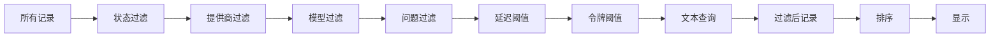

# 浏览记录

左面板中的记录标签页是浏览 JSONL 日志文件的主要方式。它显示所有记录的虚拟化列表，具有过滤、排序和搜索功能。

## 记录列表

列表中的每张记录卡片显示紧凑的摘要：

```
+--------------------------------------------------+
| [绿点] gpt-4.1                        14:32:05   |
| openai  234ms  1.2k tokens  $0.0042              |
| What is the capital of France? The capital of... |
+--------------------------------------------------+
```

### 卡片元素

| 元素 | 描述 |
|------|------|
| **状态点** | 绿色 = 成功，红色 = 错误，黄色 = 无效 JSON |
| **新徽标** | 通过增量扫描或实时模式加载的记录上出现 |
| **模型名称** | 检测到的模型（如 gpt-4.1、claude-sonnet-4-20250514） |
| **时间戳** | 请求发出的时间 |
| **提供商** | 检测到的提供商（openai、anthropic、gemini、ollama） |
| **延迟** | 响应时间（毫秒） |
| **令牌数** | 总令牌数（提示 + 补全） |
| **费用** | 基于定价数据的估算费用（如有） |
| **图片图标** | 记录包含嵌入图片时出现 |
| **工具图标** | 记录包含工具调用时出现 |
| **比较图标** | 点击将此记录设为差异比较基线 |
| **预览** | 第一条用户消息的文本片段 |

## 虚拟滚动

记录列表使用**虚拟滚动**（通过 `@tanstack/react-virtual`）高效处理大文件。只有可见的行会被渲染到 DOM 中。`LeftPanel` 组件初始化虚拟化器，估算行高 74px，overscan 为 10 行：

```tsx
// file: src/app/components/LeftPanel.tsx:303
const rowVirtualizer = useVirtualizer({
  count: items.length,
  getScrollElement: () => parentRef.current,
  estimateSize: () => 74,
  overscan: 10,
});
```

| 参数 | 值 | 用途 |
|------|-----|------|
| 估算行高 | 74px | 用于滚动高度计算 |
| Overscan | 10 行 | 在视口上方/下方额外渲染的行数 |

选择记录时，列表自动滚动到居中位置：

```tsx
// file: src/app/components/LeftPanel.tsx:309
useEffect(() => {
  if (!selected) return;
  const index = items.findIndex((item) => isSameLine(item, selected));
  if (index >= 0) rowVirtualizer.scrollToIndex(index, { align: "center" });
}, [items, rowVirtualizer, selected]);
```

`isSameLine` 辅助函数通过 `lineNumber` 和可选的 `byteOffset` 比较记录：

```tsx
// file: src/app/analytics.ts:351
export function isSameLine(
  a: { lineNumber: number; byteOffset?: number },
  b: { lineNumber: number; byteOffset?: number } | null
) {
  return Boolean(
    b && a.lineNumber === b.lineNumber &&
    (a.byteOffset === undefined || b.byteOffset === undefined || a.byteOffset === b.byteOffset)
  );
}
```

## 过滤

记录列表上方的工具栏提供多种过滤控件。所有过滤状态由 `useAppStore` Zustand store（`src/app/store.ts`）管理，通过 `App` 组件中的 `useMemo` 管道应用。

### 状态过滤

| 选项 | 行为 |
|------|------|
| 全部 | 显示所有记录（默认） |
| 错误 | 仅显示 `error` 或 `invalid_json` 状态的记录 |
| 成功 | 仅显示 `success` 状态的记录 |
| 图片 | 仅显示标记为包含图片的记录 |
| 工具 | 仅显示标记为包含工具调用的记录 |

### 提供商和模型过滤

下拉菜单从当前文件的数据中填充。`buildFilterOptions()` 函数提取唯一的提供商、模型和追踪 ID：

```tsx
// file: src/app/analytics.ts:122
export function buildFilterOptions(items: LogSummary[]) {
  const providers = new Set<string>();
  const models = new Set<string>();
  const traces = new Set<string>();
  for (const item of items) {
    providers.add(item.provider || "unknown provider");
    models.add(item.model || "unknown model");
    if (item.traceId || item.sessionId) traces.add(item.traceId || item.sessionId || "");
  }
  return {
    providers: Array.from(providers).sort(),
    models: Array.from(models).sort(),
    traces: Array.from(traces).filter(Boolean).sort(),
  };
}
```

### 问题过滤

问题过滤按钮切换仅显示问题模式。问题由分析引擎使用基于 P95 值的可配置阈值检测：

```tsx
// file: src/app/analytics.ts:71
export function detectIssues(items: LogSummary[], analytics: AnalyticsSummary): IssueRecord[] {
  const latencyThreshold = Math.max(analytics.p95Latency ?? 0, 10_000);
  const tokenThreshold = Math.max(analytics.p95Tokens ?? 0, 8_000);
  return items.flatMap((summary): IssueRecord[] => {
    const issues: IssueRecord[] = [];
    if (summary.status === "invalid_json") {
      issues.push({ summary, kind: "invalid", message: summary.parseError || "Invalid JSON line", severity: "high" });
    } else if (summary.status === "error") {
      issues.push({ summary, kind: "error", message: summary.preview || "Error response", severity: "high" });
    }
    if (summary.latencyMs !== undefined && summary.latencyMs >= latencyThreshold) {
      issues.push({ summary, kind: "latency", message: `High latency: ${formatLatency(summary.latencyMs)}`, severity: "medium" });
    }
    if (summary.totalTokens !== undefined && summary.totalTokens >= tokenThreshold) {
      issues.push({ summary, kind: "tokens", message: `High token usage: ${summary.totalTokens.toLocaleString()} tokens`, severity: "medium" });
    }
    if (!summary.preview && summary.status === "success") {
      issues.push({ summary, kind: "empty", message: "Successful record has no preview text", severity: "low" });
    }
    return issues;
  });
}
```

问题按严重程度（高 > 中 > 低）然后按行号排序：

```tsx
// file: src/app/analytics.ts:138
export function severityRank(severity: IssueRecord["severity"]) {
  if (severity === "high") return 3;
  if (severity === "medium") return 2;
  return 1;
}
```

### 阈值过滤

| 输入 | 效果 |
|------|------|
| **最小毫秒** | 隐藏延迟低于此值的记录 |
| **最小令牌** | 隐藏总令牌数低于此值的记录 |

### 过滤管道

所有过滤器以组合方式（AND 逻辑）在 `App.tsx` 的单个 `useMemo` 钩子中应用。记录必须通过每个活动过滤器才会出现在列表中。管道还在模型、提供商、预览、时间戳、状态、traceId、sessionId 和 requestId 字段上应用文本搜索：

```tsx
// file: src/app/App.tsx:110
const filtered = useMemo(() => {
  if (!file) return [];
  const q = query.trim().toLowerCase();
  const minLatency = Number(latencyMin);
  const minTokens = Number(tokensMin);
  return [...file.summaries]
    .filter((item) => {
      if (filter === "error" && item.status !== "error" && item.status !== "invalid_json") return false;
      if (filter === "success" && item.status !== "success") return false;
      if (filter === "image" && !item.hasImage) return false;
      if (filter === "tool" && !item.hasToolCall) return false;
      if (providerFilter && (item.provider || "unknown provider") !== providerFilter) return false;
      if (modelFilter && (item.model || "unknown model") !== modelFilter) return false;
      if (issueOnly && !issueLineSet.has(item.lineNumber)) return false;
      if (latencyMin && (!item.latencyMs || item.latencyMs < minLatency)) return false;
      if (tokensMin && (!item.totalTokens || item.totalTokens < minTokens)) return false;
      if (!q) return true;
      return [item.model, item.provider, item.preview, item.timestamp, item.status]
        .filter(Boolean)
        .some((value) => String(value).toLowerCase().includes(q));
    })
    .sort((a, b) => compareSummary(a, b, sortKey));
}, [file, filter, sortKey, query, latencyMin, tokensMin, providerFilter, modelFilter, issueOnly]);
```



## 排序

排序下拉菜单控制记录的顺序。`compareSummary()` 函数处理所有排序键：

```tsx
// file: src/app/analytics.ts:5
export function compareSummary(a: LogSummary, b: LogSummary, key: SortKey) {
  if (key === "latency") return (b.latencyMs ?? -1) - (a.latencyMs ?? -1);
  if (key === "tokens") return (b.totalTokens ?? -1) - (a.totalTokens ?? -1);
  if (key === "model") return (a.model ?? "").localeCompare(b.model ?? "");
  if (key === "status") return a.status.localeCompare(b.status);
  return (Date.parse(b.timestamp ?? "") || b.lineNumber) - (Date.parse(a.timestamp ?? "") || a.lineNumber);
}
```

| 排序键 | 顺序 |
|--------|------|
| **时间** | 按时间戳（默认，最新在前） |
| **延迟** | 按响应时间（最高在前） |
| **令牌** | 按总令牌数（最高在前） |
| **模型** | 按模型名称字母顺序 |
| **状态** | 按状态分组（错误在前） |

`SortKey` 类型与其他 UI 状态类型一起定义：

```tsx
// file: src/app/types.ts:13
export type SortKey = "time" | "latency" | "tokens" | "model" | "status";
```

## 导航

| 操作 | 方法 |
|------|------|
| 选择记录 | 点击 |
| 上移一条记录 | 按 `Arrow Up` |
| 下移一条记录 | 按 `Arrow Down` |
| 聚焦搜索框 | 按 `Ctrl+F` |
| 跳转到搜索结果 | 点击搜索结果列表中的结果 |
| 设置差异基线 | 点击记录卡片上的比较图标 |

键盘导航由 `App` 组件中的全局 `keydown` 监听器处理：

```tsx
// file: src/app/App.tsx:190
useEffect(() => {
  function onKeyDown(event: KeyboardEvent) {
    const mod = event.metaKey || event.ctrlKey;
    if (mod && event.key.toLowerCase() === "f") {
      event.preventDefault();
      app().setLeftTab("records");
      document.querySelector<HTMLInputElement>(".records-search input")?.focus();
    }
    if (event.key === "ArrowDown") {
      event.preventDefault();
      ws().moveSelection(1, filtered);
    }
    if (event.key === "ArrowUp") {
      event.preventDefault();
      ws().moveSelection(-1, filtered);
    }
  }
  window.addEventListener("keydown", onKeyDown);
  return () => window.removeEventListener("keydown", onKeyDown);
}, [filtered]);
```

## 文件头

标签栏上方的文件头显示文件名、显示记录数、有效/无效计数和文件大小：

```tsx
// file: src/app/components/LeftPanel.tsx:265
const FileHeader = memo(function FileHeader({ file, count }) {
  if (!file) return <div className="file-header muted">No file loaded</div>;
  return (
    <div className="file-header">
      <div className="file-name" title={file.filePath}>{file.fileName}</div>
      <div className="file-stats">
        {count.toLocaleString()} shown · {file.validRecords.toLocaleString()} valid ·{" "}
        {file.invalidRecords.toLocaleString()} invalid · {formatBytes(file.fileSize)}
      </div>
    </div>
  );
});
```

示例：`my-audit.log  1,234 shown · 1,200 valid · 34 invalid · 45.2 MB`

## 记录卡片内部结构

每张记录卡片是一个带有 `log-row` 类的 `<button>` 元素。虚拟滚动器使用 `transform: translateY()` 绝对定位每行：

```
button.log-row
  div.row-top
    span.status-dot.success
    span.new-badge (if new)
    span.model "gpt-4.1"
    span.time "14:32:05"
  div.row-meta
    span "openai"
    span "234ms"
    span "1.2k tokens"
    span.cost "$0.0042" (if available)
    svg (Image icon, if has images)
    svg (Wrench icon, if has tool calls)
    span.row-spacer
    span.row-compare (compare icon button)
  div.preview "What is the capital of France?..."
```

每张卡片的底层数据结构是 `LogSummary` 类型，包含每个显示元素的字段：

```rust
// file: src-tauri/src/types.rs:27
pub(crate) struct LogSummary {
    pub(crate) id: String,
    pub(crate) line_number: usize,
    pub(crate) byte_offset: u64,
    pub(crate) timestamp: Option<String>,
    pub(crate) provider: Option<String>,
    pub(crate) model: Option<String>,
    pub(crate) status: String,
    pub(crate) latency_ms: Option<u64>,
    pub(crate) total_tokens: Option<u64>,
    pub(crate) has_image: bool,
    pub(crate) has_tool_call: bool,
    pub(crate) preview: Option<String>,
    // ... trace_id, session_id, request_id, etc.
}
```

## 费用估算

当定价数据可用时，每张记录卡片显示估算费用。前端将令牌数发送到后端的 `calculate_costs` 命令：

```typescript
// file: src/tauri.ts:103
export async function calculateCosts(
  requests: Array<{ model: string; prompt_tokens?: number; completion_tokens?: number }>,
): Promise<CostEstimate[]> {
  return invoke("calculate_costs", { requests });
}
```

费用在 `LeftPanel` 中按索引与过滤后的记录对齐：

```tsx
// file: src/app/components/LeftPanel.tsx:126
const costMap = useMemo(() => {
  const aligned = new Map<number, CostEstimate>();
  for (let i = 0; i < Math.min(filtered.length, costEstimates.length); i++) {
    aligned.set(filtered[i].lineNumber, costEstimates[i]);
  }
  return aligned;
}, [filtered, costEstimates]);
```

## 分析摘要

`buildAnalytics()` 函数计算过滤后记录集的聚合统计信息：

```tsx
// file: src/app/analytics.ts:52
export function buildAnalytics(items: LogSummary[]): AnalyticsSummary {
  const latencies = items.map((i) => i.latencyMs).filter((v): v is number => v !== undefined);
  const tokens = items.map((i) => i.totalTokens).filter((v): v is number => v !== undefined);
  const errors = items.filter((i) => i.status === "error" || i.status === "invalid_json").length;
  return {
    total: items.length,
    success: items.filter((i) => i.status === "success").length,
    errors,
    invalid: items.filter((i) => i.status === "invalid_json").length,
    errorRate: items.length ? (errors / items.length) * 100 : 0,
    p95Latency: percentile(latencies, 0.95),
    p99Latency: percentile(latencies, 0.99),
    totalTokens: tokens.reduce((sum, v) => sum + v, 0),
    p95Tokens: percentile(tokens, 0.95),
    topModels: topCounts(items.map((i) => i.model || "unknown model")),
    topProviders: topCounts(items.map((i) => i.provider || "unknown provider")),
  };
}
```

## 性能说明

| 方面 | 实现 |
|------|------|
| 渲染 | 虚拟滚动 -- 仅可见行在 DOM 中 |
| 内存 | 摘要是轻量级对象；完整 JSON 按需通过 `read_record` 加载 |
| 过滤 | 在 `useMemo` 钩子中运行；仅在过滤依赖变化时重新计算 |
| 排序 | 在过滤后运行；每个排序键使用 `compareSummary()` |
| 选择 | 通过行号跟踪；通过 `scrollToIndex` 自动滚动 |
| 新记录 | 通过行号集合跟踪；用 CSS 动画高亮 |
| 费用估算 | 通过后端 `calculate_costs` 命令异步计算 |
