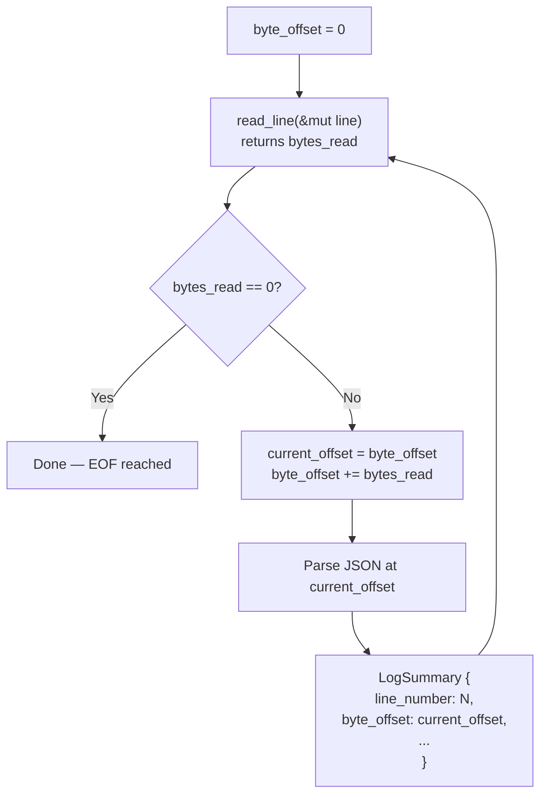
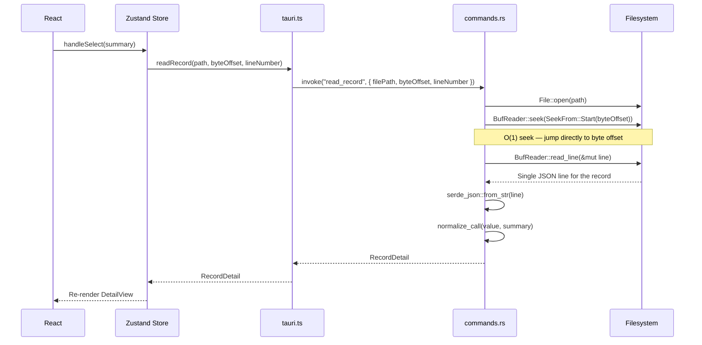
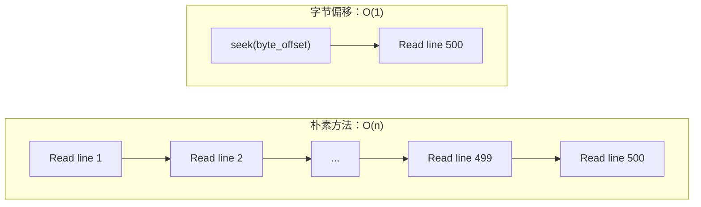
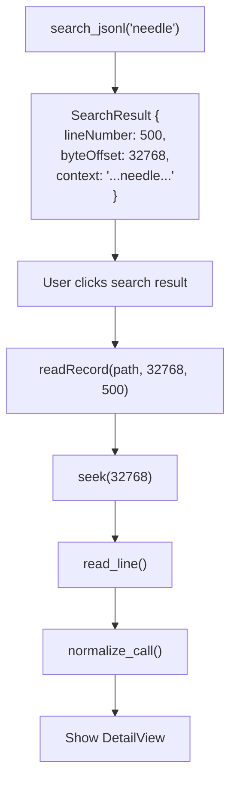
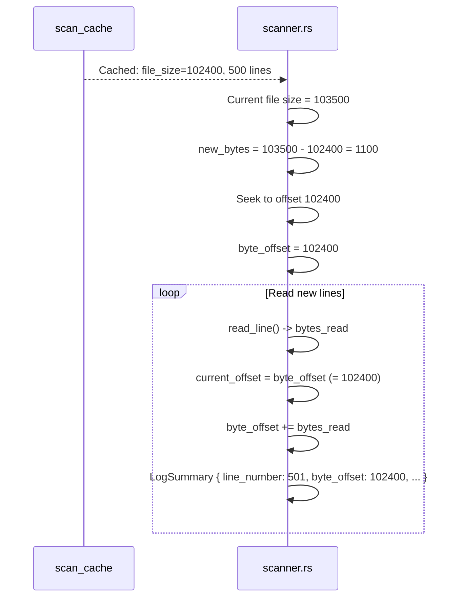

# 字节偏移索引

PromptLens 在初始扫描期间存储每条 JSONL 记录的字节偏移量。这允许在用户选择记录时通过 `seek()` 实现 O(1) 随机访问，无需读取任何前面的行。这是使记录详情视图无论文件大小如何都能快速响应的核心机制。

## JSONL 文件布局

JSONL 文件由换行符分隔的 JSON 对象组成。每一行都是一个完整、自包含的 JSON 值：

```
字节: 0                                                           1023    1070    2047
      |                                                             |       |       |
      v                                                             v       v       v
      {"id":"call_1","model":"gpt-4.1","request":{...},"response":{...}}\n{"id":"call_2",...}\n
      |<------------------- 第 1 行（1024 字节） ------------------->| |<-- 第 2 行 -->|

第 1 行: byte_offset = 0,    length = 1024
第 2 行: byte_offset = 1025, length = 975
```

在扫描过程中，每行的起始字节位置被记录为其 `byte_offset`：

```
第 1 行:  byte_offset = 0
第 2 行:  byte_offset = (第 1 行读取的字节数)
第 3 行:  byte_offset = (第 1 行读取的字节数 + 第 2 行读取的字节数)
...
第 N 行:  byte_offset = 第 1..N-1 行读取字节数之和
```

## 扫描器如何追踪偏移量

`scanner.rs` 中的扫描器维护一个累计的 `byte_offset` 计数器，累加每行读取的字节数：

```rust
// file: src-tauri/src/scanner.rs:42
let mut byte_offset = 0u64;
let mut line = String::new();

loop {
    line.clear();
    let bytes_read = reader.read_line(&mut line)?;
    if bytes_read == 0 { break; }

    total_lines += 1;
    let current_offset = byte_offset;
    byte_offset += bytes_read as u64;

    // 解析行，创建以 current_offset 为 byte_offset 的 LogSummary
    match serde_json::from_str::<Value>(line.trim()) {
        Ok(value) => {
            valid_records += 1;
            let summary = summary_from_value(&value, total_lines, current_offset, None);
            summaries.push(summary);
        }
        Err(err) => {
            invalid_records += 1;
            let summary = invalid_line_summary(total_lines, current_offset, line.trim(), &err);
            summaries.push(summary);
        }
    }
}
```



### 偏移量追踪图示

```
文件内容（显示十六进制位置）：
0x0000: {"id":"a","model":"gpt-4.1"}\n
0x0020: {"id":"b","model":"claude-sonnet-4"}\n
0x0045: {"id":"c","model":"gemini-2.5-pro"}\n
        ^^^^                 ^^^^                    ^^^^
        0x0000               0x0020                  0x0045

LogSummary 条目：
+----------+--------------+------------------------------+
| 行号     | 字节偏移     | ID                           |
+----------+--------------+------------------------------+
| 1        | 0x0000 (0)   | a                            |
| 2        | 0x0020 (32)  | b                            |
| 3        | 0x0045 (69)  | c                            |
+----------+--------------+------------------------------+
```

## 通过 seek() 实现 O(1) 随机访问

当用户在列表中点击一条记录时，`read_record` 命令使用存储的字节偏移直接定位到该行：



### 为什么这是 O(1)

如果没有字节偏移索引，从一个 10,000 行的文件中读取第 500 条记录需要：

```
朴素方法：O(n) — 读取所有 499 行前面的行才能找到第 500 行

+--------------------------------------------------------------+
| 读取第 1 行，丢弃                                            |
| 读取第 2 行，丢弃                                            |
| 读取第 3 行，丢弃                                            |
| ...                                                          |
| 读取第 499 行，丢弃                                          |
| 读取第 500 行 — 这才是我们要的                               |
+--------------------------------------------------------------+
总计：500 次 read_line() 调用
```

使用字节偏移索引，操作系统的 `seek()` 系统调用直接移动文件光标：

```
字节偏移方法：O(1) — seek 到字节偏移，读取一行

+--------------------------------------------------------------+
| seek(byte_offset)  — 操作系统直接移动文件位置                 |
| read_line()        — 读取恰好一行                             |
+--------------------------------------------------------------+
总计：1 次 seek + 1 次 read_line() 调用
```



### seek() 系统调用

Rust 中的 `SeekFrom::Start(byte_offset)` 调用转换为：

| 平台 | 系统调用 | 描述 |
|----------|-------------|-------------|
| Linux/macOS | `lseek(fd, offset, SEEK_SET)` | 将文件位置移到精确的字节位置 |
| Windows | `SetFilePointer(handle, offset, NULL, FILE_BEGIN)` | 相同功能，Win32 API |

两者都是 O(1) 操作，因为文件系统维护一个文件位置指针，可以移动到任何位置而无需读取中间数据。内核的页面缓存可能需要加载相关的磁盘块，但无论偏移量如何，这都是单次 I/O 操作。

## seek() 实现

`commands.rs` 中的 `read_record` 函数：

```rust
// 模拟自 commands.rs read_record 处理器
fn read_record(file_path: String, byte_offset: u64, line_number: usize)
    -> Result<RecordDetail, String>
{
    let file = File::open(&file_path)?;
    let mut reader = BufReader::new(file);
    reader.seek(SeekFrom::Start(byte_offset))?;

    let mut line = String::new();
    reader.read_line(&mut line)?;

    // 解析并规范化单行
    let value: Value = serde_json::from_str(line.trim())?;
    let summary = summary_from_value(&value, line_number, byte_offset, None);
    let normalized = normalize_call(&value, &summary);

    Ok(RecordDetail {
        summary,
        normalized: Some(normalized),
        raw: Some(value),
        parse_error: None,
    })
}
```

包裹 `File` 的 `BufReader` 很重要：它为 `read_line()` 调用添加了缓冲，即使行跨越多个磁盘块也能高效读取。

## 缓存中的字节偏移

`LogSummary` 结构体与其他摘要字段一起存储字节偏移：

```rust
// file: src-tauri/src/types.rs:25
#[derive(Debug, Serialize, Deserialize, Clone)]
#[serde(rename_all = "camelCase")]
pub(crate) struct LogSummary {
    pub(crate) id: String,
    pub(crate) line_number: usize,
    pub(crate) byte_offset: u64,       // <-- 源文件中的字节位置
    pub(crate) timestamp: Option<String>,
    pub(crate) provider: Option<String>,
    pub(crate) model: Option<String>,
    // ... 其他字段
}
```

这些摘要被序列化为 `scan_cache` 表的 `payload` 列中的 JSON。当前端接收到 `FileScanResult` 时，每个摘要携带其字节偏移量，从而实现即时记录访问。

```
scan_cache.payload（JSON，简化版）：
{
  "filePath": "/path/to/audit.jsonl",
  "fileSize": 1048576,
  "summaries": [
    { "lineNumber": 1, "byteOffset": 0,     "model": "gpt-4.1", ... },
    { "lineNumber": 2, "byteOffset": 1024,   "model": "gpt-4.1", ... },
    { "lineNumber": 3, "byteOffset": 2048,   "model": "gpt-4.1", ... },
    ...
  ]
}
```

### TypeScript 端

前端的 TypeScript 类型与 Rust 结构体镜像：

```typescript
// file: src/types.ts:3
export type LogSummary = {
  id: string;
  lineNumber: number;
  byteOffset: number;   // <-- 用于 readRecord()
  timestamp?: string;
  provider?: string;
  model?: string;
  // ...
};
```

当用户选择一条记录时，前端直接将 `byteOffset` 传递给 IPC 包装器：

```typescript
// file: src/tauri.ts:62
export async function readRecord(
  filePath: string,
  byteOffset: number,
  lineNumber: number,
): Promise<RecordDetail> {
  return invoke("read_record", { filePath, byteOffset, lineNumber });
}
```

## 搜索结果中的字节偏移

搜索结果也携带字节偏移，因此点击搜索结果可以直接跳转到匹配的记录：



这意味着搜索到详情的流程也是 O(1) -- 搜索结果的字节偏移直接传递给 `readRecord()`。

### 搜索索引存储

FTS5 搜索索引也存储字节偏移：

```sql
-- file: src-tauri/src/search.rs:65
INSERT INTO search_index (file_path, line_number, byte_offset, content)
VALUES (?1, ?2, ?3, ?4)
```

当返回搜索结果时，`byte_offset` 列被包含在内：

```typescript
// file: src/types.ts:108
export type SearchResult = {
  lineNumber: number;
  byteOffset: number;   // <-- 从搜索结果实现 O(1) 访问
  context: string;
};
```

## 增量扫描和偏移连续性

当新行追加到文件时，增量扫描器从最后已知的偏移量开始：



新摘要的字节偏移从前一次扫描结束处继续，维护整个文件的一致偏移空间。

```
原始扫描：
  第 1 行:   offset 0
  第 2 行:   offset 1024
  ...
  第 500 行: offset 102399

增量扫描（文件增长了 1100 字节）：
  第 501 行: offset 102400
  第 502 行: offset 102900
  第 503 行: offset 103400
```

### 跨扫描的偏移一致性

字节偏移空间是一致的，因为：

1. JSONL 文件按惯例是仅追加的 -- 现有行永远不会被修改
2. 增量扫描器从 `file_size`（之前扫描数据的末尾）开始
3. 每行的偏移量是迄今为止读取字节数的累积和

这种一致性至关重要：如果偏移不一致，`read_record` 中的 `seek()` 操作会落在 JSON 行的中间，导致解析错误。

## 边界情况

### 文件截断

如果文件缩小（大小 < 缓存偏移量），增量扫描器返回错误：

```rust
if metadata.len() < from_offset {
    return Err("File appears to have been truncated. Run a full rescan.".to_string());
}
```

这防止了 seek 到文件末尾之后，否则会产生未定义行为。用户必须触发全量重新扫描以重建偏移索引。

### 空行

空行（仅包含空白或换行符）在扫描期间被跳过。字节偏移仍然会越过它们推进，但不会创建 `LogSummary`。这意味着字节偏移可能存在空行处的"间隙"：

```
第 1 行:  {"data": "..."}\n    -> offset 0,    创建摘要
         \n                   -> offset 50,   跳过（空行）
第 2 行:  {"data": "..."}\n    -> offset 51,   创建摘要
```

这是安全的，因为 `seek()` 后跟 `read_line()` 将读取完整的行，无论前面是什么。

### 无效 JSON 行

JSON 解析失败的行仍然会获得一个 `status: "invalid_json"` 的 `LogSummary`。它们的字节偏移是有效的，可用于 seek 回原始行内容进行显示：

```rust
// file: src-tauri/src/scanner.rs:91
Err(err) => {
    invalid_records += 1;
    let summary = invalid_line_summary(total_lines, current_offset, trimmed, &err);
    summaries.push(summary);
}
```

### 多字节字符（UTF-8）

字节偏移计算原始字节而非字符。包含 UTF-8 多字节字符（如中文、表情符号）的 JSONL 文件的字节偏移不会对应字符位置。这是正确的，因为：

1. `seek()` 操作字节而非字符
2. `read_line()` 读取到 `\n`（字节 0x0A），在 UTF-8 中始终是单字节
3. JSON 解析内部处理 UTF-8

## 性能影响

| 操作 | 无字节偏移 | 有字节偏移 |
| --- | --- | --- |
| 读取第 1 条记录 | O(1) | O(1) |
| 读取第 500 条记录 | O(500) 行读取 | O(1) seek + 1 次读取 |
| 读取第 10000 条记录 | O(10000) 行读取 | O(1) seek + 1 次读取 |
| 扫描所有记录 | O(n) | O(n) |
| 搜索后查看匹配 | O(n) + O(n) = O(n) | O(n) + O(1) = O(n) |
| 存储开销 | 0 字节 | 每条记录 8 字节 |

字节偏移方法在扫描期间零开销（只是递增计数器），但使记录访问为常数时间，无论文件大小或记录位置。对于一个 100,000 行的文件，当用户选择最后一条记录时，这意味着读取 99,999 行与读取 1 行的差异。

存储开销为每条记录 8 字节（一个 `u64`）。对于一个 50,000 条记录的文件，这是 400KB 的偏移数据 -- 与多兆字节的 JSONL 文件本身相比可以忽略不计。

## 架构图


