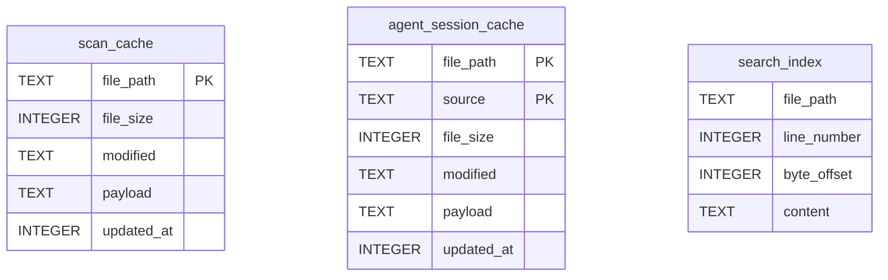
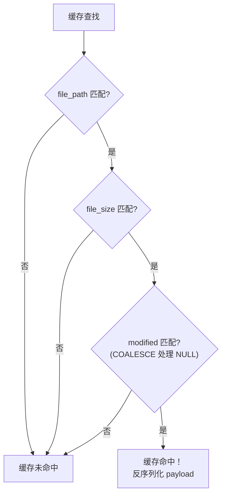
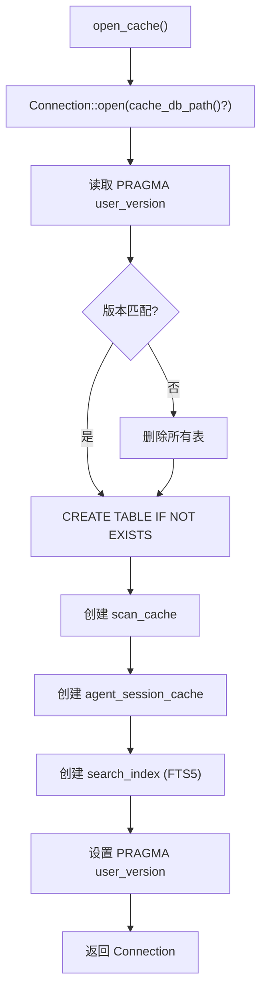

# 缓存层

PromptLens 使用本地 SQLite 数据库缓存扫描结果、代理会话解析和 FTS5 搜索索引。这避免了每次应用启动时重新扫描大文件。缓存层在 `cache.rs` 中使用 `rusqlite` crate 实现，内置 SQLite 引擎。

## 数据库位置

| 平台 | 路径 |
|------|------|
| Linux | `~/.local/share/PromptLens/scan-cache.sqlite` |
| macOS | `~/Library/Application Support/PromptLens/scan-cache.sqlite` |
| Windows | `C:\Users\{user}\AppData\Local\PromptLens\scan-cache.sqlite` |

```rust
// file: src-tauri/src/cache.rs:6
pub(crate) fn cache_db_path() -> Result<std::path::PathBuf, String> {
    if let Ok(path) = std::env::var("PROMPTLENS_CACHE_PATH") {
        return Ok(std::path::PathBuf::from(path));
    }
    let base = dirs::data_local_dir().or_else(dirs::data_dir)
        .ok_or_else(|| "Failed to resolve app data directory".to_string())?
        .join("PromptLens");
    fs::create_dir_all(&base)?;
    Ok(base.join("scan-cache.sqlite"))
}
```

## 模式

数据库包含三张表：



### scan_cache

存储按文件标识键控的序列化 `FileScanResult` 对象。

| 列 | 类型 | 描述 |
|-----|------|------|
| `file_path` | `TEXT PRIMARY KEY` | JSONL 文件的绝对路径 |
| `file_size` | `INTEGER NOT NULL` | 扫描时的文件大小（字节） |
| `modified` | `TEXT` | 修改时间戳（自纪元以来的秒数） |
| `payload` | `TEXT NOT NULL` | JSON 序列化的 `FileScanResult` |
| `updated_at` | `INTEGER NOT NULL` | 通过 `strftime('%s','now')` 的缓存写入时间戳 |

### agent_session_cache

存储按文件和源类型双键控的序列化 `AgentSessionResult` 对象。复合主键 `(file_path, source)` 允许同一文件在不同源解释下缓存。

### search_index

用于全文搜索的 FTS5 虚拟表。只有 `content` 列被索引用于全文搜索。

## 缓存键匹配



```sql
-- file: src-tauri/src/cache.rs:79
SELECT payload FROM scan_cache
WHERE file_path = ?1 AND file_size = ?2
  AND COALESCE(modified, '') = COALESCE(?3, '')
```

## 模式版本控制

数据库使用 `PRAGMA user_version` 跟踪模式变更：

```rust
// file: src-tauri/src/types.rs:7
pub(crate) const CACHE_SCHEMA_VERSION: i64 = 3;
```

启动时，如果存储的版本与 `CACHE_SCHEMA_VERSION` 不匹配，所有表将被删除并重新创建。

## 连接管理

每个缓存操作通过 `open_cache()` 打开新的 SQLite 连接：



## 缓存操作

### 读取扫描缓存

```rust
// file: src-tauri/src/cache.rs:71
pub(crate) fn read_scan_cache(
    file_path: &str, file_size: u64, modified: Option<&str>,
) -> Result<Option<FileScanResult>, String>
```

### 写入扫描缓存

使用 upsert 处理新条目和现有条目：

```rust
// file: src-tauri/src/cache.rs:100
pub(crate) fn write_scan_cache(result: &FileScanResult) -> Result<(), String> {
    // INSERT ... ON CONFLICT(file_path) DO UPDATE SET ...
}
```

### 追加扫描缓存

对于增量扫描，扩展现有缓存条目：读取现有 payload -> 验证 file_size == from_offset -> 扩展 summaries -> 写回。

## 性能特征

| 方面 | 行为 |
|------|------|
| 连接 | 每次操作新连接（SQLite 内部处理池化） |
| 序列化 | 整个 `FileScanResult` 的 JSON 序列化 |
| 缓存命中速度 | 典型文件 &lt;10ms |
| 写入速度 | 取决于 payload 大小；通常 &lt;100ms |
