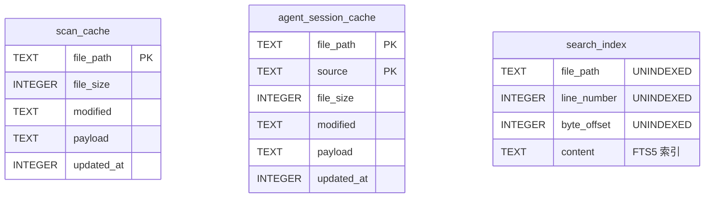
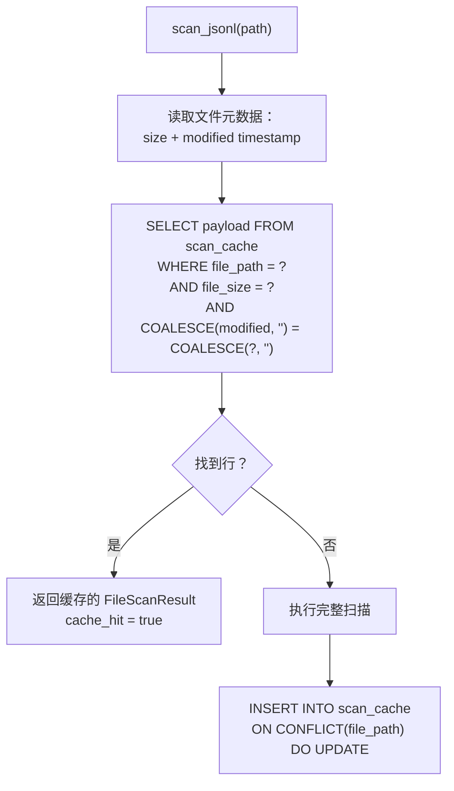
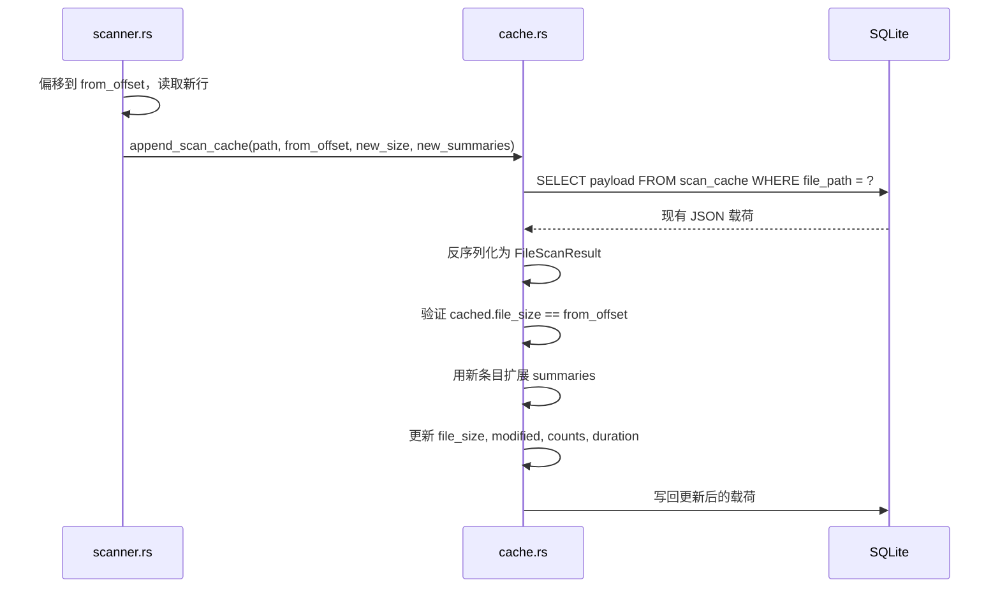
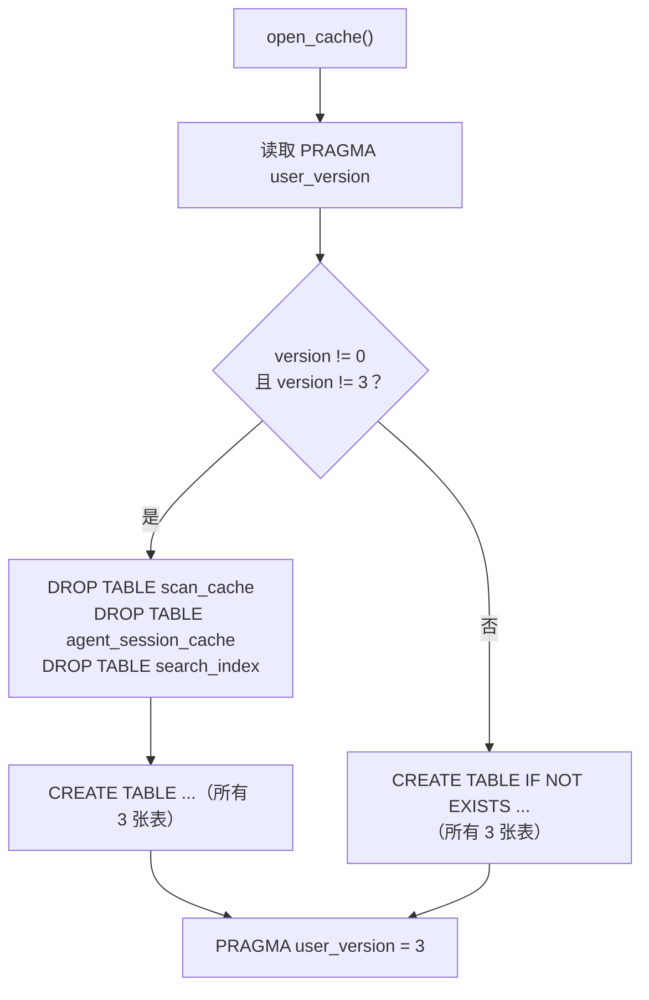
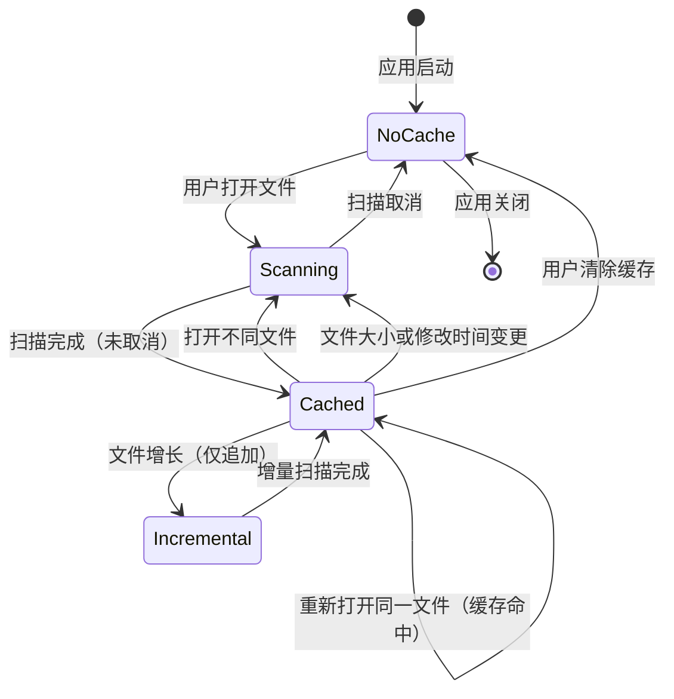

# SQLite 缓存策略

PromptLens 使用单个 SQLite 数据库来缓存扫描结果、agent 会话数据和全文搜索索引。这避免了重新扫描未变更的文件，并提供对先前扫描内容的快速搜索。

## 数据库位置

| 平台 | 路径 |
|------|------|
| macOS | `~/Library/Application Support/PromptLens/scan-cache.sqlite` |
| Linux | `~/.local/share/PromptLens/scan-cache.sqlite` |
| Windows | `C:\Users\{user}\AppData\Local\PromptLens\scan-cache.sqlite` |

路径由 `cache_db_path` 函数使用 `dirs` crate 解析。可以通过 `PROMPTLENS_CACHE_PATH` 环境变量覆盖（用于测试）。

```rust
// file: src-tauri/src/cache.rs:6
pub(crate) fn cache_db_path() -> Result<std::path::PathBuf, String> {
    if let Ok(path) = std::env::var("PROMPTLENS_CACHE_PATH") {
        return Ok(std::path::PathBuf::from(path));
    }
    let base = dirs::data_local_dir()
        .or_else(dirs::data_dir)
        .ok_or_else(|| "Failed to resolve app data directory".to_string())?
        .join("PromptLens");
    fs::create_dir_all(&base)?;
    Ok(base.join("scan-cache.sqlite"))
}
```

## Schema

数据库包含三张表：



### 表 1：`scan_cache`

存储完整的 `FileScanResult` 对象，序列化为 JSON。

```sql
CREATE TABLE IF NOT EXISTS scan_cache (
    file_path TEXT PRIMARY KEY,
    file_size INTEGER NOT NULL,
    modified TEXT,
    payload TEXT NOT NULL,
    updated_at INTEGER NOT NULL
)
```

| 列 | 用途 |
|----|------|
| `file_path` | JSONL 文件的绝对路径（主键） |
| `file_size` | 扫描时的文件大小（字节） |
| `modified` | 文件修改时间戳（Unix 纪元秒数） |
| `payload` | 完整的 `FileScanResult` 序列化为 JSON |
| `updated_at` | 缓存写入时间戳 |

### 表 2：`agent_session_cache`

存储解析后的 agent 会话结果，按文件路径和日志源双重键控。复合主键 `(file_path, source)` 允许同一文件在不同的日志源解释下缓存。

### 表 3：`search_index`（FTS5 虚拟表）

```sql
CREATE VIRTUAL TABLE IF NOT EXISTS search_index USING fts5(
    file_path UNINDEXED,
    line_number UNINDEXED,
    byte_offset UNINDEXED,
    content
)
```

```rust
// file: src-tauri/src/cache.rs:57
conn.execute(
    "CREATE VIRTUAL TABLE IF NOT EXISTS search_index USING fts5(
        file_path UNINDEXED,
        line_number UNINDEXED,
        byte_offset UNINDEXED,
        content
    )",
    [],
)
```

只有 `content` 列被 FTS5 索引用于全文搜索。`file_path`、`line_number` 和 `byte_offset` 列存储但不索引——它们用于过滤和结果构建。

## 缓存键和失效

缓存由三元组键控：**(file_path, file_size, modified_timestamp)**。



### 失效触发条件

| 条件 | 示例 |
|------|------|
| 文件路径不同 | 打开不同的文件 |
| 文件大小变更 | 新行追加到日志 |
| 修改时间变更 | 上次扫描后文件被编辑 |
| 缓存 schema 版本 | `PRAGMA user_version` 与 `CACHE_SCHEMA_VERSION`（当前为 3）不同 |

## 缓存写入路径

当完整扫描完成且未被取消时，结果写入缓存：

```rust
// file: src-tauri/src/cache.rs:100
pub(crate) fn write_scan_cache(result: &FileScanResult) -> Result<(), String> {
    let conn = open_cache()?;
    let payload = serde_json::to_string(result)?;
    conn.execute(
        "INSERT INTO scan_cache (file_path, file_size, modified, payload, updated_at)
         VALUES (?1, ?2, ?3, ?4, strftime('%s','now'))
         ON CONFLICT(file_path) DO UPDATE SET
            file_size = excluded.file_size,
            modified = excluded.modified,
            payload = excluded.payload,
            updated_at = excluded.updated_at",
        params![result.file_path, result.file_size as i64, result.modified, payload],
    )?;
    Ok(())
}
```

`ON CONFLICT(file_path) DO UPDATE` 子句意味着重新扫描同一文件会替换现有缓存条目。

## 增量缓存更新

当文件增长（仅追加）时，缓存增量更新而非重写：



关键安全检查是 `cached.file_size != from_offset`——如果缓存大小与预期偏移量不匹配（例如文件被截断或外部修改），则跳过追加并需要完整重新扫描。

## Schema 版本控制

```rust
// file: src-tauri/src/types.rs:7
pub(crate) const CACHE_SCHEMA_VERSION: i64 = 3;
```



## 错误处理

缓存操作设计为非致命的。如果任何缓存读取或写入失败，错误被静默忽略，操作回退到完整扫描或跳过缓存：

| 操作 | 出错时 | 原因 |
|------|--------|------|
| `read_scan_cache` | 返回 `Ok(None)` | 视为缓存未命中，触发完整扫描 |
| `write_scan_cache` | 返回 `Err`（被调用者忽略） | 扫描结果已在内存中 |
| `append_scan_cache` | 如果条目不存在则返回 `Ok(())` | 没有现有数据可扩展 |

## 缓存生命周期



## 性能特征

| 操作 | 复杂度 | 说明 |
|------|--------|------|
| 缓存读取（命中） | O(1) | 按主键的单次 SQL 查询 |
| 完整扫描 | O(n) | n = 文件总行数 |
| 增量扫描 | O(delta) | delta = 上次扫描后的新行数 |
| FTS5 搜索（索引） | O(k) | k = 匹配结果数（通常很快） |
| 线性搜索（回退） | O(n) | n = 总行数，用于 regex 模式 |
| 缓存写入 | O(1) | 单次 INSERT/UPDATE |
| 搜索索引写入 | O(n) | 每行一次 INSERT |
| 搜索索引追加 | O(delta) | 每个新行一次 INSERT |

### 为什么将整个载荷存储为 JSON？

将完整的 `FileScanResult` 作为 JSON blob 存储在单列中是有意的设计选择。替代方案是：

1. **规范化表** — 将 `LogSummary` 条目存储在单独的表中，使用外键。这将支持对单个记录的 SQL 查询，但增加了连接和序列化的复杂性。
2. **每字段一列** — 将所有字段展平为列。当 schema 变更时会中断，且使表变得宽而稀疏。

JSON blob 方法对 PromptLens 来说是最优的，因为：
- 整个扫描结果始终作为一个单元读取/写入
- 没有 SQL 查询操作单个 `LogSummary` 字段
- Schema 变更只影响 Rust 结构体，不影响 SQL schema
- SQLite 使用其内置存储引擎高效处理大文本 blob
