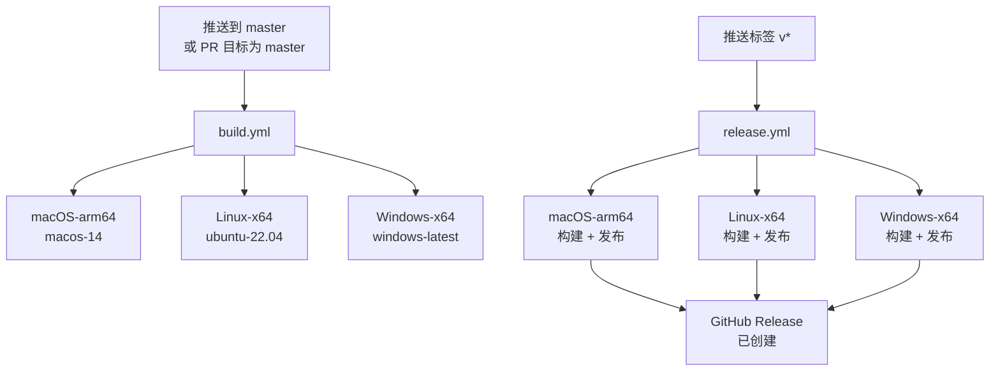
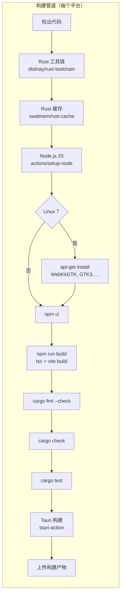

# CI/CD

PromptLens 使用 GitHub Actions 进行持续集成和发布自动化。两个工作流处理所有构建和发布。

## 工作流概览





## 构建工作流 (`build.yml`)

**触发条件：** 推送到 `master` 或针对 `master` 的拉取请求。

**并发控制：** 按分支取消进行中的构建。

📄 `.github/workflows/build.yml`

### 完整工作流 YAML

```yaml
# file: .github/workflows/build.yml:1-12
name: Build

on:
  push:
    branches: [master]
  pull_request:
    branches: [master]

concurrency:
  group: ${{ github.workflow }}-${{ github.ref }}
  cancel-in-progress: true
```

### 构建矩阵

```yaml
# file: .github/workflows/build.yml:14-30
strategy:
  fail-fast: false
  matrix:
    include:
      - platform: macos-14
        target: aarch64-apple-darwin
        bundles: dmg,app
        label: macOS-arm64
      - platform: ubuntu-22.04
        target: x86_64-unknown-linux-gnu
        bundles: deb,rpm,appimage
        label: Linux-x64
      - platform: windows-latest
        target: x86_64-pc-windows-msvc
        bundles: msi,nsis
        label: Windows-x64
```

| 平台 | 运行器 | 目标 | 安装包 | 标签 |
|----------|--------|--------|---------|-------|
| macOS | `macos-14` | `aarch64-apple-darwin` | dmg, app | macOS-arm64 |
| Linux | `ubuntu-22.04` | `x86_64-unknown-linux-gnu` | deb, rpm, appimage | Linux-x64 |
| Windows | `windows-latest` | `x86_64-pc-windows-msvc` | msi, nsis | Windows-x64 |

### 构建步骤

| 步骤 | 操作/命令 | 描述 |
|------|---------------|-------------|
| 检出 | `actions/checkout@v4` | 克隆仓库 |
| Rust 工具链 | `dtolnay/rust-toolchain@stable` | 安装带目标三元组的 Rust |
| Rust 缓存 | `swatinem/rust-cache@v2` | 缓存 `src-tauri/target/` |
| Node.js 设置 | `actions/setup-node@v4` | Node 20，npm 缓存 |
| Linux 依赖 | `apt-get install` | WebKitGTK, GTK3, libayatana, librsvg, patchelf |
| 前端安装 | `npm ci` | 从 lockfile 干净安装 |
| 前端构建 | `npm run build` | TypeScript 检查 + Vite 生产构建 |
| Rust 检查 | `cargo fmt --check && cargo check` | 格式化 + 类型检查 |
| Rust 测试 | `cargo test` | 运行所有单元测试 |
| Tauri 构建 | `tauri-apps/tauri-action@v0` | 构建平台特定安装包 |
| 上传产物 | `actions/upload-artifact@v4` | 上传到 GitHub Actions 产物 |

Linux 依赖安装步骤：
```yaml
# file: .github/workflows/build.yml:54-63
- name: Install system dependencies (Linux)
  if: matrix.platform == 'ubuntu-22.04'
  run: |
    sudo apt-get update
    sudo apt-get install -y \
      libwebkit2gtk-4.1-dev \
      libgtk-3-dev \
      libayatana-appindicator3-dev \
      librsvg2-dev \
      patchelf
```

### 产物名称

| 标签 | 产物名称 | 文件 |
|-------|--------------|-------|
| macOS-arm64 | `promptlens-macOS-arm64` | `.dmg`, `.app.tar.gz` |
| Linux-x64 | `promptlens-Linux-x64` | `.deb`, `.rpm`, `.AppImage` |
| Windows-x64 | `promptlens-Windows-x64` | `.exe`, `.msi`, `.nsis.zip` |

上传步骤模式：
```yaml
# file: .github/workflows/build.yml:88-100
- name: Upload artifacts
  uses: actions/upload-artifact@v4
  with:
    name: promptlens-${{ matrix.label }}
    path: |
      src-tauri/target/${{ matrix.target }}/release/bundle/**/*.dmg
      src-tauri/target/${{ matrix.target }}/release/bundle/**/*.app.tar.gz
      src-tauri/target/${{ matrix.target }}/release/bundle/**/*.deb
      src-tauri/target/${{ matrix.target }}/release/bundle/**/*.rpm
      src-tauri/target/${{ matrix.target }}/release/bundle/**/*.exe
      src-tauri/target/${{ matrix.target }}/release/bundle/**/*.msi
      src-tauri/target/${{ matrix.target }}/release/bundle/**/*.nsis.zip
    if-no-files-found: ignore
```

## 发布工作流 (`release.yml`)

**触发条件：** 推送匹配 `v*` 的标签（例如 `v0.7.0`）。

**权限：** `contents: write`（用于创建 GitHub releases）。

📄 `.github/workflows/release.yml`

```yaml
# file: .github/workflows/release.yml:1-9
name: Release

on:
  push:
    tags:
      - "v*"

permissions:
  contents: write
```

### 发布矩阵

与构建矩阵相同（macOS-arm64、Linux-x64、Windows-x64）。

### 发布步骤

与构建步骤相同，加上发布特定的 Tauri 操作：

```yaml
# file: .github/workflows/release.yml:83-93
- name: Build and release
  uses: tauri-apps/tauri-action@v0
  env:
    GITHUB_TOKEN: ${{ secrets.GITHUB_TOKEN }}
  with:
    tagName: ${{ github.ref_name }}
    releaseName: "PromptLens ${{ github.ref_name }}"
    releaseBody: "See the assets below for platform-specific installers."
    releaseDraft: false
    prerelease: false
    args: --target ${{ matrix.target }} --bundles ${{ matrix.bundles }}
```

| 步骤 | 描述 |
|------|-------------|
| Tauri 构建 + 发布 | `tauri-apps/tauri-action@v0` 配置 `tagName`、`releaseName`、`releaseBody` |
| GitHub Release | 自动创建为非草稿、非预发布 |

### 发布命名

| 字段 | 模式 | 示例 |
|-------|---------|---------|
| 标签 | `v{版本}` | `v0.7.0` |
| 发布名称 | `PromptLens v{版本}` | `PromptLens v0.7.0` |
| 正文 | 静态："See the assets below for platform-specific installers." | |

## 设置 CI

### Fork / 新仓库

1. 工作流定义在 `.github/workflows/build.yml` 和 `.github/workflows/release.yml`
2. 仅构建运行不需要密钥
3. 发布时，`GITHUB_TOKEN` 由 GitHub Actions 自动提供

### 自托管运行器

如果使用自托管运行器，请确保：

| 平台 | 要求 |
|----------|-------------|
| macOS | Xcode CLI 工具、Rust 工具链、Node.js 20 |
| Linux | WebKitGTK 4.1 dev、GTK3 dev、libayatana、librsvg、patchelf |
| Windows | Visual Studio Build Tools 带 C++ 工作负载 |

## 缓存策略

| 缓存 | 范围 | 键 | 操作 |
|-------|-------|-----|--------|
| Rust | 按目标 + Cargo.lock 哈希 | `swatinem/rust-cache@v2` | 缓存 `src-tauri/target/` |
| npm | 按 `package-lock.json` 哈希 | `actions/setup-node@v4` 缓存 | 缓存 `~/.npm` |

```yaml
# file: .github/workflows/build.yml:42-46
- name: Rust cache
  uses: swatinem/rust-cache@v2
  with:
    workspaces: src-tauri -> target
```

Rust 缓存存储 `src-tauri/target/` 目录。增量构建通常在首次运行后需要 1-3 分钟。

## CI 故障排除

| 问题 | 原因 | 修复 |
|-------|-------|-----|
| Linux 构建在 `apt-get` 失败 | 缺少系统依赖 | 确保 Linux 依赖步骤在 Rust 检查之前运行 |
| macOS 代码签名错误 | 缺少证书 | PR 构建不需要代码签名；仅发布构建尝试公证 |
| Rust 缓存未命中 | `Cargo.lock` 已更改 | 这是预期的；缓存会自动重建 |
| `cargo fmt --check` 失败 | 代码未格式化 | 推送前在本地运行 `cargo fmt` |
| Tauri 操作超时 | 大型二进制编译 | 首次构建可能需要 15-20 分钟；后续构建有缓存 |
| `npm ci` 失败 | lockfile 损坏 | 在本地运行 `npm install` 重新生成 `package-lock.json` |
| WebKitGTK 未找到 | Linux 依赖缺失 | 验证 `apt-get install` 步骤成功运行 |
| Windows 链接器错误 | MSVC 未安装 | 安装带 C++ 工作负载的 Visual Studio Build Tools |

## 构建时间估计

| 平台 | 首次构建 | 缓存构建 |
|----------|------------|-------------|
| macOS-arm64 | 12-18 分钟 | 3-6 分钟 |
| Linux-x64 | 10-15 分钟 | 2-5 分钟 |
| Windows-x64 | 12-18 分钟 | 3-6 分钟 |

首次构建较慢是因为需要从头编译所有 Rust 依赖。后续构建受益于 `swatinem/rust-cache` 操作缓存 `target/` 目录。

## 本地 CI 模拟

在推送前验证更改是否通过 CI：

```bash
# 1. 前端检查
npm ci
npm run build

# 2. 后端检查
cd src-tauri
cargo fmt --check
cargo check
cargo test

# 3. 返回项目根目录
cd ..
```

## 添加新平台目标

要添加新平台（例如 macOS x86_64）：

1. 在 `build.yml` 和 `release.yml` 的 `matrix.include` 数组中添加新条目
2. 指定正确的 `platform` 运行器、`target` 三元组和 `bundles`
3. 添加任何平台特定的依赖安装步骤
4. 在功能分支上测试工作流后再合并

## 分支保护

`master` 的推荐分支保护规则：

| 规则 | 设置 |
|------|---------|
| 要求 PR 审查 | 1 次批准 |
| 要求状态检查 | `Build . macOS-arm64`, `Build . Linux-x64`, `Build . Windows-x64` |
| 要求分支最新 | 是 |
| 要求线性历史 | 可选（推荐 squash merge） |

## 工作流文件位置

| 文件 | 路径 |
|------|------|
| 构建工作流 | `.github/workflows/build.yml` |
| 发布工作流 | `.github/workflows/release.yml` |

## 密钥参考

| 密钥 | 需要方 | 用途 |
|--------|------------|---------|
| `GITHUB_TOKEN` | 发布工作流 | 由 GitHub Actions 自动提供；用于创建 releases 和上传资源 |
| `APPLE_CERTIFICATE` | 发布（macOS，可选） | Base64 编码的 Apple 签名证书 |
| `APPLE_CERTIFICATE_PASSWORD` | 发布（macOS，可选） | 证书密码 |
| `APPLE_ID` | 发布（macOS，可选） | 公证用 Apple ID |
| `APPLE_PASSWORD` | 发布（macOS，可选） | 公证用应用专用密码 |
| `APPLE_TEAM_ID` | 发布（macOS，可选） | Apple 开发者团队 ID |

macOS 签名密钥是可选的。没有它们，macOS 构建会生成未签名的产物，用户可以通过右键 > 打开来使用。
