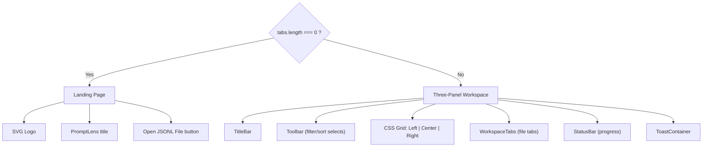
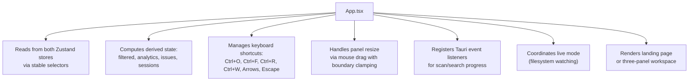
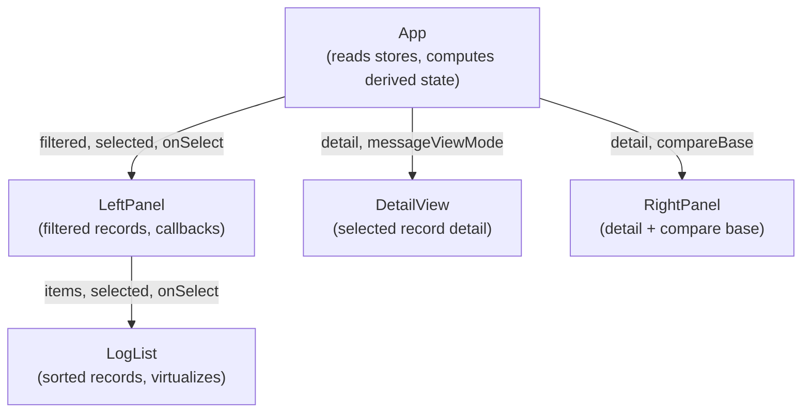
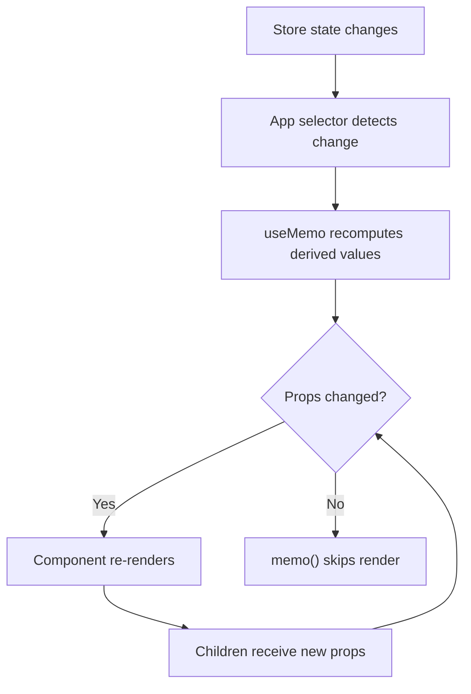

# 组件层级

PromptLens 使用由单一根组件管理的三面板布局。组件树有意保持扁平 -- 没有深层嵌套层级，也没有超出 React 内置 `StrictMode` 的 Context Provider。

## 组件树

```mermaid
graph TD
    App["App (root)"]
    TitleBar["TitleBar"]
    Landing["Landing (no file)"]
    Toolbar["Toolbar (filters)"]
    WorkspaceGrid["Workspace Grid"]
    LeftPanel["LeftPanel"]
    CenterPanel["CenterPanel (DetailView)"]
    RightPanel["RightPanel"]
    ResizeHandleL["Resize Handle (left)"]
    ResizeHandleR["Resize Handle (right)"]
    StatusBar["StatusBar"]
    WorkspaceTabs["WorkspaceTabs"]
    ToastContainer["ToastContainer"]
    SourceConfirmDialog["SourceConfirmDialog"]
    ImagePreview["ImagePreview Modal"]

    App --> TitleBar
    App --> Landing
    App --> Toolbar
    App --> WorkspaceGrid
    App --> StatusBar
    App --> WorkspaceTabs
    App --> ToastContainer
    App --> SourceConfirmDialog
    App --> ImagePreview

    WorkspaceGrid --> LeftPanel
    WorkspaceGrid --> ResizeHandleL
    WorkspaceGrid --> CenterPanel
    WorkspaceGrid --> ResizeHandleR
    WorkspaceGrid --> RightPanel

    LeftPanel --> FileHeader["FileHeader"]
    LeftPanel --> LogList["LogList (virtual)"]
    LeftPanel --> AgentTimelineView["AgentTimelineView"]
    LeftPanel --> SubagentsView["SubagentsView"]
    LeftPanel --> AgentFilesView["AgentFilesView"]
    LeftPanel --> TraceView["TraceView"]
    LeftPanel --> SessionsView["SessionsView"]
    LeftPanel --> AnalyticsView["AnalyticsView"]
    LeftPanel --> IssuesView["IssuesView"]

    CenterPanel --> DetailView["DetailView"]
    CenterPanel --> AgentEventDetailView["AgentEventDetailView"]
    CenterPanel --> MessageCard["MessageCard"]
    CenterPanel --> RawRecordFallback["RawRecordFallback"]

    RightPanel --> DiffView["DiffView"]
    RightPanel --> ToolCallsView["ToolCallsView"]
    RightPanel --> ErrorView["ErrorView"]
    RightPanel --> JsonTreeView["JsonTreeView"]
    RightPanel --> RawPayloadView["RawPayloadView"]

    AnalyticsView --> BarChart["BarChart"]
    AnalyticsView --> Histogram["Histogram"]
```



## 渲染模式

`App` 组件根据是否加载了文件渲染两种顶层布局之一：



当没有文件打开时，显示带有 PromptLens logo 和"打开 JSONL 文件"按钮的居中着陆页。一旦文件加载完成，三面板工作区接管整个视口。

### 为什么需要两种模式？

着陆页作为一个干净的入口点，避免显示空的工作区。它还为应用品牌提供视觉锚点。模式之间的转换通过渲染逻辑中的简单条件处理 -- 不需要路由库，因为 PromptLens 是一个没有基于 URL 导航的单页应用。

## 组件职责

### 根组件

**`App`** (`src/app/App.tsx`)
整个应用程序的单一编排点。它：



### 标题栏

**`TitleBar`** (`src/app/components/TitleBar.tsx`)
macOS 风格的可拖动标题栏，包含：

| 功能 | 实现 |
|---------|---------------|
| 窗口控制 | Tauri 窗口 API（最小化、最大化、关闭） |
| 应用菜单 | 打开（带源选择）、导出、设置 |
| 最近文件 | 来自 localStorage 的子菜单 |
| 主题切换 | 深色/浅色切换 |
| 设置面板 | 覆盖层，用于字体族、字号、代码字体 |
| 缓存信息 | 显示路径和清除操作 |

### 工作区组件

**`WorkspaceTabs`** (`src/app/components/Workspace.tsx`)
渲染工作区顶部的会话标签栏。每个标签代表一个子代理会话或主会话：

```typescript
// 每个标签具有：
type SessionTab = {
  id: string;           // "main" 或 "subagent:<agentId>"
  kind: SessionTabKind; // "main" | "subagent"
  label: string;        // 显示名称
  agentId?: string;     // 用于子代理标签
  selected: LogSummary | null;
  detail: RecordDetail | null;
  compareBase: RecordDetail | null;
  searchTerm: string;
  searchResults: SearchResult[];
};
```

**`StatusBar`** (`src/app/components/Workspace.tsx`)
底部薄条，显示扫描/搜索进度的进度条和取消按钮。空闲时显示上次扫描和搜索操作的持续时间。

### 左面板

**`LeftPanel`** (`src/app/components/LeftPanel.tsx`)
主要导航界面。它是用 `memo` 包装的组件，包含最多 8 个子视图的标签页界面：

| 标签 | 图标 | 何时可见 | 用途 |
|---|---|---|---|
| 记录 | FileText | 始终 | 虚拟滚动的所有日志记录列表 |
| 时间线 | Terminal | 代理会话 | 按时间顺序的代理事件时间线 |
| 子代理 | Bot | 代理会话 | 带状态的子代理任务列表 |
| 代理文件 | FileText | 代理会话 | 代理会话期间的文件活动 |
| 追踪 | Network | 审计日志 | 追踪链分组 |
| 会话 | Users | 审计日志 | 启发式会话分组 |
| 分析 | BarChart3 | 始终 | Token 使用量、延迟、错误率图表 |
| 问题 | AlertTriangle | 始终 | 检测到的异常和高延迟记录 |

```typescript
// file: src/app/components/LeftPanel.tsx:51
export const LeftPanel = memo(function LeftPanel({
  tab, setTab, source, sortOrder, setSortOrder,
  query, setQuery, file, filtered, selected,
  selectedAgentEvent, newLineNumbers, agentSession,
  sessions, issues, filterOptions,
  searchTerm, setSearchTerm, searching, searchResults,
  lastSearchIndexed, analytics, detail, costEstimates,
  onSearch, onSelect, onCompare, onJump,
  onAgentEventSelect, onTraceFilter,
  onClearSearchResults, onOpenSubagentTab,
}: { /* ... */ }) {
  // 标签切换、搜索输入、虚拟列表渲染
});
```

### 中面板

**`CenterPanel`** (`src/app/components/CenterPanel.tsx`)
显示完整规范化记录的主要内容区域：

| 子组件 | 用途 |
|---------------|---------|
| `DetailView` | 带请求/响应标签的完整记录 |
| `MessageCard` | 带角色徽章、Markdown、视图模式切换的单条消息 |
| `AgentEventDetailView` | 代理事件详情（工具名称、命令、文件） |
| `RawRecordFallback` | 规范化失败时的原始 JSON |
| `KeyValue` | 可复用的键值行，用于元数据 |
| `JsonCode` | 带复制按钮的语法高亮 JSON |

### 右面板

**`RightPanel`** (`src/app/components/RightPanel.tsx`)
用于补充视图的标签页侧边栏：

| 标签 | 图标 | 用途 |
|---|---|---|
| Diff | GitCompare | 两条记录之间的并排文本差异 |
| Tools | Wrench | 从当前记录提取的工具调用 |
| Error | AlertCircle | 带堆栈跟踪的错误详情 |
| JSON | Braces | 可展开/折叠的交互式 JSON 树 |
| Raw | Code | 带语法高亮的原始 JSON 负载 |

### 覆盖层组件

**`ToastContainer`** (`src/app/components/Toast.tsx`)
渲染自动消失的通知 toast（5 秒超时）。支持错误、成功和信息变体。

**`SourceConfirmDialog`** (`src/app/components/SourceConfirmDialog.tsx`)
当自动检测的日志源与默认值不同时显示的模态框。让用户确认检测到的源或选择替代源。

**`ImagePreview`**（内联在 `App.tsx` 中）
用于查看记录中发现的 base64/data-URL 图片的全屏模态覆盖层。按 Escape 或点击外部关闭。

### 工具组件

**`BarChart`** 和 **`Histogram`** (`src/app/components/Charts.tsx`)
用于分析可视化的纯渲染组件：

```typescript
// file: src/app/components/Charts.tsx
export function BarChart({ data, max }: { data: { label: string; value: number }[]; max: number }) {
  return (
    <div className="bar-chart">
      {data.map((d) => (
        <div key={d.label} className="bar-row">
          <span className="bar-label">{d.label}</span>
          <div className="bar-track">
            <div className="bar-fill" style={{ width: `${(d.value / max) * 100}%` }} />
          </div>
          <span className="bar-value">{d.value}</span>
        </div>
      ))}
    </div>
  );
}
```

## Props 流

所有数据从 `App` 通过 props 自顶向下流动。没有 React Context providers：



组件永远不会直接调用 store actions -- 它们从 `App` 接收回调 props，`App` 委托给 store 的 action 方法。这使组件树可测试且数据流可预测。

## 组件大小参考

| 组件 | 文件 | 行数 | 复杂度 |
|---|---|---|---|
| LeftPanel | `LeftPanel.tsx` | ~1,060 | 高 -- 8 个标签页视图、虚拟列表、搜索 |
| CenterPanel | `CenterPanel.tsx` | ~570 | 中 -- 消息卡片、内容块 |
| App | `App.tsx` | ~800 | 高 -- 编排、效果、调整大小 |
| TitleBar | `TitleBar.tsx` | ~370 | 中 -- 菜单、设置、窗口控制 |
| RightPanel | `RightPanel.tsx` | ~350 | 中 -- 5 个标签页视图、diff、JSON 树 |
| Workspace | `Workspace.tsx` | ~130 | 低 -- 标签、状态栏 |
| Charts | `Charts.tsx` | ~60 | 低 -- BarChart、Histogram |
| SourceConfirmDialog | `SourceConfirmDialog.tsx` | ~57 | 低 -- 模态对话框 |
| Toast | `Toast.tsx` | ~24 | 低 -- 通知渲染 |

## 重新渲染优化

组件树通过多层设计来最小化重新渲染：



| 层级 | 机制 | 说明 |
|-------|-----------|-------|
| 1. Store selectors | `useAppStore((s) => s.theme)` | 仅在选中值变化时重新渲染 |
| 2. `useMemo` | `useMemo(() => buildAnalytics(filtered), [filtered])` | 依赖不变时不重新计算 |
| 3. `React.memo()` | `memo(function LeftPanel(...))` | props 浅比较相等时跳过渲染 |
| 4. 回调稳定性 | Store actions 是稳定引用 | 传递 actions 作为 props 不触发重新渲染 |
| 5. 虚拟滚动 | `@tanstack/react-virtual` | DOM 中仅有可见行 |
