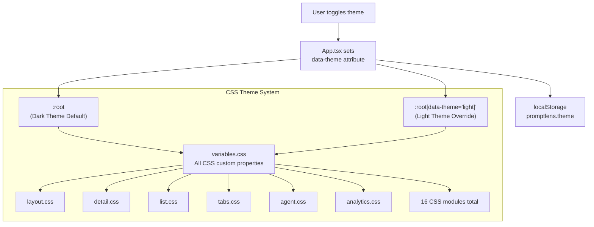
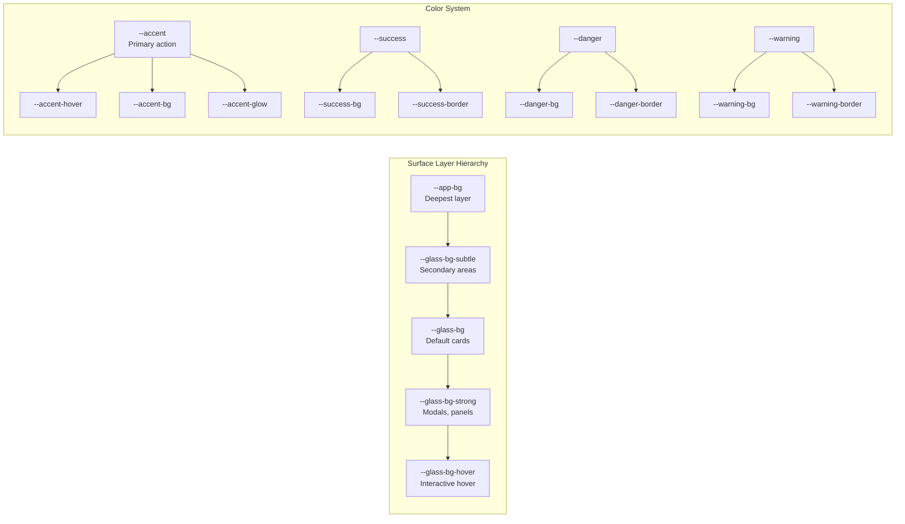

# CSS 变量

PromptLens 使用 CSS 自定义属性作为其主题系统。所有变量定义在 `src/styles/variables.css` 中。深色主题是默认主题（`:root`），浅色主题覆盖通过 `:root[data-theme="light"]` 应用。

## 主题架构





## 主题切换

主题通过在根元素上设置 `data-theme` 属性来切换：

```typescript
document.documentElement.setAttribute("data-theme", "light");
document.documentElement.setAttribute("data-theme", "dark");
```

当前主题持久化到 localStorage 中，键为 `promptlens.theme`。

```typescript
// file: src/app/types.ts:117
export const THEME_KEY = "promptlens.theme";
```

## 完整变量参考

### 表面层

从后到前的背景表面。

```css
/* file: src/styles/variables.css:8-13 */
:root {
  --app-bg: #0a0c10;
  --glass-bg: rgba(22, 27, 36, 0.72);
  --glass-bg-strong: rgba(28, 33, 44, 0.88);
  --glass-bg-subtle: rgba(18, 22, 30, 0.55);
  --glass-bg-hover: rgba(38, 44, 58, 0.72);
}
```

```css
/* file: src/styles/variables.css:80-85 */
:root[data-theme="light"] {
  --app-bg: #e8ecf1;
  --glass-bg: rgba(255, 255, 255, 0.55);
  --glass-bg-strong: rgba(255, 255, 255, 0.82);
  --glass-bg-subtle: rgba(255, 255, 255, 0.40);
  --glass-bg-hover: rgba(240, 244, 250, 0.65);
}
```

| 变量 | 深色 | 浅色 | 用途 |
|----------|------|-------|---------|
| `--app-bg` | `#0a0c10` | `#e8ecf1` | 应用背景 |
| `--glass-bg` | `rgba(22,27,36,0.72)` | `rgba(255,255,255,0.55)` | 玻璃卡片背景 |
| `--glass-bg-strong` | `rgba(28,33,44,0.88)` | `rgba(255,255,255,0.82)` | 强化玻璃（模态框、面板） |
| `--glass-bg-subtle` | `rgba(18,22,30,0.55)` | `rgba(255,255,255,0.40)` | 微妙玻璃（次要区域） |
| `--glass-bg-hover` | `rgba(38,44,58,0.72)` | `rgba(240,244,250,0.65)` | 悬停状态背景 |

### 边框和边缘

```css
/* file: src/styles/variables.css:15-18 */
:root {
  --glass-border: rgba(255, 255, 255, 0.08);
  --glass-border-strong: rgba(255, 255, 255, 0.14);
  --glass-border-accent: rgba(91, 156, 246, 0.30);
}
```

| 变量 | 深色 | 浅色 | 用途 |
|----------|------|-------|---------|
| `--glass-border` | `rgba(255,255,255,0.08)` | `rgba(255,255,255,0.60)` | 默认玻璃边框 |
| `--glass-border-strong` | `rgba(255,255,255,0.14)` | `rgba(0,0,0,0.08)` | 强调边框 |
| `--glass-border-accent` | `rgba(91,156,246,0.30)` | `rgba(52,120,246,0.30)` | 强调色边框 |

### 阴影和高光

```css
/* file: src/styles/variables.css:20-24 */
:root {
  --glass-shadow: 0 2px 20px rgba(0, 0, 0, 0.35);
  --glass-shadow-lg: 0 8px 40px rgba(0, 0, 0, 0.45);
  --glass-highlight: inset 0 1px 0 rgba(255, 255, 255, 0.05);
  --glass-inset: inset 0 1px 3px rgba(0, 0, 0, 0.2);
}
```

| 变量 | 深色 | 浅色 | 用途 |
|----------|------|-------|---------|
| `--glass-shadow` | `0 2px 20px rgba(0,0,0,0.35)` | `0 2px 16px rgba(0,0,0,0.06)` | 卡片阴影 |
| `--glass-shadow-lg` | `0 8px 40px rgba(0,0,0,0.45)` | `0 8px 32px rgba(0,0,0,0.08)` | 大阴影（模态框） |
| `--glass-highlight` | `inset 0 1px 0 rgba(255,255,255,0.05)` | `inset 0 1px 0 rgba(255,255,255,0.80)` | 顶部边缘高光 |
| `--glass-inset` | `inset 0 1px 3px rgba(0,0,0,0.2)` | `inset 0 1px 3px rgba(0,0,0,0.06)` | 内阴影 |

### 排版

```css
/* file: src/styles/variables.css:26-29 */
:root {
  --text-primary: #e8eaed;
  --text-secondary: #8b95a5;
  --text-tertiary: #5a6370;
  --text-inverse: #1d1d1f;
}
```

| 变量 | 深色 | 浅色 | 用途 |
|----------|------|-------|---------|
| `--text-primary` | `#e8eaed` | `#1d1d1f` | 主文本颜色 |
| `--text-secondary` | `#8b95a5` | `#6e7681` | 次文本 |
| `--text-tertiary` | `#5a6370` | `#9ca3af` | 第三级/禁用文本 |
| `--text-inverse` | `#1d1d1f` | `#ffffff` | 强调色背景上的文本 |

### 强调色

```css
/* file: src/styles/variables.css:31-36 */
:root {
  --accent: #5b9cf6;
  --accent-hover: #7ab3ff;
  --accent-bg: rgba(91, 156, 246, 0.15);
  --accent-bg-strong: rgba(91, 156, 246, 0.25);
  --accent-glow: 0 0 16px rgba(91, 156, 246, 0.20);
  --surface-selected: rgba(91, 156, 246, 0.10);
}
```

| 变量 | 深色 | 浅色 | 用途 |
|----------|------|-------|---------|
| `--accent` | `#5b9cf6` | `#3478f6` | 主强调色 |
| `--accent-hover` | `#7ab3ff` | `#2563eb` | 强调色悬停状态 |
| `--accent-bg` | `rgba(91,156,246,0.15)` | `rgba(52,120,246,0.10)` | 强调色背景色调 |
| `--accent-bg-strong` | `rgba(91,156,246,0.25)` | `rgba(52,120,246,0.18)` | 更强的强调色背景 |
| `--accent-glow` | `0 0 16px rgba(91,156,246,0.20)` | `0 0 12px rgba(52,120,246,0.15)` | 强调色发光效果 |
| `--surface-selected` | `rgba(91,156,246,0.10)` | `rgba(52,120,246,0.08)` | 选中项背景 |

### 语义颜色

#### 成功

```css
/* file: src/styles/variables.css:39-42 */
:root {
  --success: #34d399;
  --success-bg: rgba(52, 211, 153, 0.12);
  --success-border: rgba(52, 211, 153, 0.25);
}
```

| 变量 | 深色 | 浅色 | 用途 |
|----------|------|-------|---------|
| `--success` | `#34d399` | `#059669` | 成功文本/图标 |
| `--success-bg` | `rgba(52,211,153,0.12)` | `rgba(5,150,105,0.08)` | 成功背景 |
| `--success-border` | `rgba(52,211,153,0.25)` | `rgba(5,150,105,0.20)` | 成功边框 |

#### 危险

```css
/* file: src/styles/variables.css:43-46 */
:root {
  --danger: #f87171;
  --danger-bg: rgba(248, 113, 113, 0.10);
  --danger-border: rgba(248, 113, 113, 0.25);
  --danger-text: #fecaca;
}
```

| 变量 | 深色 | 浅色 | 用途 |
|----------|------|-------|---------|
| `--danger` | `#f87171` | `#dc2626` | 危险文本/图标 |
| `--danger-bg` | `rgba(248,113,113,0.10)` | `rgba(220,38,38,0.06)` | 危险背景 |
| `--danger-border` | `rgba(248,113,113,0.25)` | `rgba(220,38,38,0.20)` | 危险边框 |
| `--danger-text` | `#fecaca` | `#991b1b` | 危险背景上的文本 |

#### 警告

```css
/* file: src/styles/variables.css:48-50 */
:root {
  --warning: #fbbf24;
  --warning-bg: rgba(251, 191, 36, 0.10);
  --warning-border: rgba(251, 191, 36, 0.25);
}
```

| 变量 | 深色 | 浅色 | 用途 |
|----------|------|-------|---------|
| `--warning` | `#fbbf24` | `#d97706` | 警告文本/图标 |
| `--warning-bg` | `rgba(251,191,36,0.10)` | `rgba(217,119,6,0.08)` | 警告背景 |
| `--warning-border` | `rgba(251,191,36,0.25)` | `rgba(217,119,6,0.20)` | 警告边框 |

### 代码和语法

```css
/* file: src/styles/variables.css:52-59 */
:root {
  --code-bg: rgba(8, 10, 15, 0.60);

  /* JSON 语法高亮 */
  --json-key: #7cc4f7;
  --json-string: #9bd88f;
  --json-number: #f8c77e;
  --json-boolean: #c69cff;
}
```

| 变量 | 深色 | 浅色 | 用途 |
|----------|------|-------|---------|
| `--code-bg` | `rgba(8,10,15,0.60)` | `rgba(0,0,0,0.04)` | 代码块背景 |
| `--json-key` | `#7cc4f7` | `#176b9e` | JSON 属性键 |
| `--json-string` | `#9bd88f` | `#2e7d32` | JSON 字符串值 |
| `--json-number` | `#f8c77e` | `#b5651d` | JSON 数字值 |
| `--json-boolean` | `#c69cff` | `#7b1fa2` | JSON 布尔值 |

### 模糊预设

```css
/* file: src/styles/variables.css:61-64 */
:root {
  --blur-sm: blur(12px);
  --blur-md: blur(20px);
  --blur-lg: blur(28px);
}
```

| 变量 | 值 | 用途 |
|----------|-------|---------|
| `--blur-sm` | `blur(12px)` | 小模糊（卡片） |
| `--blur-md` | `blur(20px)` | 中模糊（面板） |
| `--blur-lg` | `blur(28px)` | 大模糊（覆盖层） |

### 过渡

```css
/* file: src/styles/variables.css:66 */
:root {
  --ease: cubic-bezier(0.25, 0.1, 0.25, 1);
}
```

| 变量 | 值 | 用途 |
|----------|-------|---------|
| `--ease` | `cubic-bezier(0.25, 0.1, 0.25, 1)` | 标准缓动曲线 |

### 基础排版

```css
/* file: src/styles/variables.css:68-76 */
:root {
  font-family: Inter, ui-sans-serif, system-ui, -apple-system,
    BlinkMacSystemFont, "Segoe UI", sans-serif;
  -webkit-font-smoothing: antialiased;
  -moz-osx-font-smoothing: grayscale;
  background: var(--app-bg);
  color: var(--text-primary);
  font-size: 13px;
  line-height: 1.45;
}
```

| 属性 | 值 |
|----------|-------|
| `font-family` | `Inter, ui-sans-serif, system-ui, -apple-system, BlinkMacSystemFont, "Segoe UI", sans-serif` |
| `font-size` | `13px` |
| `line-height` | `1.45` |
| `-webkit-font-smoothing` | `antialiased` |
| `-moz-osx-font-smoothing` | `grayscale` |

## CSS 模块文件

变量在以下 CSS 模块中被使用：

| 文件 | 用途 |
|------|---------|
| `styles/layout.css` | 主布局网格 |
| `styles/titlebar.css` | 自定义标题栏 |
| `styles/toolbar.css` | 顶部工具栏 |
| `styles/banners.css` | 状态横幅 |
| `styles/tabs.css` | 标签组件 |
| `styles/loading.css` | 加载状态 |
| `styles/list.css` | 记录列表 |
| `styles/detail.css` | 详情视图 |
| `styles/media.css` | 图片/媒体显示 |
| `styles/rightpanel.css` | 右面板 |
| `styles/sessions.css` | 会话视图 |
| `styles/agent.css` | 代理会话 UI |
| `styles/analytics.css` | 分析仪表板 |
| `styles/diff.css` | 差异视图 |
| `styles/metadata.css` | 元数据显示 |
| `styles/search.css` | 搜索 UI |
| `styles/misc.css` | 杂项 |

## 使用示例

```css
/* 磨砂玻璃卡片 */
.card {
  background: var(--glass-bg);
  border: 1px solid var(--glass-border);
  border-radius: 10px;
  box-shadow: var(--glass-shadow);
  backdrop-filter: var(--blur-md);
  color: var(--text-primary);
}

.card:hover {
  background: var(--glass-bg-hover);
  border-color: var(--glass-border-strong);
}

/* 成功状态徽章 */
.status-success {
  color: var(--success);
  background: var(--success-bg);
  border: 1px solid var(--success-border);
}

/* 危险状态徽章 */
.status-error {
  color: var(--danger);
  background: var(--danger-bg);
  border: 1px solid var(--danger-border);
}

/* 强调按钮 */
.btn-primary {
  background: var(--accent);
  color: var(--text-inverse);
  box-shadow: var(--accent-glow);
}

.btn-primary:hover {
  background: var(--accent-hover);
}

/* JSON 语法高亮 */
.json-key { color: var(--json-key); }
.json-string { color: var(--json-string); }
.json-number { color: var(--json-number); }
.json-boolean { color: var(--json-boolean); }
```

## 添加新主题

要添加第三个主题（如"高对比度"）：

1. 在 `variables.css` 中添加新选择器：
   ```css
   :root[data-theme="high-contrast"] {
     --app-bg: #000000;
     --text-primary: #ffffff;
     /* ... 其他覆盖 ... */
   }
   ```
2. 在 `src/app/types.ts` 的 `Theme` 类型中添加主题选项
3. 更新 `App.tsx` 中的主题切换逻辑

## 设计系统原则

| 原则 | 描述 |
|-----------|-------------|
| 磨砂玻璃 | 表面使用带模糊的半透明背景实现磨砂玻璃效果 |
| 分层深度 | 多个不透明度级别创建视觉层级（微妙、默认、强化） |
| 语义颜色 | 成功/危险/警告具有一致的文本、背景和边框变体 |
| 强调色一致性 | 贯穿使用一个强调色（`--accent`），配合悬停/活动/发光变体 |
| 深色优先 | 深色主题是默认主题；浅色主题覆盖是附加的 |

## 字体栈

应用使用系统字体栈以获得最大兼容性和原生体验：

```
Inter, ui-sans-serif, system-ui, -apple-system, BlinkMacSystemFont, "Segoe UI", sans-serif
```

代码块使用等宽字体栈：

```
ui-monospace, SFMono-Regular, Menlo, Consolas, monospace
```

两者都可通过 `AppSettings` 类型和 UI 中的设置面板自定义：

```typescript
// file: src/app/types.ts:156-160
export const DEFAULT_SETTINGS: AppSettings = {
  fontFamily: 'Inter, ui-sans-serif, system-ui, -apple-system, BlinkMacSystemFont, "Segoe UI", sans-serif',
  fontSize: 13,
  codeFontFamily: "ui-monospace, SFMono-Regular, Menlo, Consolas, monospace",
};
```
