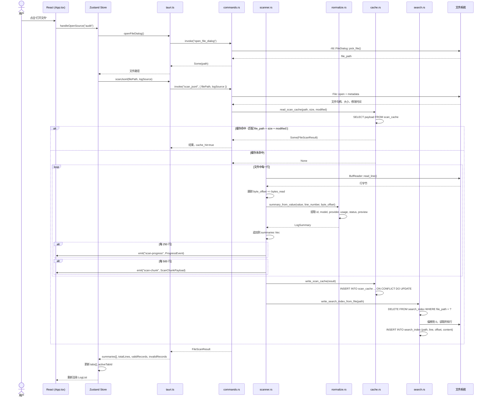
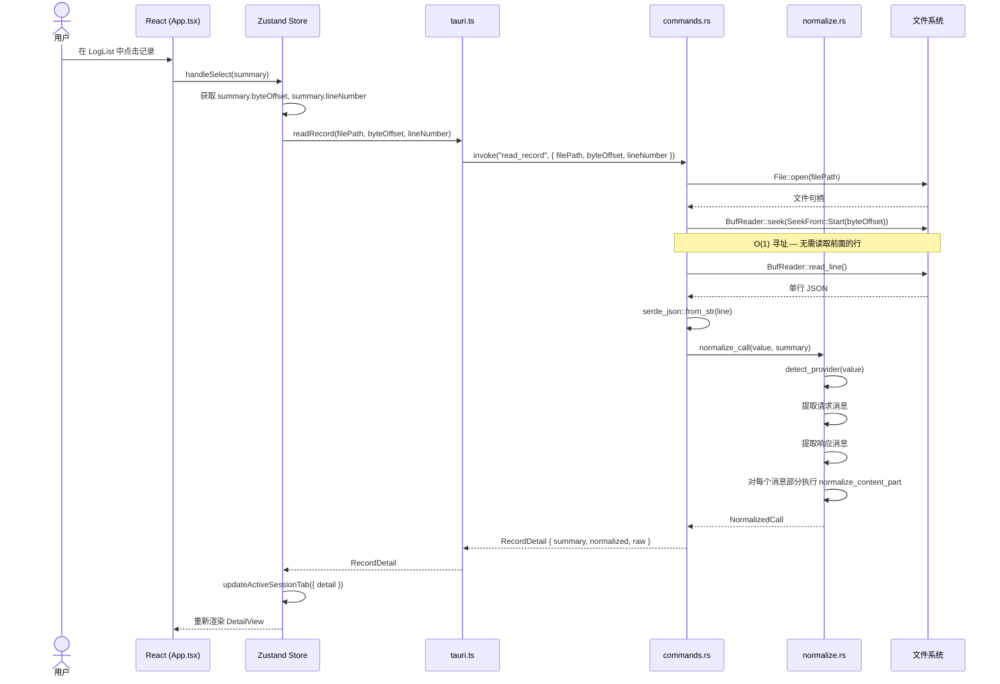
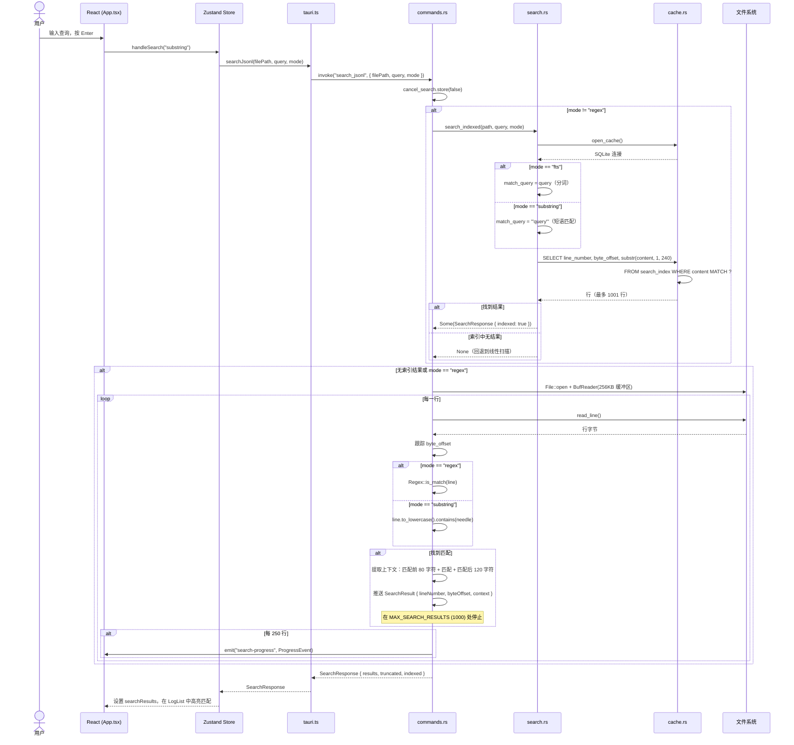
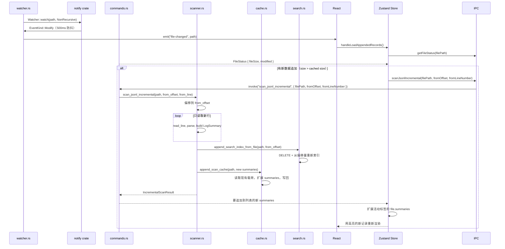

# 数据流

本文档使用 Mermaid 序列图追踪 PromptLens 技术栈中四个主要的用户发起流程。每个流程展示了涉及的确切 IPC 调用、Rust 函数和存储交互。

## 流程 1：打开文件

用户通过原生文件对话框打开 `.jsonl` 文件。后端逐行扫描文件，构建带字节偏移量的 `LogSummary` 条目，写入扫描缓存和 FTS5 搜索索引，并返回完整结果。



### 扫描进度事件

在完整扫描期间，后端发出两种类型的 Tauri 事件：

```rust
// file: src-tauri/src/scanner.rs:66
if total_lines == 1 || total_lines.is_multiple_of(250) {
    if let Some(app) = app {
        let _ = app.emit("scan-progress", ProgressEvent {
            processed_bytes: byte_offset,
            total_bytes: metadata.len(),
            line_number: total_lines,
        });
    }
}
```

| 事件 | 频率 | 载荷 | 用途 |
|------|------|------|------|
| `scan-progress` | 每 250 行 | `{ processedBytes, totalBytes, lineNumber }` | 进度条更新 |
| `scan-chunk` | 每 500 行 | `{ filePath, summaries[], lineFrom, lineTo }` | 增量列表渲染 |

### 取消操作

用户可以通过调用 `cancel_scan` 取消活跃扫描。这会设置一个 `AtomicBool` 标志，扫描器在每次读取循环迭代时检查该标志：

```rust
// file: src-tauri/src/scanner.rs:49
if cancel_flag.is_some_and(|flag| flag.load(Ordering::Relaxed)) {
    cancelled = true;
    break;
}
```

## 流程 2：选择记录（读取记录）

当用户点击列表中的记录时，后端直接定位到存储的字节偏移量并读取单行。无论记录在文件中的位置如何，这都是 O(1) 操作。



### 按需规范化

规范化只在用户选择记录时发生，而不是在初始扫描期间。扫描阶段仅提取轻量级的 `LogSummary`（id、model、provider、tokens、preview）。完整的 `NormalizedCall`（包含消息、内容部分、工具调用和错误）是从通过字节偏移量读取的原始 JSON 按需计算的。

## 流程 3：搜索

用户在搜索栏中输入查询。后端对 `substring` 和 `fts` 模式使用 FTS5 索引，如果索引不可用则回退到线性扫描。`regex` 模式始终使用线性扫描。



### 搜索模式

| 模式 | 使用的索引 | 查询风格 | 性能 | 用例 |
|------|-----------|----------|------|------|
| `substring` | FTS5 | 短语匹配（`"query"`） | 快（索引） | 查找精确短语 |
| `fts` | FTS5 | 分词匹配 | 快（索引） | 基于词的搜索 |
| `regex` | 无 | 编译的 `Regex` 模式 | 较慢（线性） | 复杂模式匹配 |

## 流程 4：增量扫描（文件监视）

当文件正在被积极写入时（例如实时审计日志），文件监视器检测到变更并从最后已知的字节偏移量触发增量扫描。



### 增量扫描 vs 完整扫描

| 方面 | 完整扫描 | 增量扫描 |
|------|---------|---------|
| 触发 | 初始文件打开 | 监视器检测到文件变更 |
| 起始偏移 | 0 | 缓存中的最后已知 `file_size` |
| 扫描的行 | 所有行 | 仅新行 |
| 缓存操作 | `write_scan_cache`（覆盖） | `append_scan_cache`（扩展） |
| 搜索索引 | `write_search_index_from_file` | `append_search_index_from_file` |
| 速度 | O(n)，n = 总行数 | O(delta)，delta = 新行数 |
