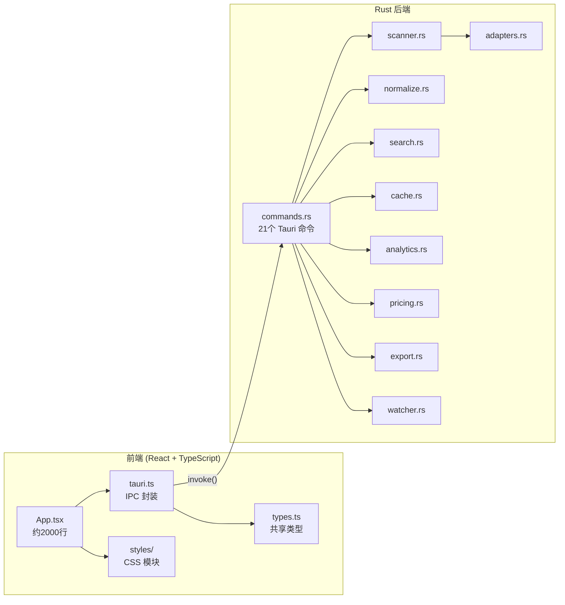
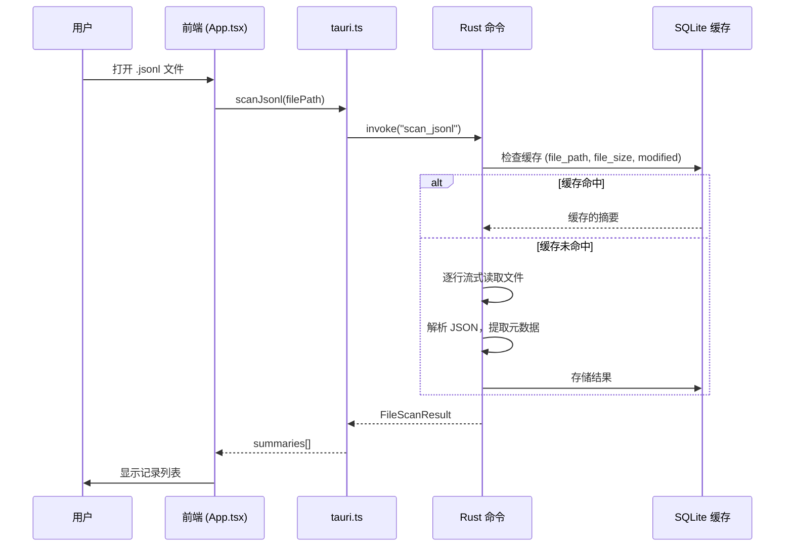
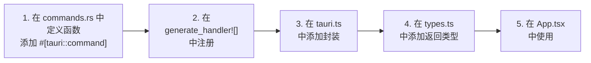

# 开发指南

本指南涵盖从源代码构建、运行和调试 PromptLens 所需的一切。PromptLens 是一个 Tauri v2 桌面应用，前端使用 React+TypeScript，后端使用 Rust，通过 Tauri IPC 命令通信。

## 架构概览





## 前置要求

| 工具         | 最低版本 | 用途                          |
|------------- |---------|-------------------------------|
| Node.js      | 18+（推荐20） | 前端构建和开发服务器 |
| npm          | 9+      | 包管理                         |
| Rust         | 1.70+   | 后端编译                        |
| Cargo        | 随 Rust 附带 | Rust 包管理器              |
| Xcode CLI    | 最新    | macOS：Apple SDK 和链接器      |
| WebKitGTK    | 4.1     | Linux：Tauri webview 运行时    |
| MSVC         | 最新    | Windows：Visual Studio 构建工具 |

### 平台特定依赖

**macOS**
```bash
xcode-select --install
```

**Linux (Ubuntu/Debian)**
```bash
sudo apt-get update
sudo apt-get install -y \
  libwebkit2gtk-4.1-dev \
  libgtk-3-dev \
  libayatana-appindicator3-dev \
  librsvg2-dev \
  patchelf
```
{/* file: .github/workflows/build.yml:57-63 */}

**Windows**

安装 Visual Studio Build Tools，选择"使用 C++ 的桌面开发"工作负载。

## 快速设置

```bash
# 克隆仓库
git clone https://github.com/XUranus/promptlens.git
cd promptlens

# 安装前端依赖
npm install

# 运行完整桌面应用（编译 Rust + 启动 Vite）
npm run tauri:dev
```

## 命令参考

### 前端命令

| 命令              | 描述                                      |
|----------------------|--------------------------------------------------|
| `npm run dev`        | 仅启动 Vite 前端开发服务器（端口 1420）  |
| `npm run tauri:dev`  | 完整 Tauri 桌面应用（Rust + Vite）              |
| `npm run build`      | 类型检查并构建生产前端（`tsc && vite build`） |
| `npm run test`       | 运行一次 Vitest 测试（`vitest run`）              |
| `npm run test:watch` | 以监视模式运行 Vitest                          |
| `npm run sample:large` | 生成大型 JSONL 样本用于测试         |

`package.json` 中的 `build` 脚本先运行 TypeScript 编译，再运行 Vite：
```json
// file: package.json:8
{
  "scripts": {
    "dev": "vite",
    "build": "tsc && vite build",
    "preview": "vite preview",
    "tauri": "tauri",
    "tauri:dev": "tauri dev",
    "test": "vitest run",
    "test:watch": "vitest"
  }
}
```

### 后端命令（在 `src-tauri/` 目录下）

| 命令                | 描述                          |
|------------------------|--------------------------------------|
| `cargo fmt --check`   | 验证 Rust 格式化                |
| `cargo check`         | Rust 代码类型检查                  |
| `cargo test`          | 运行所有 Rust 单元测试               |
| `cargo clippy`        | Rust 代码检查                        |
| `cargo build --release` | 构建优化后的发布二进制文件      |
| `cargo tauri build`   | 构建完整 Tauri 应用及安装包     |

## 项目结构

```
promptlens/
  src/                    # 前端 (React + TypeScript)
    app/
      App.tsx             # 主 UI 组件（约2000行）
      types.ts            # 应用级类型（Filter、WorkspaceTab 等）
      analytics.test.ts   # 分析单元测试
      storage.test.ts     # 存储单元测试
    lib/
      format.ts           # 格式化工具
      format.test.ts      # 格式化单元测试
    types.ts              # 共享类型（LogSummary、NormalizedCall 等）
    tauri.ts              # Tauri IPC 封装（21个函数）
    styles/
      variables.css       # CSS 自定义属性（深色/浅色主题）
      layout.css          # 主布局网格
      detail.css          # 详情视图
      list.css            # 记录列表
      ...                 # 共16个 CSS 模块文件
  src-tauri/
    src/
      lib.rs              # Tauri 入口 + 测试
      commands.rs         # 全部21个 #[tauri::command] 函数
      adapters.rs         # 提供商检测启发式算法
      normalize.rs        # 规范化管道
      scanner.rs          # JSONL 扫描器（字节偏移索引）
      search.rs           # FTS5 搜索引擎
      cache.rs            # SQLite 缓存层
      analytics.rs        # 分析计算
      pricing.rs          # 成本计算引擎
      types.rs            # Rust 类型（带 serde 注解）
      export.rs           # 导出逻辑（JSONL、Markdown）
      watcher.rs          # 文件监视器（使用 notify crate）
    fixtures/             # 测试固件 JSON 文件
    pricing.json          # 模型定价数据（18个模型）
    Cargo.toml            # Rust 依赖
  package.json            # Node 依赖
  .github/workflows/
    build.yml             # CI 构建工作流
    release.yml           # 发布工作流
```

## 调试

### 前端调试

Vite 开发服务器运行在端口 1420。使用浏览器 DevTools（在 Tauri 窗口内右键，或使用 `tauri:dev` 打开可调试的 webview）。

```bash
# 仅启动前端以便快速迭代
npm run dev
# 在浏览器中打开 http://localhost:1420
```

### 后端调试

使用 `cargo test` 运行带输出的单元测试：

```bash
cd src-tauri
cargo test -- --nocapture
```

定向运行特定测试：

```bash
cargo test scan_jsonl_tracks
cargo test normalizes_provider
cargo test adapters::tests
cargo test pricing::tests
```

### 环境变量

| 变量               | 用途                              |
|------------------------|--------------------------------------|
| `PROMPTLENS_CACHE_PATH` | 覆盖 SQLite 缓存文件位置（用于测试） |

该环境变量在运行时读取以确定缓存文件路径：
```rust
// file: src-tauri/src/cache.rs 中的概念用法
fn cache_path() -> PathBuf {
    if let Ok(custom) = std::env::var("PROMPTLENS_CACHE_PATH") {
        return PathBuf::from(custom);
    }
    // 回退到平台数据目录
    dirs::data_dir()
        .unwrap_or_else(|| PathBuf::from("."))
        .join("promptlens")
        .join("cache.db")
}
```

### Tauri DevTools

运行 `npm run tauri:dev` 时，按 `Ctrl+Shift+I`（Windows/Linux）或 `Cmd+Option+I`（macOS）打开 webview DevTools。

### 日志

Tauri 日志写入系统日志。在 macOS 上使用 Console.app。在 Linux 上检查 `journalctl`。在 Windows 上使用事件查看器。

## 常见工作流

### 添加新的 Tauri 命令



1. 在 `src-tauri/src/commands.rs` 中使用 `#[tauri::command]` 定义命令函数
2. 在 `tauri::generate_handler![]` 宏中注册
3. 在 `src/tauri.ts` 中添加 TypeScript 封装
4. 在 `src/types.ts` 中添加返回类型

TypeScript IPC 封装示例：
```typescript
// file: src/tauri.ts:21-23
export async function scanJsonl(
  filePath: string,
  logSource: LogSource = "audit"
): Promise<FileScanResult> {
  return invoke("scan_jsonl", { filePath, logSource });
}
```

### 添加新的 CSS 变量

1. 在 `src/styles/variables.css` 的 `:root`（深色主题）下定义变量
2. 在 `:root[data-theme="light"]` 下添加浅色模式覆盖
3. 在 `src/styles/` 中的相关 CSS 模块中引用

```css
/* file: src/styles/variables.css:5-14 */
:root {
  --app-bg: #0a0c10;
  --glass-bg: rgba(22, 27, 36, 0.72);
  --glass-bg-strong: rgba(28, 33, 44, 0.88);
  /* ... */
}

:root[data-theme="light"] {
  --app-bg: #e8ecf1;
  --glass-bg: rgba(255, 255, 255, 0.55);
  /* ... */
}
```

### 修改定价表

1. 编辑 `src-tauri/pricing.json` 添加新的模型条目
2. 定价表在启动时通过 `include_str!` 加载
3. 如果模型需要特殊匹配，在 `src-tauri/src/pricing.rs` 中添加测试

```rust
// file: src-tauri/src/pricing.rs:21
const PRICING_JSON: &str = include_str!("../pricing.json");
```

## 故障排除

| 问题 | 解决方案 |
|-------|----------|
| `cargo build` 在 Linux 上失败 | 安装 WebKitGTK 开发包（见前置要求） |
| `npm run tauri:dev` 挂起 | 确保端口 1420 未被其他进程占用 |
| 缓存错误 | 运行 `npm run tauri:dev` 并从 UI 清除缓存，或删除 SQLite 文件 |
| 字体渲染问题 | 检查系统字体 `fc-list` 在 Linux 上是否可用 |
| Tauri 重编译慢 | 首次构建需 30-60 秒；增量更改更快 |
| `npm ci` 失败 | 删除 `node_modules/` 和 `package-lock.json`，然后运行 `npm install` |

## 代码风格

### Rust

- 格式化由 `rustfmt` 强制执行（运行 `cargo fmt`）
- 使用 `clippy` 进行代码检查（运行 `cargo clippy`）
- 所有结构体使用 `#[serde(rename_all = "camelCase")]` 进行 JSON 互操作
- 内部类型使用 `pub(crate)` 可见性

```rust
// file: src-tauri/src/types.rs:25-27
#[derive(Debug, Serialize, Deserialize, Clone)]
#[serde(rename_all = "camelCase")]
pub(crate) struct LogSummary {
    pub(crate) id: String,
    pub(crate) line_number: usize,
    pub(crate) byte_offset: u64,
    // ...
}
```

### TypeScript

- 目前未配置格式化器或代码检查器
- 遵循现有模式：函数组件、hooks、提前返回
- 类型定义在 `src/types.ts`（共享）和 `src/app/types.ts`（UI）中
- Tauri IPC 封装在 `src/tauri.ts` 中

### CSS

- 所有样式在 `src/styles/` 中作为 CSS 模块
- 使用 `variables.css` 中的 CSS 自定义属性设置所有颜色和间距
- 避免内联样式；优先使用基于类的样式

## 架构决策

| 决策 | 理由 |
|----------|-----------|
| 字节偏移索引 | O(1) 随机访问 JSONL 文件中的任何记录 |
| SQLite + FTS5 | 本地优先的缓存和全文搜索，无外部依赖 |
| 增量扫描 | 检测仅追加的更改，无需完全重新扫描 |
| 提供商规范化 | 所有 LLM 提供商统一为 `NormalizedCall` 模式 |
| 单体前端 | 单个 `App.tsx` 文件将所有 UI 逻辑集中放置 |
| 静态定价表 | 编译时包含的定价数据避免网络调用 |
| `include_str!` 用于定价 | 定价 JSON 编译到二进制文件中；无运行时文件 I/O |
| `AtomicBool` 用于取消 | 无锁的扫描/搜索操作取消标志 |
