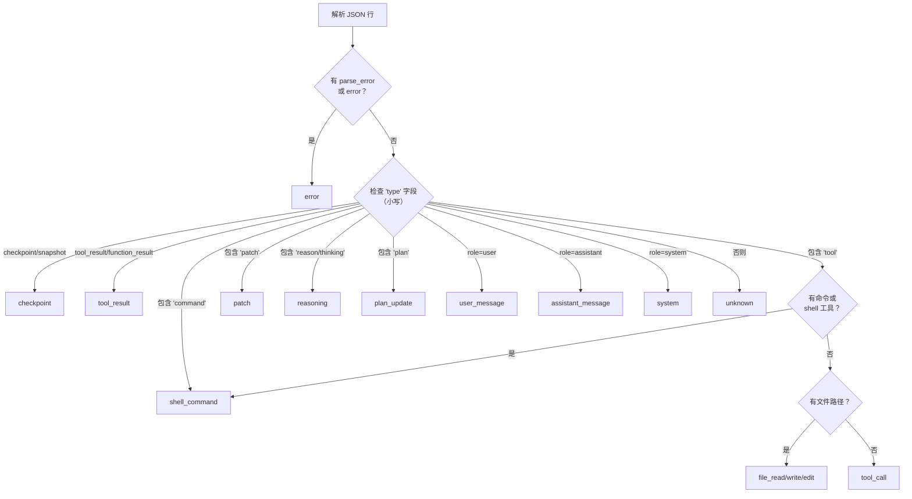
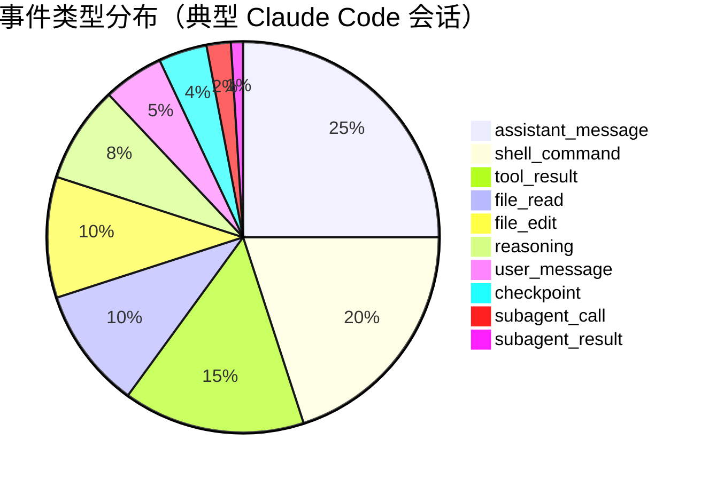
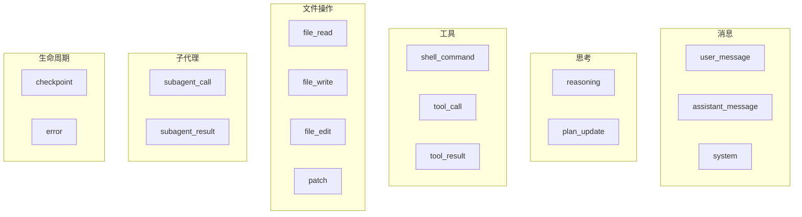

# 事件类型

PromptLens 将代理会话事件分为 16 种类型。每种类型在 UI 中有独特的视觉表示和特定的填充字段。事件类型由适配器特定逻辑和通用回退检测树的组合确定。

## 完整事件类型参考

| # | 事件类型 | 图标 | 描述 | 关键字段 |
|---|----------|------|------|----------|
| 1 | `user_message` | User | 用户对代理的输入 | `role`, `text` |
| 2 | `assistant_message` | Bot | 代理的文本响应 | `role`, `text` |
| 3 | `system` | Gear | 系统或开发者消息 | `role`, `text`, `status` |
| 4 | `reasoning` | Brain | 代理的思考/推理步骤 | `text` |
| 5 | `shell_command` | Terminal | Shell 或终端命令 | `command`, `tool_name` |
| 6 | `tool_result` | Check | 工具调用的结果 | `tool_name`, `text`, `is_error` |
| 7 | `tool_call` | Wrench | 通用工具调用 | `tool_name`, `tool_use_id` |
| 8 | `file_read` | Eye | 文件读取操作 | `file_paths` |
| 9 | `file_write` | Pencil | 文件写入/创建操作 | `file_paths` |
| 10 | `file_edit` | Edit | 文件编辑/修改操作 | `file_paths` |
| 11 | `patch` | Diff | 应用于文件的差异/补丁 | `file_paths` |
| 12 | `subagent_call` | Branch | 子代理（Task/Agent）被调用 | `subagent_type`, `subagent_description`, `tool_use_id` |
| 13 | `subagent_result` | Merge | 子代理任务完成 | `subagent_type`, `subagent_description`, `text` |
| 14 | `checkpoint` | Flag | 会话状态检查点 | `status` |
| 15 | `plan_update` | List | 代理的计划更新 | `text` |
| 16 | `error` | Alert | 解析或执行错误 | `text`, `is_error` |

`AgentEvent` 结构体包含任何事件类型的所有可能字段：

```rust
// file: src-tauri/src/types.rs:150
pub(crate) struct AgentEvent {
    pub(crate) id: String,
    pub(crate) line_number: usize,
    pub(crate) byte_offset: u64,
    pub(crate) timestamp: Option<String>,
    pub(crate) session_id: Option<String>,
    pub(crate) turn_id: Option<String>,
    pub(crate) parent_id: Option<String>,
    pub(crate) role: Option<String>,
    pub(crate) event_type: String,
    pub(crate) provider: Option<String>,
    pub(crate) model: Option<String>,
    pub(crate) tool_name: Option<String>,
    pub(crate) tool_use_id: Option<String>,
    pub(crate) subagent_type: Option<String>,
    pub(crate) subagent_description: Option<String>,
    pub(crate) subagent_prompt: Option<String>,
    pub(crate) command: Option<String>,
    pub(crate) file_paths: Vec<String>,
    pub(crate) status: Option<String>,
    pub(crate) duration_ms: Option<u64>,
    pub(crate) input_tokens: Option<u64>,
    pub(crate) output_tokens: Option<u64>,
    pub(crate) is_error: bool,
    pub(crate) tool_result_content: Option<Value>,
    pub(crate) is_sidechain: bool,
    pub(crate) agent_id: Option<String>,
    pub(crate) preview: Option<String>,
    pub(crate) text: Option<String>,
    pub(crate) raw: Value,
}
```

## 事件类型检测

主要检测发生在 `agent.rs` 中的 `detect_agent_event_type()`。检测树检查 JSON 结构和 `type` 字段来分类事件：



每个源适配器（Claude Code、Codex、OpenCode、OpenClaw）可能在通用检测运行之前通过自己的 `adapt_agent_event()` 函数覆盖或细化检测。

## 详细示例

### 1. user_message

```json
{
  "type": "user",
  "sessionId": "session-1",
  "message": {
    "role": "user",
    "content": [{ "type": "text", "text": "Fix the bug in the login form" }]
  }
}
```

**提取：** `role: "user"`, `text: "Fix the bug in the login form"`, `event_type: "user_message"`

### 2. assistant_message

```json
{
  "type": "assistant",
  "sessionId": "session-1",
  "message": {
    "role": "assistant",
    "content": [{ "type": "text", "text": "I'll investigate the login form." }]
  }
}
```

**提取：** `role: "assistant"`, `text: "I'll investigate..."`, `event_type: "assistant_message"`

### 3. system

```json
{
  "type": "system",
  "sessionId": "session-1",
  "subtype": "init",
  "content": "Session initialized with permissions: read, write"
}
```

**提取：** `role: "system"`, `status: "init"`, `event_type: "system"`

### 4. reasoning

**Codex 格式：**
```json
{"type": "reasoning", "summary": "Need to inspect the form component"}
```

**Claude Code 格式：**
```json
{
  "type": "assistant",
  "message": {
    "role": "assistant",
    "content": [{"type": "thinking", "thinking": "Let me look at the form..."}]
  }
}
```

**提取：** `text`（推理内容），`event_type: "reasoning"`

### 5. shell_command

**Codex 格式：**
```json
{"type": "function_call", "tool_name": "exec_command", "arguments": "{\"cmd\": \"grep -r 'validate' src/\"}"}
```

**Claude Code 格式：**
```json
{
  "message": {"content": [{"type": "tool_use", "name": "Bash", "input": {"command": "grep -r 'validate' src/"}}]}
}
```

**提取：** `command: "grep -r 'validate' src/"`, `tool_name: "Bash"`, `event_type: "shell_command"`

### 6. tool_result

```json
{
  "message": {"content": [{"type": "tool_result", "tool_use_id": "toolu_123", "content": "Found 3 matches"}]}
}
```

**提取：** `tool_use_id: "toolu_123"`, `text: "Found 3 matches"`, `event_type: "tool_result"`

注意：如果此 `tool_use_id` 匹配之前看到的 `subagent_call`，事件类型将升级为 `subagent_result`（参见[子代理会话](./subagent-sessions.md)）。

### 7. tool_call

不是 shell 命令或文件操作的通用工具调用。

```json
{"type": "tool_call", "name": "web_search", "input": {"query": "react form validation"}}
```

**提取：** `tool_name: "web_search"`, `event_type: "tool_call"`

### 8-10. file_read, file_write, file_edit

```json
{
  "message": {"content": [{"type": "tool_use", "name": "Read", "input": {"file_path": "src/LoginForm.tsx"}}]}
}
```

**提取：** `file_paths: ["src/LoginForm.tsx"]`, `tool_name: "Read"`, `event_type: "file_read"`

文件操作子类型（`file_read`、`file_write`、`file_edit`）在适配器特定处理期间通过工具名称区分：

| 工具名称模式 | 事件类型 |
|-------------|----------|
| `Read`, `read_file` | `file_read` |
| `Write`, `write_file`, `create_file` | `file_write` |
| `Edit`, `edit_file`, `MultiEdit` | `file_edit` |

### 11. patch

**Codex 格式：**
```json
{"type": "patch_apply_end", "path": "src/form.tsx", "diff": "@@ -10,6 +10,8 @@"}
```

**提取：** `file_paths: ["src/form.tsx"]`, `event_type: "patch"`

### 12. subagent_call

```json
{
  "message": {"content": [{"type": "tool_use", "id": "toolu_sub_1", "name": "Task", "input": {
    "subagent_type": "explorer",
    "description": "Find all validation functions",
    "prompt": "Search the codebase for form validation logic"
  }}]}
}
```

**提取：** `tool_use_id: "toolu_sub_1"`, `subagent_type: "explorer"`, `event_type: "subagent_call"`

### 13. subagent_result

当 `tool_result` 的 `tool_use_id` 匹配 `subagent_call` 时，通过升级创建：

```json
{
  "message": {"content": [{"type": "tool_result", "tool_use_id": "toolu_sub_1", "content": "Found validation in src/validate.ts"}]}
}
```

**提取：** `tool_use_id: "toolu_sub_1"`, `subagent_type: "explorer"`（从调用复制），`event_type: "subagent_result"`

### 14. checkpoint

```json
{"type": "task_started", "id": "ckpt-1"}
{"type": "file-history-snapshot"}
```

### 15. plan_update

```json
{"type": "plan", "content": "1. Read the form\n2. Fix validation\n3. Add tests"}
```

### 16. error

```json
{"parse_error": "invalid JSON at position 42", "raw": "not valid json{"}
```

当 JSON 行解析失败时生成错误事件。原始文本被保留用于调试：

```rust
// file: src-tauri/src/commands.rs:290
let value = match serde_json::from_str::<Value>(trimmed) {
    Ok(value) => value,
    Err(err) => json!({
        "parse_error": err.to_string(),
        "raw": trimmed,
    }),
};
```

## UI 中的事件类型标签

前端将事件类型映射为人类可读的标签用于显示：

```tsx
// file: src/app/analytics.ts:327
export function agentEventTypeLabel(type: string) {
  const labels: Record<string, string> = {
    user_message: "User",
    assistant_message: "Assistant",
    system_message: "System",
    tool_call: "Tool Call",
    tool_result: "Tool Result",
    shell_command: "Shell",
    file_read: "File Read",
    file_write: "File Write",
    file_edit: "File Edit",
    reasoning: "Reasoning",
    plan_update: "Plan",
    error: "Error",
    checkpoint: "Checkpoint",
    subagent_call: "Subagent Call",
    subagent_result: "Subagent Result",
  };
  return labels[type] ?? type;
}
```

## 事件类型分布

典型的 Claude Code 会话包含大致以下比例的事件：



## 事件类型层次结构

事件按逻辑分组，用于左面板时间线中的过滤和显示：



## 文件活动跟踪

前端从所有事件构建文件活动映射，按引用的文件路径分组事件：

```tsx
// file: src/app/analytics.ts:308
export function buildAgentFileActivity(events: AgentEvent[]) {
  const map = new Map<string, AgentEvent[]>();
  for (const event of events) {
    for (const path of event.filePaths ?? []) {
      const existing = map.get(path) ?? [];
      existing.push(event);
      map.set(path, existing);
    }
  }
  return Array.from(map.entries())
    .map(([path, evts]) => ({ path, events: evts }))
    .sort((a, b) => b.events.length - a.events.length);
}
```

这驱动了左面板中的"Agent Files"标签，显示代理会话期间哪些文件被最活跃地读取、写入或编辑。

## UI 中的事件过滤

查看代理会话时，主时间线过滤掉 sidechain 事件和子代理事件。仅显示属于主会话（或选中的子代理标签）的事件：

```tsx
// file: src/app/App.tsx:90
const filteredAgentSession = useMemo(() => {
  if (!agentSession) return null;
  if (activeSessionTabId === "main") {
    return { ...agentSession, events: agentSession.events.filter(
      (e) => !e.isSidechain && !e.agentId
    )};
  }
  const sub = agentSession.subagentSessions.find(
    (s) => `subagent:${s.agentId}` === activeSessionTabId
  );
  if (!sub) return agentSession;
  return { ...agentSession, events: sub.events };
}, [agentSession, activeSessionTabId]);
```

事件也可以通过排序顺序控件使用 `orderAgentEvents()` 重新排序：

```tsx
// file: src/app/analytics.ts:254
export function orderAgentEvents(items: AgentEvent[], order: SortOrder) {
  const factor = orderFactor(order);
  return [...items].sort((a, b) => factor * (lineTimeValue(a) - lineTimeValue(b)));
}
```

## 添加新事件类型

要添加新事件类型，请更新以下位置：

1. **检测**：在 `agent.rs` 中的 `detect_agent_event_type()` 添加新分支
2. **类型标签**：在 `src/app/analytics.ts:327` 的 `agentEventTypeLabel()` 添加条目
3. **适配器**：如果是提供商特定的，在 `agent_adapters.rs` 下的相关适配器中添加处理
4. **UI 渲染**：在 `src/app/components/CenterPanel.tsx` 的 `AgentEventDetailView` 中添加情况
