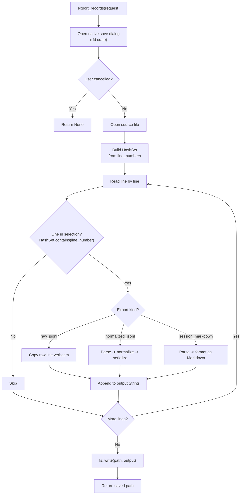
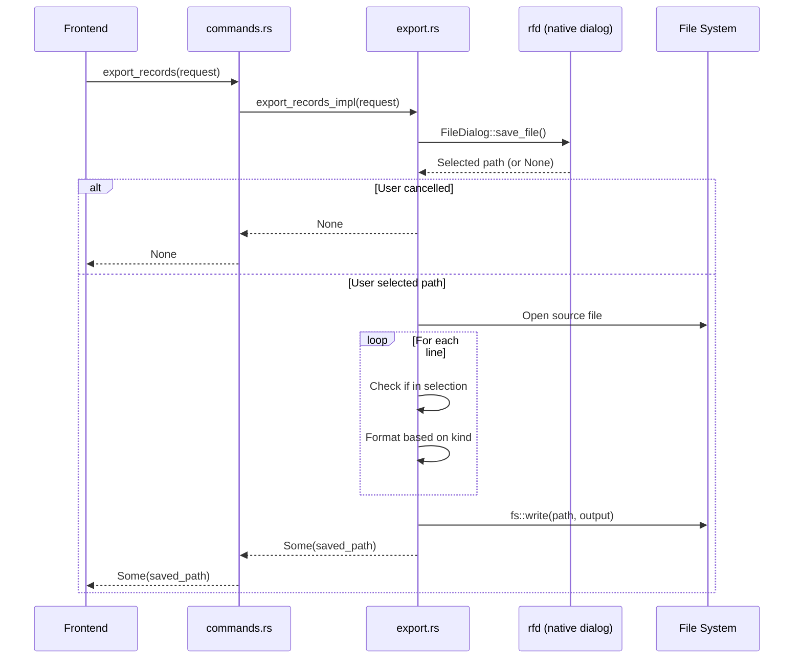

# 导出模块

导出模块允许用户将 JSONL 文件中的选中记录保存为三种格式之一。它逐行读取原始文件，按选中行号过滤，并将输出写入用户选择的路径。该模块在 `export.rs` 中实现。

## 导出流程



## 导出请求

```rust
// file: src-tauri/src/types.rs:288
#[derive(Debug, Deserialize)]
#[serde(rename_all = "camelCase")]
pub(crate) struct ExportRecordsRequest {
    pub(crate) file_path: String,         // 源 JSONL 文件
    pub(crate) line_numbers: Vec<usize>,  // 要导出的从 1 开始的行号
    pub(crate) kind: String,              // 导出格式
    pub(crate) default_file_name: String, // 保存对话框的建议文件名
}
```

## 导出格式

### raw_jsonl

逐字复制原始 JSONL 行，保留源文件的精确格式。

```rust
// file: src-tauri/src/export.rs:45
"raw_jsonl" => {
    output.push_str(trimmed);
    output.push('\n');
}
```

**输入：**
```jsonl
{"id":"call_1","model":"gpt-4o","request":{...},"response":{...}}
{"id":"call_2","model":"claude-sonnet-4","request":{...},"response":{...}}
```

**输出：** 与输入完全相同（仅选中的行）。

**用例：** 与他人分享原始日志或输入到其他分析工具。

### normalized_jsonl

通过规范化管道重新解析每条选中行，并写入 `NormalizedCall` JSON。


```rust
// file: src-tauri/src/export.rs:49
"normalized_jsonl" => {
    let value = serde_json::from_str::<Value>(trimmed)
        .map_err(|err| format!("Failed to parse line {line_number}: {err}"))?;
    let summary = summary_from_value(&value, line_number, current_offset, None);
    let normalized = normalize_call(&value, &summary);
    output.push_str(&serde_json::to_string(&normalized)?);
    output.push('\n');
}
```

**每行输出结构：**
```json
{
  "id": "call_1",
  "lineNumber": 1,
  "provider": "openai",
  "model": "gpt-4o",
  "request": { "messages": [...] },
  "response": { "text": "...", "messages": [...] },
  "usage": { "promptTokens": 100, "completionTokens": 50 },
  "raw": { ... }
}
```

**用例：** 在下游管道或脚本中消费规范化数据。

### session_markdown

生成带记录元数据和响应文本的人类可读 Markdown 文档。

```rust
// file: src-tauri/src/export.rs:60
"session_markdown" => {
    let value = serde_json::from_str::<Value>(trimmed)?;
    let summary = summary_from_value(&value, line_number, current_offset, None);
    let normalized = normalize_call(&value, &summary);
    output.push_str(&format!(
        "## Line {} · {}\n\n- Provider: {}\n- Model: {}\n- Trace: {}\n- Session: {}\n- Status: {}\n- Latency: {} ms\n\n",
        summary.line_number, summary.id,
        summary.provider.as_deref().unwrap_or("unknown"),
        summary.model.as_deref().unwrap_or("unknown"),
        summary.trace_id.as_deref().unwrap_or("-"),
        summary.session_id.as_deref().unwrap_or("-"),
        summary.status,
        summary.latency_ms.map(|v| v.to_string()).unwrap_or_else(|| "-".to_string()),
    ));
    if let Some(response) = normalized.response.and_then(|r| r.text) {
        output.push_str(&response);
        output.push_str("\n\n");
    }
}
```

**输出格式：**
```markdown
## Line 1 · call_1

- Provider: openai
- Model: gpt-4o
- Trace: trace-abc
- Session: session-123
- Status: success
- Latency: 150 ms

助手的响应文本在这里...

## Line 5 · call_2

- Provider: anthropic
- Model: claude-sonnet-4
- Trace: -
- Session: session-456
- Status: success
- Latency: 200 ms

另一条响应...
```

**用例：** 在文档、问题报告或聊天中分享对话日志。

## 格式总结

| 格式 | 扩展名 | 内容 | 保留原始 | 人类可读 | 解析 JSON |
|--------|-----------|---------|---------------|----------------|-------------|
| `raw_jsonl` | `.jsonl` | 原始行 | 是 | 否 | 否 |
| `normalized_jsonl` | `.jsonl` | 规范化记录 | 嵌套在 `raw` 中 | 否 | 是 |
| `session_markdown` | `.md` | 格式化文本 | 否 | 是 | 是 |

## 实现细节

### 选择过滤

选中的行号被收集到 `HashSet<usize>` 中以实现 O(1) 查找：

```rust
// file: src-tauri/src/export.rs:17
let selected: HashSet<usize> = request.line_numbers.into_iter().collect();
```

在逐行读取期间，只有 `line_number` 在集合中的行被处理。这避免了排序并允许高效过滤，无论选择顺序如何。

### 文件对话框

原生保存对话框由 `rfd` crate 提供：

```rust
// file: src-tauri/src/export.rs:11
let Some(path) = rfd::FileDialog::new()
    .set_file_name(request.default_file_name)
    .save_file()
else {
    return Ok(None);  // 用户取消
};
```

### 错误处理

每行单独解析。如果在 `normalized_jsonl` 或 `session_markdown` 导出期间某行 JSON 解析失败，整个操作返回错误并包含失败的行号：

```rust
let value = serde_json::from_str::<Value>(trimmed)
    .map_err(|err| format!("Failed to parse line {line_number}: {err}"))?;
```

### 输出写入

输出累积在 `String` 中，在最后通过单次 `fs::write` 写入：

```rust
// file: src-tauri/src/export.rs:84
fs::write(&path, output).map_err(|err| format!("Failed to save export: {err}"))?;
Ok(Some(path.to_string_lossy().to_string()))
```

## 性能考量

| 方面 | 行为 |
|--------|----------|
| 内存 | 整个输出在写入前缓冲在 `String` 中 |
| 解析 | 每条选中行从原始 JSON 重新解析 |
| 规范化 | 非原始格式每行应用完整规范化管道 |
| 文件 I/O | 最后单次 `fs::write` |
| 选择 | 通过 HashSet 每行 O(1) |

对于大型导出（数千条记录），内存使用量与总输出大小线性增长。原始 JSONL 格式最高效，因为它复制行而不解析。

## 数据流



## 前端使用

```typescript
import { invoke } from "@tauri-apps/api/core";

const savedPath = await invoke("export_records", {
    request: {
        filePath: currentFile,
        lineNumbers: selectedLines,
        kind: "session_markdown",
        defaultFileName: "session-export.md",
    },
});

if (savedPath) {
    // 显示成功通知
}
```

`default_file_name` 参数根据当前文件名和选中的导出格式预先填充。

## 扩展导出格式

要添加新的导出格式：

1. 在 `export.rs` 的 `export_records()` 中添加新的 match 分支
2. 为新的 kind 实现格式化逻辑
3. 在前端的导出格式选择器中添加 kind 字符串
4. 设置适当的默认文件名和扩展名

格式字符串精确匹配 -- 未知格式返回 `Err("Unsupported export kind")`。
