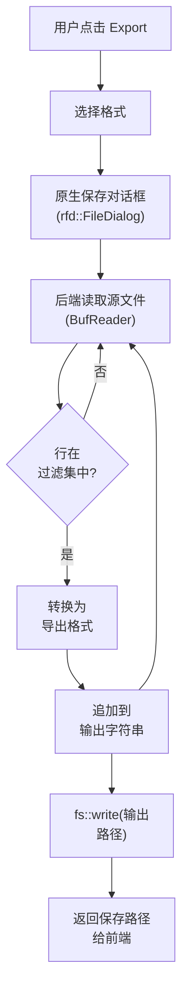
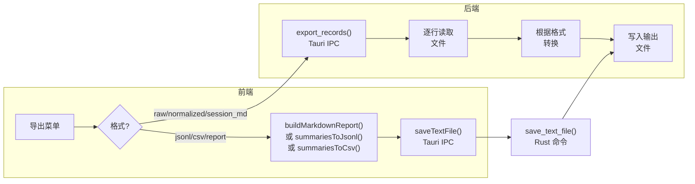
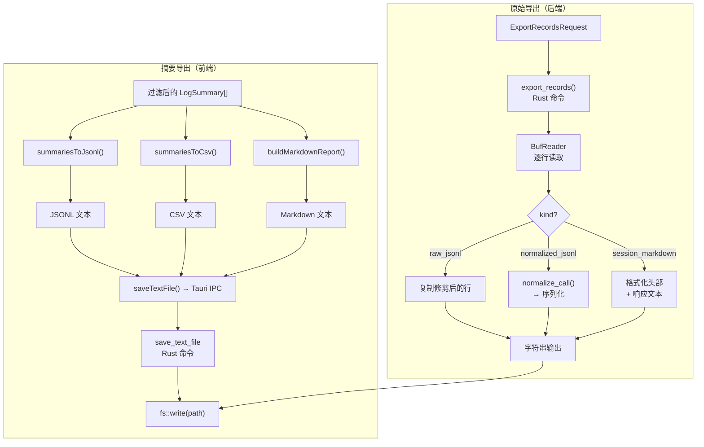

# 导出

PromptLens 提供六种导出格式，用于将数据从应用程序中导出。导出仅包含当前过滤后的记录，因此请在导出前应用过滤器以控制包含的内容。

## 访问导出

点击标题栏中的 **Export** 打开导出菜单。菜单显示：

- 过滤后记录的数量和检测到的问题
- 六种导出格式选项

## 导出格式

### 摘要导出

这些格式导出扫描期间提取的摘要元数据。

#### JSONL 摘要

将过滤后的记录导出为 JSONL 文件，每行是一个摘要对象：

```json
{"id":"call_1","lineNumber":1,"provider":"openai","model":"gpt-4.1","status":"success","latencyMs":234,"totalTokens":1656,"timestamp":"2026-05-13T10:00:00Z"}
```

| 字段 | 说明 |
|------|------|
| `id` | 记录标识符 |
| `lineNumber` | 源文件中的行号 |
| `provider` | 检测到的提供商 |
| `model` | 检测到的模型 |
| `status` | success、error 或 invalid_json |
| `latencyMs` | 响应时间（毫秒） |
| `promptTokens` | 提示令牌数 |
| `completionTokens` | 完成令牌数 |
| `totalTokens` | 总令牌数 |
| `timestamp` | 请求时间戳 |
| `traceId` | Trace 标识符（如果存在） |
| `sessionId` | Session 标识符（如果存在） |
| `requestId` | Request 标识符（如果存在） |
| `hasImage` | 记录是否包含图片 |
| `hasToolCall` | 记录是否包含工具调用 |
| `preview` | 第一条用户消息的文本片段 |

**最适合：** 导入到其他工具、数据管道、程序化分析。

JSONL 摘要在前端生成：

```ts
// file: src/app/analytics.ts:144-146
export function summariesToJsonl(items: LogSummary[]) {
  return items.map((item) => JSON.stringify(item)).join("\n") +
    (items.length ? "\n" : "");
}
```

#### CSV 摘要

将相同的摘要数据导出为带有标题行的 CSV 文件。字段以逗号分隔，必要时加引号。

```ts
// file: src/app/analytics.ts:148-192
export function summariesToCsv(items: LogSummary[]) {
  const header = [
    "lineNumber", "byteOffset", "timestamp", "provider", "model",
    "traceId", "sessionId", "requestId", "parentId", "status",
    "latencyMs", "promptTokens", "completionTokens", "totalTokens",
    "hasImage", "hasToolCall", "preview",
  ];
  const rows = items.map((item) =>
    [/* 字段 */].map(csvCell).join(",")
  );
  return [header.join(","), ...rows].join("\n") + "\n";
}
```

**最适合：** 在电子表格应用程序（Excel、Google Sheets）中打开、数据透视表、图表制作。

#### Markdown 报告

生成人类可读的 Markdown 报告，包含：

- **文件概览** -- 路径、大小、总/有效/无效行数
- **分析摘要** -- 记录数、错误率、延迟百分位数、总令牌数
- **顶级模型和提供商** -- 按使用次数排名
- **检测到的问题** -- 有问题的记录列表，按严重程度分组
- **成本摘要** -- 总成本和平均成本估算

```ts
// file: src/app/analytics.ts:199-235
export function buildMarkdownReport(
  file: FileScanResult,
  filtered: LogSummary[],
  analytics: AnalyticsSummary,
  issues: IssueRecord[],
  sessions: SessionGroup[],
) {
  const lines = [
    `# PromptLens Report: ${file.fileName}`,
    "",
    `- Source: ${file.filePath}`,
    `- Filtered records: ${filtered.length.toLocaleString()}`,
    // ... 更多元数据、顶级模型、问题、会话
  ];
  return `${lines.join("\n")}\n`;
}
```

**最适合：** 与团队成员分享、包含在文档中、在 Markdown 查看器中审阅。

### 原始导出

这些格式导出记录的实际 JSON 内容。它们由 Rust 后端处理：

```rust
// file: src-tauri/src/export.rs:10-86
pub(crate) fn export_records(request: ExportRecordsRequest) -> Result<Option<String>, String> {
    let Some(path) = rfd::FileDialog::new()
        .set_file_name(request.default_file_name)
        .save_file()
    else {
        return Ok(None);  // 用户取消了对话框
    };
    let selected: HashSet<usize> = request.line_numbers.into_iter().collect();
    // ... 逐行读取文件，过滤到选中的行
    match request.kind.as_str() {
        "raw_jsonl" => { /* 复制修剪后的行 */ }
        "normalized_jsonl" => { /* normalize_call → 序列化 */ }
        "session_markdown" => { /* 格式化为 markdown 块 */ }
        _ => return Err("Unsupported export kind".to_string()),
    }
}
```

#### 原始 JSONL

从源文件导出原始 JSON 行。每行完全按照源文件中的格式复制，保留原始格式。

```rust
// file: src-tauri/src/export.rs:45-48
"raw_jsonl" => {
    output.push_str(trimmed);
    output.push('\n');
}
```

**最适合：** 创建原始文件的子集、输入到其他 LLM 工具、归档。

#### 规范化 JSONL

将记录导出为 PromptLens 统一模式。每行包含完整的 `NormalizedCall` 对象：

```rust
// file: src-tauri/src/export.rs:49-59
"normalized_jsonl" => {
    let value = serde_json::from_str::<Value>(trimmed)?;
    let summary = summary_from_value(&value, line_number, current_offset, None);
    let normalized = normalize_call(&value, &summary);
    output.push_str(&serde_json::to_string(&normalized)?);
    output.push('\n');
}
```

```json
{
  "id": "call_1",
  "lineNumber": 1,
  "provider": "openai",
  "model": "gpt-4.1",
  "status": "success",
  "request": {
    "messages": [
      {"role": "system", "content": [{"type": "text", "text": "You are helpful."}]},
      {"role": "user", "content": [{"type": "text", "text": "Hello!"}]}
    ]
  },
  "response": {
    "messages": [
      {"role": "assistant", "content": [{"type": "text", "text": "Hi! How can I help?"}]}
    ]
  },
  "usage": {"promptTokens": 10, "completionTokens": 8, "totalTokens": 18},
  "raw": { ... }
}
```

**最适合：** 跨提供商分析、构建具有一致模式的数据集、工具间迁移。

#### 会话 Markdown

将每条记录导出为带有元数据头和响应文本的 Markdown 块：

```rust
// file: src-tauri/src/export.rs:60-80
"session_markdown" => {
    // 格式化头部，包含行号、id、提供商、模型、trace、session、状态、延迟
    output.push_str(&format!(
        "## Line {} · {}\n\n- Provider: {}\n- Model: {}\n- Trace: {}\n- Session: {}\n- Status: {}\n- Latency: {} ms\n\n",
        summary.line_number, summary.id, ...
    ));
    // 如果有响应文本则追加
    if let Some(response) = normalized.response.and_then(|r| r.text) {
        output.push_str(&response);
        output.push_str("\n\n");
    }
}
```

```markdown
## Line 1 · call_1

- Provider: openai
- Model: gpt-4.1
- Trace: trace-abc
- Session: session-xyz
- Status: success
- Latency: 234 ms

Hi! How can I help you today?

## Line 2 · call_2

...
```

**最适合：** 在 Markdown 查看器中阅读对话、生成文档、人工审阅。

## 导出工作原理

当您选择导出格式时：

1. PromptLens 打开带有建议文件名的原生保存对话框。
2. Rust 后端逐行读取源文件。
3. 对于每行，检查行号是否在过滤集中。
4. 匹配的行根据导出格式进行转换。
5. 输出写入选定的文件路径。
6. 保存的文件路径返回给前端。



## 导出管道架构



## 导出技巧

| 技巧 | 说明 |
|------|------|
| 先过滤 | 仅导出过滤后的记录 -- 使用过滤器精确选择所需内容 |
| 检查数量 | 导出菜单显示将包含多少条记录 |
| 选择正确的格式 | JSONL 用于工具，CSV 用于电子表格，Markdown 用于人类阅读 |
| 规范化以获得一致性 | 需要跨提供商一致模式时使用规范化 JSONL |
| 原始以获得保真度 | 需要精确原始内容时使用原始 JSONL |

## 导出限制

| 限制 | 详情 |
|------|------|
| 单文件导出 | 仅导出当前打开的文件 |
| 仅过滤后的记录 | 仅包含匹配当前过滤器的记录 |
| 无计划导出 | 导出必须手动触发 |
| 无流式传输 | 整个导出在写入前在内存中构建 |
| 需要文件对话框 | 每次导出都需要保存对话框交互 |

## 导出文件命名

PromptLens 根据源文件和导出格式建议默认文件名：

| 格式 | 默认文件名模式 |
|------|--------------|
| JSONL 摘要 | `{filename}-summaries.jsonl` |
| CSV 摘要 | `{filename}-summaries.csv` |
| Markdown 报告 | `{filename}-report.md` |
| 原始 JSONL | `{filename}-raw.jsonl` |
| 规范化 JSONL | `{filename}-normalized.jsonl` |
| 会话 Markdown | `{filename}-session.md` |

您可以在确认前在保存对话框中更改文件名。

## 导出的 Tauri 命令

| 命令 | 用途 |
|------|------|
| `export_records` | 以指定格式导出选中的记录 |
| `save_text_file` | 将任意文本内容保存到文件（用于 CSV、Markdown、JSONL 摘要） |

`export_records` 命令接受 `ExportRecordsRequest`：

```rust
// file: src-tauri/src/types.rs
pub(crate) struct ExportRecordsRequest {
    pub(crate) file_path: String,
    pub(crate) line_numbers: Vec<usize>,
    pub(crate) kind: String,
    pub(crate) default_file_name: String,
}
```

| 字段 | 类型 | 说明 |
|------|------|------|
| `file_path` | string | 源 JSONL 文件的路径 |
| `line_numbers` | number[] | 导出中要包含哪些行 |
| `kind` | string | 导出格式：`raw_jsonl`、`normalized_jsonl` 或 `session_markdown` |
| `default_file_name` | string | 保存对话框的建议文件名 |

后端逐行读取源文件，过滤到选中的行，根据导出格式转换每行，并将输出写入用户选择的文件路径。

## 导出数据流详情

每种导出格式的完整数据流：



## CSV 格式详情

CSV 导出遵循 RFC 4180 规范：

- 包含逗号、双引号或换行符的字段用双引号括起来
- 字段内的双引号转义为 `""`
- 第一行始终是标题行
- 即使为空也包含所有字段（作为空字符串）

```ts
// file: src/app/analytics.ts:194-197
function csvCell(value: unknown) {
  const text = String(value);
  return /[",\n]/.test(text) ? `"${text.replace(/"/g, '""')}"` : text;
}
```

## 相关页面

- [设置](settings.md) -- 缓存管理
- [分析](analytics.md) -- 报告中使用的指标
- [搜索](search.md) -- 导出前过滤记录
