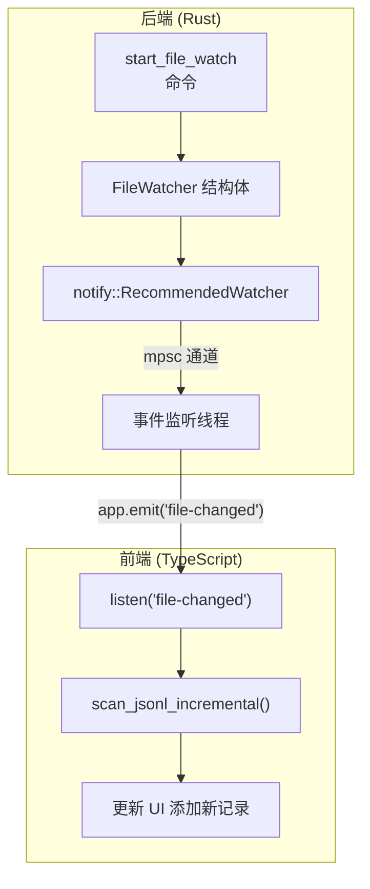
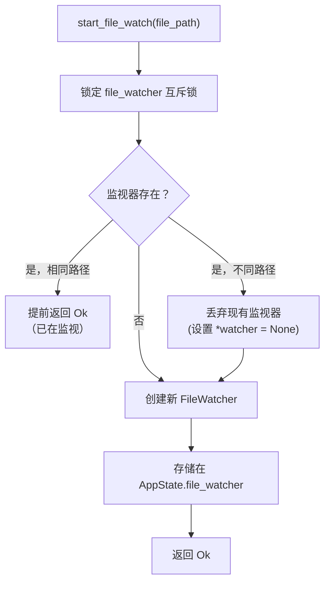
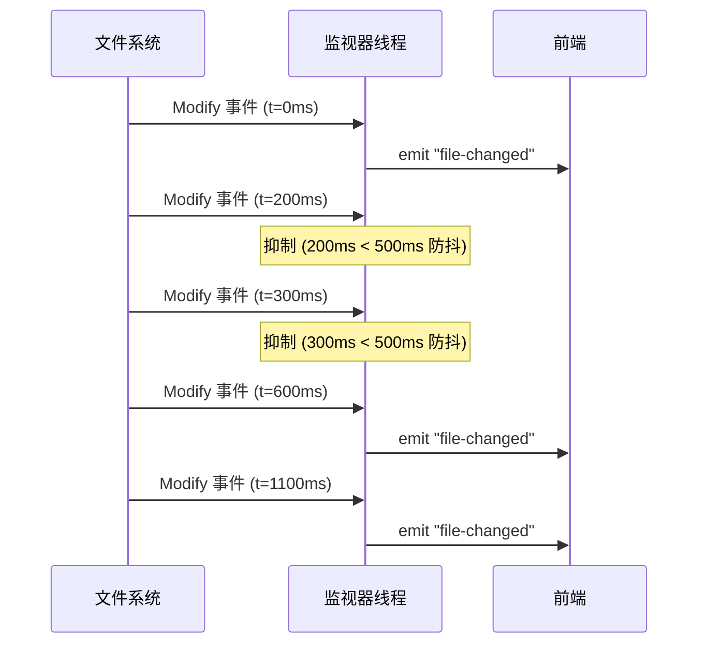
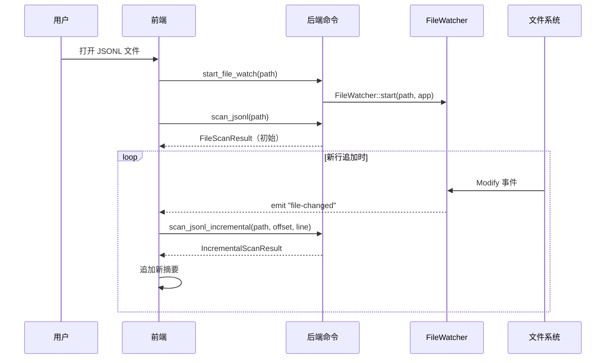

# 文件监视器

文件监视器监控 JSONL 文件的更改，并在有新数据可用时通知前端。它使用 `notify` crate 实现跨平台文件系统事件，并带有防抖机制以避免淹没 UI。实现在 `src-tauri/src/watcher.rs` 中。

## 架构



## FileWatcher 结构体

```rust
// file: src-tauri/src/watcher.rs:7
pub struct FileWatcher {
    _watcher: RecommendedWatcher,  // 保持监视器存活
    path: PathBuf,                 // 被监视的路径
}
```

`_watcher` 字段持有 `notify::RecommendedWatcher` 实例。下划线前缀表示它仅为其 `Drop` 实现而存储 -- 丢弃此结构体会停止监视。`path()` 方法提供对被监视路径的读取访问：

```rust
// file: src-tauri/src/watcher.rs:54
pub fn path(&self) -> &std::path::Path {
    &self.path
}
```

## 启动监视

`start_file_watch` 命令管理监视器生命周期。它使用 `AppState` 中的 `Mutex<Option<FileWatcher>>` 确保同时只存在一个监视器：



```rust
// file: src-tauri/src/commands.rs:554
fn start_file_watch(
    file_path: String,
    state: State<'_, AppState>,
    app: AppHandle,
) -> Result<(), String> {
    let mut watcher = state.file_watcher.lock().map_err(|e| e.to_string())?;
    if let Some(ref w) = *watcher {
        if w.path().to_string_lossy() != file_path {
            *watcher = None;  // 丢弃旧监视器
        } else {
            return Ok(());    // 已在监视此文件
        }
    }
    let new_watcher = crate::watcher::FileWatcher::start(
        std::path::PathBuf::from(&file_path), app
    )?;
    *watcher = Some(new_watcher);
    Ok(())
}
```

`AppState` 结构体在互斥锁后持有监视器以确保线程安全：

```rust
// file: src-tauri/src/types.rs:9
pub(crate) struct AppState {
    pub(crate) cancel_scan: AtomicBool,
    pub(crate) cancel_search: AtomicBool,
    pub(crate) file_watcher: Mutex<Option<crate::watcher::FileWatcher>>,
}
```

## 监视器创建

`FileWatcher::start()` 方法创建平台特定的监视器并生成监听线程：

```rust
// file: src-tauri/src/watcher.rs:13
pub fn start(path: PathBuf, app: tauri::AppHandle) -> Result<Self, String> {
    let (tx, rx) = mpsc::channel::<notify::Result<Event>>();
    let watch_path = path.clone();

    let mut watcher = RecommendedWatcher::new(
        tx,
        notify::Config::default().with_poll_interval(Duration::from_millis(500)),
    ).map_err(|e| format!("Failed to create file watcher: {e}"))?;

    watcher.watch(&watch_path, RecursiveMode::NonRecursive)
        .map_err(|e| format!("Failed to watch file: {e}"))?;

    // ... 生成监听线程

    Ok(Self { _watcher: watcher, path })
}
```

### 监视器配置

| 设置 | 值 | 用途 |
|------|-----|------|
| 轮询间隔 | 500ms | 检查更改的频率（非原生事件的回退） |
| 递归模式 | `NonRecursive` | 仅监视单个文件，不监视其目录 |

## 事件监听线程

专用线程通过 `mpsc` 通道接收 `notify` 监视器的事件，并使用 Tauri 的事件系统转发给前端：

```rust
// file: src-tauri/src/watcher.rs:28
let watched_path = path.clone();
std::thread::spawn(move || {
    let mut last_emit = std::time::Instant::now();
    let debounce = Duration::from_millis(500);

    while let Ok(event_result) = rx.recv() {
        let Ok(event) = event_result else { continue };
        match event.kind {
            EventKind::Modify(_) | EventKind::Create(_) => {
                let now = std::time::Instant::now();
                if now.duration_since(last_emit) >= debounce {
                    last_emit = now;
                    let _ = app.emit(
                        "file-changed",
                        watched_path.to_string_lossy().to_string(),
                    );
                }
            }
            _ => {}  // 忽略 Remove、Rename、Access 等
        }
    }
});
```

### 防抖逻辑

监视器实现简单的基于时间的防抖，将快速文件系统事件合并为单个通知：



防抖将 `Instant::now()` 与 `last_emit` 进行 500ms 阈值比较。这防止前端在快速文件写入期间（如日志库刷新缓冲区）被淹没增量扫描请求。

### 事件类型过滤

仅转发 `Modify` 和 `Create` 事件。其他事件类型被忽略：

| 事件类型 | 转发？ | 原因 |
|----------|--------|------|
| `Modify(_)` | 是 | 文件内容已更改 |
| `Create(_)` | 是 | 文件已创建（新日志文件） |
| `Remove(_)` | 否 | 不可操作 |
| `Rename(_)` | 否 | 需要特殊处理 |
| `Access(_)` | 否 | 会导致事件风暴 |
| `Any` | 否 | 过于通用 |

## 停止监视

`stop_file_watch` 命令通过将互斥保护的字段设置为 `None` 来丢弃监视器：

```rust
// file: src-tauri/src/commands.rs:574
fn stop_file_watch(state: State<'_, AppState>) -> Result<(), String> {
    let mut watcher = state.file_watcher.lock().map_err(|e| e.to_string())?;
    *watcher = None;
    Ok(())
}
```

当 `FileWatcher` 被丢弃时，级联如下：

1. `_watcher`（RecommendedWatcher）被丢弃 -- 停止底层 `notify` 监视器
2. `mpsc::Sender`（在监视器内）被丢弃 -- 关闭通道
3. 监听线程的 `rx.recv()` 返回 `Err` -- `while let Ok(...)` 循环退出
4. 线程自然终止

这种干净的关闭确保没有泄漏的线程或文件句柄。

## 前端集成

前端监听 `file-changed` 事件并触发增量扫描。事件监听器在 `App` 组件中设置：

```tsx
// file: src/app/App.tsx:156
const unlistenScan = listen<ProgressEvent>("scan-progress", (event) =>
  ws().setScanProgress(event.payload)
);
```

`file-changed` 监听器在工作区 store 中管理，它使用最后已知偏移调用 `scanJsonlIncremental`：

```typescript
import { listen } from "@tauri-apps/api/event";

const unlisten = await listen<string>("file-changed", async (event) => {
    const filePath = event.payload;
    const result = await invoke("scan_jsonl_incremental", {
        filePath,
        fromOffset: lastOffset,
        fromLineNumber: lastLineNumber,
    });
    // 将新摘要追加到 UI
    lastOffset = result.nextOffset;
    lastLineNumber = result.nextLineNumber;
});
```

前端 Tauri 包装器：

```typescript
// file: src/tauri.ts:25
export async function scanJsonlIncremental(
  filePath: string,
  fromOffset: number,
  fromLineNumber: number,
): Promise<IncrementalScanResult> {
  return invoke("scan_jsonl_incremental", { filePath, fromOffset, fromLineNumber });
}
```

## 线程安全

对监视器的所有访问（启动、停止、路径检查）都需要获取 `AppState.file_watcher` 上的互斥锁。如果锁被毒化（持有锁时发生恐慌），命令通过 `map_err(|e| e.to_string())` 返回错误。

`AppState` 还使用 `AtomicBool` 作为取消标志，扫描和搜索命令无需锁即可检查：

```rust
// file: src-tauri/src/types.rs:9
pub(crate) struct AppState {
    pub(crate) cancel_scan: AtomicBool,      // 无锁取消标志，用于扫描
    pub(crate) cancel_search: AtomicBool,    // 无锁取消标志，用于搜索
    pub(crate) file_watcher: Mutex<Option<FileWatcher>>,  // 互斥锁，用于监视器生命周期
}
```

## 平台行为

`notify` crate 使用平台特定的后端进行原生文件系统事件检测：

| 平台 | 后端 | 行为 |
|------|------|------|
| Linux | `inotify` | 原生内核事件，无需轮询 |
| macOS | `FSEvents` | 原生文件系统事件 |
| Windows | `ReadDirectoryChangesW` | 原生目录监控 |

500ms 轮询间隔是不支持原生事件的平台或文件系统的回退（如网络文件系统、WSL 挂载、Docker 卷）。在原生平台上，轮询间隔很少触发。

## 与增量扫描的集成

文件正在被主动写入时的典型工作流：



后端的增量扫描仅读取 `from_offset` 之后的字节，使其即使对非常大的文件也高效：

```rust
// file: src-tauri/src/scanner.rs:177
reader.seek(SeekFrom::Start(from_offset))?;
// ... 仅从定位位置读取新行
```

新记录在 UI 中获得"New"徽标，通过 `newLineNumbers` 集合中的行号跟踪：

```tsx
// file: src/app/App.tsx:99
const newLineNumbers = useMemo(() => activeTab?.newLineNumbers ?? [], [activeTab]);
```

## 实时模式切换

前端暴露"实时模式"切换来启动或停止文件监视器。状态由 `useAppStore` 管理：

```tsx
// file: src/app/App.tsx:40
const liveMode = useAppStore((s) => s.liveMode);
```

启用实时模式时，前端调用 `startFileWatch`；禁用时调用 `stopFileWatch`：

```typescript
// file: src/tauri.ts:109
export async function startFileWatch(filePath: string): Promise<void> {
  return invoke("start_file_watch", { filePath });
}

export async function stopFileWatch(): Promise<void> {
  return invoke("stop_file_watch");
}
```

## 限制

| 限制 | 描述 |
|------|------|
| 单文件 | 同时只能监视一个文件（存储在单个 `Mutex<Option<FileWatcher>>` 中） |
| 无重命名检测 | 文件重命名不被跟踪（Rename 事件被忽略） |
| 防抖粒度 | 500ms 内的更改被合并为一个事件 |
| 线程生命周期 | 监听线程运行直到监视器被丢弃或应用退出 |
| 无递归监视 | 仅监视文件本身，不监视其目录 |
| 无跨平台轮询回退配置 | 500ms 轮询间隔是硬编码的，不可由用户配置 |

## 实现摘要

文件监视器由三个紧密耦合的组件组成：

| 组件 | 位置 | 职责 |
|------|------|------|
| `FileWatcher` 结构体 | `src-tauri/src/watcher.rs:7` | 持有 `notify` 监视器和路径；拥有监听线程生命周期 |
| `start_file_watch` 命令 | `src-tauri/src/commands.rs:554` | 创建/替换监视器；获取互斥锁；检查现有监视器 |
| `stop_file_watch` 命令 | `src-tauri/src/commands.rs:574` | 通过将互斥保护字段设置为 `None` 来丢弃监视器 |

从文件系统更改到 UI 更新的数据流：

1. OS 通过原生后端（inotify/FSEvents/ReadDirectoryChangesW）检测文件修改
2. `notify` crate 将 OS 事件转换为带有 `EventKind` 的 `Event` 结构体
3. 监视线程通过 `mpsc` 通道接收事件
4. 如果事件类型是 `Modify` 或 `Create` 且距上次发送已过 500ms，线程调用 `app.emit("file-changed", path)`
5. 前端 Tauri 事件监听器接收路径字符串
6. 工作区 store 调用 `scanJsonlIncremental(filePath, lastOffset, lastLineNumber)`
7. Rust 后端定位到 `lastOffset`，仅读取新行，返回 `IncrementalScanResult`
8. 前端将新的 `LogSummary` 对象追加到活动标签的文件摘要中
9. 新记录在记录列表中显示"New"徽标动画

## 错误处理

监视器优雅地处理几种错误场景：

| 场景 | 行为 |
|------|------|
| 监视时文件被删除 | `notify` 监视器继续运行；在文件重新创建之前不发出事件 |
| 互斥锁中毒 | 命令通过 `map_err(|e| e.to_string())` 返回错误字符串 |
| 监视器创建失败 | `start_file_watch` 将错误消息传播到前端 |
| 通道关闭 | 当 `rx.recv()` 返回 `Err` 时监听线程自然退出 |
| 应用退出 | 进程退出时所有线程被终止；无需显式清理 |

带下划线前缀的 `_watcher` 字段是 Rust 惯例，表示该字段仅为其 `Drop` 实现而存在。当 `FileWatcher` 结构体超出范围（无论是通过 `stop_file_watch` 将其设置为 `None` 还是应用关闭），`RecommendedWatcher` 会自动清理。
