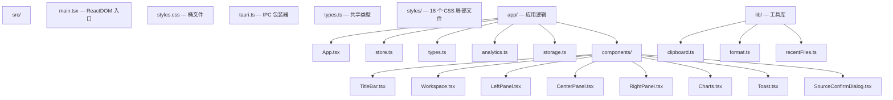
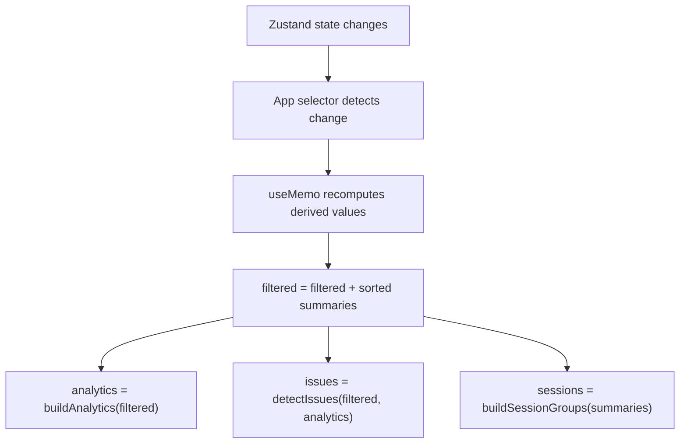
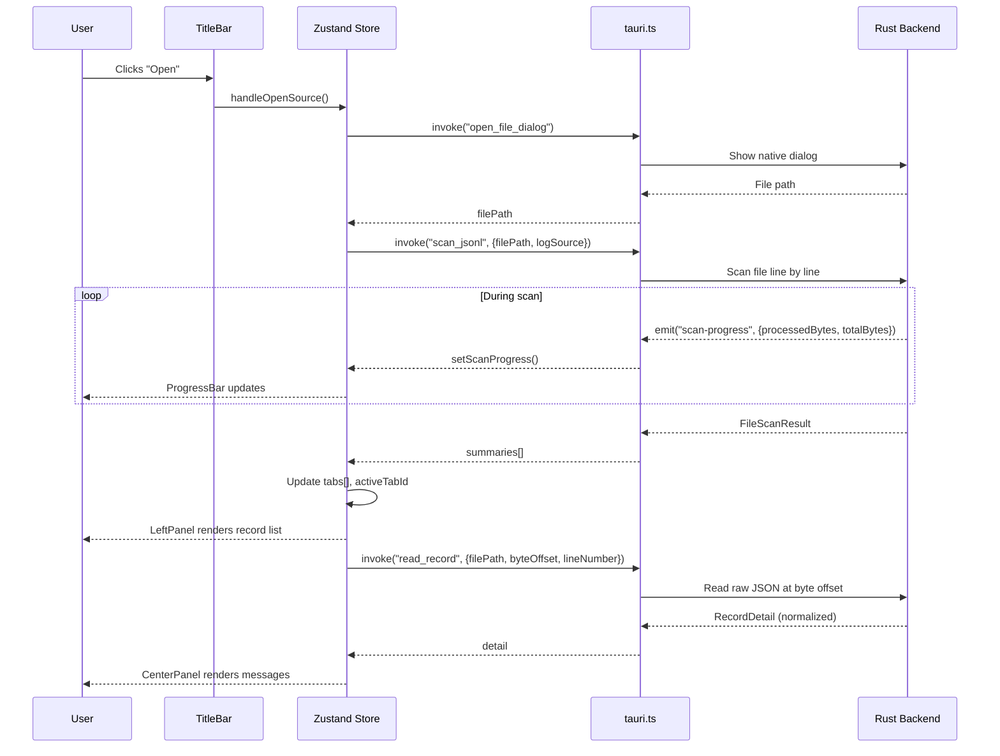
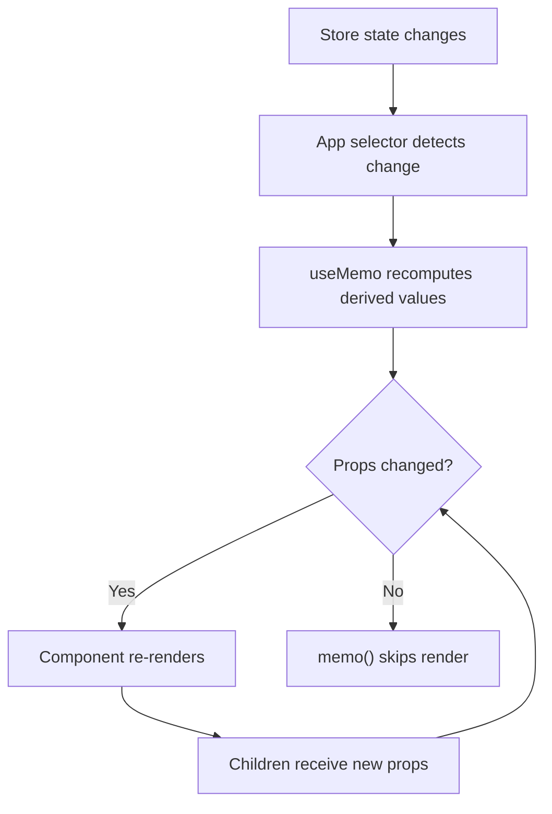

# 前端架构

PromptLens 使用 React 18 + TypeScript 构建的单页应用，基于 Vite。前端与 Rust 后端的通信完全通过 Tauri v2 IPC 命令实现。没有 REST 端点、没有 WebSocket 连接、没有任何网络调用。

## 技术栈

| 层级 | 技术 | 版本 | 用途 |
|---|---|---|---|
| 框架 | React | 18.3 | 使用 hooks 的 UI 渲染 |
| 语言 | TypeScript | 5.6 | 整个代码库的类型安全 |
| 打包工具 | Vite | 5.4 | 开发服务器 + 生产构建 |
| 状态管理 | Zustand | 5.0 | 双 store 架构（app + workspace） |
| 虚拟滚动 | @tanstack/react-virtual | 3.13 | 大列表的高效渲染 |
| Markdown 渲染 | react-markdown + remark-gfm | 9.1 / 4.0 | 显示带格式的 LLM 响应 |
| 图标 | lucide-react | 0.468 | SVG 图标库 |
| 桌面壳 | Tauri v2 (@tauri-apps/api) | 2.9 | IPC、文件对话框、窗口管理 |
| 测试 | Vitest + @testing-library/react | 4.1 / 16.3 | 分析和存储的单元测试 |

## 目录结构



### 文件职责表

| 文件 | 行数 | 用途 |
|------|-------|---------|
| `main.tsx` | ~15 | ReactDOM.createRoot，渲染 App |
| `styles.css` | ~20 | 所有 CSS 局部文件的桶导入 |
| `tauri.ts` | ~120 | 所有 20 个 IPC 命令的类型化包装器 |
| `types.ts` | ~200 | 共享 TypeScript 类型（LogSummary、NormalizedCall 等） |
| `app/App.tsx` | ~800 | 根组件：编排、键盘快捷键、调整大小 |
| `app/store.ts` | ~600 | Zustand stores：useAppStore + useWorkspaceStore |
| `app/types.ts` | ~100 | 应用层类型（Filter、SortKey、WorkspaceTab 等） |
| `app/analytics.ts` | ~300 | 客户端分析、问题检测、会话分组 |
| `app/storage.ts` | ~80 | localStorage 持久化辅助函数 |
| `components/LeftPanel.tsx` | ~1060 | 8 个标签页视图，带虚拟滚动 |
| `components/CenterPanel.tsx` | ~570 | 带消息卡片的详情视图 |
| `components/RightPanel.tsx` | ~350 | 5 个标签页视图：diff、tools、error、JSON、raw |
| `components/TitleBar.tsx` | ~370 | macOS 风格标题栏，带菜单 |
| `components/Workspace.tsx` | ~130 | 标签栏和状态栏 |
| `components/Charts.tsx` | ~60 | BarChart 和 Histogram 组件 |
| `lib/format.ts` | ~40 | 时间、延迟、token、字节格式化 |
| `lib/clipboard.ts` | ~25 | 复制到剪贴板工具 |
| `lib/recentFiles.ts` | ~20 | localStorage 中的最近文件历史 |

## IPC 包装器（`tauri.ts`）

每次调用 Rust 后端都通过单一文件：`src/tauri.ts`。该文件用匹配 Rust `#[command]` 处理器的类型化签名包装 Tauri 的 `invoke()` 函数。

```typescript
// file: src/tauri.ts:1
import { invoke } from "@tauri-apps/api/core";
import type {
  AgentSessionIncrementalResult, AgentSessionResult, CacheInfo,
  ComputedAnalyticsRaw, CostEstimate, FileScanResult, FileStatus,
  IncrementalScanResult, LogSource, ModelPricing, RecordDetail, SearchResponse,
} from "./types";
```

```typescript
// file: src/tauri.ts:17
export async function openFileDialog(): Promise<string | null> {
  return invoke("open_file_dialog");
}

export async function scanJsonl(
  filePath: string,
  logSource: LogSource = "audit",
): Promise<FileScanResult> {
  return invoke("scan_jsonl", { filePath, logSource });
}

export async function readRecord(
  filePath: string,
  byteOffset: number,
  lineNumber: number,
): Promise<RecordDetail> {
  return invoke("read_record", { filePath, byteOffset, lineNumber });
}
```

### 完整命令目录

| 包装器 | Rust 命令 | 用途 |
|---|---|---|
| `openFileDialog()` | `open_file_dialog` | 原生文件选择器 |
| `scanJsonl()` | `scan_jsonl` | 带提供商自动检测的全文件扫描 |
| `scanJsonlIncremental()` | `scan_jsonl_incremental` | 从字节偏移的仅追加重扫描 |
| `cancelScan()` | `cancel_scan` | 取消进行中的扫描 |
| `clearScanCache()` | `clear_scan_cache` | 清除 SQLite 缓存 |
| `getCacheInfo()` | `get_cache_info` | 获取缓存数据库路径 |
| `getFileStatus()` | `get_file_status` | 检查文件存在/大小/修改时间 |
| `saveTextFile()` | `save_text_file` | 导出的另存为对话框 |
| `exportRecords()` | `export_records` | 导出过滤后的记录（JSONL/Markdown） |
| `readRecord()` | `read_record` | 通过字节偏移读取单条记录 |
| `detectLogSource()` | `detect_log_source` | 自动检测提供商格式 |
| `readAgentSession()` | `read_agent_session` | 读取完整代理会话 |
| `readAgentSessionIncremental()` | `read_agent_session_incremental` | 增量代理会话读取 |
| `searchJsonl()` | `search_jsonl` | 全文搜索（子串/正则/FTS5） |
| `cancelSearch()` | `cancel_search` | 取消进行中的搜索 |
| `listSystemFonts()` | `list_system_fonts` | 枚举系统字体 |
| `getPricingTable()` | `get_pricing_table` | 获取模型定价数据 |
| `calculateCosts()` | `calculate_costs` | 估算 token 成本 |
| `startFileWatch()` | `start_file_watch` | 启动实时模式的文件系统监视器 |
| `stopFileWatch()` | `stop_file_watch` | 停止文件系统监视器 |
| `computeAnalytics()` | `compute_analytics` | 服务端分析计算 |

### 事件监听器

除了请求/响应 IPC，前端还订阅 Tauri 事件通道以获取实时进度更新：

```typescript
// file: src/app/store.ts:77
import { listen } from "@tauri-apps/api/event";

// 扫描进度（已处理字节、行号）
const unlistenScan = listen<ProgressEvent>("scan-progress", (event) => {
  workspaceStore.setScanProgress(event.payload);
});

// 搜索进度
const unlistenSearch = listen<ProgressEvent>("search-progress", (event) => {
  workspaceStore.setSearchProgress(event.payload);
});
```

## 关键设计模式

### 无本地数据获取

应用避免在 `useEffect` 中获取数据并存储在本地组件状态中。所有持久状态都在 Zustand stores 中。组件仅通过稳定的 selector 函数选择它们需要的特定切片，防止不必要的重新渲染。

```typescript
// 好：原始 selector，仅在主题变化时重新渲染
const theme = useAppStore((s) => s.theme);

// 好：用 useMemo 派生，稳定引用
const file = useMemo(() => activeTab?.file ?? null, [activeTab]);
```

### 用 `useMemo` 派生状态

昂贵的计算如过滤、排序、分析和问题检测在根 `App` 组件中用 `useMemo` 进行记忆化。依赖数组仅包含实际变化的原始值，避免陈旧闭包和无限重新渲染循环。

```typescript
const filtered = useMemo(() => {
  return [...file.summaries]
    .filter((item) => { /* provider, model, status, query */ })
    .sort((a, b) => compareSummary(a, b, sortKey));
}, [file, filter, sortKey, query, providerFilter, modelFilter, ...]);

const analytics = useMemo(() => buildAnalytics(filtered), [filtered]);
const issues = useMemo(() => detectIssues(filtered, analytics), [filtered, analytics]);
```



### 组件记忆化

所有主要面板组件都用 `React.memo()` 包装，并且仅从 store selectors 接收稳定的 prop 引用：

```typescript
// file: src/app/components/LeftPanel.tsx:51
export const LeftPanel = memo(function LeftPanel({
  tab, setTab, source, sortOrder, setSortOrder, query, setQuery,
  file, filtered, selected, selectedAgentEvent, newLineNumbers,
  agentSession, sessions, issues, filterOptions,
  searchTerm, setSearchTerm, searching, searchResults,
  // ... 更多 props
}: { /* ... */ }) {
  // 组件体
});
```

### 键盘快捷键

全局键盘快捷键在 `App.tsx` 中通过添加到 `window` 的 `keydown` 监听器的 `useEffect` 注册：

| 快捷键 | 操作 |
|---|---|
| `Cmd/Ctrl + O` | 打开文件对话框 |
| `Cmd/Ctrl + F` | 聚焦搜索输入 |
| `Cmd/Ctrl + R` | 重扫描当前文件 |
| `Cmd/Ctrl + Shift + C` | 复制选中记录的原始 JSON |
| `Cmd/Ctrl + W` | 关闭活动标签 |
| `Arrow Up/Down` | 导航记录 |
| `Escape` | 关闭图片预览 |

### 调整大小手柄

三面板布局（左、中、右）使用 CSS Grid 配合可拖动的调整大小手柄。鼠标事件通过 `useEffect` 动态附加和分离，边界由常量强制执行：

```typescript
// file: src/app/types.ts（近似）
export const LEFT_MIN = 260;
export const LEFT_MAX = 560;
export const LEFT_DEFAULT = 340;
export const RIGHT_MIN = 300;
export const RIGHT_MAX_RATIO = 0.6;
export const RIGHT_DEFAULT = 400;
export const CENTER_MIN = 200;
```

## 工具库

### clipboard.ts

提供三个函数用于将数据复制到系统剪贴板：

```typescript
// file: src/lib/clipboard.ts
export async function copyText(value: string): Promise<void> {
  await navigator.clipboard.writeText(value);
}

export async function copyJson(value: unknown): Promise<void> {
  await navigator.clipboard.writeText(JSON.stringify(value, null, 2));
}

export function safeJson(value: unknown): string {
  try { return JSON.stringify(value, null, 2); }
  catch { return String(value); }
}
```

### format.ts

整个 UI 中用于一致显示值的格式化函数：

| 函数 | 输入 | 输出示例 |
|---|---|---|
| `formatTime(timestamp)` | ISO 字符串 | `"14:32:05"` |
| `formatLatency(ms)` | 毫秒 | `"250ms"` 或 `"1.5s"` |
| `formatTokens(count)` | token 数量 | `"1.5k tokens"` 或 `"450 tokens"` |
| `formatBytes(bytes)` | 字节数 | `"2.4 MB"` 或 `"512 KB"` |
| `basename(path)` | 文件路径 | `"session.jsonl"` |

### recentFiles.ts

管理 `localStorage` 中最近打开文件的列表：

- `loadRecentFiles()` -- 从 `localStorage` 键 `"promptlens.recentFiles"` 读取数组
- `rememberRecentFile(path)` -- 将文件添加到列表开头，去重，并限制为 8 条

## 开发工作流

```bash
# 仅启动 Vite 开发服务器（前端热重载，端口 1420）
npm run dev

# 启动完整 Tauri 应用（编译 Rust 后端 + 运行 Vite）
npm run tauri:dev

# 类型检查并构建生产前端
npm run build

# 运行前端单元测试
npm run test
```

在 `npm run tauri:dev` 期间，Rust 后端编译一次，然后 Vite 开发服务器为前端提供热模块替换（HMR）。TypeScript 或 CSS 文件的更改会立即反映，无需重启应用。Rust 代码的更改会触发后端重新编译。

## 数据流概览

当用户打开 JSONL 文件时，数据在前端中的流转如下：



## 重新渲染优化

组件树通过多层设计来最小化重新渲染：



| 优化层 | 机制 | 效果 |
|-------------------|-----------|--------|
| Store selectors | `useAppStore((s) => s.theme)` | 仅在选中值变化时重新渲染 |
| `useMemo` | 记忆化派生计算 | 依赖不变时不重新计算 |
| `React.memo()` | 浅比较 props | props 相等时跳过渲染 |
| 回调稳定性 | Store actions 是稳定引用 | 传递 actions 作为 props 不触发重新渲染 |
| 虚拟滚动 | 仅渲染可见行 | 列表变化时最小化 DOM 更新 |
