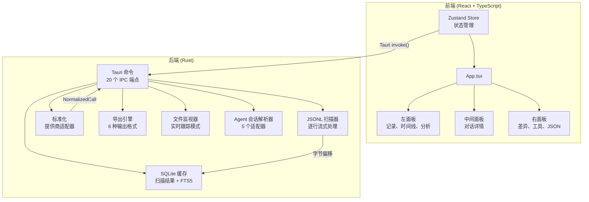
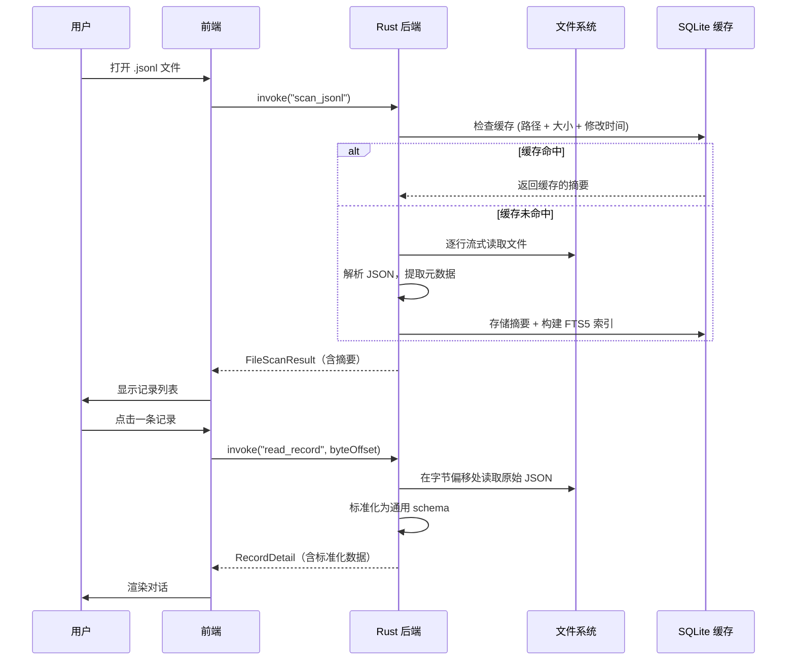

# PromptLens 入门指南

PromptLens 是一款本地优先的桌面应用程序，用于查看、搜索和分析来自 LLM 提供商的 JSONL 审计日志。它完全在您的机器上运行，不进行任何网络调用，也不收集遥测数据。

## 什么是 PromptLens？

当您使用 OpenAI、Anthropic、Gemini 或 Ollama 等提供商的 LLM API 时，通常会生成包含请求/响应对的大型 JSONL 文件。PromptLens 将这些文件转化为可交互、可搜索的界面，让您可以检查对话、调试错误、跟踪 token 用量并分析成本。

PromptLens 还支持来自 Codex、Claude Code、OpenCode、OpenClaw 和通用 agent JSONL 格式的 agent 会话日志。

## 核心功能

| 功能 | 描述 |
|------|------|
| **多提供商标准化** | 自动检测 OpenAI、Anthropic、Gemini 和 Ollama 格式，并将其标准化为统一 schema |
| **Agent 会话支持** | 解析来自 Codex、Claude Code、OpenCode、OpenClaw 和通用 agent JSONL 格式的日志 |
| **字节偏移索引** | 通过字节偏移定位记录，实现 O(1) 随机访问，即使在数 GB 的文件上也是如此 |
| **SQLite + FTS5 缓存** | 扫描结果本地缓存；全文搜索由 SQLite FTS5 提供支持 |
| **增量扫描** | 检测仅追加的文件变更，无需重新扫描整个文件 |
| **虚拟滚动** | 使用虚拟化列表流畅处理数百万条记录 |
| **三种视图模式** | 将消息渲染为 Markdown 预览、纯文本或原始 JSON |
| **差异比较** | 并排比较任意两条记录，支持文本级差异显示 |
| **分析仪表板** | Token 用量、延迟百分位数、错误率、模型分布和成本估算 |
| **导出** | 将过滤后的记录导出为 JSONL、CSV、Markdown 报告、原始 JSONL、标准化 JSONL 或会话 Markdown |

## 架构概览

PromptLens 基于 [Tauri v2](https://v2.tauri.app/) 构建，将 React + TypeScript 前端与 Rust 后端相结合。这种混合架构是经过深思熟虑的选择：Rust 处理性能关键的 I/O（文件扫描、JSON 解析、SQLite 操作），而 React 提供响应式的组件驱动 UI。



Rust 后端注册为 Tauri 应用状态，包含用于长时间运行操作的原子取消标志：

```rust
// file: src-tauri/src/types.rs:9
pub(crate) struct AppState {
    pub(crate) cancel_scan: AtomicBool,
    pub(crate) cancel_search: AtomicBool,
    pub(crate) file_watcher: Mutex<Option<crate::watcher::FileWatcher>>,
}
```

所有 20 个 Tauri 命令在库入口点的 `run()` 函数中注册：

```rust
// file: src-tauri/src/commands.rs:593
pub fn run() {
    tauri::Builder::default()
        .manage(AppState::default())
        .invoke_handler(tauri::generate_handler![
            open_file_dialog,
            scan_jsonl,
            scan_jsonl_incremental,
            cancel_scan,
            clear_scan_cache,
            get_cache_info,
            get_file_status,
            save_text_file,
            export_records,
            read_record,
            read_agent_session,
            read_agent_session_incremental,
            detect_log_source,
            search_jsonl,
            cancel_search,
            list_system_fonts,
            get_pricing_table,
            calculate_costs,
            start_file_watch,
            stop_file_watch,
            compute_analytics
        ])
        .run(tauri::generate_context!())
        .expect("error while running PromptLens");
}
```

## 数据流

数据流遵循两阶段模式：**扫描**（索引所有记录）和**读取**（按需加载单条记录）。这种设计意味着即使对于 GB 级文件，记录列表也能快速加载，因为扫描阶段只创建轻量级摘要。



扫描阶段使用 256KB 缓冲区流式读取文件，每 250 行发出一次进度事件：

```rust
// file: src-tauri/src/scanner.rs:37
let mut reader = BufReader::with_capacity(256 * 1024, file);
// ...
// 每 250 行报告进度：
if total_lines == 1 || total_lines.is_multiple_of(250) {
    if let Some(app) = app {
        let _ = app.emit("scan-progress", ProgressEvent {
            processed_bytes: byte_offset,
            total_bytes: metadata.len(),
            line_number: total_lines,
        });
    }
}
```

## 使用 Zustand 进行状态管理

PromptLens 使用两个 Zustand store 来分离关注点：

```tsx
// file: src/app/store.ts:147
export const useAppStore = create<AppState>((set, get) => ({
  theme: loadTheme(),
  settings: loadSettings(),
  messageViewMode: loadMessageViewMode(),
  // ... UI 偏好和瞬态状态
}));

// file: src/app/store.ts:284
export const useWorkspaceStore = create<WorkspaceState>((set, get) => ({
  tabs: [],
  activeTabId: null,
  recentFiles: loadRecentFiles(),
  // ... 文件数据、标签页、异步操作
}));
```

| Store | 用途 | 持久化方式 |
|-------|------|-----------|
| **App Store** | UI 偏好（主题、字体、过滤器、排序键、面板宽度） | 通过 subscribe 中间件写入 `localStorage` |
| **Workspace Store** | 文件标签页、扫描结果、agent 会话、搜索状态 | 打开的文件路径存储在 `localStorage` |

这种分离意味着 UI 偏好更改不会触发文件数据组件的重渲染，反之亦然。

## 支持的 LLM 提供商

PromptLens 基于 JSON 结构自动检测提供商。检测在 Rust 后端通过简单的键存在性检查完成：

```rust
// file: src-tauri/src/adapters.rs:11
pub(crate) fn detect_provider(value: &Value) -> Option<String> {
    if value.get("choices").is_some() || value.get("output").is_some() {
        return Some("openai".to_string());
    }
    if value.get("candidates").is_some() || value.get("contents").is_some() {
        return Some("gemini".to_string());
    }
    if value.get("message").is_some() && value.get("done").is_some() {
        return Some("ollama".to_string());
    }
    // Anthropic: 带类型化项的 content 数组
    if value.get("content").and_then(Value::as_array).is_some_and(|items| {
        items.iter().any(|item| item.get("type").and_then(Value::as_str) == Some("text"))
    }) {
        return Some("anthropic".to_string());
    }
    None
}
```

| 提供商 | 检测信号 |
|--------|---------|
| **OpenAI** | 存在 `choices`、`output` 或 `output_text` 字段 |
| **Anthropic** | `content` 数组包含类型化项（如 `{"type": "text"}`） |
| **Gemini** | 存在 `candidates` 或 `contents` 字段 |
| **Ollama** | 存在 `message` 和 `done` 字段 |

## 支持的 Agent 来源

| 来源 | 标签 | 描述 |
|------|------|------|
| `audit` | 审计 JSONL 日志 | 标准 LLM 审计日志（默认） |
| `codex` | Codex | OpenAI Codex CLI 会话日志 |
| `claude_code` | Claude Code | Anthropic Claude Code 会话日志 |
| `opencode` | OpenCode | OpenCode 会话日志 |
| `openclaw` | OpenClaw | OpenClaw 会话日志 |
| `generic_agent` | Agent JSONL | 具有灵活 schema 的通用 agent JSONL |

## PromptLens 与其他工具的对比

| 功能 | PromptLens | 浏览器 DevTools | CLI 工具 | 云仪表板 |
|------|-----------|----------------|---------|---------|
| 本地优先 | 是 | 是 | 是 | 否 |
| 多提供商支持 | 是 | 否 | 各异 | 特定提供商 |
| Agent 会话解析 | 是 | 否 | 否 | 否 |
| 可视化对话视图 | 是 | 否 | 否 | 是 |
| 全文搜索 | 是 (FTS5) | 否 | grep | 是 |
| 成本估算 | 是 | 否 | 否 | 是 |
| 导出格式 | 6 种格式 | 无 | 有限 | CSV/JSON |
| 离线使用 | 是 | 是 | 是 | 否 |

## 系统要求

| 要求 | 最低配置 |
|------|---------|
| 操作系统 | macOS 11+、Windows 10+ 或 Linux（Ubuntu 20.04+、Fedora 36+、Arch） |
| 内存 | 512 MB 空闲（大型文件需要更多） |
| 磁盘 | 100 MB 应用空间，额外空间用于 SQLite 缓存 |
| 显示 | 建议最低 1280x720 |

## 项目结构

对代码库感兴趣的开发者可以参考：

```
promptlens/
├── src/                          # 前端 (React + TypeScript)
│   ├── app/
│   │   ├── App.tsx               # 主应用组件
│   │   ├── store.ts              # Zustand 状态管理
│   │   ├── types.ts              # 前端类型定义
│   │   ├── analytics.ts          # 分析计算
│   │   ├── storage.ts            # localStorage 持久化
│   │   └── components/
│   │       ├── TitleBar.tsx       # 标题栏和菜单
│   │       ├── Workspace.tsx      # 标签栏和状态栏
│   │       ├── LeftPanel.tsx      # 记录、时间线、分析
│   │       ├── CenterPanel.tsx    # 对话详情视图
│   │       ├── RightPanel.tsx     # 差异、工具、JSON 视图
│   │       ├── Charts.tsx         # 柱状图和直方图
│   │       └── Toast.tsx          # 通知提示
│   ├── tauri.ts                  # Tauri IPC 包装器
│   ├── types.ts                  # 共享 TypeScript 类型
│   ├── lib/                      # 工具函数（剪贴板、格式化等）
│   └── styles/                   # 毛玻璃风格 CSS
├── src-tauri/                    # 后端 (Rust)
│   └── src/
│       ├── lib.rs                # 入口点 + 测试
│       ├── commands.rs           # Tauri 命令处理器
│       ├── scanner.rs            # JSONL 逐行扫描器
│       ├── normalize.rs          # 提供商标准化
│       ├── adapters.rs           # 提供商自动检测
│       ├── agent_adapters.rs     # Agent 会话适配器
│       ├── cache.rs              # SQLite 缓存层
│       ├── search.rs             # FTS5 搜索引擎
│       ├── export.rs             # 导出格式
│       ├── analytics.rs          # 服务端分析
│       ├── pricing.rs            # 成本估算
│       ├── types.rs              # Rust 类型定义
│       └── parser/               # 专用解析器
└── package.json                  # Node.js 配置
```

## 快速安装

从 [GitHub Releases](https://github.com/xuranus/promptlens/releases) 页面下载适合您平台的最新版本。详细说明（包括从源码构建）请参阅 [安装指南](installation.md)。

## 快速测试

安装后，尝试打开一个示例文件：

```bash
# 生成示例 JSONL 文件
npm run sample:large

# 打开 PromptLens 并加载生成的文件
```

或使用您 LLM API 审计日志中的任何现有 JSONL 文件。

## 下一步

- [安装指南](installation.md) -- 下载发行版或从源码构建
- [快速开始](quick-start.md) -- 启动应用并检查您的第一个日志文件
- [用户指南](user-guide.md) -- 深入了解所有功能
