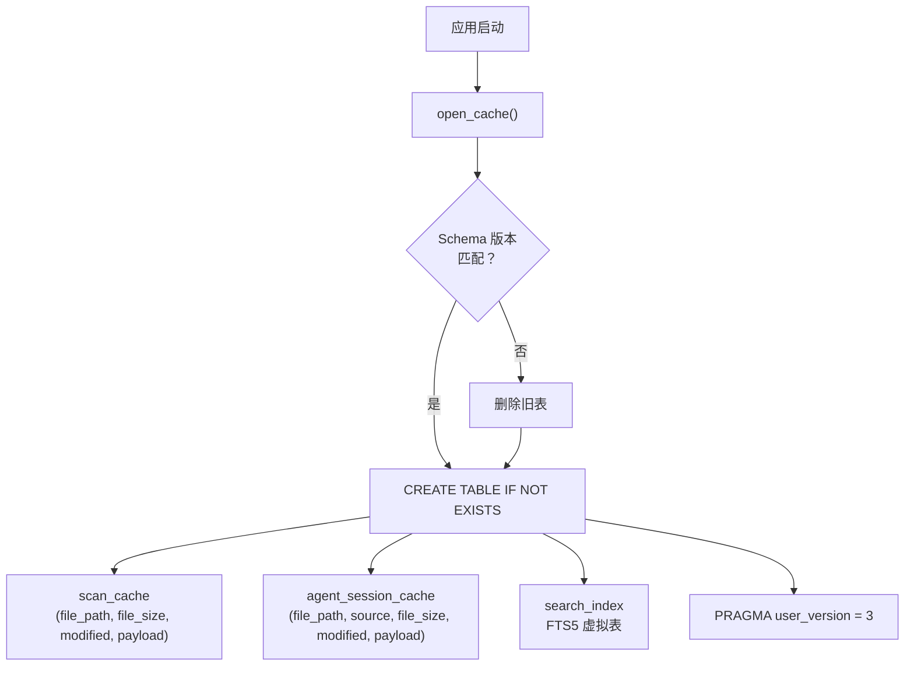
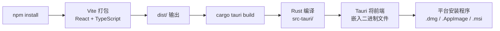

# 安装指南

PromptLens 提供适用于 macOS、Linux 和 Windows 的预构建二进制文件。您也可以选择从源码构建。

## 下载预构建版本

访问 [GitHub Releases](https://github.com/xuranus/promptlens/releases) 页面，下载适合您平台的安装程序。

| 平台 | 文件格式 | 备注 |
|------|---------|------|
| macOS (Apple Silicon) | `.dmg` | 推荐用于 M1/M2/M3/M4 Mac |
| macOS (Intel) | `.dmg` | 适用于旧款 Intel Mac |
| Linux | `.AppImage`、`.deb`、`.rpm` | AppImage 适用于大多数发行版 |
| Windows | `.msi`、`.exe` | 推荐使用 MSI 安装程序 |

### macOS

1. 下载适合您架构的 `.dmg` 文件。
2. 打开 `.dmg` 并将 **PromptLens** 拖到应用程序文件夹。
3. 首次启动时，macOS 可能会显示安全警告。前往 **系统设置 > 隐私与安全性**，点击 **仍要打开**。

### Linux

**AppImage（推荐）：**

```bash
chmod +x PromptLens_*.AppImage
./PromptLens_*.AppImage
```

**Debian/Ubuntu (.deb)：**

```bash
sudo dpkg -i promptlens_*.deb
```

**Fedora (.rpm)：**

```bash
sudo rpm -i promptlens_*.rpm
```

### Windows

1. 下载 `.msi` 安装程序。
2. 运行安装程序并按照提示操作。
3. 从开始菜单启动 PromptLens。

## 从源码构建

如果您想自行构建 PromptLens，需要 Node.js、Rust 和平台特定的依赖项。

### 前置条件

| 工具 | 最低版本 | 检查命令 |
|------|---------|---------|
| Node.js | 18+ | `node --version` |
| npm | 9+ | `npm --version` |
| Rust | 1.77+ | `rustc --version` |
| Cargo | （随 Rust 附带） | `cargo --version` |

### Linux 系统依赖

在 Debian/Ubuntu 上，安装所需的系统库：

```bash
sudo apt update
sudo apt install -y \
  libwebkit2gtk-4.1-dev \
  libgtk-3-dev \
  libayatana-appindicator3-dev \
  librsvg2-dev \
  patchelf
```

在 Fedora 上：

```bash
sudo dnf install -y \
  webkit2gtk4.1-devel \
  gtk3-devel \
  libappindicator-gtk3-devel \
  librsvg2-devel
```

在 Arch Linux 上：

```bash
sudo pacman -S --needed \
  webkit2gtk-4.1 \
  gtk3 \
  libappindicator-gtk3 \
  librsvg
```

### 克隆并构建

```bash
# 克隆仓库
git clone https://github.com/xuranus/promptlens.git
cd promptlens

# 安装前端依赖
npm install

# 以开发模式运行完整的 Tauri 桌面应用
npm run tauri:dev

# 构建生产版本
npm run tauri:build
```

生产构建会在 `src-tauri/target/release/bundle/` 输出平台特定的安装程序。

### 仅前端开发

如果您只想在不编译 Rust 的情况下开发 React 前端：

```bash
npm run dev
```

这会在 `http://localhost:1420` 启动 Vite 开发服务器。请注意，没有 Rust 后端，Tauri IPC 命令将无法工作。

### 运行 Rust 检查

```bash
cd src-tauri

# 格式检查
cargo fmt --check

# 编译器检查
cargo check

# 运行单元测试
cargo test
```

## 缓存数据库的初始化过程

当 PromptLens 启动时，Rust 后端会打开（或创建）一个 SQLite 数据库。缓存 schema 包含三个表，并使用版本号来处理迁移：

```rust
// file: src-tauri/src/cache.rs:6
pub(crate) fn cache_db_path() -> Result<std::path::PathBuf, String> {
    if let Ok(path) = std::env::var("PROMPTLENS_CACHE_PATH") {
        return Ok(std::path::PathBuf::from(path));
    }
    let base = dirs::data_local_dir()
        .or_else(dirs::data_dir)
        .ok_or_else(|| "Failed to resolve app data directory".to_string())?
        .join("PromptLens");
    fs::create_dir_all(&base).map_err(|err| format!("Failed to create cache directory: {err}"))?;
    Ok(base.join("scan-cache.sqlite"))
}
```



FTS5 虚拟表存储每行 JSONL 的内容以支持全文搜索：

```rust
// file: src-tauri/src/cache.rs:57
conn.execute(
    "CREATE VIRTUAL TABLE IF NOT EXISTS search_index USING fts5(
        file_path UNINDEXED,
        line_number UNINDEXED,
        byte_offset UNINDEXED,
        content
    )",
    [],
)
```

## 缓存存储位置

| 平台 | 典型位置 |
|------|---------|
| macOS | `~/Library/Application Support/PromptLens/scan-cache.sqlite` |
| Linux | `~/.local/share/PromptLens/scan-cache.sqlite` |
| Windows | `%APPDATA%\PromptLens\scan-cache.sqlite` |

您可以通过设置 `PROMPTLENS_CACHE_PATH` 环境变量来覆盖缓存路径。这在开发和测试时很有用。

## 构建架构



## 验证安装

启动 PromptLens 后，您应该看到带有 PromptLens 徽标和"打开 JSONL 文件"按钮的启动屏幕。要验证一切正常：

1. 点击 **打开 JSONL 文件** 或按 `Ctrl+O`。
2. 选择包含 LLM 审计日志的任意 `.jsonl` 文件。
3. 左面板中应显示记录列表。

## 生成示例数据

用于测试，您可以生成示例 JSONL 文件：

```bash
# 生成大型示例文件（默认：1000 行）
npm run sample:large

# 或指定行数和大约大小（MB）
node scripts/generate-large-sample.mjs 5000 10
```

## 故障排除

### Linux 上出现 "webkit2gtk not found"

安装您发行版的 webkit2gtk 开发包。请参阅上面的 Linux 系统依赖部分。

### "cargo build" 出现链接错误

确保已安装所有必需的系统库。在 Debian/Ubuntu 上：

```bash
sudo apt install -y build-essential pkg-config libssl-dev
```

### `npm run dev` 后前端显示空白页面

Vite 开发服务器在没有 Tauri 后端的情况下运行。Tauri IPC 调用将失败。请改用 `npm run tauri:dev` 运行完整应用程序。

### AppImage 在 Linux 上无法启动

确保文件可执行：

```bash
chmod +x PromptLens_*.AppImage
```

某些发行版需要 FUSE 才能运行 AppImage。安装它：

```bash
sudo apt install fuse libfuse2
```

### macOS "app is damaged" 错误

这是 Gatekeeper 问题。运行：

```bash
xattr -cr /Applications/PromptLens.app
```

## 更新

PromptLens 不会自动更新。新版本发布时，请从 GitHub 下载最新版本。您的扫描缓存和最近文件存储在平台特定的应用数据目录中，更新后仍会保留。

## 卸载

| 平台 | 步骤 |
|------|------|
| macOS | 将 PromptLens 从应用程序拖到废纸篓 |
| Linux (AppImage) | 删除 AppImage 文件 |
| Linux (.deb) | `sudo apt remove promptlens` |
| Linux (.rpm) | `sudo rpm -e promptlens` |
| Windows | 在设置中使用"添加或删除程序" |

扫描缓存和设置存储在平台特定的应用数据目录中。要完全删除所有数据，请在卸载后删除 PromptLens 数据目录。
