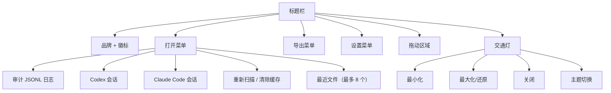
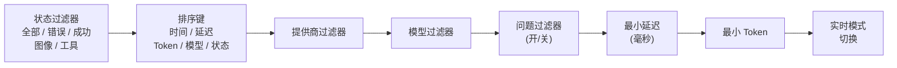
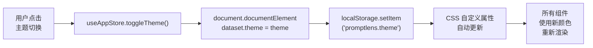
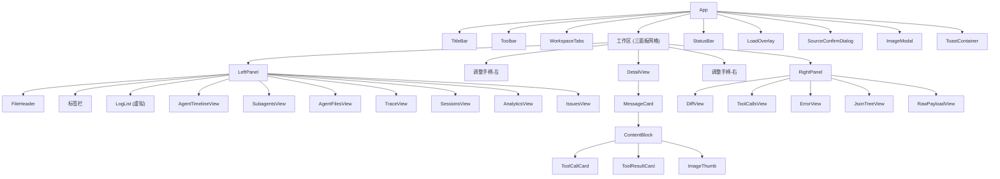

# 界面概览

PromptLens 使用三面板布局，顶部为标题栏，底部为状态栏。设计采用毛玻璃美学，使用 CSS 自定义属性进行主题化。

## 布局图

```
+------------------------------------------------------------------+
| [徽标] PromptLens    [打开] [导出] [设置]              [_][O][X]   |
+------------------------------------------------------------------+
| [全部 v] [时间 v] [提供商 v] [模型 v] [!] 最小ms 最小tokens      |
|                                                     [实时]       |
+----------+----+-------------------------+----+-------------------+
|          | |  |                         | |  |                   |
|  左面板  | |  |      中间面板            | |  |   右面板          |
|          |R|  |                         |R|  |                   |
|          |e|  |   对话视图              |e|  |   差异 / 工具     |
| 记录     |s|  |                         |s|  |   错误 / JSON     |
| 时间线   |i|  |   消息卡片              |i|  |   原始            |
| 会话     |z|  |                         |z|  |                   |
| 分析     |e|  |   [预览] [文本]         |e|  |                   |
| 问题     | |  |   [JSON]                | |  |                   |
|          | |  |                         | |  |                   |
+----------+----+-------------------------+----+-------------------+
| 就绪 · 2.3s · 1,234 条记录                                      |
+------------------------------------------------------------------+
```

## 标题栏

标题栏位于窗口顶部。它使用 Tauri 的窗口 API 进行拖动和交通灯控制：

```tsx
// file: src/app/components/TitleBar.tsx:110
<div className="title-bar" onMouseDown={startDrag} onDoubleClick={() => appWindow.toggleMaximize()}>
```

| 元素 | 描述 |
|------|------|
| **徽标 + 品牌名称** | 显示 PromptLens 徽标。标签根据活动来源更改（例如，Claude Code 会话显示"Claude Code"）。 |
| **打开菜单** | 下拉菜单，包含源类型选项、最近文件、重新扫描和缓存控制。 |
| **导出菜单** | 下拉菜单，包含所有六种导出格式。 |
| **设置菜单** | 下拉菜单，用于字体和显示偏好。 |
| **交通灯** | 窗口控制（最小化、最大化/还原、关闭）。平台特定样式。 |
| **主题切换** | 太阳/月亮图标，在亮色和暗色主题之间切换。 |



## 工具栏

标题栏下方，工具栏提供对过滤器和排序的快速访问：



## 工作区标签页

当打开多个文件时，工作区标签页出现在工具栏和三面板工作区之间。每个标签页代表一个打开的文件。

```tsx
// file: src/app/components/Workspace.tsx:43
<div className="workspace-tabs" role="tablist">
  {sessionTabs.map((tab) => (
    <button
      key={tab.id}
      role="tab"
      aria-selected={tab.id === activeSessionTabId}
      className={`${tab.kind === "subagent" ? "subagent-tab" : ""} ${tab.id === activeSessionTabId ? "active" : ""}`}
      onClick={() => onActivate(tab.id)}
      onContextMenu={(e) => handleContextMenu(e, tab.id)}
    >
      <span>{tab.label}</span>
      {tab.kind === "subagent" && (
        <span className="tab-close" onClick={(e) => { e.stopPropagation(); onClose(tab.id); }}>
          ×
        </span>
      )}
    </button>
  ))}
</div>
```

- 点击标签页切换到该文件。
- 右键点击标签页查看上下文菜单选项：关闭、关闭其他、关闭全部。
- 按 `Ctrl+W` 关闭活动标签页。

对于 agent 会话，**会话标签页**也显示在这里。"主"标签页显示主对话。双击子 agent 任务时会添加子 agent 标签页。

## 左面板

左面板是导航中心。顶部有自己的标签栏：

| 标签页 | 图标 | 可用时机 | 描述 |
|--------|------|---------|------|
| **记录** | 文件 | 始终 | 可过滤、可排序的所有记录列表 |
| **时间线** | 终端 | 仅 Agent 会话 | Agent 事件的时间顺序列表 |
| **子 Agent** | 机器人 | 仅 Agent 会话 | 带状态的子 agent 任务列表 |
| **Agent 文件** | 文件 | 仅 Agent 会话 | Agent 操作的文件 |
| **跟踪** | 网络 | 仅审计日志 | 按跟踪/会话 ID 分组的记录 |
| **会话** | 用户 | 仅审计日志 | 启发式会话分组 |
| **分析** | 柱状图 | 始终 | 指标、图表和元数据 |
| **问题** | 警告三角 | 始终 | 检测到问题的记录 |

左面板可调整大小。拖动左面板和中间面板之间的调整手柄（细垂直线）来调整宽度。面板宽度约束定义为常量：

```tsx
// file: src/app/types.ts:162
export const LEFT_MIN = 260;
export const LEFT_MAX = 560;
export const LEFT_DEFAULT = 340;
export const RIGHT_MIN = 300;
export const RIGHT_MAX_RATIO = 0.6;
export const RIGHT_DEFAULT = 400;
export const CENTER_MIN = 200;
```

## 中间面板

中间面板显示选定记录的对话详情。它显示：

1. **记录标题** -- 模型名称、提供商、行号、延迟和状态标签。
2. **错误卡片**（如适用） -- 错误类型和消息。
3. **消息卡片** -- 请求和响应中每条消息一张卡片。

每张消息卡片有：
- **角色标签**（system、user、assistant、tool）
- **视图模式按钮**（预览、文本、JSON）
- **复制按钮** 将消息复制到剪贴板
- 根据选定视图模式渲染的**内容**

## 右面板

右面板提供补充视图。它有五个标签页：

| 标签页 | 图标 | 描述 |
|--------|------|------|
| **差异** | GitCompare | 两条记录的并排比较 |
| **工具** | 扳手 | 工具调用和结果的结构化视图 |
| **错误** | 警告圆圈 | 错误详情和堆栈跟踪 |
| **JSON** | 花括号 | 带搜索的交互式 JSON 树视图 |
| **原始** | 代码 | 带语法高亮的原始 JSON 载荷 |

## 状态栏

在窗口底部，状态栏显示：

```tsx
// file: src/app/components/Workspace.tsx:81
export const StatusBar = memo(function StatusBar({ loading, searching, scanProgress, ... }) {
  const percent = active && active.totalBytes > 0
    ? Math.min(100, (active.processedBytes / active.totalBytes) * 100)
    : 0;
  // ...
  return (
    <footer className="status-bar">
      <div className="status-right">
        <div className="status-progress-track" role="progressbar" ...>
          <div style={{ width: `${percent}%` }} />
        </div>
        <span className="status-progress-label">{label}</span>
        <button onClick={loading ? onCancelScan : onCancelSearch}>取消</button>
      </div>
    </footer>
  );
});
```

- 当前状态（就绪、扫描中、搜索中）
- 扫描/搜索持续时间
- 记录计数
- 扫描或搜索进行中的取消按钮
- 长时间操作期间的进度条

## 主题系统

PromptLens 使用 CSS 自定义属性进行主题化。主题通过根元素上的 `data-theme` 属性应用：

```css
/* file: src/styles/variables.css:5 */
:root {
  --app-bg: #0a0c10;
  --glass-bg: rgba(22, 27, 36, 0.72);
  --text-primary: #e8eaed;
  --accent: #5b9cf6;
  --success: #34d399;
  --danger: #f87171;
  /* ... */
}

:root[data-theme="light"] {
  --app-bg: #e8ecf1;
  --glass-bg: rgba(255, 255, 255, 0.55);
  --text-primary: #1d1d1f;
  --accent: #3478f6;
  /* ... */
}
```



## 组件层次结构

UI 组织为 React 组件树：



## 状态管理

PromptLens 使用 [Zustand](https://zustand-demo.pmnd.rs/) 进行状态管理，包含两个 store：

| Store | 用途 | 关键状态 |
|-------|------|---------|
| **App Store** | UI 偏好和瞬态状态 | 主题、设置、过滤器、排序键、查询、左/右标签页、图像预览 |
| **Workspace Store** | 文件和标签页状态 | 打开的标签页、活动标签页、最近文件、加载状态、扫描/搜索进度 |

设置和工作区状态持久化到 `localStorage` 并在启动时恢复。
