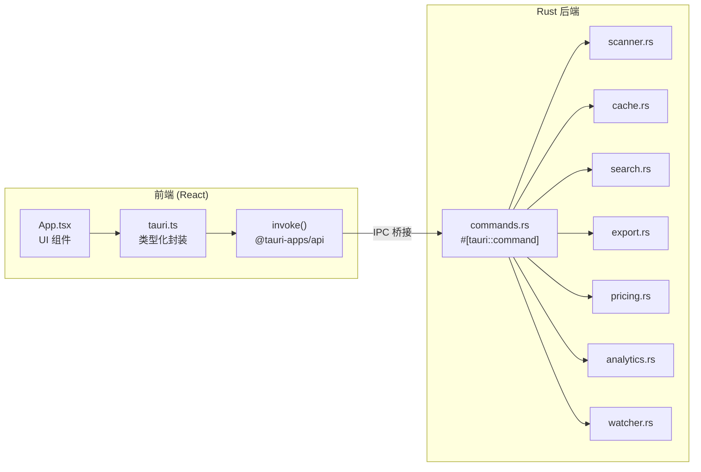
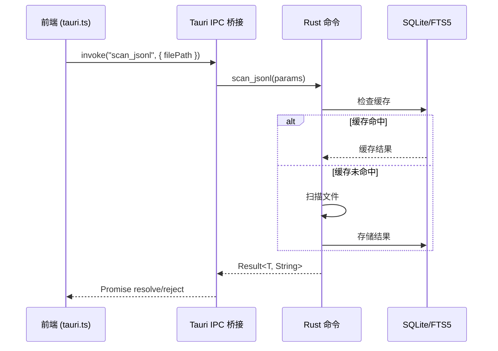
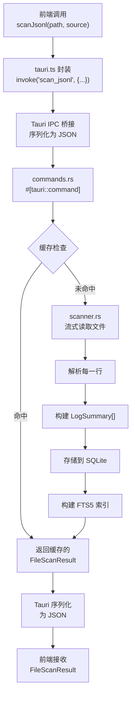

# IPC 命令

PromptLens 暴露 21 个 Tauri IPC 命令。前端通过 `src/tauri.ts` 中定义的 `invoke()` 封装调用这些命令。

## IPC 架构





## 命令概览

| # | 命令 | 类别 | 描述 |
|---|---------|----------|-------------|
| 1 | `open_file_dialog` | 文件 | 打开原生文件选择器 |
| 2 | `scan_jsonl` | 扫描 | 完整扫描 JSONL 文件 |
| 3 | `scan_jsonl_incremental` | 扫描 | 扫描追加到文件的新行 |
| 4 | `cancel_scan` | 扫描 | 取消进行中的扫描 |
| 5 | `clear_scan_cache` | 缓存 | 删除 SQLite 缓存 |
| 6 | `get_cache_info` | 缓存 | 获取缓存文件路径和存在状态 |
| 7 | `get_file_status` | 文件 | 检查文件存在、大小、修改时间 |
| 8 | `save_text_file` | 导出 | 通过原生保存对话框保存文本 |
| 9 | `export_records` | 导出 | 将选定记录导出为 JSONL 或 Markdown |
| 10 | `read_record` | 读取 | 按字节偏移读取并规范化单条记录 |
| 11 | `detect_log_source` | 代理 | 自动检测日志源类型 |
| 12 | `read_agent_session` | 代理 | 从 JSONL 文件读取完整代理会话 |
| 13 | `read_agent_session_incremental` | 代理 | 从字节偏移读取新代理事件 |
| 14 | `search_jsonl` | 搜索 | 使用 FTS5 或子字符串模式进行全文搜索 |
| 15 | `cancel_search` | 搜索 | 取消进行中的搜索 |
| 16 | `list_system_fonts` | 系统 | 列出可用系统字体 |
| 17 | `get_pricing_table` | 定价 | 返回完整模型定价表 |
| 18 | `calculate_costs` | 定价 | 计算 token 使用的成本估算 |
| 19 | `start_file_watch` | 监视 | 开始监视文件更改 |
| 20 | `stop_file_watch` | 监视 | 停止文件监视器 |
| 21 | `compute_analytics` | 分析 | 从缓存扫描结果计算分析 |

## 命令类别

```mermaid
flowchart TB
    subgraph FileOps["文件操作"]
        A["open_file_dialog"]
        B["get_file_status"]
        C["save_text_file"]
    end

    subgraph ScanOps["扫描操作"]
        D["scan_jsonl"]
        E["scan_jsonl_incremental"]
        F["cancel_scan"]
    end

    subgraph CacheOps["缓存操作"]
        G["clear_scan_cache"]
        H["get_cache_info"]
    end

    subgraph SearchOps["搜索操作"]
        I["search_jsonl"]
        J["cancel_search"]
    end

    subgraph ExportOps["导出操作"]
        K["export_records"]
    end

    subgraph ReadOps["读取操作"]
        L["read_record"]
    end

    subgraph AgentOps["代理操作"]
        M["detect_log_source"]
        N["read_agent_session"]
        O["read_agent_session_incremental"]
    end

    subgraph PricingOps["定价操作"]
        P["get_pricing_table"]
        Q["calculate_costs"]
    end

    subgraph WatchOps["监视操作"]
        R["start_file_watch"]
        S["stop_file_watch"]
    end

    subgraph AnalyticsOps["分析"]
        T["compute_analytics"]
    end

    subgraph SystemOps["系统"]
        U["list_system_fonts"]
    end
```



## 详细命令参考

### 1. `open_file_dialog`

打开原生文件选择器对话框，过滤为 JSONL 文件。

| 参数 | 类型 | 必需 | 描述 |
|-----------|------|----------|-------------|
| （无） | - | - | - |

**返回：** `string | null` -- 文件路径，取消则为 `null`。

```typescript
// file: src/tauri.ts:17-19
export async function openFileDialog(): Promise<string | null> {
  return invoke("open_file_dialog");
}
```

### 2. `scan_jsonl`

对 JSONL 文件执行完整扫描，解析每一行并构建摘要。

| 参数 | 类型 | 必需 | 描述 |
|-----------|------|----------|-------------|
| `filePath` | `string` | 是 | JSONL 文件的绝对路径 |
| `logSource` | `LogSource` | 否 | 解析器提示：`"audit"`、`"codex"`、`"opencode"`、`"openclaw"`、`"claude_code"`、`"generic_agent"` |

**返回：** `FileScanResult`

```typescript
// file: src/tauri.ts:21-23
export async function scanJsonl(
  filePath: string,
  logSource: LogSource = "audit"
): Promise<FileScanResult> {
  return invoke("scan_jsonl", { filePath, logSource });
}
```

### 3. `scan_jsonl_incremental`

仅扫描自上次扫描以来追加的新行，使用字节偏移实现 O(1) 寻址。

| 参数 | 类型 | 必需 | 描述 |
|-----------|------|----------|-------------|
| `filePath` | `string` | 是 | JSONL 文件的绝对路径 |
| `fromOffset` | `number` | 是 | 要寻址的字节偏移 |
| `fromLineNumber` | `number` | 是 | 要继续的行号 |

**返回：** `IncrementalScanResult`

```typescript
// file: src/tauri.ts:25-31
export async function scanJsonlIncremental(
  filePath: string,
  fromOffset: number,
  fromLineNumber: number,
): Promise<IncrementalScanResult> {
  return invoke("scan_jsonl_incremental", { filePath, fromOffset, fromLineNumber });
}
```

### 4. `cancel_scan`

设置取消标志以停止进行中的扫描。

| 参数 | 类型 | 必需 | 描述 |
|-----------|------|----------|-------------|
| （无） | - | - | - |

**返回：** `void`

```typescript
// file: src/tauri.ts:33-35
export async function cancelScan(): Promise<void> {
  return invoke("cancel_scan");
}
```

### 5. `clear_scan_cache`

删除 SQLite 缓存文件。

| 参数 | 类型 | 必需 | 描述 |
|-----------|------|----------|-------------|
| （无） | - | - | - |

**返回：** `void`

```typescript
// file: src/tauri.ts:37-39
export async function clearScanCache(): Promise<void> {
  return invoke("clear_scan_cache");
}
```

### 6. `get_cache_info`

返回 SQLite 缓存的路径和是否存在。

| 参数 | 类型 | 必需 | 描述 |
|-----------|------|----------|-------------|
| （无） | - | - | - |

**返回：** `CacheInfo`

```typescript
// file: src/tauri.ts:41-43
export async function getCacheInfo(): Promise<CacheInfo> {
  return invoke("get_cache_info");
}
```

### 7. `get_file_status`

检查文件是否存在、大小和最后修改时间戳。

| 参数 | 类型 | 必需 | 描述 |
|-----------|------|----------|-------------|
| `filePath` | `string` | 是 | 文件的绝对路径 |

**返回：** `FileStatus`

```typescript
// file: src/tauri.ts:45-47
export async function getFileStatus(filePath: string): Promise<FileStatus> {
  return invoke("get_file_status", { filePath });
}
```

### 8. `save_text_file`

打开原生保存对话框并将文本内容写入选择的路径。

| 参数 | 类型 | 必需 | 描述 |
|-----------|------|----------|-------------|
| `defaultFileName` | `string` | 是 | 建议的文件名 |
| `contents` | `string` | 是 | 要写入的文本内容 |

**返回：** `string | null` -- 保存路径，取消则为 `null`。

```typescript
// file: src/tauri.ts:49-51
export async function saveTextFile(
  defaultFileName: string,
  contents: string
): Promise<string | null> {
  return invoke("save_text_file", { defaultFileName, contents });
}
```

### 9. `export_records`

通过保存对话框以指定格式导出选定记录。

| 参数 | 类型 | 必需 | 描述 |
|-----------|------|----------|-------------|
| `filePath` | `string` | 是 | 源 JSONL 文件路径 |
| `lineNumbers` | `number[]` | 是 | 要导出的记录行号 |
| `kind` | `"raw_jsonl" \| "normalized_jsonl" \| "session_markdown"` | 是 | 导出格式 |
| `defaultFileName` | `string` | 是 | 建议的文件名 |

**返回：** `string | null` -- 保存路径，取消则为 `null`。

```typescript
// file: src/tauri.ts:53-60
export async function exportRecords(
  filePath: string,
  lineNumbers: number[],
  kind: "raw_jsonl" | "normalized_jsonl" | "session_markdown",
  defaultFileName: string,
): Promise<string | null> {
  return invoke("export_records", {
    request: { filePath, lineNumbers, kind, defaultFileName }
  });
}
```

### 10. `read_record`

寻址到文件中的字节偏移，读取该行并规范化。

| 参数 | 类型 | 必需 | 描述 |
|-----------|------|----------|-------------|
| `filePath` | `string` | 是 | JSONL 文件的绝对路径 |
| `byteOffset` | `number` | 是 | 记录的字节偏移 |
| `lineNumber` | `number` | 是 | 记录的行号 |

**返回：** `RecordDetail`

```typescript
// file: src/tauri.ts:62-68
export async function readRecord(
  filePath: string,
  byteOffset: number,
  lineNumber: number,
): Promise<RecordDetail> {
  return invoke("read_record", { filePath, byteOffset, lineNumber });
}
```

### 11. `detect_log_source`

读取文件前 20 行并投票选出最可能的日志源类型。

| 参数 | 类型 | 必需 | 描述 |
|-----------|------|----------|-------------|
| `filePath` | `string` | 是 | JSONL 文件的绝对路径 |

**返回：** `string | null` -- 检测到的源类型，或 `null`。

```typescript
// file: src/tauri.ts:70-72
export async function detectLogSource(filePath: string): Promise<LogSource | null> {
  return invoke("detect_log_source", { filePath });
}
```

### 12. `read_agent_session`

读取并解析整个代理会话 JSONL 文件，包括子代理会话。

| 参数 | 类型 | 必需 | 描述 |
|-----------|------|----------|-------------|
| `filePath` | `string` | 是 | 代理会话 JSONL 的绝对路径 |
| `logSource` | `LogSource` | 否 | 代理日志源类型提示 |

**返回：** `AgentSessionResult`

```typescript
// file: src/tauri.ts:74-76
export async function readAgentSession(
  filePath: string,
  logSource: LogSource = "audit"
): Promise<AgentSessionResult> {
  return invoke("read_agent_session", { filePath, logSource });
}
```

### 13. `read_agent_session_incremental`

从字节偏移读取新代理事件（用于仅追加文件）。

| 参数 | 类型 | 必需 | 描述 |
|-----------|------|----------|-------------|
| `filePath` | `string` | 是 | JSONL 文件的绝对路径 |
| `fromOffset` | `number` | 是 | 要寻址的字节偏移 |
| `fromLineNumber` | `number` | 是 | 要继续的行号 |
| `logSource` | `LogSource` | 否 | 代理日志源类型提示 |

**返回：** `AgentSessionIncrementalResult`

```typescript
// file: src/tauri.ts:78-85
export async function readAgentSessionIncremental(
  filePath: string,
  fromOffset: number,
  fromLineNumber: number,
  logSource: LogSource = "audit",
): Promise<AgentSessionIncrementalResult> {
  return invoke("read_agent_session_incremental", {
    filePath, fromOffset, fromLineNumber, logSource
  });
}
```

### 14. `search_jsonl`

使用 FTS5 索引或子字符串回退执行全文搜索。

| 参数 | 类型 | 必需 | 描述 |
|-----------|------|----------|-------------|
| `filePath` | `string` | 是 | JSONL 文件的绝对路径 |
| `query` | `string` | 是 | 搜索查询字符串 |
| `mode` | `string` | 否 | `"substring"`（默认）或 `"fts5"` |

**返回：** `SearchResponse`

```typescript
// file: src/tauri.ts:87-89
export async function searchJsonl(
  filePath: string,
  query: string,
  mode: string = "substring"
): Promise<SearchResponse> {
  return invoke("search_jsonl", { filePath, query, mode });
}
```

### 15. `cancel_search`

设置取消标志以停止进行中的搜索。

| 参数 | 类型 | 必需 | 描述 |
|-----------|------|----------|-------------|
| （无） | - | - | - |

**返回：** `void`

```typescript
// file: src/tauri.ts:91-93
export async function cancelSearch(): Promise<void> {
  return invoke("cancel_search");
}
```

### 16. `list_system_fonts`

列出所有可用系统字体（Linux/macOS 使用 `fc-list`）。

| 参数 | 类型 | 必需 | 描述 |
|-----------|------|----------|-------------|
| （无） | - | - | - |

**返回：** `string[]`

```typescript
// file: src/tauri.ts:95-97
export async function listSystemFonts(): Promise<string[]> {
  return invoke("list_system_fonts");
}
```

### 17. `get_pricing_table`

返回完整的模型定价表。

| 参数 | 类型 | 必需 | 描述 |
|-----------|------|----------|-------------|
| （无） | - | - | - |

**返回：** `ModelPricing[]`

```typescript
// file: src/tauri.ts:99-101
export async function getPricingTable(): Promise<ModelPricing[]> {
  return invoke("get_pricing_table");
}
```

### 18. `calculate_costs`

计算 token 使用记录列表的成本估算。

| 参数 | 类型 | 必需 | 描述 |
|-----------|------|----------|-------------|
| `requests[].model` | `string` | 是 | 模型名称 |
| `requests[].prompt_tokens` | `number` | 否 | 输入 token 数 |
| `requests[].completion_tokens` | `number` | 否 | 输出 token 数 |

**返回：** `CostEstimate[]`

```typescript
// file: src/tauri.ts:103-107
export async function calculateCosts(
  requests: Array<{ model: string; prompt_tokens?: number; completion_tokens?: number }>,
): Promise<CostEstimate[]> {
  return invoke("calculate_costs", { requests });
}
```

### 19. `start_file_watch`

开始监视文件更改（仅追加）。通过 Tauri 事件系统发出事件。

| 参数 | 类型 | 必需 | 描述 |
|-----------|------|----------|-------------|
| `filePath` | `string` | 是 | 要监视的绝对路径 |

**返回：** `void`

```typescript
// file: src/tauri.ts:109-111
export async function startFileWatch(filePath: string): Promise<void> {
  return invoke("start_file_watch", { filePath });
}
```

### 20. `stop_file_watch`

停止活动的文件监视器。

| 参数 | 类型 | 必需 | 描述 |
|-----------|------|----------|-------------|
| （无） | - | - | - |

**返回：** `void`

```typescript
// file: src/tauri.ts:113-115
export async function stopFileWatch(): Promise<void> {
  return invoke("stop_file_watch");
}
```

### 21. `compute_analytics`

从缓存的扫描结果计算分析摘要。需要先执行 `scan_jsonl`。

| 参数 | 类型 | 必需 | 描述 |
|-----------|------|----------|-------------|
| `filePath` | `string` | 是 | JSONL 文件的绝对路径 |

**返回：** `ComputedAnalyticsRaw`

```typescript
// file: src/tauri.ts:117-119
export async function computeAnalytics(filePath: string): Promise<ComputedAnalyticsRaw> {
  return invoke("compute_analytics", { filePath });
}
```

## TypeScript 封装位置

所有 IPC 封装定义在 `src/tauri.ts` 中。每个函数调用 `@tauri-apps/api/core` 中的 `invoke()`，传入命令名和参数。

```typescript
// file: src/tauri.ts:1
import { invoke } from "@tauri-apps/api/core";
```

## 错误处理

所有在 Rust 中返回 `Result<T, String>` 的命令会在前端用错误字符串拒绝 Promise。使用 try/catch：

```typescript
try {
  const result = await scanJsonl(path);
} catch (err) {
  console.error("扫描失败:", err);
}
```

## IPC 数据流


