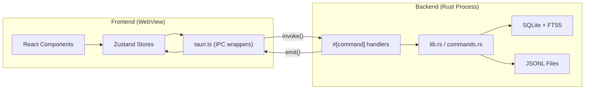
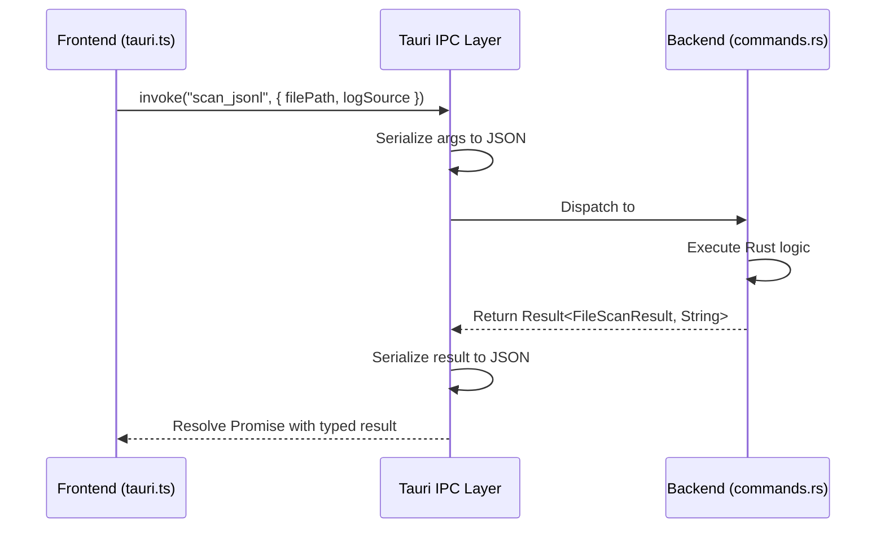
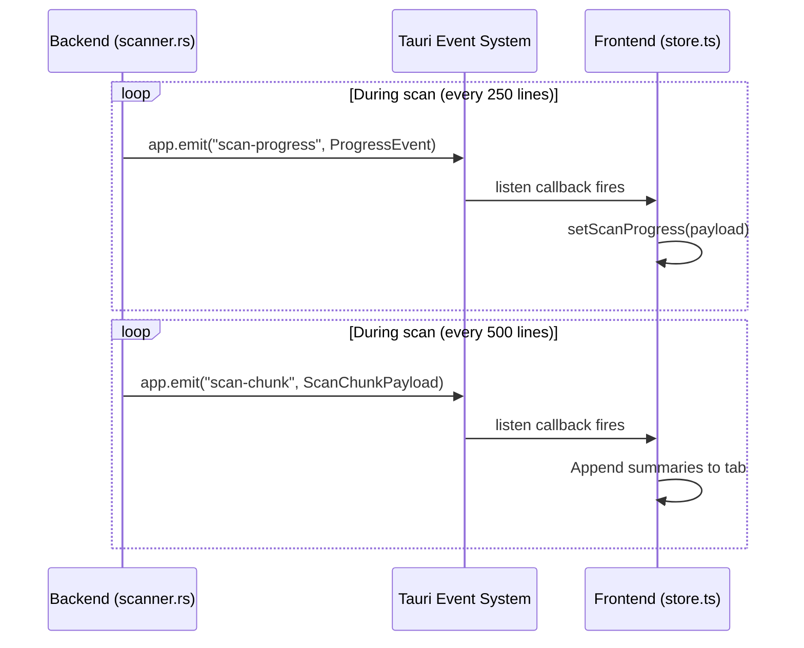
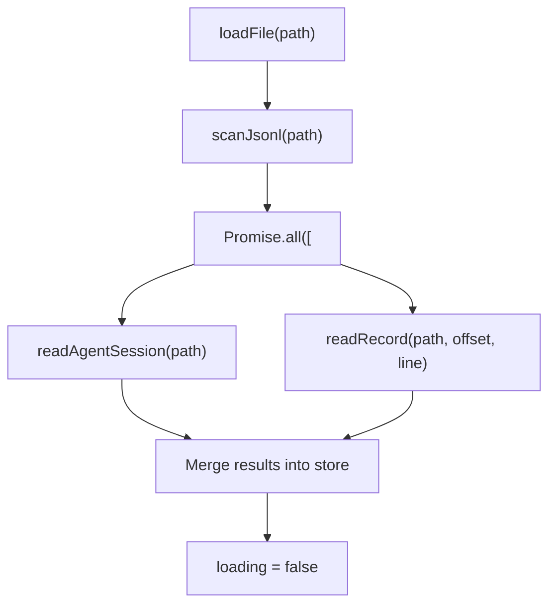
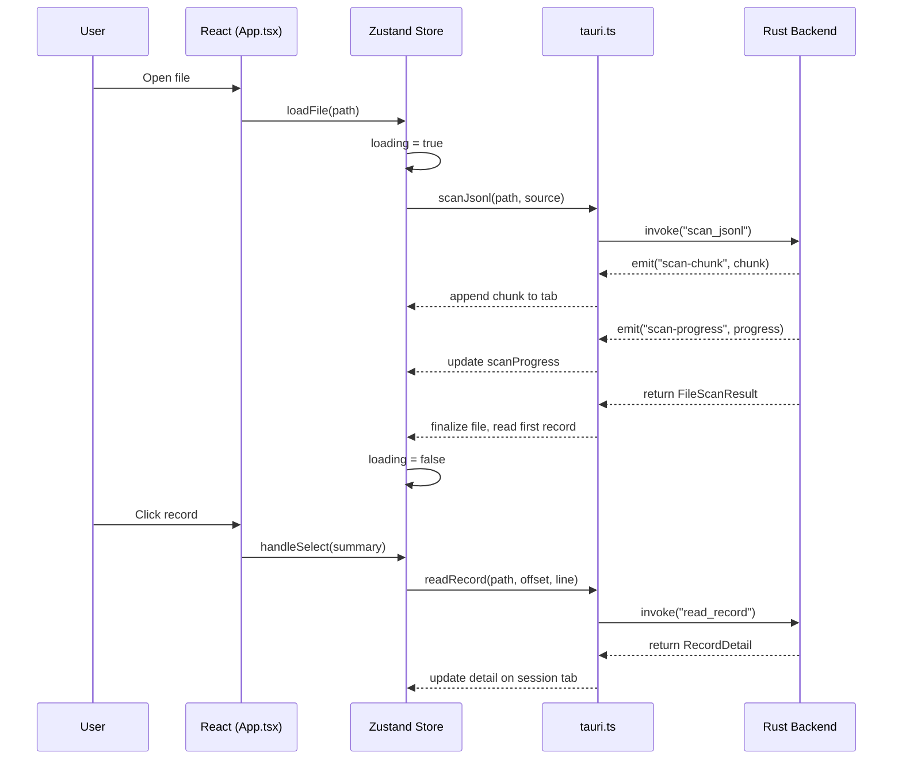

# IPC 通信

PromptLens 是一个 Tauri v2 桌面应用。React 前端和 Rust 后端运行在独立进程中，通过 Tauri 的 IPC（进程间通信）层通信。没有 HTTP 服务器、没有 WebSocket、没有网络调用。

## 架构概览



## 两种通信模式

Tauri v2 支持两种 IPC 模式，PromptLens 两种都使用：

### 模式 1：请求/响应（`invoke`）

前端调用命名命令并接收响应。这是主要模式，用于所有数据获取和变更。

```typescript
// file: src/tauri.ts:21
export async function scanJsonl(
  filePath: string,
  logSource: LogSource = "audit",
): Promise<FileScanResult> {
  return invoke("scan_jsonl", { filePath, logSource });
}
```

```rust
// file: src-tauri/src/commands.rs（近似）
#[tauri::command]
async fn scan_jsonl(
    app: tauri::AppHandle,
    state: tauri::State<'_, AppState>,
    file_path: String,
    log_source: LogSource,
) -> Result<FileScanResult, String> {
    // ... 扫描逻辑
}
```



### 模式 2：服务器推送事件（`listen`）

后端在没有先前请求的情况下向前端发出事件。用于长时间运行操作期间的进度更新。

```typescript
// file: src/app/store.ts:77
import { listen } from "@tauri-apps/api/event";

const unlistenScan = listen<ProgressEvent>("scan-progress", (event) => {
  workspaceStore.setScanProgress(event.payload);
});

const unlistenSearch = listen<ProgressEvent>("search-progress", (event) => {
  workspaceStore.setSearchProgress(event.payload);
});

const unlistenChunk = listen<ScanChunkPayload>("scan-chunk", (event) => {
  // 将块摘要追加到活动标签的文件
});

const unlistenFileChange = listen<string>("file-changed", () => {
  // 在实时模式下触发增量重扫描
});
```



## 完整命令参考

所有命令按领域分组。`src/tauri.ts` 中的每个包装器 1:1 映射到 Rust 的 `#[tauri::command]` 处理器。

### 文件操作

| 包装器 | 签名 | 返回值 | 源码 |
|---|---|---|---|
| `openFileDialog()` | 无参数 | `string \| null` | `tauri.ts:17` |
| `getFileStatus(filePath)` | `{ filePath }` | `FileStatus` | `tauri.ts:45` |
| `saveTextFile(name, contents)` | `{ defaultFileName, contents }` | `string \| null` | `tauri.ts:49` |

### 扫描

| 包装器 | 签名 | 返回值 | 源码 |
|---|---|---|---|
| `scanJsonl(filePath, logSource)` | `{ filePath, logSource }` | `FileScanResult` | `tauri.ts:21` |
| `scanJsonlIncremental(filePath, offset, line)` | `{ filePath, fromOffset, fromLineNumber }` | `IncrementalScanResult` | `tauri.ts:25` |
| `cancelScan()` | 无参数 | `void` | `tauri.ts:33` |
| `detectLogSource(filePath)` | `{ filePath }` | `LogSource \| null` | `tauri.ts:70` |

### 记录访问

| 包装器 | 签名 | 返回值 | 源码 |
|---|---|---|---|
| `readRecord(path, offset, line)` | `{ filePath, byteOffset, lineNumber }` | `RecordDetail` | `tauri.ts:62` |
| `readAgentSession(path, source)` | `{ filePath, logSource }` | `AgentSessionResult` | `tauri.ts:74` |
| `readAgentSessionIncremental(path, offset, line, source)` | `{ filePath, fromOffset, fromLineNumber, logSource }` | `AgentSessionIncrementalResult` | `tauri.ts:78` |

### 搜索

| 包装器 | 签名 | 返回值 | 源码 |
|---|---|---|---|
| `searchJsonl(path, query, mode)` | `{ filePath, query, mode }` | `SearchResponse` | `tauri.ts:87` |
| `cancelSearch()` | 无参数 | `void` | `tauri.ts:91` |

`mode` 参数接受 `"substring"`、`"regex"` 或 `"fts"`。

### 分析和定价

| 包装器 | 签名 | 返回值 | 源码 |
|---|---|---|---|
| `computeAnalytics(filePath)` | `{ filePath }` | `ComputedAnalyticsRaw` | `tauri.ts:117` |
| `getPricingTable()` | 无参数 | `ModelPricing[]` | `tauri.ts:99` |
| `calculateCosts(requests)` | `{ requests }` | `CostEstimate[]` | `tauri.ts:103` |

### 缓存和文件监视

| 包装器 | 签名 | 返回值 | 源码 |
|---|---|---|---|
| `clearScanCache()` | 无参数 | `void` | `tauri.ts:37` |
| `getCacheInfo()` | 无参数 | `CacheInfo` | `tauri.ts:41` |
| `startFileWatch(filePath)` | `{ filePath }` | `void` | `tauri.ts:109` |
| `stopFileWatch()` | 无参数 | `void` | `tauri.ts:113` |
| `listSystemFonts()` | 无参数 | `string[]` | `tauri.ts:95` |

## 事件通道

### `scan-progress`

在 `scan_jsonl` 期间发出增量进度。

```typescript
// file: src/types.ts:122
type ProgressEvent = {
  processedBytes: number;   // 已读取字节数
  totalBytes: number;       // 文件总大小
  lineNumber: number;       // 当前处理的行号
};
```

`StatusBar` 组件将其渲染为带百分比和行数的进度条。

### `search-progress`

与 `scan-progress` 相同的类型，在 `search_jsonl` 期间发出。

### `scan-chunk`

在 `scan_jsonl` 期间发出解析摘要的批次。这实现了渐进式渲染：

```typescript
type ScanChunkPayload = {
  filePath: string;
  summaries: LogSummary[];    // 解析记录的批次
  lineFrom: number;
  lineTo: number;
};
```

workspace store 监听此事件并将块追加到活动标签：

```typescript
// file: src/app/store.ts（近似监听设置）
const unlistenChunk = listen<ScanChunkPayload>("scan-chunk", (event) => {
  const chunk = event.payload;
  if (chunk.filePath !== scanningFilePath) return;
  set((s) => ({
    tabs: s.tabs.map((t) =>
      t.id === chunk.filePath
        ? { ...t, file: { ...t.file, summaries: [...t.file.summaries, ...chunk.summaries] } }
        : t,
    ),
  }));
});
```

### `file-changed`

当打开的 JSONL 文件被修改时由文件系统监视器发出。实时模式用其触发增量重扫描。

```typescript
listen<string>("file-changed", () => {
  if (!loading && file) void ws().handleLoadAppendedRecords();
});
```

## 异步模式

### 并发操作

`loadFile` action 使用 `Promise.all` 并发启动多个独立操作：

```typescript
// file: src/app/store.ts（近似）
const [agentSession, detail] = await Promise.all([
  readAgentSession(result.filePath, source).catch(() => null),
  first
    ? readRecord(result.filePath, first.byteOffset, first.lineNumber).catch(() => null)
    : Promise.resolve(null),
]);
```



两个操作都是非阻塞的，它们的结果在两者完成后合并到 store 中。错误被单独捕获，因此一个失败不会阻塞另一个。

### 取消

长时间运行的操作（扫描、搜索）支持通过专用 IPC 命令取消：

```typescript
// 用户在状态栏点击"取消"
<button onClick={loading ? onCancelScan : onCancelSearch}>取消</button>

// 处理器调用取消命令
async function onCancelScan() {
  await cancelScan();  // 在 Rust 中设置取消标志
}
```

```mermaid
sequenceDiagram
    participant User
    participant UI as React
    participant Store as Zustand Store
    participant IPC as tauri.ts
    participant BE as Rust Backend

    User->>UI: Clicks "Cancel"
    UI->>Store: onCancelScan()
    Store->>IPC: cancelScan()
    IPC->>BE: invoke("cancel_scan")
    BE->>BE: cancel_scan.store(true, Relaxed)
    Note over BE: Scanner checks flag next iteration
    BE->>BE: cancelled = true; break
    BE-->>IPC: FileScanResult { cancelled: true }
    IPC-->>Store: result
    Store->>Store: loading = false
    Store-->>UI: Hide loading overlay
```

### 加载状态管理

`loadFile` action 使用加载覆盖层模式：

```typescript
// file: src/app/store.ts:395
set({ loading: true, scanProgress: null });

// 让出时间让加载覆盖层在重工作开始前渲染
await new Promise((r) => setTimeout(r, 50));

// ... 执行扫描 ...

set({ loading: false, scanProgress: null });
```

50ms 的让出确保浏览器有时间在 IPC 调用阻塞线程前绘制加载覆盖层。如果没有这个让出，加载旋转器永远不会出现，因为 JavaScript 线程被同步 IPC 调用阻塞了。

### 错误处理

所有 IPC 包装器都可能抛出异常。store 捕获错误并将其路由到错误显示：

```typescript
try {
  const result = await scanJsonl(path, source);
  // ... 处理结果
} catch (err) {
  if (!options?.quiet) {
    app.setError(err instanceof Error ? err.message : String(err));
  }
} finally {
  set({ loading: false, scanProgress: null });
}
```

错误显示为 toast 通知或 UI 中的持久错误横幅。

## 类型安全

IPC 边界完全类型化。前端 `tauri.ts` 文件镜像 Rust 命令签名：

```typescript
// file: src/types.ts:25
export type FileScanResult = {
  filePath: string;
  fileName: string;
  fileSize: number;
  modified?: string;
  totalLines: number;
  validRecords: number;
  invalidRecords: number;
  durationMs: number;
  cancelled: boolean;
  cacheHit: boolean;
  summaries: LogSummary[];
};
```

```rust
// file: src-tauri/src/types.rs:49
#[derive(Debug, Serialize, Deserialize, Clone)]
#[serde(rename_all = "camelCase")]
pub(crate) struct FileScanResult {
    pub(crate) file_path: String,
    pub(crate) file_name: String,
    pub(crate) file_size: u64,
    pub(crate) modified: Option<String>,
    pub(crate) total_lines: usize,
    pub(crate) valid_records: usize,
    pub(crate) invalid_records: usize,
    pub(crate) duration_ms: u128,
    pub(crate) cancelled: bool,
    pub(crate) cache_hit: bool,
    pub(crate) summaries: Vec<LogSummary>,
}
```

Tauri 通过 serde 在 Rust 结构体和 TypeScript 类型之间自动序列化/反序列化。字段名在 Rust 中使用 `snake_case`，在 TypeScript 中使用 `camelCase`，Tauri 通过 `#[serde(rename_all = "camelCase")]` 处理转换。

### 类型映射表

| Rust 类型 | TypeScript 类型 | 序列化方式 |
|-----------|-----------------|---------------|
| `String` | `string` | 直接 |
| `u64`、`u128`、`usize` | `number` | 直接 |
| `bool` | `boolean` | 直接 |
| `Option<T>` | `T \| undefined` | `null` -> `undefined` |
| `Vec<T>` | `T[]` | JSON 数组 |
| `Value`（serde_json） | `unknown` | 透传 |
| `HashMap<K, V>` | `Record<K, V>` | JSON 对象 |

## 生命周期



## 性能考量

| 方面 | 行为 | 影响 |
|--------|----------|--------|
| IPC 序列化 | 两端的 JSON serde | 典型负载约 1ms |
| 事件发出 | 进度每 250 行一次 | 最小开销 |
| 块发出 | 每 500 行一次 | 批处理提高效率 |
| 取消 | 每次迭代的 AtomicBool 检查 | 近乎瞬时响应 |
| 并发操作 | Promise.all 用于独立调用 | 并行执行 |
| 加载让出 | IPC 前 50ms setTimeout | 确保 UI 响应性 |
