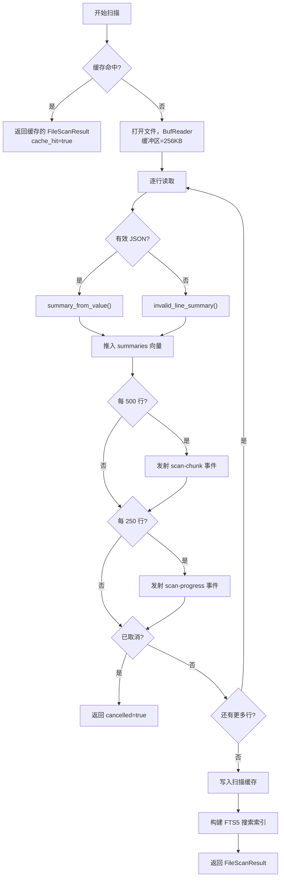
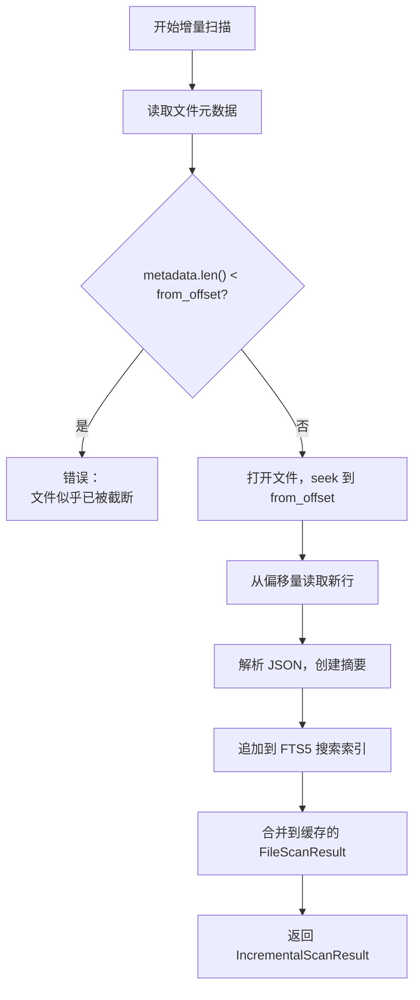
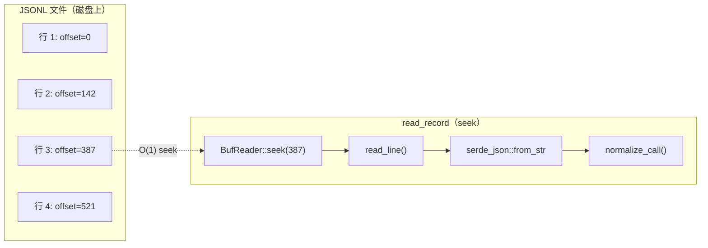

# JSONL 扫描器

JSONL 扫描器负责逐行读取 JSONL 文件，将每行解析为 `LogSummary`，并构建搜索索引。它支持全量扫描和仅追加文件的增量扫描。扫描器是 PromptLens 所有数据摄入的入口。

## 全量扫描

`scanner.rs` 中的 `scan_jsonl_inner` 函数执行 JSONL 文件的完整扫描。



### 缓存键

扫描前，函数检查 SQLite 缓存中是否存在现有结果。缓存键是以下三个字段的组合：

| 字段 | 类型 | 来源 |
|------|------|------|
| `file_path` | `TEXT PRIMARY KEY` | JSONL 文件的绝对路径 |
| `file_size` | `INTEGER` | `metadata.len()` |
| `modified` | `TEXT` | 来自 `metadata.modified()` 的 Unix 纪元秒数 |

```rust
// file: src-tauri/src/scanner.rs:30
if let Ok(Some(mut cached)) = read_scan_cache(&file_path, metadata.len(), modified.as_deref()) {
    cached.duration_ms = started.elapsed().as_millis();
    cached.cache_hit = true;
    cached.cancelled = false;
    return Ok(cached);
}
```

### BufReader 配置

扫描器使用 256 KB 缓冲区以优化顺序 I/O 性能：

```rust
// file: src-tauri/src/scanner.rs:37
let mut reader = BufReader::with_capacity(256 * 1024, file);
```

### 进度事件

| 事件 | 条件 | 载荷 |
|------|------|------|
| `scan-progress` | 第 1 行，然后每 250 行 | `ProgressEvent { processed_bytes, total_bytes, line_number }` |
| `scan-chunk` | 每 500 行 | `ScanChunkPayload { file_path, summaries[], line_from, line_to }` |

### 扫描后操作

成功（未取消）扫描后：

```rust
// file: src-tauri/src/scanner.rs:156
if !result.cancelled {
    let _ = write_scan_cache(&result);
    let _ = write_search_index_from_file(&result.file_path);
}
```

1. **写入扫描缓存**：将整个 `FileScanResult` 序列化到 `scan_cache` SQLite 表
2. **构建搜索索引**：调用 `write_search_index_from_file` 将所有行插入 FTS5 虚拟表

## 增量扫描

`scan_jsonl_incremental` 函数处理仅追加的文件变更，无需重新读取整个文件。



```rust
// file: src-tauri/src/scanner.rs:163
pub(crate) fn scan_jsonl_incremental(
    file_path: String, from_offset: u64, from_line_number: usize,
) -> Result<IncrementalScanResult, String>
```

### 缓存追加

增量扫描更新现有缓存条目而非替换它：

```rust
// file: src-tauri/src/cache.rs:187
pub(crate) fn append_scan_cache(
    file_path: &str, from_offset: u64, file_size: u64,
    modified: Option<String>, summaries: &[LogSummary],
    total_lines: usize, valid_records: usize, invalid_records: usize, duration_ms: u128,
) -> Result<(), String>
```

## 字节偏移跟踪

每个 `LogSummary` 记录其行在文件中开始的字节偏移量。这使得 `read_record` 能够通过 `BufReader::seek(SeekFrom::Start(byte_offset))` O(1) 随机访问任何记录。



## 取消机制

`scan_jsonl` 和 `search_jsonl` 在每次行迭代开始时检查 `AtomicBool` 取消标志：

```rust
// file: src-tauri/src/scanner.rs:49
if cancel_flag.is_some_and(|flag| flag.load(Ordering::Relaxed)) {
    cancelled = true;
    break;
}
```

使用 `Relaxed` 排序是因为精确排序不是关键的 -- 取消通知延迟一次迭代是可以接受的。

## 无效行处理

当行 JSON 解析失败时，扫描器创建 `invalid_line_summary`：

```rust
// file: src-tauri/src/normalize.rs:636
pub(crate) fn invalid_line_summary(
    line_number: usize, byte_offset: u64, trimmed: &str, err: &serde_json::Error,
) -> LogSummary {
    LogSummary {
        id: format!("line-{line_number}"),
        status: "invalid_json".to_string(),
        preview: Some(trimmed.chars().take(180).collect()),
        parse_error: Some(err.to_string()),
        // ... 其他字段设为 None/false
    }
}
```

## 性能特征

| 指标 | 行为 |
|------|------|
| I/O 缓冲区 | 256 KB `BufReader` 用于顺序读取 |
| 进度粒度 | 每行用于进度，每 250 行用于事件，每 500 行用于块 |
| 内存使用 | 扫描期间所有摘要保存在内存中 |
| 缓存写入 | 整个 `FileScanResult` 的单次 JSON 序列化 |
| 索引写入 | FTS5 表中每行一次 INSERT |

对于典型的 100 MB JSONL 文件（100,000 行）：
- 全量扫描：约 2-5 秒，取决于行复杂度
- 缓存命中：&lt;10ms（仅反序列化）
- 增量扫描：与追加数据量成正比
