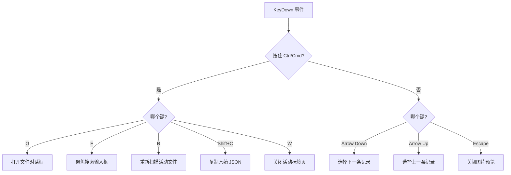
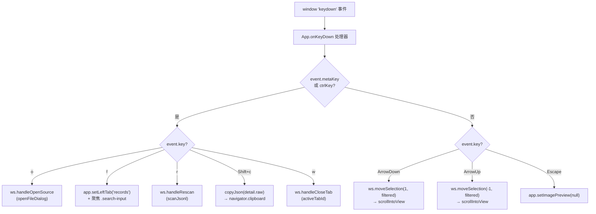
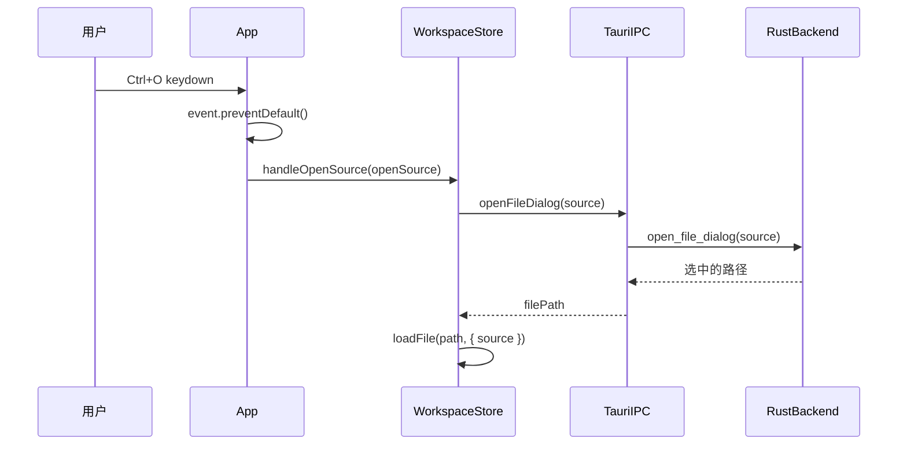
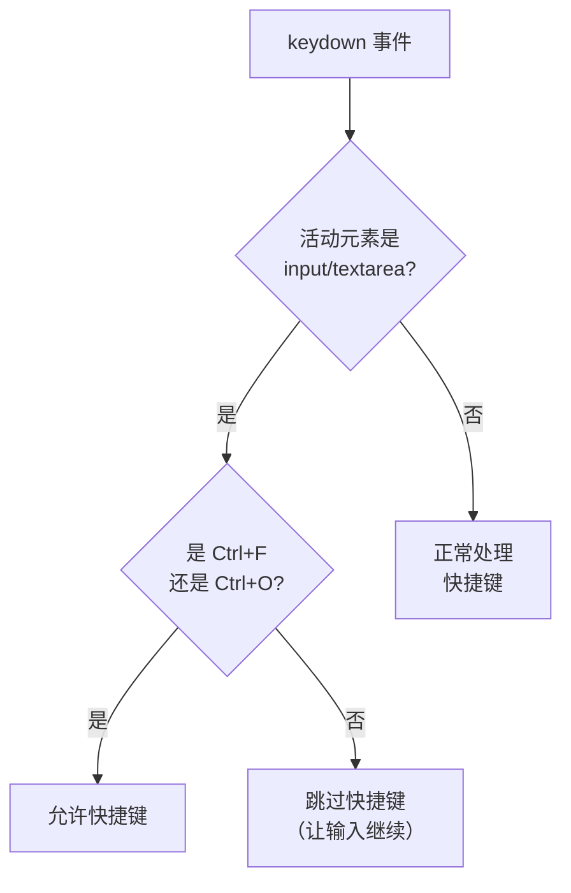
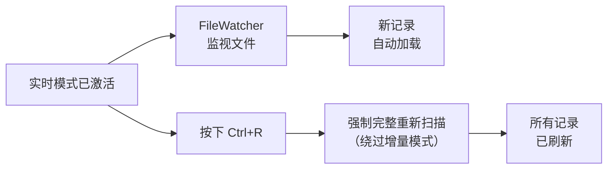
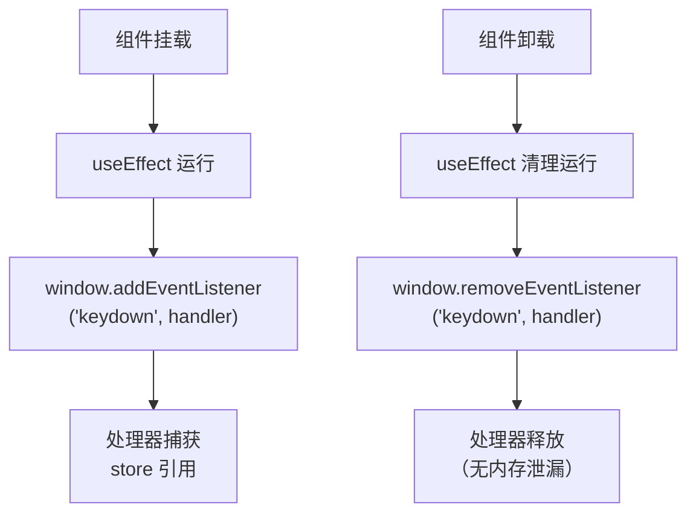

# 键盘快捷键

PromptLens 为常用操作提供了键盘快捷键。在 macOS 上，请使用 `Cmd` 代替 `Ctrl`。

## 文件操作

| 快捷键 | 操作 | 说明 |
|--------|------|------|
| `Ctrl+O` | 打开文件 | 打开原生文件对话框选择 JSONL 文件 |
| `Ctrl+R` | 重新扫描 | 强制对当前活动文件执行完整重新扫描 |
| `Ctrl+W` | 关闭标签页 | 关闭当前活动的工作区或会话标签页 |

## 导航

| 快捷键 | 操作 | 说明 |
|--------|------|------|
| `Arrow Down` | 下一条记录 | 选择列表中的下一条记录 |
| `Arrow Up` | 上一条记录 | 选择列表中的上一条记录 |
| `Escape` | 关闭预览 | 关闭图片预览弹窗 |

## 编辑与剪贴板

| 快捷键 | 操作 | 说明 |
|--------|------|------|
| `Ctrl+Shift+C` | 复制 JSON | 将选中记录的原始 JSON 复制到剪贴板 |
| `Ctrl+F` | 聚焦搜索 | 将焦点定位到"记录"标签页的搜索/过滤输入框 |

## 快捷键参考表

| 快捷键 | Windows/Linux | macOS |
|--------|:------------:|:-----:|
| 打开文件对话框 | `Ctrl+O` | `Cmd+O` |
| 重新扫描文件 | `Ctrl+R` | `Cmd+R` |
| 关闭标签页 | `Ctrl+W` | `Cmd+W` |
| 聚焦搜索 | `Ctrl+F` | `Cmd+F` |
| 复制原始 JSON | `Ctrl+Shift+C` | `Cmd+Shift+C` |
| 下一条记录 | `Arrow Down` | `Arrow Down` |
| 上一条记录 | `Arrow Up` | `Arrow Up` |
| 关闭弹窗 | `Escape` | `Escape` |

## 快捷键工作原理

快捷键通过 `window` 对象上的全局 `keydown` 事件监听器实现。监听器会检测修饰键（`Ctrl` 或 `Cmd`）和键名。



## 上下文相关行为

部分快捷键的行为会根据当前焦点位置的不同而有所变化：

| 上下文 | `Enter` 行为 |
|--------|-------------|
| 搜索输入框 | 使用当前查询和模式执行全文搜索 |
| 记录列表 | 无操作（通过点击选择） |
| 过滤输入框 | 无操作（过滤为实时生效） |

| 上下文 | `Escape` 行为 |
|--------|--------------|
| 图片预览已打开 | 关闭图片预览弹窗 |
| 搜索结果已显示 | 不清除结果（使用 x 按钮清除） |
| 下拉菜单已打开 | 关闭下拉菜单 |

## 菜单导航

标题栏菜单（Open、Export、Setting）可通过鼠标导航。除了 `Ctrl+O` 用于文件对话框外，没有专门打开特定菜单的键盘快捷键。

| 操作 | 方法 |
|------|------|
| 打开菜单 | 点击菜单按钮 |
| 关闭菜单 | 点击菜单外部区域，或再次点击菜单按钮 |
| 选择菜单项 | 点击对应项 |
| 关闭所有菜单 | 点击主工作区区域 |

## 窗口管理

| 操作 | 方法 |
|------|------|
| 最小化 | 点击红绿灯区域的最小化按钮 |
| 最大化/还原 | 点击最大化按钮或双击标题栏 |
| 关闭 | 点击关闭按钮 |
| 拖动窗口 | 在标题栏（非按钮或菜单区域）点击并拖动 |

## 快捷键实现细节

所有快捷键都在主 `App` 组件中的单个 `keydown` 事件监听器中注册。监听器在组件挂载时添加，卸载时移除。

```tsx
// file: src/app/App.tsx
useEffect(() => {
  const onKeyDown = (e: KeyboardEvent) => {
    const mod = e.metaKey || e.ctrlKey;
    if (mod && e.key === "o") {
      e.preventDefault();
      ws.handleOpenSource(app.openSource);
    }
    if (mod && e.key === "f") {
      e.preventDefault();
      app.setLeftTab("records");
      setTimeout(() => {
        (document.querySelector(".search-input") as HTMLInputElement)?.focus();
      }, 50);
    }
    if (mod && e.key === "r") {
      e.preventDefault();
      ws.handleRescan();
    }
    if (mod && e.key === "w") {
      e.preventDefault();
      ws.handleCloseTab(ws.activeTabId ?? "");
    }
    if (mod && e.shiftKey && e.key === "C") {
      e.preventDefault();
      if (detail?.raw) copyJson(detail.raw);
    }
    if (!mod && e.key === "ArrowDown") {
      e.preventDefault();
      ws.moveSelection(1, filtered);
    }
    if (!mod && e.key === "ArrowUp") {
      e.preventDefault();
      ws.moveSelection(-1, filtered);
    }
    if (!mod && e.key === "Escape") {
      app.setImagePreview(null);
    }
  };
  window.addEventListener("keydown", onKeyDown);
  return () => window.removeEventListener("keydown", onKeyDown);
}, [/* deps */]);
```

处理器从 store 中捕获当前的 `openSource`、`detail` 和 `filtered` 值来执行操作。对于所有已处理的快捷键，它都会调用 `event.preventDefault()` 以阻止浏览器的默认行为。



## moveSelection 内部实现

`moveSelection` 函数根据当前选择和过滤列表计算下一个索引，然后自动滚动虚拟列表以保持选中记录可见：

```ts
// file: src/app/store.ts
moveSelection: (delta, filtered) => {
  const tab = get().tabs.find((t) => t.id === get().activeTabId);
  if (!tab) return;
  const sel = tab.sessionTabs.find((st) => st.id === tab.activeSessionTabId);
  const current = sel?.selected;
  const idx = current ? filtered.findIndex((s) => s.lineNumber === current.lineNumber) : -1;
  const next = Math.max(0, Math.min(filtered.length - 1, idx + delta));
  const summary = filtered[next];
  if (summary) get().handleSelect(summary);
},
```

## 键盘驱动的文件打开流程

当按下 `Ctrl+O` / `Cmd+O` 时，执行以下调用链：



## 使用技巧

- 快捷键仅在没有输入框获得焦点时有效（`Ctrl+F` 除外，它会聚焦搜索输入框）。
- `Ctrl+O` 始终打开审计日志的文件对话框。要打开特定来源类型，请使用 Open 菜单。
- `Arrow Up/Down` 导航会自动滚动虚拟列表以保持选中记录可见。
- `Escape` 仅在图片预览弹窗打开时关闭它。不会关闭其他 UI 元素。
- 当打开多个工作区标签页时，`Ctrl+W` 关闭当前活动标签页。
- 比较基线会持续存在，直到您清除它或关闭文件。

## 无障碍功能

PromptLens 在键盘快捷键之外还实现了多项无障碍功能：

| 功能 | 实现方式 |
|------|---------|
| Tab 导航 | 所有交互元素均可通过键盘聚焦 |
| ARIA 角色 | 标签列表使用 `role="tablist"` 和 `role="tab"` |
| ARIA 选中状态 | 活动标签页具有 `aria-selected="true"` |
| ARIA 标签 | 按钮具有 `title` 或 `aria-label` 属性 |
| 状态公告 | 错误横幅使用 `role="alert"` |
| 弹窗语义 | 图片预览使用 `role="dialog"` 和 `aria-modal="true"` |
| 当前记录 | 选中记录具有 `aria-current="true"` |

## Zustand Store 集成

快捷键处理器从两个 Zustand store 中读取状态：

```ts
// file: src/app/store.ts
// UI 偏好设置 store
export const useAppStore = create<AppState>((set, get) => ({
  theme: loadTheme(),
  leftTab: "records",
  // ...
  setImagePreview: (v) => set({ imagePreview: v }),
  setLeftTab: (t) => set({ leftTab: t }),
}));

// 工作区/文件数据 store
export const useWorkspaceStore = create<WorkspaceState>((set, get) => ({
  tabs: [],
  activeTabId: null,
  // ...
  handleOpenSource: async (source) => { /* 打开对话框 + 加载文件 */ },
  handleRescan: async () => { /* 强制完整重新扫描 */ },
  handleCloseTab: (tabId) => { /* 关闭标签页 */ },
  moveSelection: (delta, filtered) => { /* 导航记录列表 */ },
}));
```

注册 keydown 监听器的 `useEffect` hook 依赖于它读取的 store 值，因此当这些值变化时会重新注册，确保始终捕获最新状态。

## 平台差异

| 方面 | Windows/Linux | macOS |
|------|:------------:|:-----:|
| 修饰键 | `Ctrl` | `Cmd` |
| 窗口关闭 | `Ctrl+W` 或 Alt+F4 | `Cmd+W` 或 `Cmd+Q` |
| 红绿灯按钮 | 标准窗口按钮 | macOS 风格彩色圆点 |
| 文件对话框 | 原生操作系统对话框 | 原生 macOS 对话框 |
| 上下文菜单 | 右键点击 | 右键点击或 Ctrl+点击 |

参考表中列出的所有快捷键均使用 `Ctrl` 表示。在 macOS 上，请将 `Ctrl` 替换为 `Cmd`。

## 未来计划的快捷键

当前的快捷键集涵盖了最常见的操作。未来版本可能会添加以下快捷键：

- 在工作区标签页之间切换（例如 `Ctrl+1` 到 `Ctrl+9`）
- 在左侧面板标签页之间切换（例如 `Ctrl+[` / `Ctrl+]`）
- 在右侧面板标签页之间切换
- 切换实时模式（例如 `Ctrl+L`）
- 切换过滤器（例如 `Ctrl+E` 仅显示错误）

## 复制 JSON 实现

当按下 `Ctrl+Shift+C` 时，选中记录的原始 JSON 被复制到剪贴板：

```ts
// src/app/lib/clipboard.ts
export function copyJson(raw: unknown) {
  const text = typeof raw === "string" ? raw : JSON.stringify(raw, null, 2);
  navigator.clipboard.writeText(text).then(
    () => useAppStore.getState().addToast("Copied to clipboard.", "success"),
    () => useAppStore.getState().addToast("Copy failed.", "error"),
  );
}
```

剪贴板函数是异步的，使用 `navigator.clipboard` API。toast 通知确认成功或报告失败。

## 事件传播与输入焦点

keydown 处理器包含一个保护机制，防止在用户输入文本时触发快捷键：



这确保在搜索框、过滤输入框或任何文本字段中输入时不会意外触发 `Ctrl+R`（重新扫描）或 `Ctrl+W`（关闭标签页）等快捷键。

## 快捷键调试

如果快捷键不起作用，请检查以下常见原因：

| 症状 | 原因 | 解决方法 |
|------|------|---------|
| 快捷键被忽略 | 输入框获得了焦点 | 先点击主工作区区域 |
| 触发了错误的操作 | 浏览器快捷键冲突 | PromptLens 对已处理的快捷键调用 `preventDefault()` |
| macOS 上 Cmd 不起作用 | 使用了 Ctrl 而非 Cmd | 在 macOS 上使用 Cmd 作为修饰键 |
| 方向键不导航 | 记录列表未获得焦点 | 先点击一条记录，然后使用方向键 |
| Ctrl+C 没有复制任何内容 | 没有选中记录 | 先选中一条记录 |

## 快捷键与实时模式的交互

当实时模式启用时，文件监视器在后台运行。快捷键在实时模式下继续正常工作。`Ctrl+R` 重新扫描快捷键即使在实时模式激活时也会强制完整重新扫描，这在增量监视器遗漏更改时很有用。



## 键盘快捷键与鼠标操作

某些操作仅可通过鼠标使用，某些仅可通过键盘使用：

| 操作 | 键盘 | 鼠标 |
|------|:----:|:----:|
| 打开文件对话框 | `Ctrl+O` | Open 菜单 |
| 导航记录 | `Arrow Up/Down` | 点击记录 |
| 复制 JSON | `Ctrl+Shift+C` | -- |
| 聚焦搜索 | `Ctrl+F` | 点击搜索输入框 |
| 关闭标签页 | `Ctrl+W` | 点击标签页关闭按钮 |
| 切换主题 | -- | 点击太阳/月亮图标 |
| 打开设置 | -- | 点击 Setting 菜单 |
| 导出 | -- | 点击 Export 菜单 |
| 重新扫描 | `Ctrl+R` | Open 菜单 > Rescan |
| 关闭图片预览 | `Escape` | 点击弹窗外部 |

## 快捷键注册清理

事件监听器在组件卸载时正确清理，以防止内存泄漏：



## 相关页面

- [设置](settings.md) -- 自定义字体、主题和显示选项
- [界面概览](interface-overview.md) -- 布局和组件详情
- [快速开始](quick-start.md) -- 入门教程
- [搜索](search.md) -- 全文搜索和快速过滤
