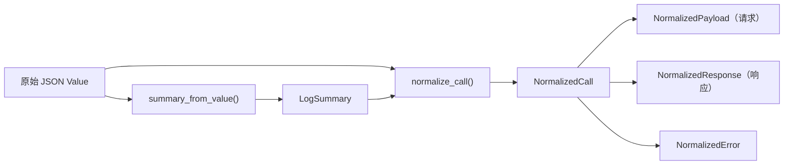
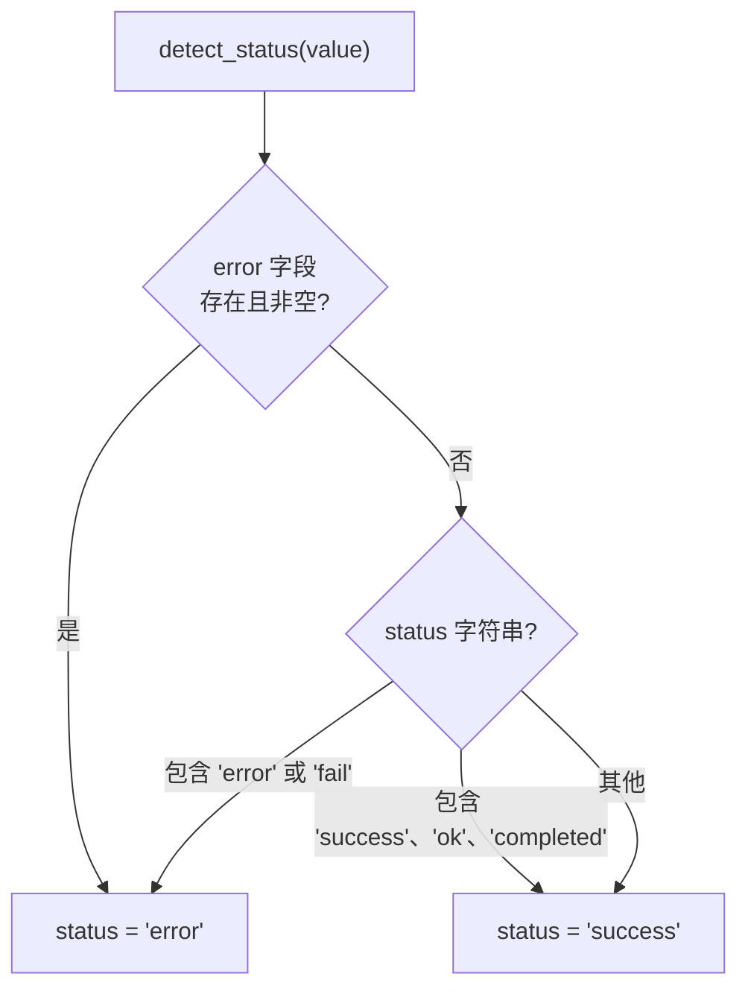
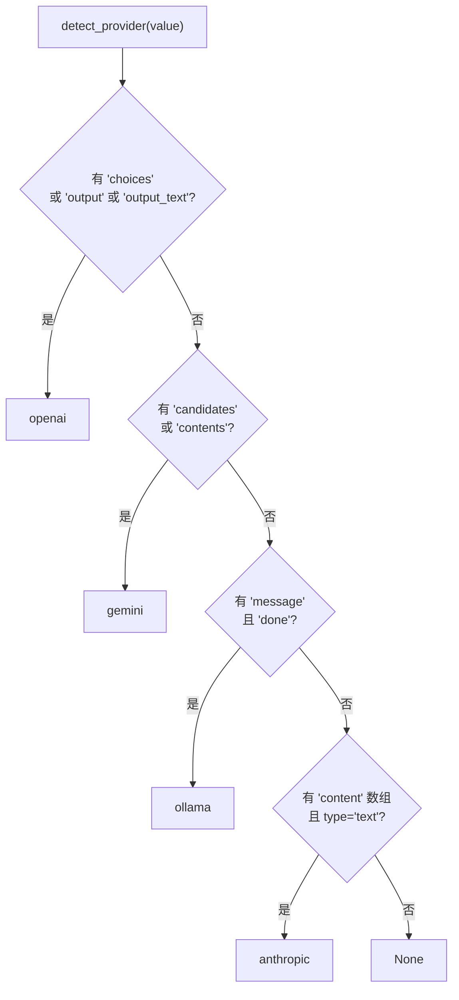
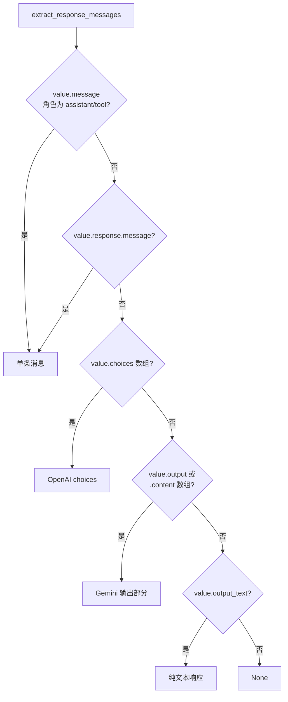

# 规范化管道

规范化管道将来自任何受支持 LLM 提供者的原始 JSONL 记录转换为统一的 `NormalizedCall` 结构。这使前端能够无论来源提供者如何都以相同方式渲染对话。管道通过灵活的键查找和结构启发式处理 OpenAI、Anthropic、Gemini、Ollama 和 Claude Code 格式。

## 管道概览



## 步骤 1：摘要提取

`summary_from_value()` 使用灵活的键查找从原始 JSON 值中提取元数据字段：

```rust
// file: src-tauri/src/normalize.rs:16
pub(crate) fn summary_from_value(
    value: &Value, line_number: usize, byte_offset: u64, parse_error: Option<String>,
) -> LogSummary
```

### 字段提取策略

每个字段通过按优先级顺序尝试多个键名来提取：

| 字段 | 尝试的键 |
|------|----------|
| `id` | `id`，回退到 `line-{line_number}` |
| `timestamp` | `timestamp`、`time`、`created_at`、`createdAt` |
| `provider` | `provider`、`vendor` |
| `model` | `model`、`model_name`、`modelName`，或在 `request` 内部 |
| `trace_id` | `trace_id`、`traceId`、`trace`、`traceID`、`run_id`、`runId` |
| `session_id` | `session_id`、`sessionId`、`conversation_id`、`conversationId`、`thread_id`、`threadId` |
| `latency_ms` | `latency_ms`、`latencyMs`、`duration_ms`、`durationMs` |

多键策略通过 `first_string()` 辅助函数实现：

```rust
// file: src-tauri/src/normalize.rs:578
pub(crate) fn first_string(value: &Value, keys: &[&str]) -> Option<String> {
    keys.iter()
        .find_map(|key| find_first_key(value, &[*key]))
        .and_then(Value::as_str)
        .map(str::to_string)
}
```

`find_first_key()` 函数在嵌套 JSON 对象和数组中递归搜索：

```rust
// file: src-tauri/src/normalize.rs:591
pub(crate) fn find_first_key<'a>(value: &'a Value, keys: &[&str]) -> Option<&'a Value> {
    match value {
        Value::Object(map) => {
            for key in keys {
                if let Some(found) = map.get(*key) { return Some(found); }
            }
            map.values().find_map(|child| find_first_key(child, keys))
        }
        Value::Array(items) => items.iter().find_map(|child| find_first_key(child, keys)),
        _ => None,
    }
}
```

### 状态检测



## 步骤 2：提供者检测

当没有显式 `provider` 字段时，`detect_provider()` 使用基于唯一 JSON 键的结构启发式：



```rust
// file: src-tauri/src/adapters.rs:11
pub(crate) fn detect_provider(value: &Value) -> Option<String> {
    if value.get("choices").is_some() || value.get("output").is_some() || value.get("output_text").is_some() {
        return Some("openai".to_string());
    }
    if value.get("candidates").is_some() || value.get("contents").is_some() {
        return Some("gemini".to_string());
    }
    if value.get("message").is_some() && value.get("done").is_some() {
        return Some("ollama".to_string());
    }
    if value.get("content").and_then(Value::as_array).is_some_and(|items| {
        items.iter().any(|item| item.get("type").and_then(Value::as_str) == Some("text"))
    }) {
        return Some("anthropic".to_string());
    }
    None
}
```

## 步骤 3：调用规范化

`normalize_call()` 通过提取请求和响应载荷来构建完整的 `NormalizedCall`。

### 响应提取

响应消息通过多步回退链提取：



## 内容部分规范化

每条消息包含一个 `Vec<NormalizedContent>`，带有类型化的内容部分：

### NormalizedContent 枚举

```rust
// file: src-tauri/src/types.rs:247
#[serde(tag = "type", rename_all = "snake_case")]
pub(crate) enum NormalizedContent {
    Text { text: String },
    Image { mime: Option<String>, data_url: Option<String>, base64: Option<String> },
    ToolCall { name: Option<String>, arguments: Option<Value> },
    ToolResult { name: Option<String>, result: Option<Value> },
    Unknown { raw: Value },
}
```

### 图片检测

图片通过两种机制检测：

```rust
// file: src-tauri/src/parser/image_detector.rs:3
pub(crate) fn normalize_image_string(value: &str) -> Option<(Option<String>, Option<String>, Option<String>)> {
    // 1. Data URL：data:image/png;base64,...
    if value.starts_with("data:image/") && value.contains(";base64,") { /* ... */ }
    // 2. 原始 base64：128 字节到 8MB，有效 base64，解码为图片 MIME
    if value.len() < 128 || value.len() > 8 * 1024 * 1024 { return None; }
    // ...
}
```

## 提供者特定规范化

| 提供者 | 请求来源 | 响应来源 | 图片格式 |
|--------|----------|----------|----------|
| OpenAI | `request.messages[]` 或 `messages[]` | `choices[].message` | `image_url.url` 带 data URL |
| Anthropic | `request.messages[]` 带内容数组 | `response.content[]` | `source.data` 带 `media_type` |
| Gemini | `contents[]` 带 `parts[]` | `candidates[].content` | `inline_data` 带 `mime_type` |
| Ollama | `messages[]` | `message` 对象 | 不适用 |
| Claude Code | 扁平消息，按角色拆分 | 扁平消息，按角色拆分 | 同 Anthropic |

## 角色规范化

```rust
// file: src-tauri/src/adapters.rs:3
pub(crate) fn normalize_role(role: &str) -> String {
    match role {
        "system" | "developer" | "user" | "assistant" | "tool" | "function" => role.to_string(),
        "model" => "assistant".to_string(),
        _ => "unknown".to_string(),
    }
}
```

| 输入 | 输出 |
|------|------|
| `system`、`developer`、`user`、`assistant`、`tool`、`function` | 相同值 |
| `model` | `assistant` |
| 其他 | `unknown` |
