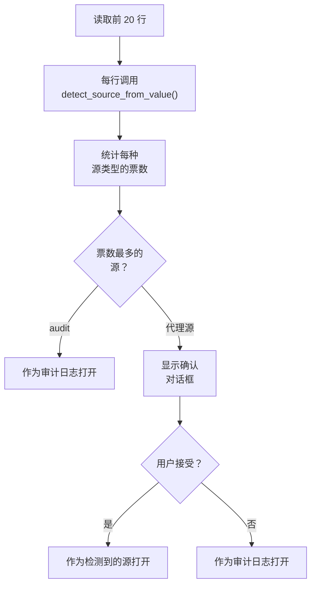
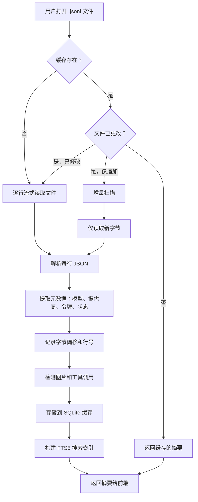

# 打开文件

PromptLens 支持通过多种方式打开 JSONL 文件，并能自动检测日志源格式。文件打开流程包括原生对话框、源类型选择、自动检测和带缓存的扫描。

## 打开文件的方法

### 1. 键盘快捷键

按 `Ctrl+O`（macOS 上为 `Cmd+O`）打开原生文件对话框。默认以审计日志方式打开文件。键盘快捷键在 `App` 组件的全局 keydown 处理器中注册：

```tsx
// file: src/app/App.tsx:192
if (mod && event.key.toLowerCase() === "o") {
  event.preventDefault();
  void ws().handleOpenSource(openSource);
}
```

前端调用 `openFileDialog` Tauri 命令，打开一个过滤 `.jsonl`、`.ndjson` 和 `.log` 文件的原生文件选择器：

```rust
// file: src-tauri/src/commands.rs:30
fn open_file_dialog() -> Option<String> {
    rfd::FileDialog::new()
        .add_filter("JSONL", &["jsonl", "ndjson", "log"])
        .pick_file()
        .map(|path| path.to_string_lossy().to_string())
}
```

### 2. 登录屏幕按钮

没有文件打开时，点击登录屏幕上的"Open JSONL File"按钮。

### 3. 打开菜单

点击标题栏中的"Open"查看包含所有源类型的下拉菜单：

```
+-----------------------------+
| Open                        |
+-----------------------------+
| [folder] Audit JSONL Log    |  Ctrl+O
| [folder] Codex Session      |
| [folder] Claude Code Session|
| [folder] OpenCode Session   |
| [folder] OpenClaw Session   |
| [folder] Agent JSONL Session|
|-----------------------------|
| [rotate] Rescan active file |  Ctrl+R
| [db]     Clear scan cache   |
|-----------------------------|
| Recent                      |
| [file]   my-audit-log.jsonl |
| [file]   claude-session.jsonl|
+-----------------------------+
```

选择源类型以打开预过滤 `.jsonl` 文件的文件对话框。

### 4. 最近文件

打开菜单显示最近打开的最多 8 个文件。最近文件存储在 localStorage 中并按路径去重：

```tsx
// file: src/lib/recentFiles.ts:12
export function rememberRecentFile(path: string) {
  const next = [path, ...loadRecentFiles().filter((item) => item !== path)].slice(0, 8);
  localStorage.setItem(RECENT_KEY, JSON.stringify(next));
  return next;
}
```

工作区 store 在应用启动时跨会话持久化和恢复最近文件。

### 5. 源选择菜单

每种源类型映射到特定的日志适配器。`LogSource` 类型决定哪个解析管道处理文件：

```tsx
// file: src/app/types.ts:123
export const LOG_SOURCE_OPTIONS: Array<{ value: LogSource; label: string }> = [
  { value: "audit", label: "Audit Log" },
  { value: "codex", label: "Codex" },
  { value: "opencode", label: "OpenCode" },
  { value: "openclaw", label: "OpenClaw" },
  { value: "claude_code", label: "Claude Code" },
  { value: "generic_agent", label: "Agent JSONL" },
];
```

## 源类型

PromptLens 支持六种源类型。每种源类型使用不同的适配器来解析和规范化日志事件。

| 源类型 | 适配器 | 描述 |
|--------|--------|------|
| **Audit JSONL Log** | 标准 LLM 适配器 | 带请求/响应对的普通 LLM API 审计日志 |
| **Codex Session** | Codex 适配器 | 带工具调用、补丁、检查点的 OpenAI Codex CLI 会话日志 |
| **Claude Code Session** | Claude Code 适配器 | 带 tool_use、Task/Agent 子代理的 Anthropic Claude Code 日志 |
| **OpenCode Session** | OpenCode 适配器 | 带工具和快照事件的 OpenCode 会话日志 |
| **OpenClaw Session** | OpenClaw 适配器 | 带 action、patch 和 shell 事件的 OpenClaw 会话日志 |
| **Agent JSONL Session** | 通用代理适配器 | 带自动分类事件类型的灵活代理 JSONL |

## 自动检测

通过 Audit JSONL Log 选项打开文件时，PromptLens 运行**自动检测**来识别源格式。检测读取前 20 行并使用投票系统：

```rust
// file: src-tauri/src/commands.rs:457
fn detect_log_source(file_path: String) -> Option<String> {
    let mut votes: HashMap<String, usize> = HashMap::new();
    for _ in 0..20 {
        // ... 读取每一行
        if let Ok(value) = serde_json::from_str::<Value>(trimmed) {
            if let Some(source) = detect_source_from_value(&value) {
                *votes.entry(source.as_str().to_string()).or_insert(0) += 1;
            }
        }
    }
    votes.into_iter().max_by_key(|(_, count)| *count).map(|(source, _)| source)
}
```

`detect_source_from_value()` 函数检查 JSON 结构来识别提供商。投票方法确保即使在混合或嘈杂的日志文件中也能进行稳健检测。

如果文件看起来像代理会话日志而不是标准审计日志，PromptLens 会显示确认对话框：



## 审计日志的提供商检测

对于标准审计日志，适配器模块中的 `detect_provider()` 函数使用启发式 JSON 结构匹配：

```rust
// file: src-tauri/src/adapters.rs:11
pub(crate) fn detect_provider(value: &Value) -> Option<String> {
    if value.get("choices").is_some()
        || value.get("output").is_some()
        || value.get("output_text").is_some()
    {
        return Some("openai".to_string());
    }
    if value.get("candidates").is_some() || value.get("contents").is_some() {
        return Some("gemini".to_string());
    }
    if value.get("message").is_some() && value.get("done").is_some() {
        return Some("ollama".to_string());
    }
    if value.get("content").and_then(Value::as_array).is_some_and(|items| {
        items.iter().any(|item| item.get("type").and_then(Value::as_str) == Some("text"))
    }) {
        return Some("anthropic".to_string());
    }
    None
}
```

| 提供商 | 检测信号 |
|--------|----------|
| OpenAI | 存在 `choices`、`output` 或 `output_text` 字段 |
| Gemini | 存在 `candidates` 或 `contents` 字段 |
| Ollama | 存在 `message` + `done` 字段 |
| Anthropic | 存在 `content` 数组且项具有 `type: "text"` |

## 扫描工作原理

打开文件时，PromptLens 执行以下步骤：



核心扫描循环使用 256KB 缓冲读取器逐行读取文件，将每行 JSON 解析为 `LogSummary`：

```rust
// file: src-tauri/src/scanner.rs:15
pub(crate) fn scan_jsonl_inner(
    file_path: String,
    app: Option<&AppHandle>,
    cancel_flag: Option<&AtomicBool>,
) -> Result<FileScanResult, String> {
    let mut reader = BufReader::with_capacity(256 * 1024, file);
    // ... 逐行读取循环
    // 每 250 行发出 scan-progress 事件
    // 每 500 行发出 scan-chunk 事件以实现增量 UI 更新
    // 完成后写入 SQLite 缓存
}
```

进度通过 Tauri 事件报告给前端。前端在 `App` 组件中监听这些事件：

```tsx
// file: src/app/App.tsx:156
const unlistenScan = listen<ProgressEvent>("scan-progress", (event) =>
  ws().setScanProgress(event.payload)
);
```

### 缓存行为

PromptLens 将扫描结果缓存在本地 SQLite 数据库中，键为：

- 文件路径
- 文件大小
- 修改时间戳

```rust
// file: src-tauri/src/cache.rs:71
fn read_scan_cache(
    file_path: &str,
    file_size: u64,
    modified: Option<&str>,
) -> Result<Option<FileScanResult>, String> {
    // SELECT payload FROM scan_cache
    // WHERE file_path = ?1 AND file_size = ?2
    //   AND COALESCE(modified, '') = COALESCE(?3, '')
}
```

缓存数据库存储在平台的本地数据目录：

```rust
// file: src-tauri/src/cache.rs:6
pub(crate) fn cache_db_path() -> Result<std::path::PathBuf, String> {
    if let Ok(path) = std::env::var("PROMPTLENS_CACHE_PATH") {
        return Ok(std::path::PathBuf::from(path));
    }
    let base = dirs::data_local_dir()
        .or_else(dirs::data_dir)
        .ok_or_else(|| "Failed to resolve app data directory".to_string())?
        .join("PromptLens");
    fs::create_dir_all(&base)?;
    Ok(base.join("scan-cache.sqlite"))
}
```

如果重新打开未更改的同一文件，缓存立即命中。如果文件增长（仅追加），PromptLens 运行增量扫描仅处理新字节。

### 进度跟踪

扫描期间，状态栏显示进度条，包含：

- 已处理字节 vs 总字节
- 当前行号
- 取消按钮

大文件（数百 MB）可能需要几秒钟。进度通过 `scan-progress` Tauri 事件报告：

```rust
// file: src-tauri/src/types.rs:106
pub(crate) struct ProgressEvent {
    pub(crate) processed_bytes: u64,
    pub(crate) total_bytes: u64,
    pub(crate) line_number: usize,
}
```

用户可以通过 `cancel_scan` 命令取消正在进行的扫描，该命令设置一个在每行检查的 `AtomicBool` 标志：

```rust
// file: src-tauri/src/scanner.rs:49
if cancel_flag.is_some_and(|flag| flag.load(Ordering::Relaxed)) {
    cancelled = true;
    break;
}
```

## 重新扫描

强制重新扫描活动文件：

- 点击菜单中的 **Open > Rescan active file**。
- 按 `Ctrl+R`。

这会清除当前文件的缓存并从头重新扫描。键盘快捷键在 `App.tsx` 中处理：

```tsx
// file: src/app/App.tsx:202
if (mod && event.key.toLowerCase() === "r") {
  event.preventDefault();
  void ws().handleRescan();
}
```

## 清除缓存

清除所有缓存的扫描结果：

- 点击菜单中的 **Open > Clear scan cache**。

这会删除整个 SQLite 缓存数据库文件。下次打开任何文件时都会重新扫描：

```rust
// file: src-tauri/src/commands.rs:55
fn clear_scan_cache() -> Result<(), String> {
    let path = cache_db_path()?;
    if path.exists() {
        fs::remove_file(path).map_err(|err| format!("Failed to clear cache: {err}"))?;
    }
    Ok(())
}
```

## 增量扫描和实时模式

启用实时模式时，PromptLens 监视活动文件的更改。如果有新数据追加到文件：

1. 文件监视器检测到大小变化（参见[文件监视器](./file-watcher.md)）。
2. PromptLens 从最后已知的字节偏移运行增量扫描。
3. 新记录以"New"徽标出现在列表中。

增量扫描器定位到最后已知偏移并仅读取新行：

```rust
// file: src-tauri/src/scanner.rs:163
fn scan_jsonl_incremental(
    file_path: String,
    from_offset: u64,
    from_line_number: usize,
) -> Result<IncrementalScanResult, String> {
    let metadata = fs::metadata(&file_path)?;
    if metadata.len() < from_offset {
        return Err("File appears to have been truncated. Run a full rescan.".to_string());
    }
    let file = File::open(&file_path)?;
    let mut reader = BufReader::new(file);
    reader.seek(SeekFrom::Start(from_offset))?;
    // ... 仅从 from_offset 读取新行
}
```

前端在 `file-changed` 事件触发时启动增量扫描：

```typescript
// file: src/tauri.ts:25
export async function scanJsonlIncremental(
  filePath: string,
  fromOffset: number,
  fromLineNumber: number,
): Promise<IncrementalScanResult> {
  return invoke("scan_jsonl_incremental", { filePath, fromOffset, fromLineNumber });
}
```

## 文件操作的 Tauri 命令

| 命令 | 调用时机 | 用途 |
|------|----------|------|
| `open_file_dialog` | 用户点击打开 | 打开原生文件对话框，返回选中路径 |
| `detect_log_source` | 文件选中后 | 从前 20 行自动检测源格式 |
| `scan_jsonl` | 初始文件打开 | 完整扫描文件，返回摘要 |
| `scan_jsonl_incremental` | 实时模式或重新扫描 | 从给定偏移仅扫描新字节 |
| `cancel_scan` | 用户点击取消 | 通过 AtomicBool 标志停止正在进行的扫描 |
| `clear_scan_cache` | 用户清除缓存 | 删除 SQLite 缓存数据库文件 |
| `get_cache_info` | 应用启动 | 返回缓存数据库路径和存在状态 |
| `get_file_status` | 定期轮询 | 检查文件是否仍然存在及其大小/修改时间 |
| `start_file_watch` | 启用实时模式 | 为文件启动文件系统监视器 |
| `stop_file_watch` | 禁用实时模式 | 停止文件系统监视器 |

所有 20 个 Tauri 命令在 `run()` 函数中注册：

```rust
// file: src-tauri/src/commands.rs:592
pub fn run() {
    tauri::Builder::default()
        .manage(AppState::default())
        .invoke_handler(tauri::generate_handler![
            open_file_dialog, scan_jsonl, scan_jsonl_incremental,
            cancel_scan, clear_scan_cache, get_cache_info, get_file_status,
            save_text_file, export_records, read_record,
            read_agent_session, read_agent_session_incremental,
            detect_log_source, search_jsonl, cancel_search,
            list_system_fonts, get_pricing_table, calculate_costs,
            start_file_watch, stop_file_watch, compute_analytics
        ])
        .run(tauri::generate_context!())
        .expect("error while running PromptLens");
}
```

## 多文件工作流

PromptLens 支持通过工作区标签同时打开多个文件：

1. 打开文件 -- 获得新的工作区标签。
2. 打开另一个文件 -- 添加另一个标签。
3. 点击标签切换。
4. 每个标签维护自己的过滤器、排序顺序、选择和搜索状态。
5. 用 `Ctrl+W` 或关闭按钮关闭标签。

工作区状态（哪些标签打开、哪个活动）持久化到 `localStorage` 并在应用启动时通过 `useWorkspaceStore` Zustand store 恢复。标签结构使用 `WorkspaceTab` 和 `SessionTab` 类型：

```tsx
// file: src/app/types.ts:15
export type LeftTab =
  | "records" | "timeline" | "subagents" | "agentFiles"
  | "trace" | "sessions" | "analytics" | "issues";
```

每个标签独立跟踪其 `leftTab`、`providerFilter`、`modelFilter`、`statusFilter`、`issueOnly`、`traceFilter`、`selected`、`compareBase` 和搜索状态。
