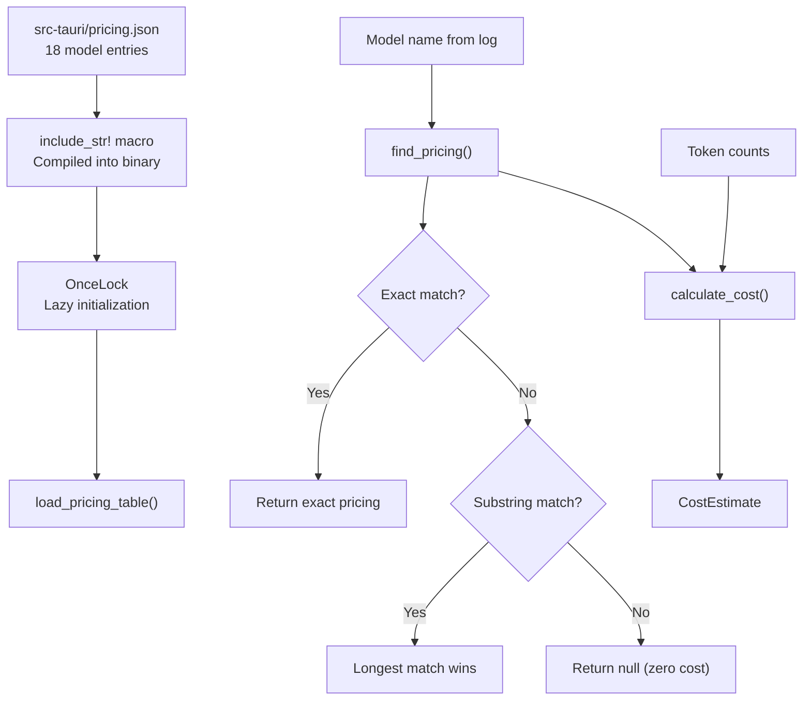
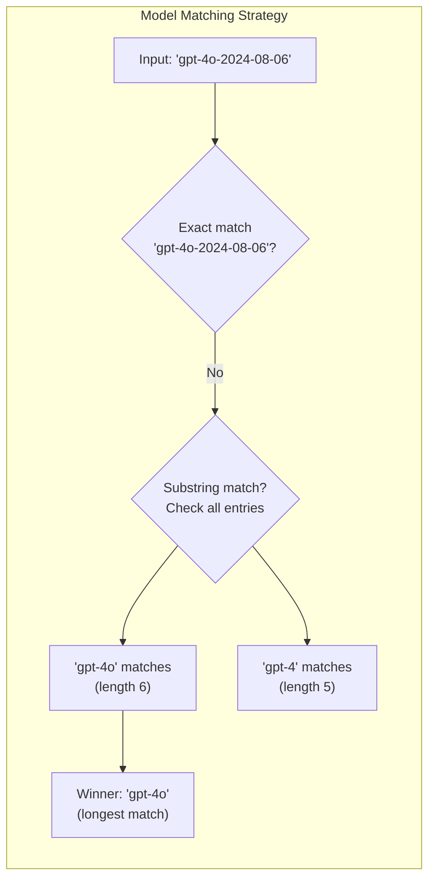
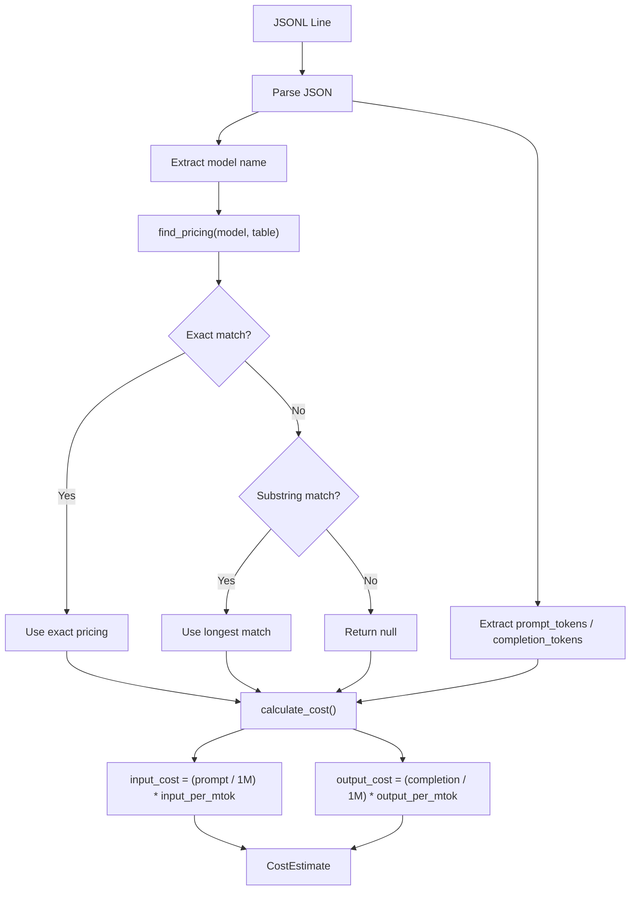

# 定价表

PromptLens 包含一个内置的定价表用于估算 LLM API 成本。该表存储在 `src-tauri/pricing.json` 中，运行时通过 `include_str!` 加载。

## 定价架构





## 成本公式

```
input_cost  = (prompt_tokens / 1,000,000) * input_per_mtok
output_cost = (completion_tokens / 1,000,000) * output_per_mtok
total_cost  = input_cost + output_cost
```

其中 `input_per_mtok` 和 `output_per_mtok` 是每百万 token 的美元成本。

```rust
// file: src-tauri/src/pricing.rs:49-72
pub fn calculate_cost(
    model: &str,
    prompt_tokens: Option<u64>,
    completion_tokens: Option<u64>,
    table: &[ModelPricing],
) -> CostEstimate {
    let pricing = find_pricing(model, table);
    let input_tokens = prompt_tokens.unwrap_or(0) as f64;
    let output_tokens = completion_tokens.unwrap_or(0) as f64;
    let (input_cost, output_cost) = match pricing {
        Some(p) => (
            (input_tokens / 1_000_000.0) * p.input_per_mtok,
            (output_tokens / 1_000_000.0) * p.output_per_mtok,
        ),
        None => (0.0, 0.0),
    };
    CostEstimate {
        model: model.to_string(),
        input_cost,
        output_cost,
        total_cost: input_cost + output_cost,
        matched_pricing: pricing.map(|p| p.model.clone()),
    }
}
```

## 模型匹配

定价引擎使用两种策略匹配模型：

1. **精确匹配：** 不区分大小写的完整模型名称比较
2. **子串匹配：** 如果没有精确匹配，表中最长的匹配条目获胜（例如 `"gpt-4o-2024-08-06"` 匹配 `"gpt-4o"`）

```rust
// file: src-tauri/src/pricing.rs:29-47
pub fn find_pricing<'a>(model: &str, table: &'a [ModelPricing]) -> Option<&'a ModelPricing> {
    let lower = model.to_lowercase();
    // 精确匹配
    if let Some(p) = table.iter().find(|p| p.model.to_lowercase() == lower) {
        return Some(p);
    }
    // 子串匹配（最长匹配模型名称获胜）
    let mut best: Option<(&ModelPricing, usize)> = None;
    for p in table {
        let p_lower = p.model.to_lowercase();
        if lower.contains(&p_lower) {
            let len = p_lower.len();
            if best.is_none_or(|(_, blen)| len > blen) {
                best = Some((p, len));
            }
        }
    }
    best.map(|(p, _)| p)
}
```

如果没有找到匹配，成本返回为零，`matched_pricing: null`。

## 完整定价表

### OpenAI

| 模型 | 输入（$/MTok） | 输出（$/MTok） | 备注 |
|-------|---------------|-----------------|-------|
| `gpt-4o` | $2.50 | $10.00 | GPT-4o |
| `gpt-4o-mini` | $0.15 | $0.60 | GPT-4o Mini |
| `gpt-4-turbo` | $10.00 | $30.00 | GPT-4 Turbo |
| `gpt-4` | $30.00 | $60.00 | GPT-4 |
| `gpt-3.5-turbo` | $0.50 | $1.50 | GPT-3.5 Turbo |
| `o1` | $15.00 | $60.00 | o1 推理模型 |
| `o1-mini` | $3.00 | $12.00 | o1 Mini |
| `o3-mini` | $1.10 | $4.40 | o3 Mini |

### Anthropic

| 模型 | 输入（$/MTok） | 输出（$/MTok） | 备注 |
|-------|---------------|-----------------|-------|
| `claude-opus-4` | $15.00 | $75.00 | Claude Opus 4 |
| `claude-sonnet-4` | $3.00 | $15.00 | Claude Sonnet 4 |
| `claude-3.5-sonnet` | $3.00 | $15.00 | Claude 3.5 Sonnet |
| `claude-3.5-haiku` | $0.80 | $4.00 | Claude 3.5 Haiku |
| `claude-3-opus` | $15.00 | $75.00 | Claude 3 Opus |
| `claude-3-sonnet` | $3.00 | $15.00 | Claude 3 Sonnet |
| `claude-3-haiku` | $0.25 | $1.25 | Claude 3 Haiku |

### Google

| 模型 | 输入（$/MTok） | 输出（$/MTok） | 备注 |
|-------|---------------|-----------------|-------|
| `gemini-2.0-flash` | $0.10 | $0.40 | Gemini 2.0 Flash |
| `gemini-1.5-pro` | $1.25 | $5.00 | Gemini 1.5 Pro |
| `gemini-1.5-flash` | $0.075 | $0.30 | Gemini 1.5 Flash |

### 原始 JSON 源

```json
// file: src-tauri/pricing.json（节选）
[
  {
    "model": "gpt-4o",
    "provider": "openai",
    "input_per_mtok": 2.50,
    "output_per_mtok": 10.00
  },
  {
    "model": "claude-sonnet-4",
    "provider": "anthropic",
    "input_per_mtok": 3.00,
    "output_per_mtok": 15.00
  },
  {
    "model": "gemini-2.0-flash",
    "provider": "google",
    "input_per_mtok": 0.10,
    "output_per_mtok": 0.40
  }
]
```

## 按提供商汇总

| 提供商 | 模型数 | 最便宜输入 | 最贵输入 | 最便宜输出 | 最贵输出 |
|----------|--------|---------------|---------------------|----------------|----------------------|
| OpenAI | 8 | $0.15 (gpt-4o-mini) | $30.00 (gpt-4) | $0.60 (gpt-4o-mini) | $60.00 (gpt-4, o1) |
| Anthropic | 7 | $0.25 (claude-3-haiku) | $15.00 (opus) | $1.25 (claude-3-haiku) | $75.00 (opus) |
| Google | 3 | $0.075 (gemini-1.5-flash) | $1.25 (gemini-1.5-pro) | $0.30 (gemini-1.5-flash) | $5.00 (gemini-1.5-pro) |

## 成本示例

### 100 万输入 + 100 万输出 token

| 模型 | 输入成本 | 输出成本 | 总计 |
|-------|-----------|-------------|-------|
| gpt-4o | $2.50 | $10.00 | **$12.50** |
| gpt-4o-mini | $0.15 | $0.60 | **$0.75** |
| claude-opus-4 | $15.00 | $75.00 | **$90.00** |
| claude-3.5-haiku | $0.80 | $4.00 | **$4.80** |
| gemini-2.0-flash | $0.10 | $0.40 | **$0.50** |
| gemini-1.5-flash | $0.075 | $0.30 | **$0.375** |

### 典型聊天轮次（2K 输入 + 500 输出 token）

| 模型 | 总成本 |
|-------|-----------|
| gpt-4o | $0.010 |
| gpt-4o-mini | $0.0006 |
| claude-sonnet-4 | $0.0135 |
| claude-3.5-haiku | $0.0036 |
| gemini-2.0-flash | $0.0004 |

### 高强度使用会话（100K 输入 + 50K 输出 token）

| 模型 | 总成本 |
|-------|-----------|
| gpt-4o | $0.75 |
| gpt-4o-mini | $0.045 |
| claude-opus-4 | $5.25 |
| claude-3.5-haiku | $0.28 |
| gemini-2.0-flash | $0.03 |

## API

### 获取完整定价表

```typescript
// file: src/tauri.ts:99-101
export async function getPricingTable(): Promise<ModelPricing[]> {
  return invoke("get_pricing_table");
}
```

```typescript
import { getPricingTable } from "./tauri";

const table = await getPricingTable();
// table: ModelPricing[]
// 每个条目：{ model, provider, input_per_mtok, output_per_mtok }
```

### 计算成本

```typescript
// file: src/tauri.ts:103-107
export async function calculateCosts(
  requests: Array<{ model: string; prompt_tokens?: number; completion_tokens?: number }>,
): Promise<CostEstimate[]> {
  return invoke("calculate_costs", { requests });
}
```

```typescript
import { calculateCosts } from "./tauri";

const estimates = await calculateCosts([
  { model: "gpt-4o", prompt_tokens: 50000, completion_tokens: 10000 },
  { model: "claude-sonnet-4", prompt_tokens: 20000, completion_tokens: 5000 },
]);
// estimates: CostEstimate[]
// 每个：{ model, input_cost, output_cost, total_cost, matched_pricing }
```

## Rust API

```rust
// file: src-tauri/src/pricing.rs:21-27
const PRICING_JSON: &str = include_str!("../pricing.json");

static PRICING_TABLE: OnceLock<Vec<ModelPricing>> = OnceLock::new();

pub fn load_pricing_table() -> &'static [ModelPricing] {
    PRICING_TABLE.get_or_init(|| serde_json::from_str(PRICING_JSON).unwrap_or_default())
}
```

```rust
use crate::pricing::{load_pricing_table, find_pricing, calculate_cost};

let table = load_pricing_table();
let pricing = find_pricing("gpt-4o", table);
let cost = calculate_cost("gpt-4o", Some(1_000_000), Some(1_000_000), table);
assert!((cost.total_cost - 12.50).abs() < 0.01);
```

## 添加自定义模型

要添加新模型，编辑 `src-tauri/pricing.json`：

```json
{
  "model": "new-model-name",
  "provider": "provider-name",
  "input_per_mtok": 1.00,
  "output_per_mtok": 3.00
}
```

定价表通过 `include_str!` 编译到二进制文件中，编辑后需要重新构建。

## Ollama / 本地模型

Ollama 和其他本地模型不在定价表中。由于它们在本地运行，API 成本为零。这些模型的成本计算将返回 `total_cost: 0` 和 `matched_pricing: null`。

## 提供商检测

PromptLens 从每行日志的 JSON 结构自动检测提供商：

```rust
// file: src-tauri/src/adapters.rs:11-36
pub(crate) fn detect_provider(value: &Value) -> Option<String> {
    if value.get("choices").is_some()
        || value.get("output").is_some()
        || value.get("output_text").is_some()
    {
        return Some("openai".to_string());
    }
    if value.get("candidates").is_some() || value.get("contents").is_some() {
        return Some("gemini".to_string());
    }
    if value.get("message").is_some() && value.get("done").is_some() {
        return Some("ollama".to_string());
    }
    if value.get("content").and_then(Value::as_array).is_some_and(|items| {
        items.iter().any(|item| item.get("type").and_then(Value::as_str) == Some("text"))
    }) {
        return Some("anthropic".to_string());
    }
    None
}
```

| JSON 签名 | 检测到的提供商 |
|---------------|-------------------|
| 有 `choices` 或 `output` 或 `output_text` | `openai` |
| 有 `candidates` 或 `contents` | `gemini` |
| 有 `message` 和 `done` | `ollama` |
| 有 `content` 数组且含 `type: "text"` 项 | `anthropic` |

检测到的提供商存储在 `LogSummary.provider` 中，用于定价查找。

## 成本计算流程



## 定价数据来源

定价数据基于各提供商网站上公开可用的 API 定价。价格以美元计，反映标准（非缓存、非批处理）费率。实际成本可能因以下因素而异：

| 因素 | 影响 |
|--------|--------|
| 提示缓存 | 某些提供商为缓存提示提供折扣费率 |
| 批处理 API | 批量请求的每 token 成本更低 |
| 批量折扣 | 企业协议可能降低每 token 成本 |
| 免费层级 | 某些提供商提供免费 token 配额 |
| 价格变化 | 提供商定价变化仅在 PromptLens 更新后反映 |

## 更新定价

当提供商更改费率时更新定价：

1. 用新值编辑 `src-tauri/pricing.json`
2. 运行 `cargo test` 验证定价表正确加载
3. 升级版本并创建发布，以便用户获得更新的价格

定价表编译到二进制文件中，因此用户必须更新 PromptLens 才能获得新价格。

## 测试

```rust
// file: src-tauri/src/pricing.rs:74-116
#[cfg(test)]
mod tests {
    use super::*;

    #[test]
    fn loads_pricing_table() {
        let table = load_pricing_table();
        assert!(table.len() >= 15);
        assert!(table.iter().any(|p| p.model == "gpt-4o"));
    }

    #[test]
    fn exact_model_match() {
        let table = load_pricing_table();
        let p = find_pricing("gpt-4o", &table).unwrap();
        assert_eq!(p.model, "gpt-4o");
    }

    #[test]
    fn fuzzy_model_match() {
        let table = load_pricing_table();
        let p = find_pricing("gpt-4o-2024-08-06", &table).unwrap();
        assert_eq!(p.model, "gpt-4o");
    }

    #[test]
    fn unknown_model_returns_zero() {
        let table = load_pricing_table();
        let cost = calculate_cost("unknown-model-xyz", Some(1000), Some(500), &table);
        assert_eq!(cost.total_cost, 0.0);
        assert!(cost.matched_pricing.is_none());
    }

    #[test]
    fn cost_calculation() {
        let table = load_pricing_table();
        let cost = calculate_cost("gpt-4o", Some(1_000_000), Some(1_000_000), &table);
        assert!((cost.input_cost - 2.50).abs() < 0.01);
        assert!((cost.output_cost - 10.00).abs() < 0.01);
        assert!((cost.total_cost - 12.50).abs() < 0.01);
    }
}
```
