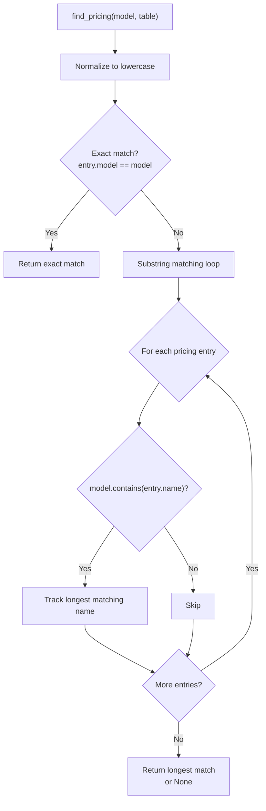
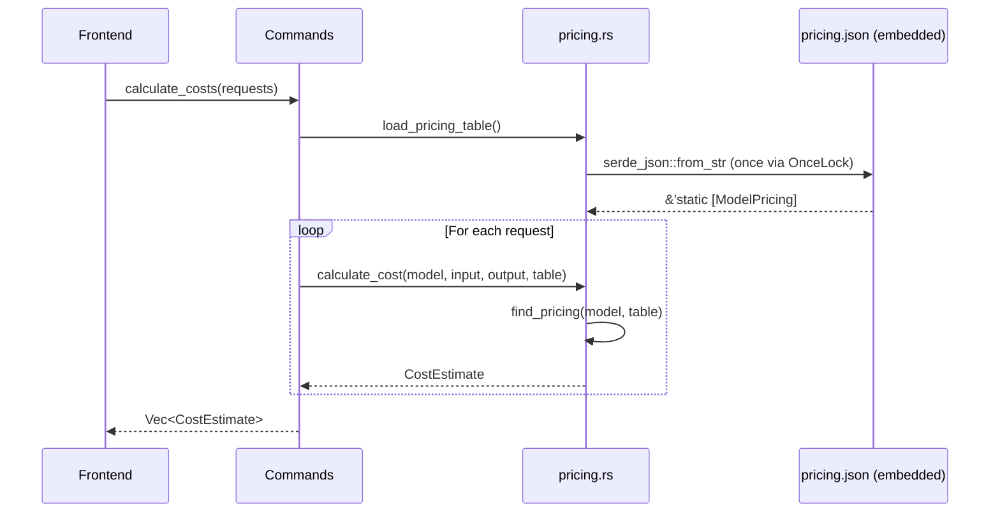
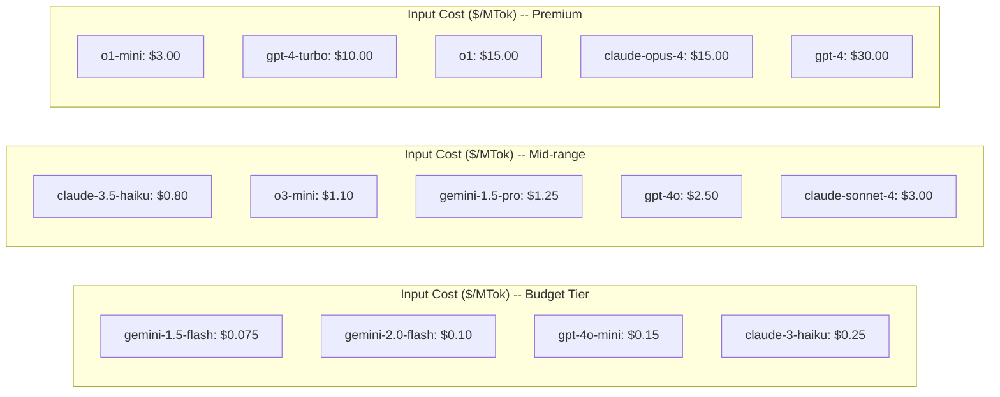

# 定价模块

定价模块根据 token 使用量计算 LLM API 调用的估算成本。它包含一个内置的定价表，涵盖 4 个提供商的 18 个模型，支持模糊模型名称匹配以处理带版本的模型字符串。该模块在 `pricing.rs` 中实现。

## 定价表

定价数据在编译时从 `src-tauri/pricing.json` 嵌入：

```rust
// file: src-tauri/src/pricing.rs:21
const PRICING_JSON: &str = include_str!("../pricing.json");
static PRICING_TABLE: OnceLock<Vec<ModelPricing>> = OnceLock::new();
```

`OnceLock` 确保 JSON 只被解析一次并在所有后续调用间共享。这是一个线程安全的延迟初始化模式。

```rust
// file: src-tauri/src/pricing.rs:25
pub fn load_pricing_table() -> &'static [ModelPricing] {
    PRICING_TABLE.get_or_init(|| serde_json::from_str(PRICING_JSON).unwrap_or_default())
}
```

### 支持的模型

| 模型 | 提供商 | 输入（$/百万token） | 输出（$/百万token） |
|-------|----------|---------------|-----------------|
| `gpt-4o` | OpenAI | 2.50 | 10.00 |
| `gpt-4o-mini` | OpenAI | 0.15 | 0.60 |
| `gpt-4-turbo` | OpenAI | 10.00 | 30.00 |
| `gpt-4` | OpenAI | 30.00 | 60.00 |
| `gpt-3.5-turbo` | OpenAI | 0.50 | 1.50 |
| `o1` | OpenAI | 15.00 | 60.00 |
| `o1-mini` | OpenAI | 3.00 | 12.00 |
| `o3-mini` | OpenAI | 1.10 | 4.40 |
| `claude-opus-4` | Anthropic | 15.00 | 75.00 |
| `claude-sonnet-4` | Anthropic | 3.00 | 15.00 |
| `claude-3.5-sonnet` | Anthropic | 3.00 | 15.00 |
| `claude-3.5-haiku` | Anthropic | 0.80 | 4.00 |
| `claude-3-opus` | Anthropic | 15.00 | 75.00 |
| `claude-3-sonnet` | Anthropic | 3.00 | 15.00 |
| `claude-3-haiku` | Anthropic | 0.25 | 1.25 |
| `gemini-2.0-flash` | Google | 0.10 | 0.40 |
| `gemini-1.5-pro` | Google | 1.25 | 5.00 |
| `gemini-1.5-flash` | Google | 0.075 | 0.30 |

## 模型定价结构

```rust
// file: src-tauri/src/pricing.rs:4
#[derive(Debug, Clone, Serialize, Deserialize)]
pub struct ModelPricing {
    pub model: String,          // 基础模型名称（如 "gpt-4o"）
    pub provider: String,       // 提供商名称（如 "openai"）
    pub input_per_mtok: f64,    // 每百万输入 token 的成本
    pub output_per_mtok: f64,   // 每百万输出 token 的成本
}
```

## 模型匹配算法

`find_pricing()` 函数使用两阶段策略将模型字符串与定价表匹配：



```rust
// file: src-tauri/src/pricing.rs:29
pub fn find_pricing<'a>(model: &str, table: &'a [ModelPricing]) -> Option<&'a ModelPricing> {
    let lower = model.to_lowercase();
    // 精确匹配
    if let Some(p) = table.iter().find(|p| p.model.to_lowercase() == lower) {
        return Some(p);
    }
    // 子串匹配（最长匹配模型名称获胜）
    let mut best: Option<(&ModelPricing, usize)> = None;
    for p in table {
        let p_lower = p.model.to_lowercase();
        if lower.contains(&p_lower) {
            let len = p_lower.len();
            if best.is_none_or(|(_, blen)| len > blen) {
                best = Some((p, len));
            }
        }
    }
    best.map(|(p, _)| p)
}
```

### 匹配示例

| 输入模型 | 匹配的定价 | 策略 |
|-------------|----------------|----------|
| `gpt-4o` | `gpt-4o` | 精确匹配 |
| `gpt-4o-2024-08-06` | `gpt-4o` | 子串匹配 |
| `claude-sonnet-4-20250514` | `claude-sonnet-4` | 子串匹配 |
| `claude-3-5-sonnet-20241022` | `claude-3.5-sonnet` | 子串匹配 |
| `unknown-model-xyz` | 无 | 无匹配，成本 = $0 |

最长匹配子串获胜以避免歧义（例如 `gpt-4` vs `gpt-4o` 对于输入 `gpt-4o-2024-08-06` 会正确匹配 `gpt-4o`）。

## 成本计算

```rust
// file: src-tauri/src/pricing.rs:49
pub fn calculate_cost(
    model: &str,
    prompt_tokens: Option<u64>,
    completion_tokens: Option<u64>,
    table: &[ModelPricing],
) -> CostEstimate {
    let pricing = find_pricing(model, table);
    let input_tokens = prompt_tokens.unwrap_or(0) as f64;
    let output_tokens = completion_tokens.unwrap_or(0) as f64;
    let (input_cost, output_cost) = match pricing {
        Some(p) => (
            (input_tokens / 1_000_000.0) * p.input_per_mtok,
            (output_tokens / 1_000_000.0) * p.output_per_mtok,
        ),
        None => (0.0, 0.0),
    };
    CostEstimate {
        model: model.to_string(),
        input_cost,
        output_cost,
        total_cost: input_cost + output_cost,
        matched_pricing: pricing.map(|p| p.model.clone()),
    }
}
```

### 公式

```
input_cost  = (prompt_tokens / 1,000,000) * input_per_mtok
output_cost = (completion_tokens / 1,000,000) * output_per_mtok
total_cost  = input_cost + output_cost
```

### 成本估算结构

```rust
// file: src-tauri/src/pricing.rs:13
#[derive(Debug, Clone, Serialize, Deserialize)]
pub struct CostEstimate {
    pub model: String,                    // 原始模型字符串
    pub input_cost: f64,                  // 输入 token 成本
    pub output_cost: f64,                 // 输出 token 成本
    pub total_cost: f64,                  // 输入 + 输出之和
    pub matched_pricing: Option<String>,  // 匹配的基础模型名称
}
```

### 计算示例

对于 `gpt-4o`，1,000,000 输入 token 和 1,000,000 输出 token：

```
input_cost  = (1,000,000 / 1,000,000) * 2.50  = $2.50
output_cost = (1,000,000 / 1,000,000) * 10.00 = $10.00
total_cost  = $12.50
```

## Tauri 命令

### get_pricing_table

返回完整的定价表作为 `Vec<ModelPricing>`：

```rust
// file: src-tauri/src/commands.rs:531
#[tauri::command]
fn get_pricing_table() -> Vec<crate::pricing::ModelPricing> {
    crate::pricing::load_pricing_table().to_vec()
}
```

### calculate_costs

多个请求的批量成本计算：

```rust
// file: src-tauri/src/commands.rs:543
#[tauri::command]
fn calculate_costs(requests: Vec<CostRequest>) -> Vec<crate::pricing::CostEstimate> {
    let table = crate::pricing::load_pricing_table();
    requests.iter().map(|r| {
        crate::pricing::calculate_cost(&r.model, r.prompt_tokens, r.completion_tokens, table)
    }).collect()
}
```

```rust
// file: src-tauri/src/commands.rs:535
struct CostRequest {
    model: String,
    prompt_tokens: Option<u64>,
    completion_tokens: Option<u64>,
}
```

## 数据流



## 未知模型

当没有找到定价匹配时，`calculate_cost` 返回零成本估算：

```rust
CostEstimate {
    model: model.to_string(),
    input_cost: 0.0,
    output_cost: 0.0,
    total_cost: 0.0,
    matched_pricing: None,
}
```

前端使用 `matched_pricing: None` 显示"无定价数据"指示器。

## 提供商成本对比



| 层级 | 模型 | 输入范围 | 输出范围 |
|------|--------|------------|-------------|
| 经济型 | `gpt-4o-mini`、`gemini-2.0-flash`、`claude-3-haiku` | $0.075-$0.25/MTok | $0.30-$1.25/MTok |
| 中端 | `gpt-4o`、`claude-sonnet-4`、`gemini-1.5-pro` | $0.80-$3.00/MTok | $4.00-$15.00/MTok |
| 高端 | `claude-opus-4`、`gpt-4`、`o1` | $10.00-$30.00/MTok | $30.00-$75.00/MTok |

## 更新定价

要更新模型定价，直接编辑 `src-tauri/pricing.json`。JSON 通过 `include_str!` 在编译时嵌入，因此需要重新构建。当提供商更改费率时应更新定价表。

定价模块包含验证表正确加载并包含预期模型的单元测试：

```rust
// file: src-tauri/src/pricing.rs:78
#[test]
fn loads_pricing_table() {
    let table = load_pricing_table();
    assert!(table.len() >= 15);
    assert!(table.iter().any(|p| p.model == "gpt-4o"));
    assert!(table.iter().any(|p| p.model == "claude-sonnet-4"));
}
```
