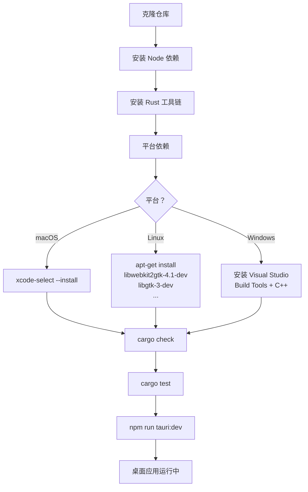
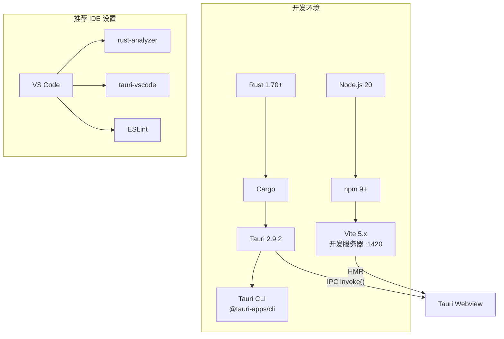
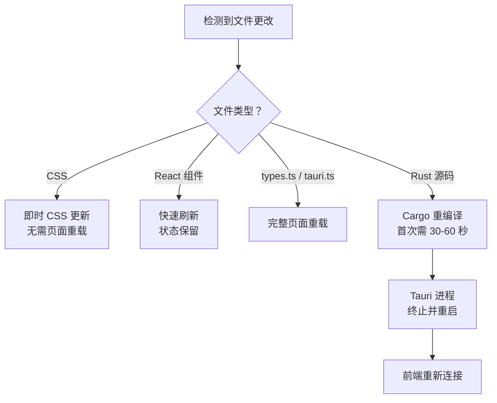

# 项目设置

在每个平台上设置 PromptLens 开发环境的详细说明。

## 设置流程





## 前端设置

前端是一个使用 Vite 构建的 React 18 + TypeScript 应用。

### 依赖

```json
// file: package.json:16-25
{
  "dependencies": {
    "@tanstack/react-virtual": "^3.13.13",
    "@tauri-apps/api": "^2.9.0",
    "lucide-react": "^0.468.0",
    "react": "^18.3.1",
    "react-dom": "^18.3.1",
    "react-markdown": "^9.1.0",
    "remark-gfm": "^4.0.0",
    "zustand": "^5.0.8"
  }
}
```

### 开发依赖

```json
// file: package.json:27-38
{
  "devDependencies": {
    "@tauri-apps/cli": "^2.9.0",
    "@testing-library/jest-dom": "^6.9.1",
    "@testing-library/react": "^16.3.2",
    "@types/react": "^18.3.12",
    "@types/react-dom": "^18.3.1",
    "@vitejs/plugin-react": "^4.3.3",
    "jsdom": "^29.1.1",
    "typescript": "^5.6.3",
    "vite": "^5.4.10",
    "vitest": "^4.1.7"
  }
}
```

### 安装步骤

```bash
# 在项目根目录下
npm install

# 验证前端构建
npm run build

# 启动开发服务器
npm run dev
```

Vite 开发服务器在 **端口 1420** 启动。Tauri webview 在开发期间连接到此端口。

## 后端设置

后端是一个使用 Tauri 2.9 的 Rust 2021 edition crate。

### Rust 依赖

```toml
# file: src-tauri/Cargo.toml:17-28
[dependencies]
base64 = "0.22.1"
dirs = "6.0.0"
infer = "0.19.0"
notify = "7.0"
regex = "1"
rfd = "0.15.4"
rusqlite = { version = "0.32.1", features = ["bundled"] }
serde = { version = "1.0", features = ["derive"] }
serde_json = "1.0"
tauri = { version = "2.9.2", features = [] }
time = { version = "0.3.44", features = ["formatting"] }

[dev-dependencies]
tempfile = "3.23.0"
```

| Crate | 版本 | 用途 |
|-------|---------|---------|
| `tauri` | 2.9.2 | 桌面应用框架、IPC、窗口管理 |
| `serde` / `serde_json` | 1.0 | JSON 序列化，`camelCase` 字段重命名 |
| `rusqlite` | 0.32.1（bundled） | SQLite 用于缓存扫描结果和 FTS5 索引 |
| `notify` | 7.0 | 文件系统监视，检测仅追加的更改 |
| `rfd` | 0.15.4 | 原生文件对话框（打开/保存） |
| `regex` | 1 | 模式匹配用于提供商检测 |
| `base64` | 0.22.1 | 嵌入图片的 Base64 编码 |
| `infer` | 0.19.0 | 文件类型检测（从字节推断 MIME） |
| `dirs` | 6.0.0 | 平台特定目录路径 |
| `time` | 0.3.44 | 时间戳格式化 |
| `tempfile` | 3.23.0 | （开发）测试中的临时文件 |

### 安装步骤

```bash
# 确保 Rust 工具链已安装
curl --proto '=https' --tlsv1.2 -sSf https://sh.rustup.rs | sh

# 在 src-tauri/ 目录下
cd src-tauri
cargo check        # 验证编译
cargo test         # 运行测试
cargo fmt --check  # 验证格式化
```

## 环境变量

| 变量 | 默认值 | 描述 |
|----------|---------|-------------|
| `PROMPTLENS_CACHE_PATH` | 平台数据目录 | 覆盖 SQLite 缓存文件路径。用于测试时隔离缓存状态。 |
| `GITHUB_TOKEN` | （仅 CI） | `tauri-action` 在 GitHub Actions 中用于上传发布资源。 |

`PROMPTLENS_CACHE_PATH` 变量在缓存模块中读取：
```rust
// 在 src-tauri/src/cache.rs 中的概念用法
if let Ok(custom) = std::env::var("PROMPTLENS_CACHE_PATH") {
    return PathBuf::from(custom);
}
```

## IDE 推荐

### VS Code

推荐扩展：

| 扩展 | 用途 |
|-----------|---------|
| `rust-analyzer` | Rust 语言服务器，内联类型提示，跳转到定义 |
| `tauri-vscode` | Tauri 项目命令和调试 |
| `dbaeumer.vscode-eslint` | TypeScript 的 ESLint |
| `esbenp.prettier-vscode` | 代码格式化 |

VS Code 工作区 Rust 设置：

```json
{
  "rust-analyzer.cargo.features": [],
  "rust-analyzer.check.command": "clippy",
  "editor.formatOnSave": true
}
```

### JetBrains (RustRover / IntelliJ)

- 安装 Rust 插件
- 将 `src-tauri/` 标记为 Cargo 项目根目录
- 启用 `cargo clippy` 作为外部检查器

### Vim / Neovim

- 通过 LSP 使用 `rust-analyzer`（`nvim-lspconfig` 或内置）
- 安装 `mason.nvim` 自动化 LSP 安装

## 构建配置

Tauri 构建系统使用 Cargo 配置。默认的 release 配置会去除调试符号并启用优化：

```toml
# src-tauri/Cargo.toml（由 Tauri 管理）
[profile.release]
strip = true
lto = true
codegen-units = 1
panic = "abort"
```

| 配置 | 优化 | 调试信息 | 使用场景 |
|---------|--------------|------------|----------|
| `dev` | 无 | 完整 | 开发（`cargo build`） |
| `release` | 完整 + LTO | 已去除 | 生产（`cargo build --release`） |

开发期间，`cargo check` 和 `cargo build` 默认使用 dev 配置（无优化，完整调试信息）。

## macOS 代码签名

本地开发不需要代码签名。发布时：

1. 设置 `APPLE_CERTIFICATE` 和 `APPLE_CERTIFICATE_PASSWORD` 环境变量
2. 设置 `APPLE_ID`、`APPLE_PASSWORD` 和 `APPLE_TEAM_ID` 用于公证
3. 这些由 GitHub Actions 发布工作流自动处理

```yaml
# file: .github/workflows/release.yml:83-93
- name: Build and release
  uses: tauri-apps/tauri-action@v0
  env:
    GITHUB_TOKEN: ${{ secrets.GITHUB_TOKEN }}
  with:
    tagName: ${{ github.ref_name }}
    releaseName: "PromptLens ${{ github.ref_name }}"
    releaseBody: "See the assets below for platform-specific installers."
    releaseDraft: false
    prerelease: false
    args: --target ${{ matrix.target }} --bundles ${{ matrix.bundles }}
```

## Linux AppImage

CI 生成 `.AppImage`、`.deb` 和 `.rpm` 安装包。本地测试 AppImage：

```bash
cd src-tauri
cargo tauri build --bundles appimage
# 输出：target/release/bundle/appimage/*.AppImage
```

## Windows MSI / NSIS

在 Windows 上，CI 生成 `.msi` 和 `.nsis.zip` 安装程序。本地构建：

```bash
cd src-tauri
cargo tauri build --bundles msi,nsis
```

## 热重载

`npm run tauri:dev` 期间，Vite 开发服务器为前端更改提供热模块替换（HMR）。Rust 后端更改会触发完整重编译和应用重启。



### 前端 HMR

| 更改类型 | 重载行为 |
|-------------|----------------|
| CSS | 即时更新，无页面重载 |
| React 组件 | 快速刷新（保留状态） |
| `types.ts` | 完整页面重载 |
| `tauri.ts` | 完整页面重载 |

### 后端重编译

`tauri:dev` 期间 Rust 源文件更改时：

1. Cargo 检测到更改并重编译受影响的 crate
2. Tauri 进程被终止并重启
3. 前端重新连接到新后端
4. 首次重编译需 30-60 秒；增量更改更快

## 首次设置检查清单

| 步骤 | 命令 | 预期结果 |
|------|---------|-----------------|
| 1. 克隆仓库 | `git clone https://github.com/XUranus/promptlens.git` | 仓库已克隆 |
| 2. 安装 Node 依赖 | `npm install` | `node_modules/` 已创建 |
| 3. 验证 Rust | `cd src-tauri && cargo check` | 编译成功 |
| 4. 运行测试 | `cd src-tauri && cargo test` | 所有测试通过 |
| 5. 启动开发 | `npm run tauri:dev` | 桌面应用打开 |
| 6. 打开文件 | 在应用中使用文件对话框 | JSONL 记录显示 |

## 依赖管理

### 更新前端依赖

```bash
# 检查过时的包
npm outdated

# 更新特定包
npm install react@latest

# 更新所有包（注意主版本）
npm update
```

### 更新 Rust 依赖

```bash
cd src-tauri

# 检查过时的 crate
cargo install cargo-edit
cargo upgrade --dry-run

# 不更改 Cargo.toml 更新 Cargo.lock
cargo update

# 更新特定 crate
cargo update -p serde_json
```

### Tauri CLI 更新

Tauri CLI 是开发依赖（`@tauri-apps/cli`）。使用以下命令更新：

```bash
npm install @tauri-apps/cli@latest
```

保持 Rust `tauri` crate 与 CLI 版本同步以避免兼容性问题。
