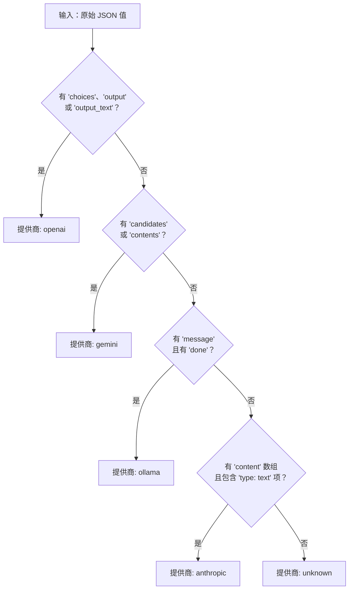
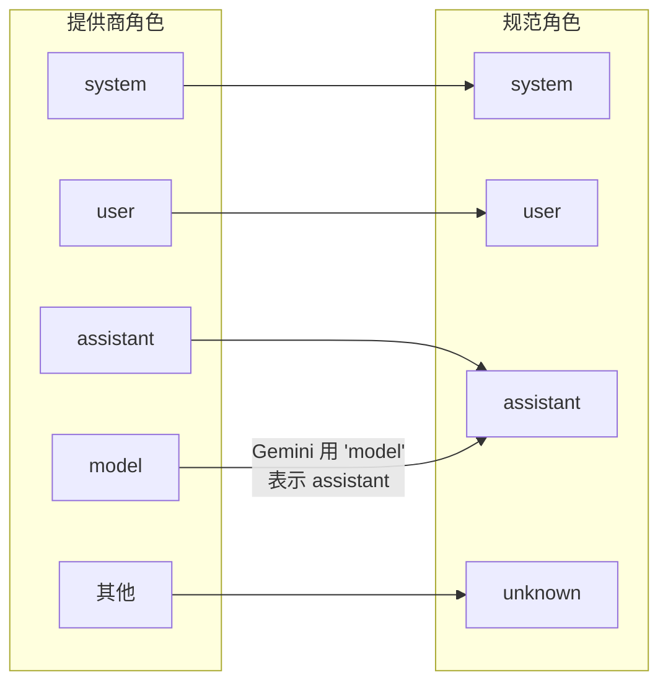
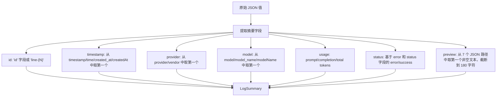
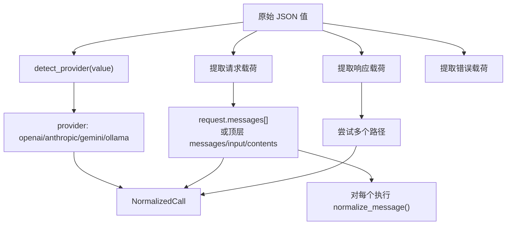
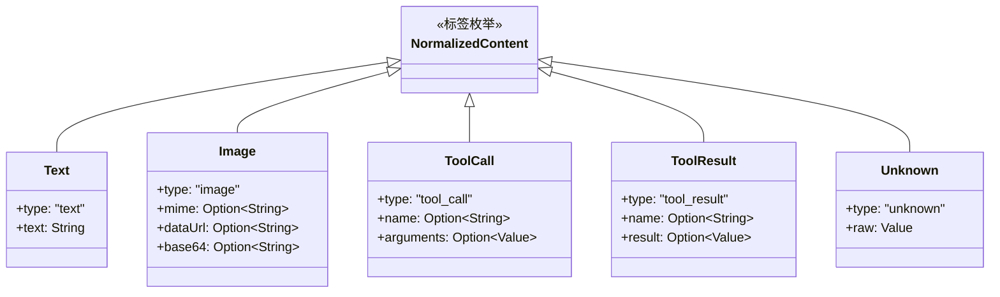

# 提供商规范化

PromptLens 将来自四个主要 LLM 提供商的 JSONL 审计日志规范化为单一的 `NormalizedCall` schema。这使得 UI 可以统一渲染所有提供商，而无需提供商特定的渲染逻辑。

## 提供商检测

`adapters.rs` 中的 `detect_provider` 函数使用原始 JSON 上的结构启发式来识别提供商。不需要显式的提供商字段。

```rust
// file: src-tauri/src/adapters.rs:11
pub(crate) fn detect_provider(value: &Value) -> Option<String> {
    if value.get("choices").is_some()
        || value.get("output").is_some()
        || value.get("output_text").is_some()
    {
        return Some("openai".to_string());
    }
    if value.get("candidates").is_some() || value.get("contents").is_some() {
        return Some("gemini".to_string());
    }
    if value.get("message").is_some() && value.get("done").is_some() {
        return Some("ollama".to_string());
    }
    if value.get("content").and_then(Value::as_array).is_some_and(|items| {
        items.iter().any(|item| item.get("type").and_then(Value::as_str) == Some("text"))
    }) {
        return Some("anthropic".to_string());
    }
    None
}
```



### 检测优先级

检查按特异性排序——每个检查都检查不太可能出现在其他提供商中的独特结构签名：

| 优先级 | 提供商 | 签名 | 为什么有效 |
|--------|--------|------|-----------|
| 1 | OpenAI | `choices`、`output` 或 `output_text` | OpenAI 对聊天补全使用 `choices`，对 Responses API 使用 `output` |
| 2 | Gemini | `candidates` 或 `contents` | Gemini 对响应用 `candidates`，对请求用 `contents` |
| 3 | Ollama | `message` 且 `done` | Ollama 流式传输时用 `done: true` 作为完成信号 |
| 4 | Anthropic | 带 `type: text` 项的 `content` 数组 | Anthropic 使用带类型化块的 `content` 数组 |

## 角色规范化

`adapters.rs` 中的 `normalize_role` 函数将提供商特定角色映射为规范集：

```rust
// file: src-tauri/src/adapters.rs:3
pub(crate) fn normalize_role(role: &str) -> String {
    match role {
        "system" | "developer" | "user" | "assistant" | "tool" | "function" => role.to_string(),
        "model" => "assistant".to_string(),
        _ => "unknown".to_string(),
    }
}
```

关键的非显而易见映射是 `model` 到 `assistant`——Gemini 使用角色 `"model"`，而其他提供商使用 `"assistant"`。



## 规范化流水线

当用户选择记录时，原始 JSON 经过两个阶段：

### 阶段 1：摘要提取（`summary_from_value`）

这个轻量级传递为列表视图提取消息，不进行完整消息规范化：



### 阶段 2：完整规范化（`normalize_call`）

此传递重建完整的对话结构。仅在用户选择特定记录时调用：



## 内容部分规范化

每个消息的内容被规范化为类型化的 `NormalizedContent` 部分：

```rust
// file: src-tauri/src/types.rs:246
#[derive(Debug, Serialize, Deserialize)]
#[serde(tag = "type", rename_all = "snake_case")]
pub(crate) enum NormalizedContent {
    Text { text: String },
    Image { mime: Option<String>, data_url: Option<String>, base64: Option<String> },
    ToolCall { name: Option<String>, arguments: Option<Value> },
    ToolResult { name: Option<String>, result: Option<Value> },
    Unknown { raw: Value },
}
```



## 字段查找别名

规范化函数对每个字段尝试多个键名以处理提供商差异：

| 字段 | 别名 |
|------|------|
| 时间戳 | `timestamp` / `time` / `created_at` / `createdAt` |
| 提供商 | `provider` / `vendor` |
| 模型 | `model` / `model_name` / `modelName`（也检查 `request.model`） |
| Trace ID | `trace_id` / `traceId` / `trace` / `traceID` / `run_id` / `runId` |
| 会话 ID | `session_id` / `sessionId` / `conversation_id` / `conversationId` / `thread_id` / `threadId` |
| 请求 ID | `request_id` / `requestId` / `call_id` / `callId` / `span_id` / `spanId` |
| 延迟 | `latency_ms` / `latencyMs` / `duration_ms` / `durationMs` |

### Token 使用量别名

在 `usage` 对象中搜索（如果不存在 `usage` 键则在根值中搜索）：

| 字段 | 别名 |
|------|------|
| `prompt_tokens` | `prompt_tokens` / `promptTokens` / `input_tokens` / `inputTokens` / `promptTokenCount` |
| `completion_tokens` | `completion_tokens` / `completionTokens` / `output_tokens` / `outputTokens` / `candidatesTokenCount` |
| `total_tokens` | `total_tokens` / `totalTokens` / `totalTokenCount` |

## 提供商特定示例载荷

### OpenAI 聊天补全

```json
{
  "id": "chatcmpl-abc123",
  "model": "gpt-4.1",
  "choices": [{ "message": { "role": "assistant", "content": "Hello!" } }],
  "usage": { "prompt_tokens": 10, "completion_tokens": 5, "total_tokens": 15 }
}
```

规范化提取：provider=`openai`，model=`gpt-4.1`，响应消息 role=`assistant`，content=`Hello!`，total_tokens=15。

### Anthropic Messages API

```json
{
  "id": "msg_abc",
  "model": "claude-sonnet-4",
  "content": [{ "type": "text", "text": "Hello!" }],
  "usage": { "input_tokens": 10, "output_tokens": 5 }
}
```

规范化提取：provider=`anthropic`，model=`claude-sonnet-4`，响应内容为 `NormalizedContent::Text`，prompt_tokens 从 `input_tokens` 获取，completion_tokens 从 `output_tokens` 获取。

### Gemini GenerateContent 响应

```json
{
  "candidates": [{ "content": { "role": "model", "parts": [{ "text": "Hello!" }] } }],
  "usageMetadata": { "promptTokenCount": 10, "candidatesTokenCount": 5, "totalTokenCount": 15 }
}
```

规范化提取：provider=`gemini`，角色从 `model` 映射为 `assistant`，token 从 `usageMetadata` 获取，响应从 `candidates[].content` 获取。

### Ollama 聊天响应

```json
{
  "model": "llama3",
  "message": { "role": "assistant", "content": "Hello!" },
  "done": true,
  "prompt_eval_count": 10,
  "eval_count": 5
}
```

规范化提取：provider=`ollama`（通过 `message` + `done` 检测），model=`llama3`，响应从 `message` 获取。

## 预览提取

`find_preview` 函数尝试多个 JSON 路径来为列表视图找到短文本预览：

| 优先级 | JSON 路径 | 典型来源 |
|--------|-----------|---------|
| 1 | `/response/message/content` | OpenAI 风格单消息 |
| 2 | `/response/content` | Anthropic 风格内容数组 |
| 3 | `/response/text` | 简单文本响应 |
| 4 | `/request/messages/0/content` | 第一条请求消息 |
| 5 | `/messages/0/content` | 顶层消息数组 |
| 6 | `/output_text` | OpenAI Responses API |
| 7 | `/text` | 纯文本字段 |

如果这些路径都没有产生字符串，则整个 JSON 值会被序列化并截断到 180 个字符。
