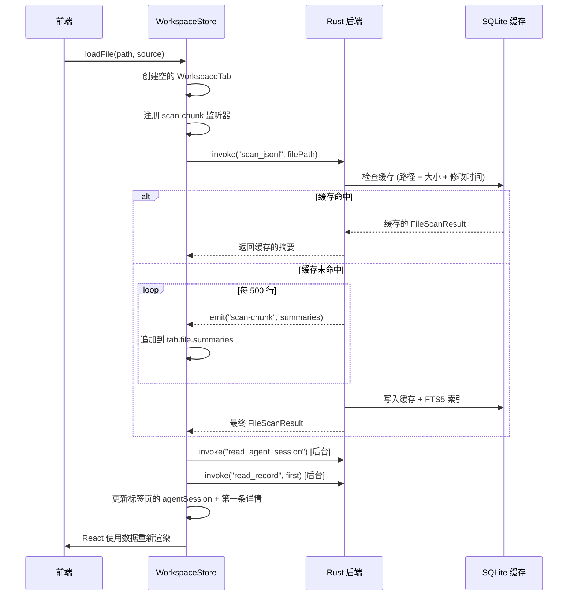
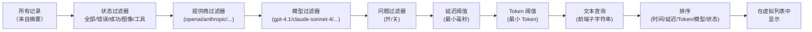
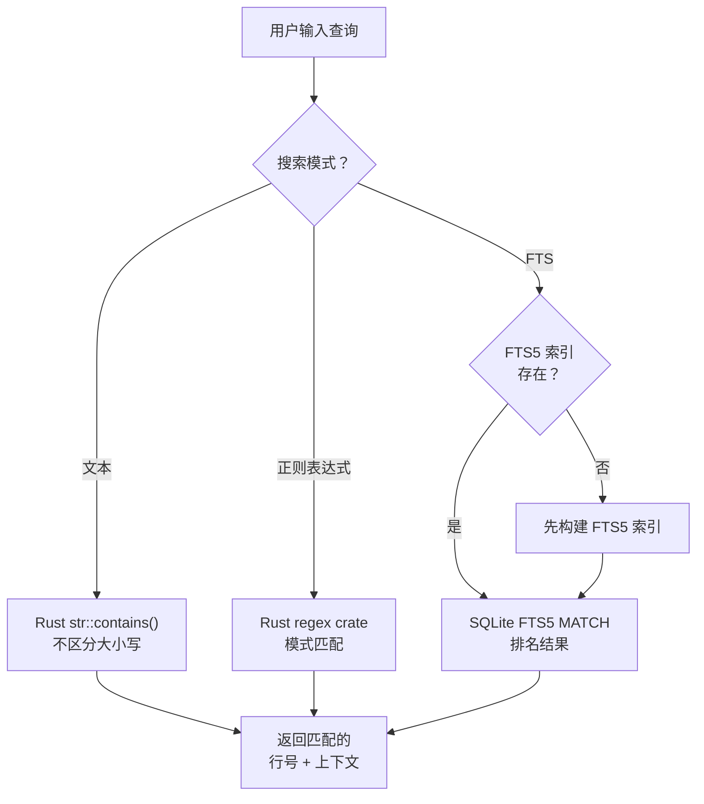
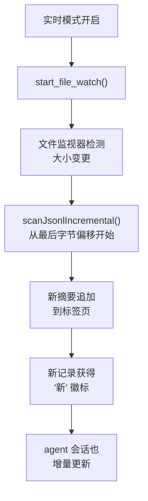

# 快速开始

本教程将引导您在 PromptLens 中打开第一个 JSONL 日志文件并探索其功能。

## 第 1 步：启动 PromptLens

从应用程序菜单打开 PromptLens，或者如果您从源码构建，运行 `npm run tauri:dev`。您将看到带有 PromptLens 徽标和"打开 JSONL 文件"按钮的启动屏幕。

## 第 2 步：打开日志文件

有多种方式可以打开文件：

1. **点击按钮** -- 在启动屏幕点击"打开 JSONL 文件"。
2. **使用菜单** -- 在标题栏点击"打开"，然后选择源类型。
3. **键盘快捷键** -- 按 `Ctrl+O`（macOS 上为 `Cmd+O`）。

将出现原生文件对话框。导航到您的 `.jsonl` 文件并选择它。

### 没有日志文件？

生成一个示例：

```bash
npm run sample:large
```

这将创建一个可以立即打开的示例 JSONL 文件。您也可以指定大小：

```bash
node scripts/generate-large-sample.mjs 5000 10   # 5000 行，约 10 MB
```

### 打开文件时会发生什么

打开过程涉及多个 Tauri IPC 调用协同工作：



Rust 扫描器使用 256KB 缓冲区流式读取文件，每 250 行发出进度事件，每 500 行发出块事件：

```rust
// file: src-tauri/src/scanner.rs:99
// 每 500 行发出 scan-chunk 以实现增量 UI 更新
if total_lines.is_multiple_of(500) && !chunk_buffer.is_empty() {
    if let Some(app) = app {
        let _ = app.emit("scan-chunk", ScanChunkPayload {
            file_path: file_path.clone(),
            summaries: std::mem::take(&mut chunk_buffer),
            line_from: chunk_start_line,
            line_to: total_lines,
        });
    }
    chunk_start_line = total_lines + 1;
}
```

前端监听这些块以逐步显示结果：

```tsx
// file: src/app/store.ts:403
const unlistenChunk = listen<ScanChunkPayload>("scan-chunk", (event) => {
  const chunk = event.payload;
  if (chunk.filePath !== scanningFilePath) return;
  set((s) => {
    const tab = s.tabs.find((t) => t.id === chunk.filePath);
    if (!tab) return s;
    return {
      tabs: s.tabs.map((t) =>
        t.id === chunk.filePath
          ? { ...t, file: { ...t.file, summaries: [...t.file.summaries, ...chunk.summaries] } }
          : t,
      ),
    };
  });
});
```

大型文件的首次扫描可能需要几秒钟。后续打开同一文件时将使用缓存并立即加载。

## 第 3 步：浏览记录列表

文件加载后，左面板显示虚拟化的记录列表。每张卡片显示：

- **彩色状态点** -- 绿色表示成功，红色表示错误，黄色表示无效 JSON
- **模型名称**和**时间戳**
- **提供商**、**延迟**和 **token 数**
- 请求内容的文本**预览**
- 包含图像或工具调用的记录显示**图标**
- 有定价数据时显示**成本估算**

记录列表使用 `@tanstack/react-virtual` 进行虚拟滚动。只有可见的行才会渲染到 DOM 中：

```tsx
// file: src/app/components/LeftPanel.tsx:303
const rowVirtualizer = useVirtualizer({
  count: items.length,
  getScrollElement: () => parentRef.current,
  estimateSize: () => 74,
  overscan: 10,
});
```

每张记录卡片使用 `transform: translateY()` 进行绝对定位：

```tsx
// file: src/app/components/LeftPanel.tsx:325
<button
  className={`log-row ${selected?.lineNumber === item.lineNumber ? "selected" : ""} ${isNew ? "new-record" : ""}`}
  onClick={() => onSelect(item)}
  style={{ transform: `translateY(${virtualRow.start}px)` }}
>
```

### 过滤记录

使用记录列表上方的工具栏缩小结果范围：

| 控件 | 用途 |
|------|------|
| 状态下拉菜单 | 按全部、错误、成功、图像或工具过滤 |
| 排序下拉菜单 | 按时间、延迟、Token、模型或状态排序 |
| 提供商下拉菜单 | 过滤到特定 LLM 提供商 |
| 模型下拉菜单 | 过滤到特定模型 |
| 问题过滤按钮 | 仅显示检测到问题的记录 |
| 最小毫秒输入 | 隐藏低于延迟阈值的记录 |
| 最小 Token 输入 | 隐藏低于 Token 阈值的记录 |
| 实时按钮 | 启用实时跟踪模式以实时监视日志 |

### 过滤管道

所有过滤器以组合方式（AND 逻辑）应用。记录必须通过每个活动过滤器才能出现在列表中：



## 第 4 步：查看对话

点击列表中的任何记录，在中间面板加载其完整对话。加载过程使用字节偏移寻址实现 O(1) 随机访问：

```rust
// file: src-tauri/src/commands.rs:111
fn read_record(file_path: String, byte_offset: u64, line_number: usize)
    -> Result<RecordDetail, String>
{
    let file = File::open(&file_path).map_err(|err| format!("Failed to open file: {err}"))?;
    let mut reader = BufReader::new(file);
    reader.seek(SeekFrom::Start(byte_offset))
        .map_err(|err| format!("Failed to seek record: {err}"))?;
    // ... 解析并标准化单行
}
```

您将看到：

1. **标题栏** -- 模型名称、提供商、行号和延迟。
2. **状态标签** -- 成功（绿色）或错误（红色）。
3. **消息卡片** -- 每条消息显示其角色和内容。

### 视图模式

每张消息卡片有三种视图模式：

| 模式 | 显示内容 |
|------|---------|
| **预览** | Markdown 渲染带语法高亮，图像显示为缩略图，工具调用显示为结构化卡片 |
| **文本** | 纯文本内容，不渲染 Markdown |
| **JSON** | 消息对象的原始 JSON |

使用每张消息卡片顶部的按钮在模式之间切换。模式在所有卡片之间共享：

```tsx
// file: src/app/components/CenterPanel.tsx:311
<article className={`message-card role-${message.role}`}>
  <div className="message-role">
    <span>{message.role}</span>
    <div className="message-actions">
      <button onClick={() => copyJson(message.raw ?? message.content)} title="Copy message">
        <Copy size={14} />
      </button>
      <button className={viewMode === "preview" ? "active" : ""} onClick={() => onViewModeChange("preview")}>
        Preview
      </button>
      <button className={viewMode === "text" ? "active" : ""} onClick={() => onViewModeChange("text")}>
        Text
      </button>
      <button className={isJson ? "active" : ""} onClick={() => onViewModeChange("json")}>
        JSON
      </button>
    </div>
  </div>
```

### 图像

如果消息包含嵌入图像（base64 数据 URL），它们将显示为可点击的缩略图。点击图像可打开全尺寸预览模态框。按 `Escape` 关闭。

## 第 5 步：检查右面板

右面板为选定记录提供额外视图：

| 标签页 | 用途 |
|--------|------|
| 差异 | 并排比较两条记录 |
| 工具 | 以结构化 JSON 查看工具调用和结果 |
| 错误 | 查看失败记录的错误详情 |
| JSON | 浏览完整的标准化 JSON 树 |
| 原始 | 查看原始 JSON 载荷 |

要使用差异视图，请在任何记录卡片上点击比较图标将其设置为基线，然后选择另一条记录。

## 第 6 步：跨文件搜索

要在整个文件中进行全文搜索：

1. 在左面板顶部的搜索框中输入查询。
2. 选择搜索模式：**文本**（子字符串）、**正则表达式**或 **FTS**（SQLite 全文搜索）。
3. 按 `Enter` 或点击"搜索"。

搜索后端支持三种模式，每种有不同的权衡：



搜索结果显示为带有上下文片段的列表。点击结果可跳转到该记录。

## 第 7 步：探索分析

切换到左面板的分析标签页查看：

- **指标卡片** -- 总记录数、错误计数和比率、P95/P99 延迟、总 Token 数、成本估算
- **柱状图** -- 按使用次数排列的热门模型和提供商
- **直方图** -- 所有过滤记录的延迟分布
- **元数据** -- 文件路径、大小、有效/无效计数和选定记录详情

分析在前端（用于即时过滤更新）和 Rust 后端（用于全面分析）两处计算：

```tsx
// file: src/app/analytics.ts:52
export function buildAnalytics(items: LogSummary[]): AnalyticsSummary {
  const latencies = items.map((item) => item.latencyMs)
    .filter((value): value is number => value !== undefined);
  const tokens = items.map((item) => item.totalTokens)
    .filter((value): value is number => value !== undefined);
  const errors = items.filter((item) =>
    item.status === "error" || item.status === "invalid_json").length;
  return {
    total: items.length,
    success: items.filter((item) => item.status === "success").length,
    errors,
    invalid: items.filter((item) => item.status === "invalid_json").length,
    errorRate: items.length ? (errors / items.length) * 100 : 0,
    p95Latency: percentile(latencies, 0.95),
    p99Latency: percentile(latencies, 0.99),
    totalTokens: tokens.reduce((sum, value) => sum + value, 0),
    p95Tokens: percentile(tokens, 0.95),
    topModels: topCounts(items.map((item) => item.model || "unknown model")),
    topProviders: topCounts(items.map((item) => item.provider || "unknown provider")),
  };
}
```

## 第 8 步：导出数据

在标题栏点击"导出"以访问导出选项。您可以将过滤后的记录导出为：

- JSONL 摘要
- CSV 摘要
- Markdown 报告
- 原始 JSONL
- 标准化 JSONL
- 会话 Markdown

详见 [导出](export.md) 了解每种格式的详情。

## 第 9 步：启用实时模式

如果您正在活跃地生成日志，请点击工具栏中的 **Live** 按钮。PromptLens 将监视文件变更并自动加载追加的记录。新记录会带有"新"徽标显示。

实时模式使用文件监视器和增量扫描：



## 常见首次使用问题

### "我打开了文件但看不到记录"

检查文件是否为有效的 JSONL（每行一个 JSON 对象）。如果文件使用非标准格式，请尝试从"打开"菜单使用正确的源类型打开它。

### "扫描似乎在大文件上卡住了"

大文件（数百 MB）需要时间扫描。在状态栏查看进度。如果需要，可以使用取消按钮取消。后续打开将使用缓存并立即加载。

### "记录显示 'unknown model' 或 'unknown provider'"

PromptLens 从 JSON 结构检测提供商。如果您的日志使用自定义格式，提供商可能无法被识别。数据仍然可查看 -- 只有提供商标签会受影响。

### "我只想看错误记录"

将状态过滤器下拉菜单（工具栏左上角）设置为"错误"。这将过滤列表以仅显示具有 error 或 invalid_json 状态的记录。

### "如何比较两个模型输出？"

1. 找到第一条记录并点击其卡片上的比较图标（两个箭头）。
2. 选择第二条记录。
3. 切换到右面板的差异标签页。
4. 差异视图显示并排比较，差异部分高亮显示。

## 下一步

- [用户指南](user-guide.md) -- 所有功能的综合指南
- [界面概览](interface-overview.md) -- 详细的布局文档
- [搜索](search.md) -- 深入了解搜索功能
- [键盘快捷键](keyboard-shortcuts.md) -- 所有可用快捷键
