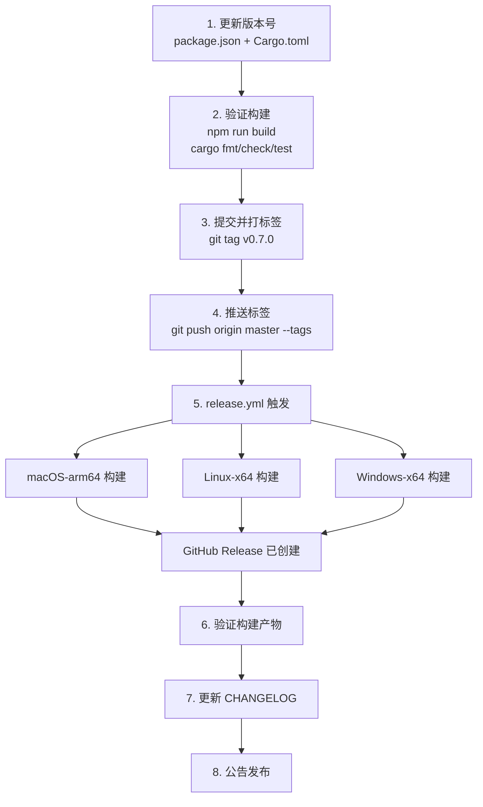
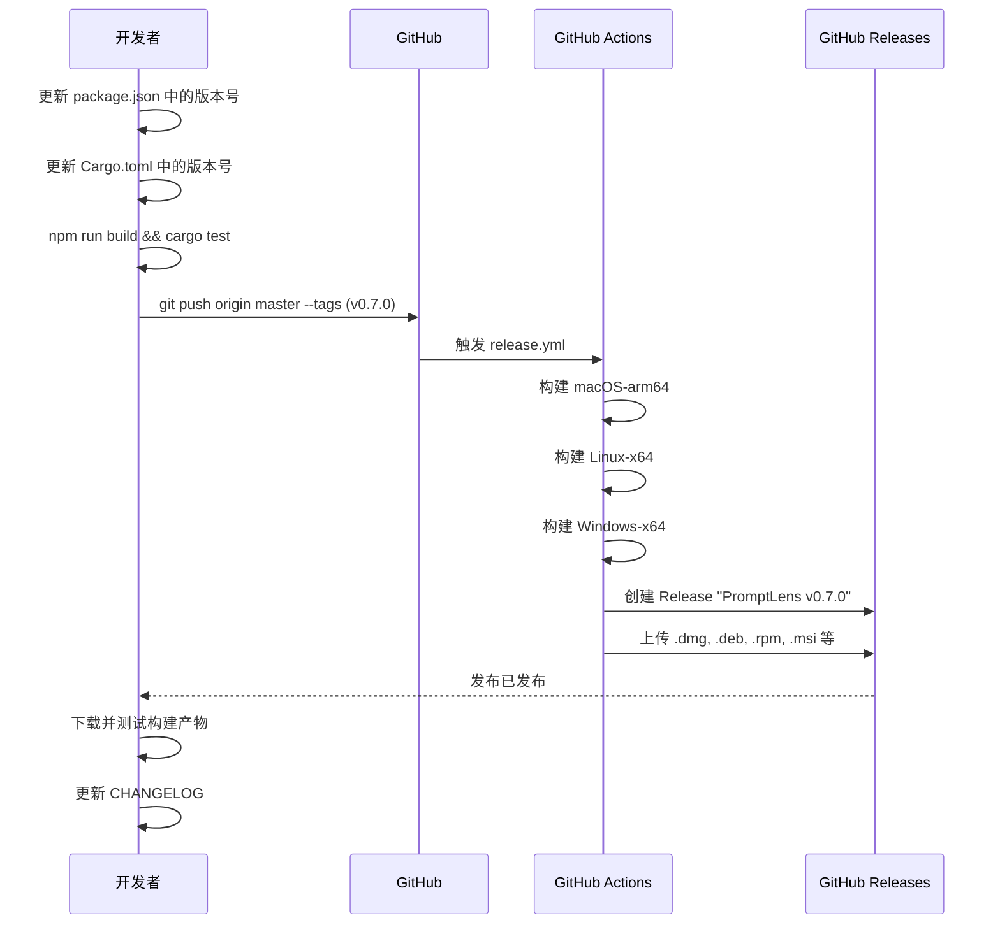
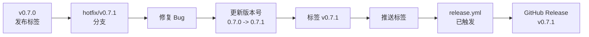

# 发布流程

本文档描述如何创建新的 PromptLens 发布版本。

## 发布流程





## 版本位置

版本字符串出现在两个必须一起更新的文件中：

| 文件 | 字段 | 示例 |
|------|-------|---------|
| `package.json` | `"version"` | `"0.6.0"` |
| `src-tauri/Cargo.toml` | `[package] version` | `"0.6.0"` |

```json
// file: package.json:3
{
  "name": "promptlens",
  "version": "0.6.0"
}
```

```toml
# file: src-tauri/Cargo.toml:2
[package]
name = "promptlens"
version = "0.6.0"
```

## 分步发布

### 1. 更新版本号

编辑两个文件为新版本字符串。它们必须完全匹配。

```bash
# 编辑 package.json
# "version": "0.7.0"

# 编辑 src-tauri/Cargo.toml
# version = "0.7.0"
```

### 2. 验证构建

```bash
# 前端类型检查和构建
npm run build

# 后端检查
cd src-tauri
cargo fmt --check
cargo check
cargo test
```

### 3. 提交并打标签

```bash
git add package.json src-tauri/Cargo.toml
git commit -m "Release v0.7.0"
git tag v0.7.0
git push origin master --tags
```

标签**必须**匹配 `v*` 模式才能触发发布工作流：

```yaml
# file: .github/workflows/release.yml:4-6
on:
  push:
    tags:
      - "v*"
```

### 4. CI 构建产物

`release.yml` 工作流在推送标签时运行，构建平台特定的安装程序：

| 平台 | 产物 |
|----------|-----------|
| macOS (arm64) | `.dmg`（磁盘映像）、`.app.tar.gz`（便携归档） |
| Linux (x64) | `.deb`（Debian/Ubuntu）、`.rpm`（Fedora/RHEL）、`.AppImage`（通用） |
| Windows (x64) | `.msi`（Windows Installer）、`.nsis.zip`（NSIS 安装程序）、`.exe` |

### 5. GitHub Release 已创建

`tauri-action` 自动创建 GitHub Release：

```yaml
# file: .github/workflows/release.yml:83-93
- name: Build and release
  uses: tauri-apps/tauri-action@v0
  env:
    GITHUB_TOKEN: ${{ secrets.GITHUB_TOKEN }}
  with:
    tagName: ${{ github.ref_name }}
    releaseName: "PromptLens ${{ github.ref_name }}"
    releaseBody: "See the assets below for platform-specific installers."
    releaseDraft: false
    prerelease: false
    args: --target ${{ matrix.target }} --bundles ${{ matrix.bundles }}
```

- **标签：** `v0.7.0`
- **名称：** `PromptLens v0.7.0`
- **正文：** "See the assets below for platform-specific installers."
- **草稿：** 否
- **预发布：** 否

所有平台产物都附加到 release 上。

## CI 发布矩阵

| 平台 | 运行器 | 目标 | 安装包格式 |
|----------|--------|--------|----------------|
| macOS-arm64 | `macos-14` | `aarch64-apple-darwin` | dmg, app |
| Linux-x64 | `ubuntu-22.04` | `x86_64-unknown-linux-gnu` | deb, rpm, appimage |
| Windows-x64 | `windows-latest` | `x86_64-pc-windows-msvc` | msi, nsis |

## 产物文件大小（近似）

| 产物 | 大小范围 | 目标平台 |
|----------|-----------|----------------|
| `.dmg`（macOS） | 8-15 MB | macOS Apple Silicon |
| `.app.tar.gz`（macOS） | 8-15 MB | macOS Apple Silicon（便携） |
| `.deb`（Linux） | 7-12 MB | Debian, Ubuntu, Mint |
| `.rpm`（Linux） | 7-12 MB | Fedora, RHEL, CentOS |
| `.AppImage`（Linux） | 8-15 MB | 通用 Linux |
| `.msi`（Windows） | 7-12 MB | 企业部署 |
| `.nsis.zip`（Windows） | 7-12 MB | 终端用户安装 |

## 热修复发布

计划发布之间的紧急修复：

```bash
# 从发布标签创建热修复分支
git checkout -b hotfix/v0.7.1 v0.7.0

# 应用修复
git commit -m "Fix critical bug"

# 在 package.json 和 Cargo.toml 中更新补丁版本
# 然后打标签并推送
git tag v0.7.1
git push origin hotfix/v0.7.1 --tags
```



## 预发布 / Beta

要创建预发布，修改发布工作流或手动创建带有 `prerelease` 标志的 GitHub Release。当前工作流设置 `prerelease: false`。

## 发布后检查清单

| 任务 | 描述 |
|------|-------------|
| 验证产物 | 下载并测试每个平台的安装程序 |
| 更新 CHANGELOG | 记录自上次发布以来的更改 |
| 公告 | 发布到 GitHub Discussions、社交媒体等 |
| 更新开发版本 | 可选：设置下一个开发版本 |

## 手动发布（无 CI）

如果 CI 不可用，为每个平台本地构建：

```bash
# macOS
cd src-tauri
cargo tauri build --target aarch64-apple-darwin --bundles dmg,app

# Linux
cargo tauri build --target x86_64-unknown-linux-gnu --bundles deb,rpm,appimage

# Windows
cargo tauri build --target x86_64-pc-windows-msvc --bundles msi,nsis
```

将 `src-tauri/target/<target>/release/bundle/` 中的结果文件手动上传到 GitHub Release。

## 版本方案

PromptLens 遵循[语义化版本](https://semver.org/)：

| 组件 | 何时递增 | 示例 |
|-----------|---------------|---------|
| 主版本 (`X.0.0`) | 文件格式或 IPC 接口的破坏性更改 | `1.0.0` |
| 次版本 (`0.X.0`) | 新功能、新提供商、UI 更改 | `0.7.0` |
| 补丁版本 (`0.0.X`) | Bug 修复、文档、小幅改进 | `0.6.1` |

## Changelog 模板

每个发布应包含 changelog 条目：

```markdown
## v0.7.0

### 功能
- 添加对新提供商 X 的支持
- 新的分析仪表板带成本跟踪

### Bug 修复
- 修复增量扫描偏移量计算
- 解决深色模式对比度问题

### 内部
- 升级 Tauri 到 2.9
- 添加 Vitest 用于前端测试
```

## 按平台的发布产物

| 平台 | 安装程序类型 | 文件扩展名 | 目标用户 |
|----------|---------------|----------------|-------------|
| macOS (Apple Silicon) | 磁盘映像 | `.dmg` | M1+ 的 macOS 用户 |
| macOS (Apple Silicon) | 便携归档 | `.app.tar.gz` | 高级 macOS 用户 |
| Linux (Debian/Ubuntu) | Debian 包 | `.deb` | Ubuntu, Debian, Mint |
| Linux (Fedora/RHEL) | RPM 包 | `.rpm` | Fedora, RHEL, CentOS |
| Linux (通用) | AppImage | `.AppImage` | 任何 Linux 发行版 |
| Windows | MSI 安装程序 | `.msi` | 企业部署 |
| Windows | NSIS 安装程序 | `.nsis.zip` | 终端用户安装 |

## 回滚程序

如果发布有严重问题：

1. 创建新的补丁发布包含修复（首选）
2. 或者，将 GitHub Release 标记为预发布以从最新发布中隐藏
3. 如有必要，撤销标签：

```bash
git tag -d v0.7.0
git push origin :refs/tags/v0.7.0
```

## 验证检查清单

发布发布后：

| 步骤 | 描述 |
|------|-------------|
| 下载产物 | 每个平台至少下载一个产物 |
| 安装并启动 | 验证应用无错误启动 |
| 打开样本文件 | 确认扫描和记录查看正常工作 |
| 检查版本 | 验证显示的版本与标签匹配 |
| 测试自动更新 | （如已配置）验证更新通知出现 |
