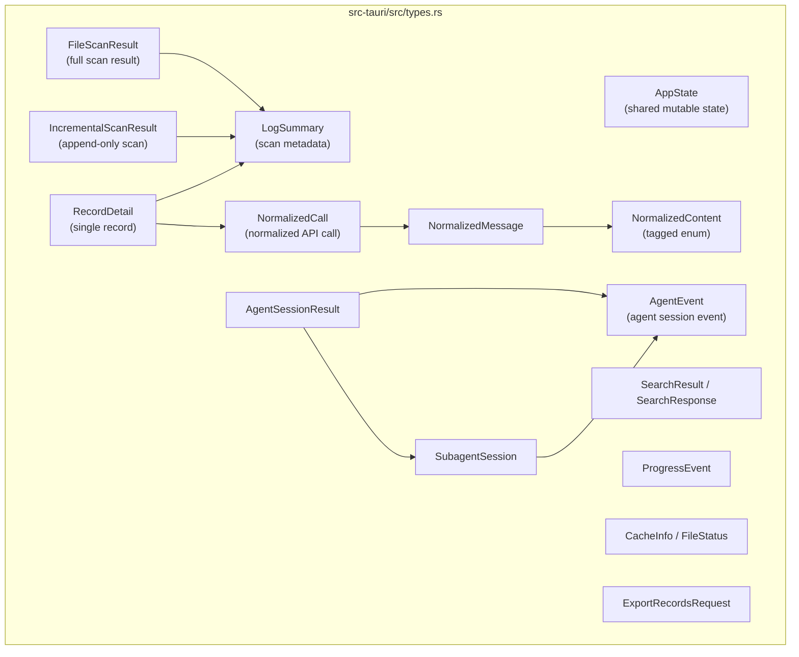

# Rust 类型

所有 Rust 类型定义在 `src-tauri/src/types.rs` 中。它们使用 `serde` 配合 `rename_all = "camelCase"` 进行 JSON 序列化，与前端的 TypeScript 类型匹配。

## 类型架构

```mermaid
classDiagram
    class AppState {
        +AtomicBool cancel_scan
        +AtomicBool cancel_search
        +Mutex~Option~FileWatcher~~ file_watcher
    }

    class LogSummary {
        +String id
        +usize line_number
        +u64 byte_offset
        +Option~String~ provider
        +Option~String~ model
        +String status
        +bool has_image
        +bool has_tool_call
    }

    class FileScanResult {
        +String file_path
        +String file_name
        +u64 file_size
        +usize total_lines
        +usize valid_records
        +Vec~LogSummary~ summaries
    }

    class NormalizedCall {
        +String id
        +usize line_number
        +String status
        +Option~Usage~ usage
        +Option~NormalizedPayload~ request
        +Option~NormalizedResponse~ response
        +Option~NormalizedError~ error
        +Value raw
    }

    class NormalizedMessage {
        +String role
        +Vec~NormalizedContent~ content
        +Option~Value~ raw
    }

    class NormalizedContent {
        <<enum>>
        Text{text}
        Image{mime, data_url, base64}
        ToolCall{name, arguments}
        ToolResult{name, result}
        Unknown{raw}
    }

    class AgentEvent {
        +String id
        +usize line_number
        +u64 byte_offset
        +String event_type
        +Vec~String~ file_paths
        +bool is_error
        +bool is_sidechain
    }

    class SearchResponse {
        +Vec~SearchResult~ results
        +bool truncated
        +bool cancelled
        +u128 duration_ms
        +bool indexed
    }

    AppState --> FileScanResult
    FileScanResult --> LogSummary
    NormalizedCall --> NormalizedMessage
    NormalizedMessage --> NormalizedContent
```



## 常量

```rust
// file: src-tauri/src/types.rs:6-7
pub(crate) const MAX_SEARCH_RESULTS: usize = 1000;
pub(crate) const CACHE_SCHEMA_VERSION: i64 = 3;
```

| 常量 | 类型 | 值 | 用途 |
|----------|------|-------|---------|
| `MAX_SEARCH_RESULTS` | `usize` | `1000` | 返回的最大搜索结果数 |
| `CACHE_SCHEMA_VERSION` | `i64` | `3` | SQLite 缓存 schema 版本 |

## 应用状态

### `AppState`

持有 Tauri 应用的共享可变状态。

```rust
// file: src-tauri/src/types.rs:9-23
pub(crate) struct AppState {
    pub(crate) cancel_scan: AtomicBool,
    pub(crate) cancel_search: AtomicBool,
    pub(crate) file_watcher: Mutex<Option<crate::watcher::FileWatcher>>,
}

impl Default for AppState {
    fn default() -> Self {
        Self {
            cancel_scan: AtomicBool::new(false),
            cancel_search: AtomicBool::new(false),
            file_watcher: Mutex::new(None),
        }
    }
}
```

| 字段 | 类型 | 描述 |
|-------|------|-------------|
| `cancel_scan` | `AtomicBool` | 取消进行中扫描的标志 |
| `cancel_search` | `AtomicBool` | 取消进行中搜索的标志 |
| `file_watcher` | `Mutex<Option<FileWatcher>>` | 活动文件监视器 |

实现 `Default`，两个标志都设为 `false`，无监视器。

## 扫描类型

### `LogSummary`

扫描期间从单行 JSONL 提取的元数据。

```rust
// file: src-tauri/src/types.rs:25-47
#[derive(Debug, Serialize, Deserialize, Clone)]
#[serde(rename_all = "camelCase")]
pub(crate) struct LogSummary {
    pub(crate) id: String,
    pub(crate) line_number: usize,
    pub(crate) byte_offset: u64,
    pub(crate) timestamp: Option<String>,
    pub(crate) provider: Option<String>,
    pub(crate) model: Option<String>,
    pub(crate) trace_id: Option<String>,
    pub(crate) session_id: Option<String>,
    pub(crate) request_id: Option<String>,
    pub(crate) parent_id: Option<String>,
    pub(crate) status: String,
    pub(crate) latency_ms: Option<u64>,
    pub(crate) prompt_tokens: Option<u64>,
    pub(crate) completion_tokens: Option<u64>,
    pub(crate) total_tokens: Option<u64>,
    pub(crate) has_image: bool,
    pub(crate) has_tool_call: bool,
    pub(crate) preview: Option<String>,
    pub(crate) parse_error: Option<String>,
}
```

| 字段 | Rust 类型 | JSON 键 | 描述 |
|-------|-----------|----------|-------------|
| `id` | `String` | `id` | 唯一记录标识符 |
| `line_number` | `usize` | `lineNumber` | 从 1 开始的行号 |
| `byte_offset` | `u64` | `byteOffset` | 用于 seek 的字节偏移 |
| `timestamp` | `Option<String>` | `timestamp` | ISO 8601 时间戳 |
| `provider` | `Option<String>` | `provider` | LLM 提供商 |
| `model` | `Option<String>` | `model` | 模型名称 |
| `trace_id` | `Option<String>` | `traceId` | 追踪标识符 |
| `session_id` | `Option<String>` | `sessionId` | 会话标识符 |
| `request_id` | `Option<String>` | `requestId` | 请求标识符 |
| `parent_id` | `Option<String>` | `parentId` | 父记录 ID |
| `status` | `String` | `status` | `"success"`、`"error"`、`"invalid_json"`、`"unknown"` |
| `latency_ms` | `Option<u64>` | `latencyMs` | 延迟（毫秒） |
| `prompt_tokens` | `Option<u64>` | `promptTokens` | 输入 token 数 |
| `completion_tokens` | `Option<u64>` | `completionTokens` | 输出 token 数 |
| `total_tokens` | `Option<u64>` | `totalTokens` | 总 token 数 |
| `has_image` | `bool` | `hasImage` | 包含图片内容 |
| `has_tool_call` | `bool` | `hasToolCall` | 包含工具调用 |
| `preview` | `Option<String>` | `preview` | 截断文本预览 |
| `parse_error` | `Option<String>` | `parseError` | 解析错误消息 |

派生：`Debug, Serialize, Deserialize, Clone`

### `FileScanResult`

JSONL 文件全量扫描的结果。

```rust
// file: src-tauri/src/types.rs:49-63
#[derive(Debug, Serialize, Deserialize, Clone)]
#[serde(rename_all = "camelCase")]
pub(crate) struct FileScanResult {
    pub(crate) file_path: String,
    pub(crate) file_name: String,
    pub(crate) file_size: u64,
    pub(crate) modified: Option<String>,
    pub(crate) total_lines: usize,
    pub(crate) valid_records: usize,
    pub(crate) invalid_records: usize,
    pub(crate) duration_ms: u128,
    pub(crate) cancelled: bool,
    pub(crate) cache_hit: bool,
    pub(crate) summaries: Vec<LogSummary>,
}
```

| 字段 | Rust 类型 | JSON 键 | 描述 |
|-------|-----------|----------|-------------|
| `file_path` | `String` | `filePath` | 绝对文件路径 |
| `file_name` | `String` | `fileName` | 文件基名 |
| `file_size` | `u64` | `fileSize` | 文件大小（字节） |
| `modified` | `Option<String>` | `modified` | 最后修改时间戳 |
| `total_lines` | `usize` | `totalLines` | 扫描的总行数 |
| `valid_records` | `usize` | `validRecords` | 成功解析的记录 |
| `invalid_records` | `usize` | `invalidRecords` | 解析失败的记录 |
| `duration_ms` | `u128` | `durationMs` | 扫描持续时间（毫秒） |
| `cancelled` | `bool` | `cancelled` | 是否被取消 |
| `cache_hit` | `bool` | `cacheHit` | 是否从缓存提供 |
| `summaries` | `Vec<LogSummary>` | `summaries` | 所有解析的摘要 |

### `IncrementalScanResult`

```rust
// file: src-tauri/src/types.rs:65-73
#[derive(Debug, Serialize, Deserialize)]
#[serde(rename_all = "camelCase")]
pub(crate) struct IncrementalScanResult {
    pub(crate) summaries: Vec<LogSummary>,
    pub(crate) file_size: u64,
    pub(crate) modified: Option<String>,
    pub(crate) next_line_number: usize,
    pub(crate) valid_records: usize,
    pub(crate) invalid_records: usize,
    pub(crate) duration_ms: u128,
}
```

| 字段 | Rust 类型 | JSON 键 |
|-------|-----------|----------|
| `summaries` | `Vec<LogSummary>` | `summaries` |
| `file_size` | `u64` | `fileSize` |
| `modified` | `Option<String>` | `modified` |
| `next_line_number` | `usize` | `nextLineNumber` |
| `valid_records` | `usize` | `validRecords` |
| `invalid_records` | `usize` | `invalidRecords` |
| `duration_ms` | `u128` | `durationMs` |

## 记录类型

### `RecordDetail`

```rust
// file: src-tauri/src/types.rs:65-72
#[derive(Debug, Serialize, Deserialize)]
#[serde(rename_all = "camelCase")]
pub(crate) struct RecordDetail {
    pub(crate) summary: LogSummary,
    pub(crate) normalized: Option<NormalizedCall>,
    pub(crate) raw: Option<Value>,
    pub(crate) parse_error: Option<String>,
}
```

| 字段 | Rust 类型 | JSON 键 | 描述 |
|-------|-----------|----------|-------------|
| `summary` | `LogSummary` | `summary` | 轻量元数据 |
| `normalized` | `Option<NormalizedCall>` | `normalized` | 规范化的 LLM 调用 |
| `raw` | `Option<Value>` | `raw` | 原始 JSON |
| `parse_error` | `Option<String>` | `parseError` | 解析错误 |

### `NormalizedCall`

```rust
// file: src-tauri/src/types.rs:182-203
#[derive(Debug, Serialize, Deserialize)]
#[serde(rename_all = "camelCase")]
pub(crate) struct NormalizedCall {
    pub(crate) id: String,
    pub(crate) line_number: usize,
    pub(crate) timestamp: Option<String>,
    pub(crate) provider: Option<String>,
    pub(crate) model: Option<String>,
    pub(crate) trace_id: Option<String>,
    pub(crate) session_id: Option<String>,
    pub(crate) request_id: Option<String>,
    pub(crate) parent_id: Option<String>,
    pub(crate) endpoint: Option<String>,
    pub(crate) status: String,
    pub(crate) latency_ms: Option<u64>,
    pub(crate) usage: Option<Usage>,
    pub(crate) request: Option<NormalizedPayload>,
    pub(crate) response: Option<NormalizedResponse>,
    pub(crate) error: Option<NormalizedError>,
    pub(crate) metadata: Option<Value>,
    pub(crate) raw: Value,
}
```

| 字段 | Rust 类型 | JSON 键 | 描述 |
|-------|-----------|----------|-------------|
| `id` | `String` | `id` | 记录 ID |
| `line_number` | `usize` | `lineNumber` | 行号 |
| `timestamp` | `Option<String>` | `timestamp` | 时间戳 |
| `provider` | `Option<String>` | `provider` | LLM 提供商 |
| `model` | `Option<String>` | `model` | 模型名称 |
| `trace_id` | `Option<String>` | `traceId` | 追踪 ID |
| `session_id` | `Option<String>` | `sessionId` | 会话 ID |
| `request_id` | `Option<String>` | `requestId` | 请求 ID |
| `parent_id` | `Option<String>` | `parentId` | 父 ID |
| `endpoint` | `Option<String>` | `endpoint` | API 端点 |
| `status` | `String` | `status` | 调用状态 |
| `latency_ms` | `Option<u64>` | `latencyMs` | 延迟 |
| `usage` | `Option<Usage>` | `usage` | Token 使用量 |
| `request` | `Option<NormalizedPayload>` | `request` | 请求数据 |
| `response` | `Option<NormalizedResponse>` | `response` | 响应数据 |
| `error` | `Option<NormalizedError>` | `error` | 错误数据 |
| `metadata` | `Option<Value>` | `metadata` | 额外元数据 |
| `raw` | `Value` | `raw` | 原始 JSON |

### 支持的规范化类型

```rust
// file: src-tauri/src/types.rs:205-236
#[derive(Debug, Serialize, Deserialize)]
#[serde(rename_all = "camelCase")]
pub(crate) struct Usage {
    pub(crate) prompt_tokens: Option<u64>,
    pub(crate) completion_tokens: Option<u64>,
    pub(crate) total_tokens: Option<u64>,
}

#[derive(Debug, Serialize, Deserialize)]
#[serde(rename_all = "camelCase")]
pub(crate) struct NormalizedPayload {
    pub(crate) messages: Option<Vec<NormalizedMessage>>,
    pub(crate) raw: Option<Value>,
}

#[derive(Debug, Serialize, Deserialize)]
#[serde(rename_all = "camelCase")]
pub(crate) struct NormalizedResponse {
    pub(crate) text: Option<String>,
    pub(crate) messages: Option<Vec<NormalizedMessage>>,
    pub(crate) tool_calls: Option<Value>,
    pub(crate) raw: Option<Value>,
}

#[derive(Debug, Serialize, Deserialize)]
#[serde(rename_all = "camelCase")]
pub(crate) struct NormalizedError {
    pub(crate) message: Option<String>,
    pub(crate) error_type: Option<String>,
    pub(crate) stack: Option<String>,
    pub(crate) raw: Option<Value>,
}
```

### `NormalizedMessage`

```rust
// file: src-tauri/src/types.rs:238-244
#[derive(Debug, Serialize, Deserialize)]
#[serde(rename_all = "camelCase")]
pub(crate) struct NormalizedMessage {
    pub(crate) role: String,
    pub(crate) content: Vec<NormalizedContent>,
    pub(crate) raw: Option<Value>,
}
```

### `NormalizedContent`（标签枚举）

```rust
// file: src-tauri/src/types.rs:246-269
#[derive(Debug, Serialize, Deserialize)]
#[serde(tag = "type", rename_all = "snake_case")]
pub(crate) enum NormalizedContent {
    Text {
        text: String,
    },
    Image {
        mime: Option<String>,
        #[serde(rename = "dataUrl")]
        data_url: Option<String>,
        base64: Option<String>,
    },
    ToolCall {
        name: Option<String>,
        arguments: Option<Value>,
    },
    ToolResult {
        name: Option<String>,
        result: Option<Value>,
    },
    Unknown {
        raw: Value,
    },
}
```

| 变体 | 字段 | JSON `type` |
|---------|--------|-------------|
| `Text` | `text: String` | `"text"` |
| `Image` | `mime: Option<String>`、`data_url: Option<String>`、`base64: Option<String>` | `"image"` |
| `ToolCall` | `name: Option<String>`、`arguments: Option<Value>` | `"tool_call"` |
| `ToolResult` | `name: Option<String>`、`result: Option<Value>` | `"tool_result"` |
| `Unknown` | `raw: Value` | `"unknown"` |

`#[serde(tag = "type")]` 属性使其成为内部标签枚举，意味着 JSON 看起来像 `{ "type": "text", "text": "hello" }`。

## 搜索类型

```rust
// file: src-tauri/src/types.rs:75-90
#[derive(Debug, Serialize, Deserialize)]
#[serde(rename_all = "camelCase")]
pub(crate) struct SearchResult {
    pub(crate) line_number: usize,
    pub(crate) byte_offset: u64,
    pub(crate) context: String,
}

#[derive(Debug, Serialize, Deserialize)]
#[serde(rename_all = "camelCase")]
pub(crate) struct SearchResponse {
    pub(crate) results: Vec<SearchResult>,
    pub(crate) truncated: bool,
    pub(crate) cancelled: bool,
    pub(crate) duration_ms: u128,
    pub(crate) indexed: bool,
}
```

| 字段 | Rust 类型 | JSON 键 |
|-------|-----------|----------|
| `results` | `Vec<SearchResult>` | `results` |
| `truncated` | `bool` | `truncated` |
| `cancelled` | `bool` | `cancelled` |
| `duration_ms` | `u128` | `durationMs` |
| `indexed` | `bool` | `indexed` |

## 代理会话类型

### `AgentEvent`

```rust
// file: src-tauri/src/types.rs:148-180
#[derive(Debug, Serialize, Deserialize, Clone)]
#[serde(rename_all = "camelCase")]
pub(crate) struct AgentEvent {
    pub(crate) id: String,
    pub(crate) line_number: usize,
    pub(crate) byte_offset: u64,
    pub(crate) timestamp: Option<String>,
    pub(crate) session_id: Option<String>,
    pub(crate) turn_id: Option<String>,
    pub(crate) parent_id: Option<String>,
    pub(crate) role: Option<String>,
    pub(crate) event_type: String,
    pub(crate) provider: Option<String>,
    pub(crate) model: Option<String>,
    pub(crate) tool_name: Option<String>,
    pub(crate) tool_use_id: Option<String>,
    pub(crate) subagent_type: Option<String>,
    pub(crate) subagent_description: Option<String>,
    pub(crate) subagent_prompt: Option<String>,
    pub(crate) command: Option<String>,
    pub(crate) file_paths: Vec<String>,
    pub(crate) status: Option<String>,
    pub(crate) duration_ms: Option<u64>,
    pub(crate) input_tokens: Option<u64>,
    pub(crate) output_tokens: Option<u64>,
    pub(crate) is_error: bool,
    pub(crate) tool_result_content: Option<Value>,
    pub(crate) is_sidechain: bool,
    pub(crate) agent_id: Option<String>,
    pub(crate) preview: Option<String>,
    pub(crate) text: Option<String>,
    pub(crate) raw: Value,
}
```

| 字段 | Rust 类型 | JSON 键 | 描述 |
|-------|-----------|----------|-------------|
| `id` | `String` | `id` | 事件 ID |
| `line_number` | `usize` | `lineNumber` | 行号 |
| `byte_offset` | `u64` | `byteOffset` | 字节偏移 |
| `timestamp` | `Option<String>` | `timestamp` | 时间戳 |
| `session_id` | `Option<String>` | `sessionId` | 会话 ID |
| `turn_id` | `Option<String>` | `turnId` | 轮次 ID |
| `event_type` | `String` | `eventType` | 事件类型 |
| `tool_name` | `Option<String>` | `toolName` | 工具名称 |
| `command` | `Option<String>` | `command` | Shell 命令 |
| `file_paths` | `Vec<String>` | `filePaths` | 受影响的文件 |
| `is_error` | `bool` | `isError` | 是否为错误事件 |
| `is_sidechain` | `bool` | `isSidechain` | 是否为 sidechain 事件 |
| `raw` | `Value` | `raw` | 原始 JSON |

派生：`Debug, Serialize, Deserialize, Clone`

### `SubagentSession`

```rust
// file: src-tauri/src/types.rs:138-146
#[derive(Debug, Serialize, Deserialize, Clone)]
#[serde(rename_all = "camelCase")]
pub(crate) struct SubagentSession {
    pub(crate) agent_id: String,
    pub(crate) agent_type: Option<String>,
    pub(crate) description: Option<String>,
    pub(crate) tool_use_id: Option<String>,
    pub(crate) events: Vec<AgentEvent>,
}
```

### `AgentSessionResult`

```rust
// file: src-tauri/src/types.rs:127-136
#[derive(Debug, Serialize, Deserialize)]
#[serde(rename_all = "camelCase")]
pub(crate) struct AgentSessionResult {
    pub(crate) file_path: String,
    pub(crate) source: String,
    pub(crate) total_events: usize,
    pub(crate) sessions: Vec<String>,
    pub(crate) events: Vec<AgentEvent>,
    pub(crate) subagent_sessions: Vec<SubagentSession>,
}
```

## 工具类型

```rust
// file: src-tauri/src/types.rs:271-295
#[derive(Debug, Serialize, Clone)]
#[serde(rename_all = "camelCase")]
pub(crate) struct ScanChunkPayload {
    pub(crate) file_path: String,
    pub(crate) summaries: Vec<LogSummary>,
    pub(crate) line_from: usize,
    pub(crate) line_to: usize,
}

#[derive(Debug, Serialize, Deserialize)]
#[serde(rename_all = "camelCase")]
pub(crate) struct AgentSessionIncrementalResult {
    pub(crate) events: Vec<AgentEvent>,
    pub(crate) next_line_number: usize,
    pub(crate) total_events: usize,
}

#[derive(Debug, Deserialize)]
#[serde(rename_all = "camelCase")]
pub(crate) struct ExportRecordsRequest {
    pub(crate) file_path: String,
    pub(crate) line_numbers: Vec<usize>,
    pub(crate) kind: String,
    pub(crate) default_file_name: String,
}
```

| 类型 | 字段 | JSON 键 |
|------|--------|-----------|
| `ProgressEvent` | `processed_bytes: u64`、`total_bytes: u64`、`line_number: usize` | `processedBytes`、`totalBytes`、`lineNumber` |
| `CacheInfo` | `path: String`、`exists: bool` | `path`、`exists` |
| `FileStatus` | `exists: bool`、`file_size: Option<u64>`、`modified: Option<String>` | `exists`、`fileSize`、`modified` |
| `ScanChunkPayload` | `file_path`、`summaries`、`line_from`、`line_to` | `filePath`、`summaries`、`lineFrom`、`lineTo` |
| `ExportRecordsRequest` | `file_path`、`line_numbers`、`kind`、`default_file_name` | `filePath`、`lineNumbers`、`kind`、`defaultFileName` |

## 定价类型（`src-tauri/src/pricing.rs`）

```rust
// file: src-tauri/src/pricing.rs:4-19
#[derive(Debug, Clone, Serialize, Deserialize)]
pub struct ModelPricing {
    pub model: String,
    pub provider: String,
    pub input_per_mtok: f64,
    pub output_per_mtok: f64,
}

#[derive(Debug, Clone, Serialize, Deserialize)]
pub struct CostEstimate {
    pub model: String,
    pub input_cost: f64,
    pub output_cost: f64,
    pub total_cost: f64,
    pub matched_pricing: Option<String>,
}
```

| 类型 | 字段 | Rust 类型 | 描述 |
|------|-------|-----------|-------------|
| `ModelPricing` | `model` | `String` | 模型名称 |
| | `provider` | `String` | 提供商名称 |
| | `input_per_mtok` | `f64` | 每百万输入 token 成本（美元） |
| | `output_per_mtok` | `f64` | 每百万输出 token 成本（美元） |
| `CostEstimate` | `model` | `String` | 模型名称 |
| | `input_cost` | `f64` | 输入成本（美元） |
| | `output_cost` | `f64` | 输出成本（美元） |
| | `total_cost` | `f64` | 总成本（美元） |
| | `matched_pricing` | `Option<String>` | 匹配的定价条目，或 `None` |

## Serde 配置模式

所有类型遵循一致的模式：

```rust
#[derive(Debug, Serialize, Deserialize)]  // 或 Clone（如需要）
#[serde(rename_all = "camelCase")]          // snake_case -> camelCase JSON 键
pub(crate) struct TypeName {                // pub(crate) 可见性
    pub(crate) field_name: RustType,        // snake_case 字段
}
```

这确保 Rust 的 `snake_case` 字段被序列化为 `camelCase` JSON 键，与 TypeScript 类型完全匹配。
