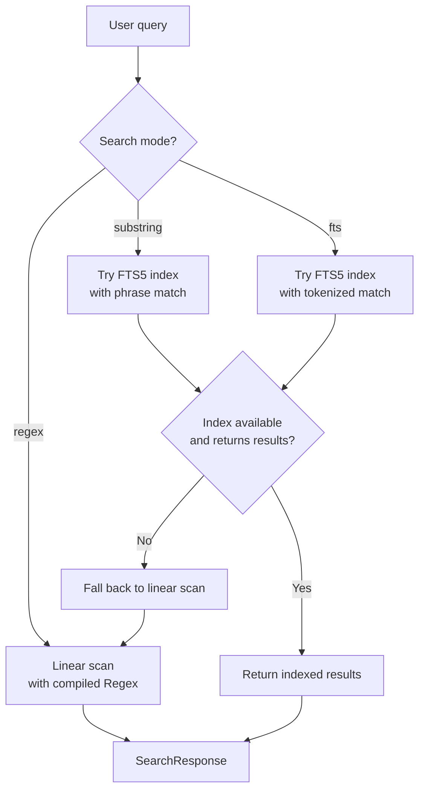
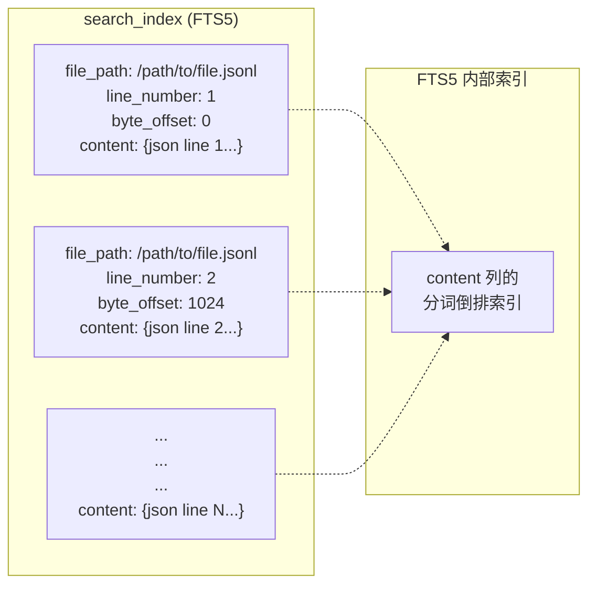
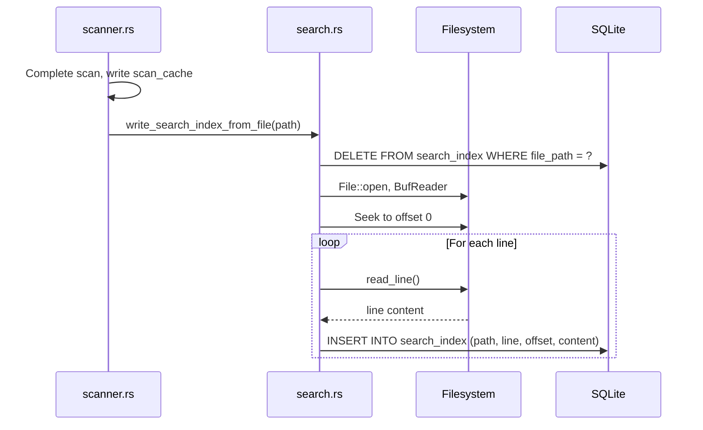
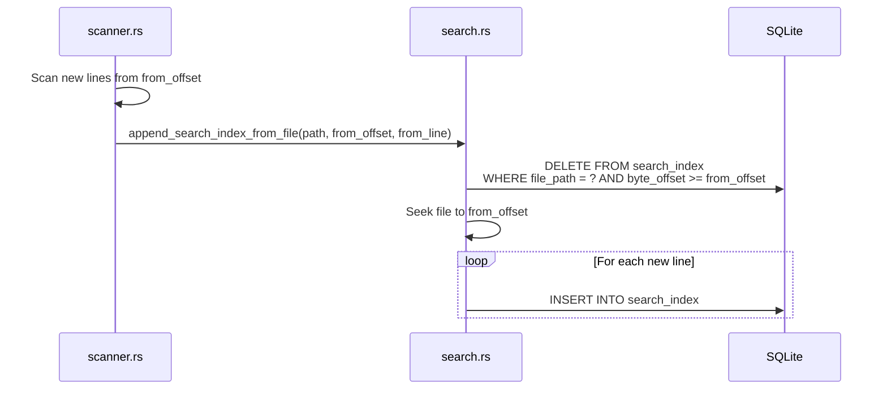
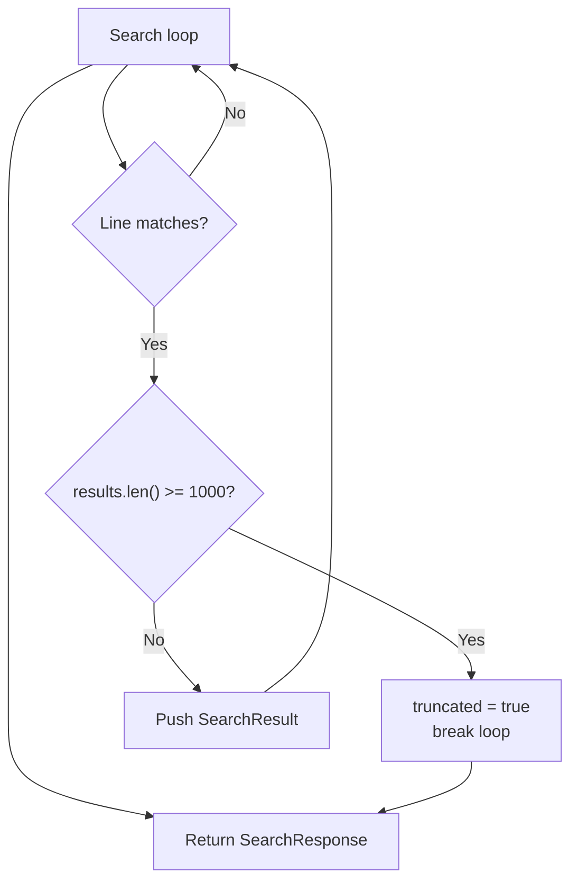
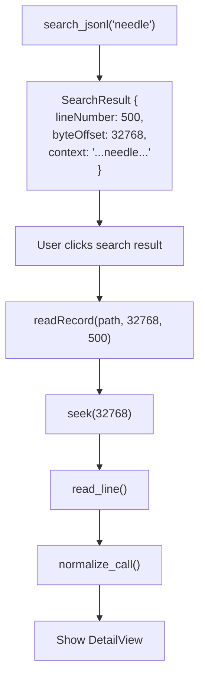

# 搜索引擎

PromptLens 提供对 JSONL 文件的全文搜索，支持三种模式：`substring`（子串）、`fts`（全文搜索）和 `regex`（正则表达式）。`substring` 和 `fts` 模式使用在扫描阶段构建的 FTS5 索引进行快速查找。`regex` 模式始终使用编译后的 `Regex` 模式进行线性扫描。

## 搜索模式



### 模式对比

| 模式 | 查询处理 | 使用索引 | 速度 | 适用场景 |
| --- | --- | --- | --- | --- |
| `substring` | 用 `"引号"` 包裹 | FTS5 | 快速 | 在内容中查找精确短语 |
| `fts` | 原样传递（分词） | FTS5 | 快速 | 基于分词的词语匹配 |
| `regex` | 编译为 `Regex` | 无 | 较慢 | 复杂模式匹配 |

### 各模式使用场景

- **`substring`** -- 最适合查找精确文本，如错误消息、模型名称或特定短语。FTS5 短语匹配即使在大文件上也非常快速。
- **`fts`** -- 最适合查找包含多个词语的文档，不考虑顺序。FTS5 对查询进行分词并匹配包含所有分词的文档。
- **`regex`** -- 最适合复杂模式，如 UUID、时间戳或自定义格式。始终使用线性扫描，因为 FTS5 不支持正则查询。

## FTS5 索引结构

搜索索引是 SQLite 缓存数据库中的 FTS5 虚拟表：

```sql
CREATE VIRTUAL TABLE IF NOT EXISTS search_index USING fts5(
    file_path UNINDEXED,
    line_number UNINDEXED,
    byte_offset UNINDEXED,
    content
)
```



| 列 | 是否索引 | 用途 |
|--------|----------|---------|
| `file_path` | 否（UNINDEXED） | 将搜索范围限定到特定文件 |
| `line_number` | 否（UNINDEXED） | 在结果中返回用于记录查找 |
| `byte_offset` | 否（UNINDEXED） | 前端用于调用 `readRecord()` |
| `content` | 是（FTS5） | 完整的 JSON 行文本，由 FTS5 分词 |

前三列上的 `UNINDEXED` 关键字意味着 FTS5 不对它们进行分词或索引，从而节省存储空间并提高写入性能。它们仅用于过滤和结果构建。

### 为什么选择 FTS5？

FTS5 是 SQLite 内置的全文搜索引擎。考虑过的替代方案：

| 方案 | 优点 | 缺点 |
|----------|------|------|
| **FTS5** | 内置于 SQLite，快速分词搜索，无外部依赖 | 查询语法相比 Elasticsearch 有限 |
| **Elasticsearch** | 功能齐全，支持复杂查询 | 外部依赖，需要单独进程 |
| **仅线性扫描** | 简单，无需索引维护 | 在大文件上速度慢 |
| **Tantivy** | Rust 原生，速度快 | 增加大型依赖，集成复杂 |

FTS5 胜出是因为 PromptLens 已经使用 SQLite 进行缓存，因此 FTS5 在不增加任何额外依赖的同时提供了快速的索引搜索。

## 索引构建

### 全量索引构建

在全量扫描期间，所有行处理完成后，搜索索引从头构建：

```rust
// file: src-tauri/src/search.rs:13
pub(crate) fn write_search_index_from_file(file_path: &str) -> Result<(), String> {
    let conn = open_cache()?;
    conn.execute(
        "DELETE FROM search_index WHERE file_path = ?1",
        params![file_path],
    )?;
    index_file_from_offset(&conn, file_path, 0, 0)
}
```



先删除再插入的模式确保索引的清洁。全量扫描期间没有增量构建 -- 所有行按顺序索引。

### 索引构建代码

核心索引函数从文件中读取行并插入到 FTS5 表中：

```rust
// file: src-tauri/src/search.rs:37
fn index_file_from_offset(
    conn: &rusqlite::Connection,
    file_path: &str,
    from_offset: u64,
    from_line_number: usize,
) -> Result<(), String> {
    let file = File::open(file_path)?;
    let mut reader = BufReader::new(file);
    reader.seek(SeekFrom::Start(from_offset))?;
    let mut line = String::new();
    let mut byte_offset = from_offset;
    let mut line_number = from_line_number;
    loop {
        line.clear();
        let bytes_read = reader.read_line(&mut line)?;
        if bytes_read == 0 { break; }
        line_number += 1;
        let current_offset = byte_offset;
        byte_offset += bytes_read as u64;
        let content = line.trim();
        if !content.is_empty() {
            conn.execute(
                "INSERT INTO search_index (file_path, line_number, byte_offset, content)
                 VALUES (?1, ?2, ?3, ?4)",
                params![file_path, line_number as i64, current_offset as i64, content],
            )?;
        }
    }
    Ok(())
}
```

### 增量索引构建

当文件增长并运行增量扫描时，仅索引新行：

```rust
// file: src-tauri/src/search.rs:23
pub(crate) fn append_search_index_from_file(
    file_path: &str,
    from_offset: u64,
    from_line_number: usize,
) -> Result<(), String> {
    let conn = open_cache()?;
    conn.execute(
        "DELETE FROM search_index WHERE file_path = ?1 AND byte_offset >= ?2",
        params![file_path, from_offset as i64],
    )?;
    index_file_from_offset(&conn, file_path, from_offset, from_line_number)
}
```



`DELETE ... WHERE byte_offset >= from_offset` 删除追加点处及之后的所有行。这处理了之前的增量构建在写入过程中被中断的边界情况。

## 搜索执行流程

### 索引搜索（`substring` 和 `fts` 模式）

```mermaid
sequenceDiagram
    participant Cmd as commands.rs
    participant Search as search.rs
    participant SQLite as SQLite

    Cmd->>Search: search_jsonl_inner(path, query, "substring")
    Search->>Search: needle = query.trim().to_lowercase()
    Search->>Search: mode != "regex", try indexed
    Search->>Search: search_indexed(path, needle, "substring")

    Search->>SQLite: open_cache()
    Search->>Search: match_query = '"needle"' (phrase match)
    Search->>SQLite: SELECT line_number, byte_offset, substr(content, 1, 240)
    Note over SQLite: FROM search_index WHERE file_path = ?<br/>AND content MATCH ? LIMIT 1001

    loop For each row
        SQLite-->>Search: (line_number, byte_offset, content_preview)
        Search->>Search: Push SearchResult
        alt results >= MAX_SEARCH_RESULTS (1000)
            Search->>Search: truncated = true; break
        end
    end

    Search-->>Cmd: Some(SearchResponse { indexed: true })
```

### FTS 与子串查询构建

`fts` 和 `substring` 模式之间的区别在于 FTS5 `MATCH` 查询的构建方式：

```mermaid
flowchart TD
    Query["Query: 'hello world'"] --> Mode{"Mode?"}
    Mode -->|fts| FtsQuery["MATCH query: hello world<br/>(tokenized: matches documents<br/>containing both 'hello' AND 'world')"]
    Mode -->|substring| SubQuery["MATCH query: \"hello world\"<br/>(phrase match: matches documents<br/>containing the exact phrase)"]
```

对于 `substring` 模式，查询被包裹在双引号中以创建短语查询。查询中的任何双引号通过加倍进行转义（`"` 变为 `""`）。

### 线性扫描回退

当 FTS5 索引不可用时（首次扫描、已清除缓存或 `regex` 模式），执行线性扫描：

```rust
// file: src-tauri/src/search.rs:113
let file = File::open(&file_path)?;
let total_bytes = fs::metadata(&file_path)?.len();
let mut reader = BufReader::with_capacity(256 * 1024, file);
```

```mermaid
sequenceDiagram
    participant Search as search.rs
    participant FS as Filesystem

    Search->>FS: File::open + BufReader(256KB buffer)
    loop For each line
        Search->>FS: read_line()
        FS-->>Search: line bytes
        Search->>Search: Track byte_offset

        alt mode == "regex"
            Search->>Search: regex.is_match(line)
        else mode == "substring" (fallback)
            Search->>Search: line.to_lowercase().contains(needle)
        end

        alt Match found
            Search->>Search: Calculate match position
            Search->>Search: Extract context window
            Search->>Search: Push SearchResult
        end

        alt results >= MAX_SEARCH_RESULTS
            Search->>Search: truncated = true; break
        end

        alt Every 250 lines
            Search->>Search: emit("search-progress")
        end
    end
```

256KB 读取缓冲区（`BufReader::with_capacity(256 * 1024, file)`）通过一次读取大块数据来减少系统调用次数。这对线性扫描很重要，因为性能瓶颈在于 I/O 而非字符串匹配。

## 上下文提取

每个搜索结果包含一个围绕匹配项的上下文片段。索引模式和线性模式的提取逻辑不同。

### 索引上下文

对于 FTS5 索引搜索，上下文来自存储的内容：

```sql
substr(content, 1, 240)
```

这返回该行的前 240 个字符。由于 FTS5 存储了完整的行内容，这只是对存储文本的简单子串操作。

### 线性扫描上下文

对于线性扫描，围绕匹配位置使用字符计数窗口提取上下文：


```
|<-- 80 字符 -->|<-- 匹配项 -->|<-- 120 字符 -->|
                  ^^^^^^^^^^^^
                  匹配位置
```

对于 `regex` 模式，匹配位置来自 `Regex::find()`。对于 `substring` 模式，位置来自对小写行的 `str::find()`。上下文在返回前会去除首尾空白。

### 为什么使用不对称上下文窗口？

上下文使用匹配前 80 个字符和匹配后 120 个字符。这种不对称是有意为之的：

- **前（80 字符）** -- 足以显示匹配前的 JSON 键或字段名，提供匹配字段的上下文。
- **后（120 字符）** -- 足以显示匹配值的开头，通常比前面的内容更有用。

## 结果限制

所有搜索模式的上限为 `MAX_SEARCH_RESULTS`（1000）：

```rust
// file: src-tauri/src/types.rs:6
pub(crate) const MAX_SEARCH_RESULTS: usize = 1000;
```



当结果被截断时，`SearchResponse.truncated` 标志被设置为 `true`。前端使用此标志显示"显示前 1000 条结果"的指示器。

### 为什么限制 1000 条结果？

1000 条结果的限制存在以下几个原因：

1. **UI 性能** -- 在日志列表中渲染 1000+ 条搜索结果会导致明显的延迟
2. **内存** -- 每个 `SearchResult` 包含一个上下文字符串，因此 1000 条结果是合理的上限
3. **相关性** -- 超过 1000 条结果后，用户应该优化查询而非滚动查看更多匹配

## 取消操作

搜索支持通过 `AtomicBool` 标志进行取消，该标志在命令处理器和搜索循环之间共享：

```mermaid
sequenceDiagram
    participant UI as React
    participant Cmd as commands.rs
    participant Search as search.rs

    UI->>Cmd: invoke("cancel_search")
    Cmd->>Cmd: state.cancel_search.store(true, Relaxed)
    Note over Search: Next loop iteration
    Search->>Search: cancel_flag.load(Relaxed) == true
    Search->>Search: cancelled = true; break
    Search-->>UI: SearchResponse { cancelled: true }
```

取消标志在每次行迭代时检查，因此即使对于大文件也能快速响应取消操作。

## 搜索响应结构

返回给前端的 `SearchResponse` 包含：

```typescript
// file: src/types.ts:114
export type SearchResponse = {
  results: SearchResult[];    // 最多 1000 条匹配
  truncated: boolean;         // 如果结果被截断则为 true
  cancelled: boolean;         // 如果用户取消则为 true
  durationMs: number;         // 搜索实际耗时
  indexed: boolean;           // 如果使用了 FTS5 索引则为 true
};

export type SearchResult = {
  lineNumber: number;         // 从 1 开始的行号
  byteOffset: number;         // 用于 readRecord() 的字节偏移
  context: string;            // 周围文本片段
};
```

每个结果中的 `byteOffset` 允许前端在用户点击搜索结果时调用 `readRecord(filePath, byteOffset, lineNumber)` 加载完整的规范化记录 -- 利用了列表视图使用的相同字节偏移索引。



## 性能特征

| 场景 | 复杂度 | 典型时间（10k 行） |
| --- | --- | --- |
| FTS5 索引搜索 | O(k) | < 10ms |
| 线性子串搜索 | O(n) | ~50-200ms |
| 线性正则搜索 | O(n) | ~100-500ms |
| 索引构建（全量） | O(n) | ~200-500ms |
| 索引构建（增量） | O(delta) | < 50ms |

FTS5 性能取决于匹配结果的数量（k）而非总行数（n），使其在大文件上的常见查询显著更快。线性扫描使用 256KB 读取缓冲区以实现高效 I/O。
