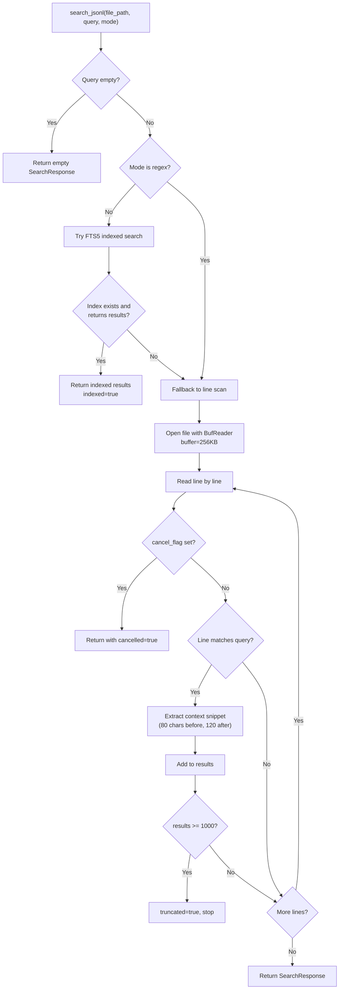
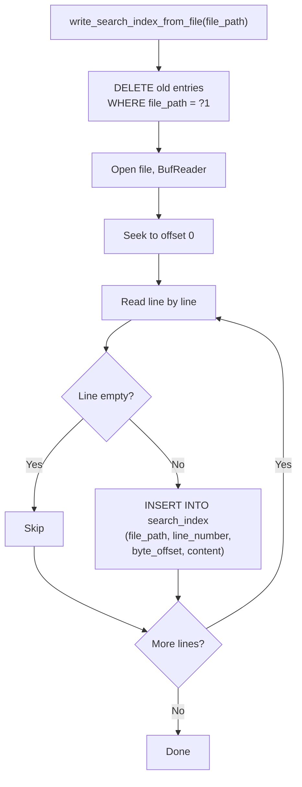
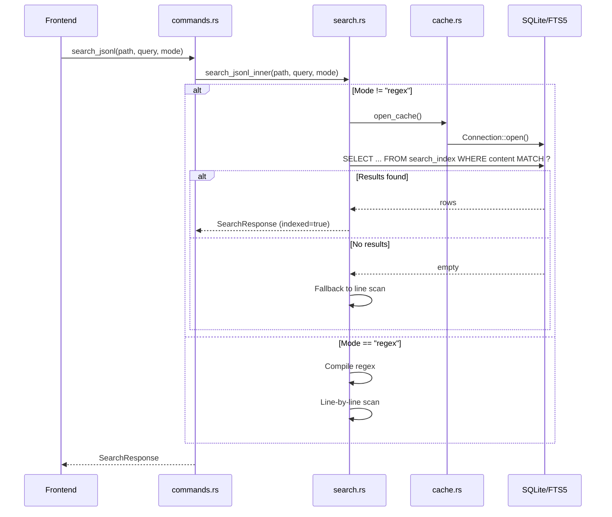

# 搜索模块

搜索模块提供跨 JSONL 文件的全文搜索，使用 SQLite FTS5 索引并支持回退到逐行扫描。支持三种搜索模式：子串、FTS 和正则。该模块在 `search.rs` 中实现。

## 搜索模式

| 模式 | 行为 | 使用索引 | 查询格式 |
|------|----------|------------|-------------|
| `substring` | 不区分大小写的短语匹配 | FTS5 短语查询 | `"gpt-4o"`（带引号） |
| `fts` | 分词全文搜索 | FTS5 分词查询 | `gpt AND error` |
| `regex` | 正则表达式匹配 | 无（行扫描） | 原始正则模式 |

## 搜索流程



```rust
// file: src-tauri/src/search.rs:80
pub(crate) fn search_jsonl_inner(
    file_path: String,
    query: String,
    mode: &str,
    app: Option<&AppHandle>,
    cancel_flag: Option<&AtomicBool>,
) -> Result<SearchResponse, String> {
    let started = Instant::now();
    let needle = query.trim().to_lowercase();
    if needle.is_empty() {
        return Ok(SearchResponse { results: Vec::new(), truncated: false, cancelled: false, duration_ms: 0, indexed: false });
    }

    // 对 substring 和 fts 模式尝试索引搜索
    if mode != "regex" {
        if let Ok(Some(indexed)) = search_indexed(&file_path, &needle, mode, started, app) {
            return Ok(indexed);
        }
    }

    // Regex 模式：编译模式
    let re = if mode == "regex" {
        Some(Regex::new(&query).map_err(|e| format!("Invalid regex: {e}"))?)
    } else {
        None
    };
    // ... 逐行扫描
}
```

## FTS5 索引

### 索引结构

搜索索引是一个 FTS5 虚拟表：

```sql
-- file: src-tauri/src/cache.rs:57
CREATE VIRTUAL TABLE IF NOT EXISTS search_index USING fts5(
    file_path UNINDEXED,
    line_number UNINDEXED,
    byte_offset UNINDEXED,
    content
)
```

只有 `content` 列被索引用于全文搜索。其他列被存储但不分词，允许它们在查询结果中返回而不参与搜索。

### 索引构建

当文件被扫描时，全部内容被索引：



```rust
// file: src-tauri/src/search.rs:13
pub(crate) fn write_search_index_from_file(file_path: &str) -> Result<(), String> {
    let conn = open_cache()?;
    conn.execute("DELETE FROM search_index WHERE file_path = ?1", params![file_path])?;
    index_file_from_offset(&conn, file_path, 0, 0)
}
```

### 增量索引更新

对于增量扫描，只索引新内容：

```rust
// file: src-tauri/src/search.rs:23
pub(crate) fn append_search_index_from_file(
    file_path: &str,
    from_offset: u64,
    from_line_number: usize,
) -> Result<(), String> {
    let conn = open_cache()?;
    // 删除追加点处及之后的条目
    conn.execute(
        "DELETE FROM search_index WHERE file_path = ?1 AND byte_offset >= ?2",
        params![file_path, from_offset as i64],
    )?;
    index_file_from_offset(&conn, file_path, from_offset, from_line_number)
}
```

这处理了文件被截断并重写的情况：在索引新内容之前清除 `from_offset` 之后的过期条目。

### FTS5 查询构建

查询格式取决于搜索模式：

```rust
// file: src-tauri/src/search.rs:214
let match_query = if mode == "fts" {
    query.to_string()           // 分词查询："gpt AND error"
} else {
    format!("\"{}\"", query.replace('"', "\"\""))  // 短语查询："\"gpt-4o\""
};
```

子串模式将查询包裹在双引号中以强制短语匹配，并通过加倍转义任何嵌入的引号。

## 索引搜索

`search_indexed()` 函数查询 FTS5 表：

```sql
-- file: src-tauri/src/search.rs:220
SELECT line_number, byte_offset, substr(content, 1, 240)
FROM search_index
WHERE file_path = ?1 AND content MATCH ?2
LIMIT ?3
```

```rust
// file: src-tauri/src/search.rs:205
fn search_indexed(
    file_path: &str,
    query: &str,
    mode: &str,
    started: Instant,
    app: Option<&AppHandle>,
) -> Result<Option<SearchResponse>, String> {
    let conn = open_cache()?;
    let match_query = if mode == "fts" { query.to_string() }
                      else { format!("\"{}\"", query.replace('"', "\"\"")) };
    let mut stmt = conn.prepare(
        "SELECT line_number, byte_offset, substr(content, 1, 240)
         FROM search_index WHERE file_path = ?1 AND content MATCH ?2 LIMIT ?3",
    )?;
    let mut rows = stmt.query(params![file_path, match_query, (MAX_SEARCH_RESULTS + 1) as i64])?;
    // ... 收集结果
}
```

关键细节：
- 上下文通过 `substr()` 截断为 240 个字符
- 结果限制为 `MAX_SEARCH_RESULTS + 1` 以检测截断
- 每 100 条结果发出进度事件
- 如果 FTS 查询返回零结果，返回 `None` 以信号回退

## 行扫描回退

当 FTS5 不可用时（正则模式或缺失索引），扫描器回退到逐行读取：

### 子串匹配

```rust
let needle = query.trim().to_lowercase();
let matched = line.to_lowercase().contains(&needle);
```

### 正则匹配

```rust
let re = Regex::new(&query).map_err(|e| format!("Invalid regex: {e}"))?;
let matched = re.is_match(&line);
```

### 上下文提取

当找到匹配时，围绕匹配项提取上下文片段：


```rust
// file: src-tauri/src/search.rs:162
let (start_chars, match_len) = if let Some(re) = &re {
    if let Some(m) = re.find(&line) {
        let prefix = &line[..m.start()];
        (prefix.chars().count(), m.as_str().chars().count())
    } else { (0, 0) }
} else {
    let haystack = line.to_lowercase();
    if let Some(index) = haystack.find(&needle) {
        (haystack[..index].chars().count(), needle.chars().count())
    } else { (0, 0) }
};
let context_start = start_chars.saturating_sub(80);
let context_end = start_chars + match_len + 120;
let context = line.chars().skip(context_start)
    .take(context_end.saturating_sub(context_start))
    .collect::<String>();
```

上下文窗口为匹配前 80 个字符和匹配后 120 个字符，提供足够的周围文本让用户理解匹配位置。

## 搜索响应

```rust
// file: src-tauri/src/types.rs:75
struct SearchResult {
    line_number: usize,          // 从 1 开始的行号
    byte_offset: u64,            // 用于 O(1) 记录访问
    context: String,             // 匹配项周围的片段
}

// file: src-tauri/src/types.rs:82
struct SearchResponse {
    results: Vec<SearchResult>,  // 最多 1000 条结果
    truncated: bool,             // 如果结果达到限制则为 true
    cancelled: bool,             // 如果用户取消则为 true
    duration_ms: u128,           // 搜索持续时间
    indexed: bool,               // 如果使用了 FTS5 则为 true
}
```

## 取消

搜索在每次行迭代开始时检查 `AtomicBool` 标志：

```rust
// file: src-tauri/src/search.rs:126
if cancel_flag.is_some_and(|flag| flag.load(Ordering::Relaxed)) {
    cancelled = true;
    break;
}
```

前端通过 `cancel_search` 命令设置此标志。

## 进度事件

在行扫描搜索期间，每 250 行发出进度事件：

```rust
// file: src-tauri/src/search.rs:142
if line_number == 1 || line_number.is_multiple_of(250) {
    if let Some(app) = app {
        let _ = app.emit("search-progress", ProgressEvent {
            processed_bytes: byte_offset,
            total_bytes,
            line_number,
        });
    }
}
```

在索引搜索期间，每 100 条结果发出进度事件。

## 结果限制

```rust
// file: src-tauri/src/types.rs:6
pub(crate) const MAX_SEARCH_RESULTS: usize = 1000;
```

当达到此限制时，`truncated` 被设置为 `true` 并停止搜索。这防止了大文件中非常常见的搜索词导致过多的内存使用。

## 性能特征

| 场景 | 性能 | 备注 |
|----------|------------|-------|
| FTS5 索引（子串） | ~1-10 ms | 取决于结果数量 |
| FTS5 索引（FTS） | ~1-10 ms | 基于分词的匹配 |
| 行扫描（子串） | 100 MB 文件约 1-5 秒 | 完整文件读取 |
| 行扫描（正则） | 100 MB 文件约 2-10 秒 | 正则开销 |
| 索引构建 | 100 MB 文件约 2-5 秒 | 每行一次 INSERT |
| 索引追加 | 与新数据量成正比 | 仅索引新行 |

## 模块交互


