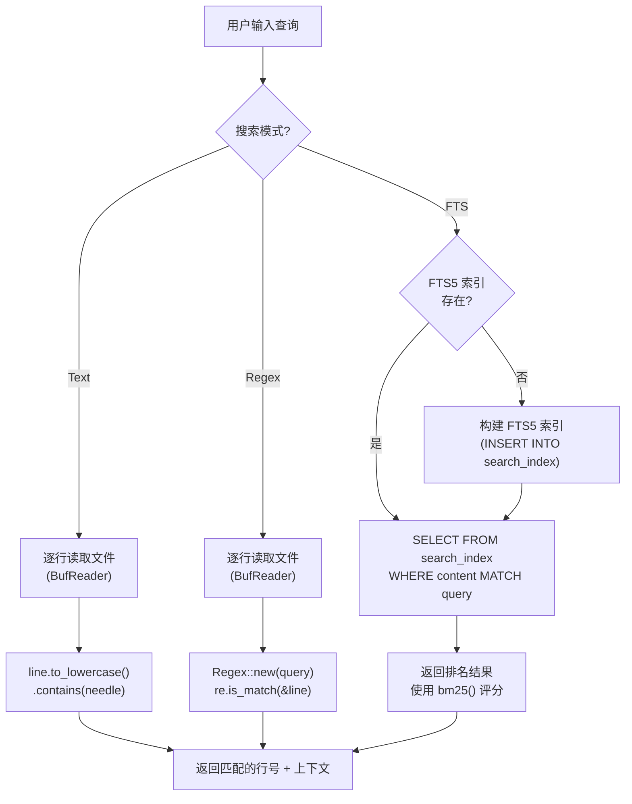
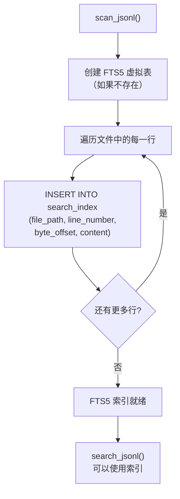
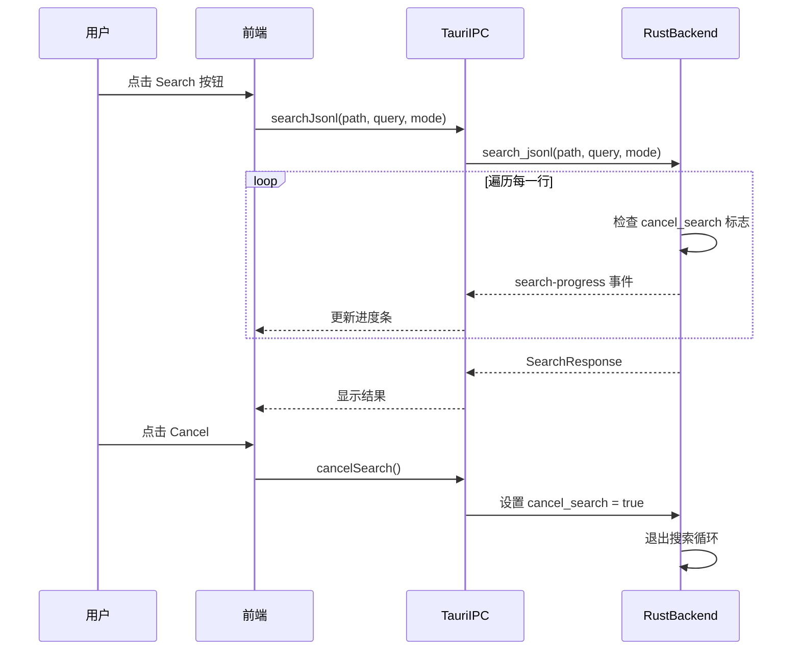
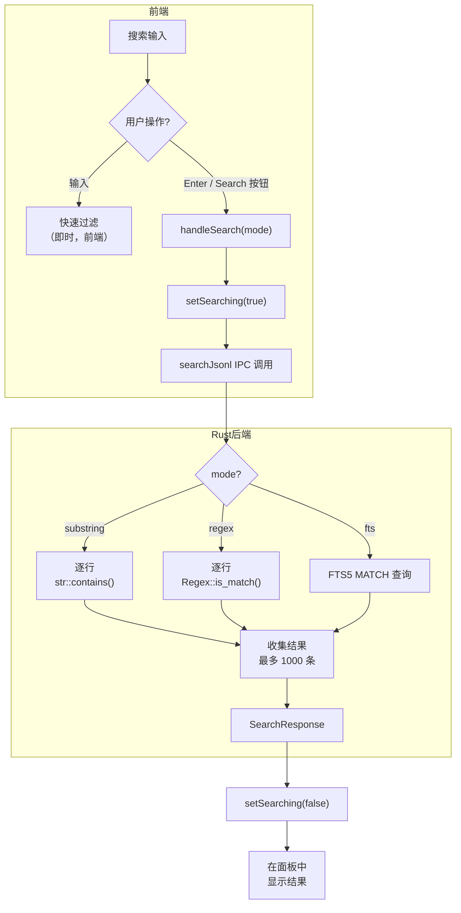
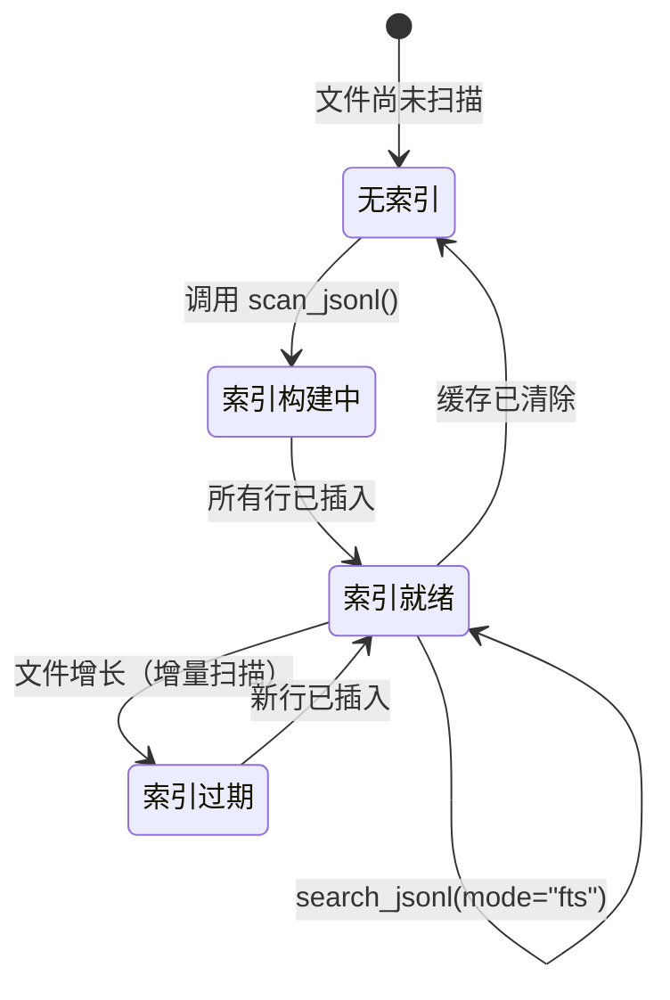
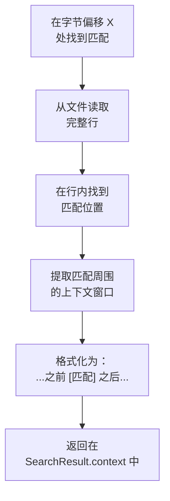

# 搜索

PromptLens 提供两级搜索功能：用于缩小记录列表范围的快速本地过滤器，以及用于在整个文件中查找内容的全文搜索引擎。

## 快速过滤（记录列表）

"记录"标签页顶部的搜索输入框充当快速过滤器。当您输入时，记录列表会缩小范围，仅显示元数据与查询匹配的记录。

过滤器搜索以下字段：

- 模型名称
- 提供商名称
- 预览文本（第一条用户消息摘要）
- 时间戳
- 状态
- Trace ID
- Session ID
- Request ID

此过滤器完全在前端运行，是即时生效的。过滤逻辑是简单的不区分大小写的子字符串匹配：

```ts
// file: src/app/store.ts
const query = appStore.query.toLowerCase();
const filtered = summaries.filter((s) => {
  const hay = [
    s.model, s.provider, s.preview, s.timestamp,
    s.status, s.traceId, s.sessionId, s.requestId,
  ].filter(Boolean).join(" ").toLowerCase();
  return hay.includes(query);
});
```


## 全文搜索

要搜索消息内容，请使用全文搜索引擎。输入查询，选择模式，然后按 `Enter` 或点击"Search"。

### 搜索模式

| 模式 | 选择器 | 说明 |
|------|--------|------|
| **Text** | `substring` | 对原始 JSON 行进行简单子字符串匹配 |
| **Regex** | `regex` | 对原始 JSON 行进行正则表达式匹配 |
| **FTS** | `fts` | SQLite FTS5 全文搜索，支持分词和排名 |

### 各模式工作原理



### Text 模式

Text 模式执行不区分大小写的子字符串搜索。在 Rust 中，这使用 `str::contains()` 进行小写转换后匹配：

```rust
// file: src-tauri/src/search.rs:155-160
let matched = if let Some(re) = &re {
    re.is_match(&line)
} else {
    line.to_lowercase().contains(&needle)
};
```

**优点：** 快速，无需索引，立即可用。
**缺点：** 无排名，无分词，匹配 JSON 结构的任何部分。

### Regex 模式

Regex 模式使用 Rust `regex` crate 对每行应用正则表达式：

```rust
// file: src-tauri/src/search.rs:107-112
let re = if mode == "regex" {
    Some(Regex::new(&query).map_err(|e| format!("Invalid regex: {e}"))?)
} else {
    None
};
```

如果正则表达式无效，错误会传播到前端并显示为 toast 通知。

**优点：** 灵活的模式匹配，可以针对特定字段。
**缺点：** 在大文件上比子字符串搜索慢，需要正则表达式知识。

### FTS 模式（全文搜索）

FTS 模式使用 SQLite 的 FTS5 扩展。索引通过将每行内容插入 FTS5 虚拟表来构建：

```rust
// file: src-tauri/src/search.rs:64-68
conn.execute(
    "INSERT INTO search_index (file_path, line_number, byte_offset, content)
     VALUES (?1, ?2, ?3, ?4)",
    params![file_path, line_number as i64, current_offset as i64, content],
)
```

对于 FTS 模式，查询直接传递给 SQLite 的 MATCH 运算符：

```rust
// file: src-tauri/src/search.rs:214-218
let match_query = if mode == "fts" {
    query.to_string()
} else {
    format!("\"{}\"", query.replace('"', "\"\""))
};
```

FTS5 查询语法支持：

| 语法 | 示例 | 匹配结果 |
|------|------|---------|
| 简单词项 | `quantum computing` | 包含两个词的记录 |
| 短语查询 | `"error rate"` | 包含精确短语的记录 |
| 前缀 | `comput*` | 以 "comput" 开头的词 |
| 布尔 AND | `error AND timeout` | 同时包含两个词项的记录 |
| 布尔 OR | `gpt-4 OR claude` | 包含任一词项的记录 |
| 布尔 NOT | `error NOT timeout` | 包含 "error" 但不包含 "timeout" 的记录 |

### FTS 索引构建

FTS 索引是增量构建的。当文件首次扫描时，后端创建 `search_index` 表并填充数据：



## 搜索结果

运行搜索后，结果显示在记录列表上方的面板中：

```
+--------------------------------------------------+
| 42 matches          Indexed              [x]     |
+--------------------------------------------------+
| [Line 15]  ...prompt mentions "error rate"...     |
| [Line 23]  ...response discusses "error rate"...  |
| [Line 67]  ...tool call with "error_rate" param...|
+--------------------------------------------------+
```

| 元素 | 说明 |
|------|------|
| **匹配数量** | 匹配记录的总数 |
| **索引状态** | "Indexed"（FTS 模式使用了索引）或 "Streaming"（逐行扫描） |
| **行号** | 找到匹配的行 |
| **上下文** | 匹配内容的片段 |

### 跳转到结果

点击搜索结果会触发 `jumpToResult()`，该函数读取匹配字节偏移处的记录并将记录列表滚动到该位置：

```ts
// file: src/app/store.ts
jumpToResult: async (result, file) => {
  if (!file) return;
  const summary = file.summaries.find(
    (s) => s.lineNumber === result.lineNumber
  );
  if (summary) {
    await get().handleSelect(summary);
  }
},
```

## 搜索进度与取消

搜索操作通过 Tauri 事件报告进度：

```tsx
// file: src/app/store.ts:521-533
handleSearch: async (mode = "substring") => {
    set({ searching: true, searchProgress: null });
    try {
      const response = await searchJsonl(file.filePath, term, mode);
      get().updateActiveSessionTab({ searchResults: response.results });
      get().updateActiveTab({
        lastSearchMs: response.durationMs,
        lastSearchIndexed: response.indexed,
      });
      if (response.truncated) {
        useAppStore.getState().setError(
          "Search stopped after 1,000 matches."
        );
      }
    } finally {
      set({ searching: false, searchProgress: null });
    }
},
```

搜索结果的最大数量限制为 1,000：

```rust
// file: src-tauri/src/types.rs:6
pub(crate) const MAX_SEARCH_RESULTS: usize = 1000;
```

### 取消搜索

长时间运行的搜索可以通过 `cancel_search` 命令取消：

```rust
// file: src-tauri/src/types.rs:12
pub(crate) cancel_search: AtomicBool,
```

搜索循环在迭代之间检查此标志，如果设置为 `true` 则提前退出。



## 搜索响应类型

Rust 后端返回 `SearchResponse` 对象：

```rust
// file: src-tauri/src/types.rs:82-90
pub(crate) struct SearchResponse {
    pub(crate) results: Vec<SearchResult>,
    pub(crate) truncated: bool,
    pub(crate) cancelled: bool,
    pub(crate) duration_ms: u128,
    pub(crate) indexed: bool,
}
```

| 字段 | 说明 |
|------|------|
| `results` | 匹配记录数组，包含行号、字节偏移和上下文 |
| `truncated` | 如果结果超过 1,000 条限制则为 `true` |
| `cancelled` | 如果用户取消了搜索则为 `true` |
| `duration_ms` | 搜索持续时间（毫秒） |
| `indexed` | 如果 FTS 模式使用了预构建索引则为 `true` |

## 搜索技巧

| 技巧 | 说明 |
|------|------|
| 使用 Text 模式进行快速查找 | 简单关键词搜索的最快模式 |
| 使用 FTS 模式搜索内容 | 搜索消息文本并带排名的最佳选择 |
| 使用 Regex 模式进行结构化查询 | 针对特定 JSON 字段或模式 |
| 与过滤器组合使用 | 先按提供商/模型过滤，然后在结果中搜索 |
| 清除搜索以重置 | 点击 x 按钮或清除搜索框以返回完整列表 |

## 限制

| 限制 | 详情 |
|------|------|
| FTS 索引大小 | FTS 索引大约使文件内容的存储翻倍 |
| 正则表达式复杂度 | 非常复杂的正则表达式在大文件上可能很慢 |
| 上下文窗口 | 搜索结果显示固定大小的上下文片段，而非完整消息 |
| 无字段特定搜索 | 无法仅在特定 JSON 字段内搜索 |
| 单文件搜索 | 搜索一次只操作一个文件 |
| 最多 1,000 条结果 | 搜索在 1,000 条匹配后被截断 |

## 搜索架构图

完整的搜索架构跨越前端和后端：



## FTS5 索引生命周期

FTS5 索引遵循与扫描缓存相关的特定生命周期：



## 搜索性能特征

| 模式 | 时间复杂度 | 空间开销 | 最适合 |
|------|-----------|---------|--------|
| Text | O(n)，n = 文件大小 | 无 | 快速关键词查找 |
| Regex | O(n * r)，r = 正则表达式复杂度 | 无 | 模式匹配 |
| FTS | O(k)，k = 匹配文档数 | 约 2 倍文件大小 | 全文内容搜索 |

## 组合搜索与过滤器

搜索和过滤器协同工作。推荐的工作流：

1. 首先，应用快速过滤器（提供商、模型、状态）缩小记录列表范围。
2. 然后，在过滤后的集合中运行全文搜索。
3. 搜索在完整文件上运行，但结果与过滤列表一起显示。


## 搜索结果上下文片段

每条搜索结果包含一个上下文片段，显示匹配内容及其周围文本。上下文从匹配位置的原始 JSON 行中提取：



上下文窗口是匹配周围固定数量的字符，而非完整消息。这保持搜索结果面板紧凑，同时显示足够的上下文来识别每个匹配的相关性。

## 高级 FTS5 查询

对于高级用户，FTS5 支持高级查询语法：

| 查询 | 说明 | 示例匹配 |
|------|------|---------|
| `NEAR(error timeout, 5)` | 词项在 5 个令牌内 | `"error in timeout handling"` |
| `column:term` | 搜索特定列（如果已索引） | `content:error` |
| `term* AND NOT term2*` | 带排除的前缀匹配 | `"errors" 但不是 "error_handling"` |
| `"exact phrase" OR term` | 组合短语和词项查询 | `"rate limit" OR timeout` |

注意：PromptLens 将完整的 JSON 行索引为单个 `content` 列，因此列特定搜索针对的是整行内容。

## 相关页面

- [浏览记录](browsing-records.md) -- 过滤和排序记录列表
- [键盘快捷键](keyboard-shortcuts.md) -- `Ctrl+F` 聚焦搜索
- [导出](export.md) -- 导出搜索结果
