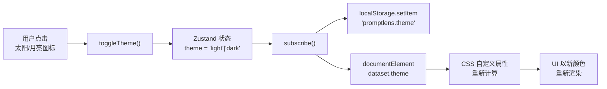
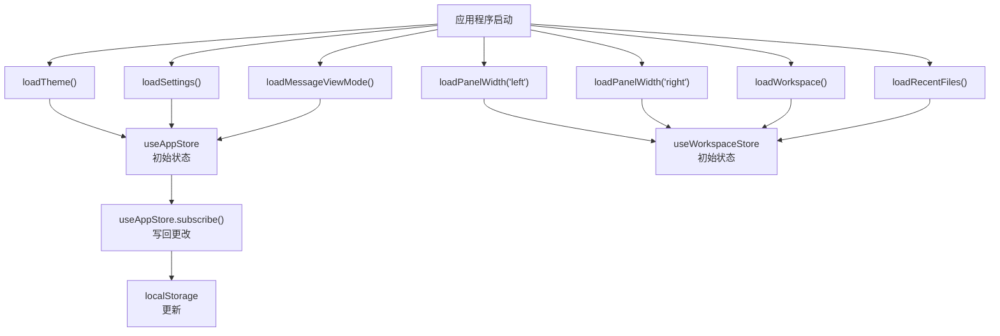
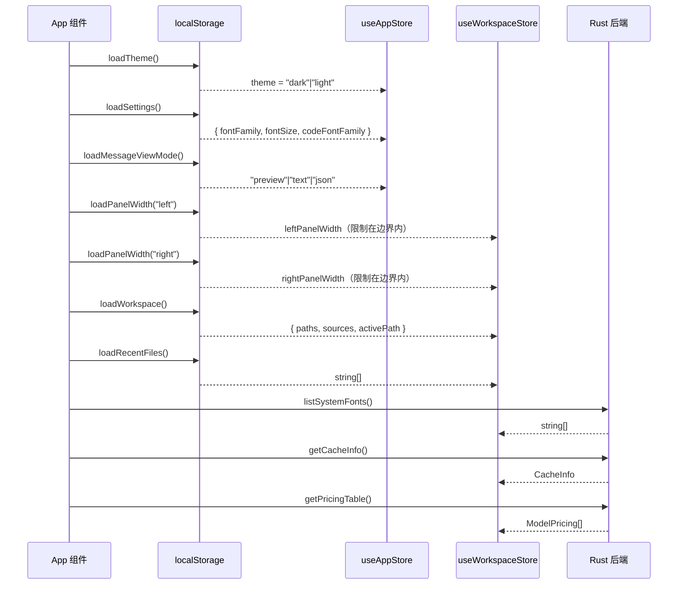

# 设置

PromptLens 提供了自定义应用程序视觉外观的设置。设置可通过标题栏中的 **Setting** 菜单访问。

## 主题

PromptLens 支持两种主题：**深色**和**浅色**。主题会影响应用程序中的所有颜色，包括背景、文字、边框和强调色。

### 切换主题

- 点击标题栏红绿灯区域的**太阳/月亮图标**。
- 主题偏好保存在本地存储中，跨会话持久化。

### 主题切换实现

主题切换同时更新 Zustand store 和 DOM：

```ts
// file: src/app/store.ts:202
toggleTheme: () =>
  set((s) => ({ theme: s.theme === "dark" ? "light" : "dark" })),
```

订阅机制将主题写入 `localStorage` 并更新 `<html>` 上的 `data-theme` 属性：

```ts
// file: src/app/store.ts:213-216
useAppStore.subscribe((state, prev) => {
  if (state.theme !== prev.theme) {
    document.documentElement.dataset.theme = state.theme;
    localStorage.setItem(THEME_KEY, state.theme);
  }
  // ...
});
```



### 主题实现

主题使用根元素上 `data-theme` 属性的 CSS 自定义属性（变量）实现。每个主题定义以下值：

- 背景颜色（面板、卡片、输入框）
- 文字颜色（主要、次要、弱化）
- 边框颜色
- 强调色（品牌蓝、成功绿、错误红）
- 状态圆点颜色
- 代码语法高亮颜色

```css
/* 来自 src/styles.css */
[data-theme="dark"] {
  --app-bg: #0f1117;
  --app-fg: #e2e4e9;
  --panel-bg: #161822;
  --card-bg: #1c1e2b;
  --border: #2a2d3a;
  --accent: #4a7bf7;
  --success: #22c55e;
  --error: #ef4444;
  --muted: #6b7280;
}

[data-theme="light"] {
  --app-bg: #ffffff;
  --app-fg: #1a1a2e;
  --panel-bg: #f5f5f7;
  --card-bg: #ffffff;
  --border: #e0e0e6;
  --accent: #3b6df5;
  --success: #16a34a;
  --error: #dc2626;
  --muted: #9ca3af;
}
```

## 字体设置

Setting 菜单提供三个字体控制项：

### UI 字体

控制所有用户界面文本（标签、按钮、菜单、记录卡片）使用的字体族。

| 选项 | 值 |
|------|-----|
| System | 使用系统默认无衬线字体栈 |
| 特定字体 | Inter、Arial、Noto Sans、DejaVu Sans 及其他已安装字体 |

字体列表由 Rust 后端通过 `list_system_fonts` 命令检测系统字体来填充。

```ts
// file: src/app/store.ts:206
listSystemFonts().then((fonts) =>
  useWorkspaceStore.setState({ systemFonts: fonts })
).catch(() => {});
```

### 字体大小

控制整个应用程序的基础字体大小。值以像素为单位。

| 属性 | 值 |
|------|-----|
| 最小值 | 11px |
| 最大值 | 18px |
| 默认值 | 13px |

字体大小通过 `--app-font-size` CSS 自定义属性应用。存储模块在加载时强制执行最小/最大边界：

```ts
// file: src/app/storage.ts:52-55
fontSize:
  typeof parsed.fontSize === "number" &&
  parsed.fontSize >= 11 &&
  parsed.fontSize <= 18
    ? parsed.fontSize
    : DEFAULT_SETTINGS.fontSize,
```

### 代码字体

控制代码块、JSON 视图和原始负载使用的字体族。

| 选项 | 值 |
|------|-----|
| System mono | 使用系统默认等宽字体栈 |
| 特定字体 | JetBrains Mono、Fira Code、Consolas 及其他已安装等宽字体 |

代码字体通过 `--code-font-family` CSS 自定义属性应用。

### 重置字体

点击 **Reset fonts** 按钮将所有字体设置恢复为默认值：

```ts
// file: src/app/types.ts
const DEFAULT_SETTINGS: AppSettings = {
  fontFamily: 'Inter, ui-sans-serif, system-ui, -apple-system, BlinkMacSystemFont, "Segoe UI", sans-serif',
  fontSize: 13,
  codeFontFamily: "ui-monospace, SFMono-Regular, Menlo, Consolas, monospace",
};
```

## 消息视图模式

消息视图模式（Preview、Text、JSON）在所有消息卡片之间共享，跨会话持久化。

```ts
// file: src/app/types.ts
export type MessageViewMode = "preview" | "text" | "json";
```

| 模式 | 说明 |
|------|------|
| **Preview** | 渲染带语法高亮、图片和工具卡片的 Markdown 内容 |
| **Text** | 显示不带 Markdown 渲染的纯文本内容 |
| **JSON** | 显示消息内容的原始 JSON 结构 |

详情请参阅[查看对话](viewing-conversations.md)。

## 面板宽度

左侧面板和右侧面板的宽度可通过拖动调整手柄来调整。这些宽度保存在本地存储中，下次启动时恢复。

| 面板 | 最小值 | 最大值 | 默认值 |
|------|--------|--------|--------|
| 左侧 | 260px | 560px | 340px |
| 右侧 | 300px | 窗口的 60% | 400px |
| 中间 | 200px | （填充剩余空间） | -- |

面板宽度存储在加载时强制执行边界：

```ts
// file: src/app/storage.ts:69-78
export function loadPanelWidth(side: "left" | "right", fallback: number): number {
  try {
    const raw = localStorage.getItem(`${PANEL_WIDTH_KEY}.${side}`);
    if (!raw) return fallback;
    const val = Number(raw);
    if (!Number.isFinite(val)) return fallback;
    return side === "left"
      ? Math.min(LEFT_MAX, Math.max(LEFT_MIN, val))
      : Math.max(RIGHT_MIN, val);
  } catch {
    return fallback;
  }
}
```

## 设置存储位置

所有设置存储在浏览器的 `localStorage` 中，键名如下：

| 键 | 内容 |
|----|------|
| `promptlens.theme` | "dark" 或 "light" |
| `promptlens.settings` | 包含 fontFamily、fontSize、codeFontFamily 的 JSON 对象 |
| `promptlens.messageViewMode` | "preview"、"text" 或 "json" |
| `promptlens.panelWidth.left` | 左侧面板宽度（像素） |
| `promptlens.panelWidth.right` | 右侧面板宽度（像素） |
| `promptlens.workspace` | 序列化的工作区状态（打开的标签页、活动标签页、来源） |
| `promptlens.recentFiles` | 最近文件路径的 JSON 数组 |

设置在应用程序启动时读取并立即应用。更改在您在 Setting 菜单中调整时实时生效。



## CSS 自定义属性

PromptLens 通过主应用程序外壳元素上的 CSS 自定义属性应用设置：

| 属性 | 来源 | 示例值 |
|------|------|--------|
| `--app-font-family` | UI 字体设置 | `"Inter", ui-sans-serif, system-ui` |
| `--app-font-size` | 字体大小设置 | `13px` |
| `--code-font-family` | 代码字体设置 | `ui-monospace, SFMono-Regular, Menlo` |

这些属性级联到所有子元素，确保整个应用程序的样式一致。

## 缓存管理

虽然不是视觉设置，但缓存管理可从 Open 菜单访问：

| 操作 | 说明 |
|------|------|
| **清除扫描缓存** | 从 SQLite 数据库中移除所有缓存的扫描结果。缓存路径显示在工具提示中。 |
| **重新扫描活动文件** | 强制对当前文件执行全新扫描，绕过缓存。 |

缓存存储在平台特定的位置：

| 平台 | 典型位置 |
|------|---------|
| macOS | `~/Library/Application Support/promptlens/` |
| Linux | `~/.local/share/promptlens/` 或 `~/.config/promptlens/` |
| Windows | `%APPDATA%\promptlens\` |

缓存使用带有 FTS5 的 SQLite 进行全文搜索索引。缓存大小取决于您扫描的文件数量和大小。

### 清除缓存

```ts
// file: src/app/store.ts
handleClearCache: async () => {
  await clearScanCache();
  const info = await getCacheInfo();
  set({ cacheInfo: info });
  app.addToast("Scan cache cleared.", "success");
},
```

## 性能考虑

| 设置 | 影响 |
|------|------|
| 大字体大小 | 虚拟列表中可见的记录略少 |
| 自定义字体 | 影响最小；字体在启动时加载一次 |
| 面板宽度 | 影响无需滚动即可看到的内容量 |
| 主题 | 深色和浅色之间无性能差异 |

## 设置的键盘快捷键

没有专门用于更改设置的键盘快捷键。所有设置都通过标题栏中的 Setting 菜单访问。主题可以通过红绿灯区域的太阳/月亮图标切换。

## 设置持久化

所有设置存储在浏览器的 `localStorage` API 中，这意味着：

- 设置在应用程序重启后持久化
- 设置特定于用户的操作系统账户
- 设置不会在机器之间同步
- 清除浏览器数据（在 Tauri webview 上下文中）会重置设置

Zustand store 在启动时从 `localStorage` 读取设置，并在更改时写回。这通过存储模块中的 `loadSettings()` 和 `saveSettings()` 函数透明地完成。

```ts
// file: src/app/store.ts:212-230
useAppStore.subscribe((state, prev) => {
  if (state.theme !== prev.theme) {
    document.documentElement.dataset.theme = state.theme;
    localStorage.setItem(THEME_KEY, state.theme);
  }
  if (state.settings !== prev.settings) {
    localStorage.setItem(SETTINGS_KEY, JSON.stringify(state.settings));
  }
  if (state.messageViewMode !== prev.messageViewMode) {
    localStorage.setItem(MESSAGE_VIEW_MODE_KEY, state.messageViewMode);
  }
  if (state.leftPanelWidth !== prev.leftPanelWidth) {
    savePanelWidth("left", state.leftPanelWidth);
  }
  if (state.rightPanelWidth !== prev.rightPanelWidth) {
    savePanelWidth("right", state.rightPanelWidth);
  }
});
```

## 无障碍功能

| 功能 | 说明 |
|------|------|
| 字体大小控制 | 视力障碍用户可将字体大小增加到 18px |
| 主题选择 | 浅色主题适用于明亮环境，深色主题适用于低光环境 |
| 系统字体 | 如果自定义字体不可用则回退到系统字体 |
| 键盘导航 | 所有设置控件均可通过键盘访问 |

## 高级：自定义 CSS

由于 PromptLens 使用 CSS 自定义属性，高级用户可以通过 Tauri webview 配置注入自定义样式。关键变量如下：

| 变量 | 默认值（深色） | 控制内容 |
|------|--------------|---------|
| `--app-bg` | `#0f1117` | 主背景颜色 |
| `--app-fg` | `#e2e4e9` | 主文字颜色 |
| `--panel-bg` | `#161822` | 面板背景 |
| `--card-bg` | `#1c1e2b` | 卡片背景 |
| `--border` | `#2a2d3a` | 边框颜色 |
| `--accent` | `#4a7bf7` | 品牌强调色 |
| `--success` | `#22c55e` | 成功指示器颜色 |
| `--error` | `#ef4444` | 错误指示器颜色 |
| `--muted` | `#6b7280` | 弱化文字颜色 |

这些设置在根元素上，通过 CSS 自定义属性继承链级联到所有子组件。

## 设置加载序列

应用程序启动时，设置按特定顺序加载：



## AppSettings 类型

应用程序设置的完整 TypeScript 类型：

```ts
// file: src/app/types.ts
export type AppSettings = {
  fontFamily: string;
  fontSize: number;
  codeFontFamily: string;
};
```

## 默认设置常量

```ts
// file: src/app/types.ts
export const DEFAULT_SETTINGS: AppSettings = {
  fontFamily: 'Inter, ui-sans-serif, system-ui, -apple-system, BlinkMacSystemFont, "Segoe UI", sans-serif',
  fontSize: 13,
  codeFontFamily: "ui-monospace, SFMono-Regular, Menlo, Consolas, monospace",
};

export const THEME_KEY = "promptlens.theme";
export const SETTINGS_KEY = "promptlens.settings";
export const MESSAGE_VIEW_MODE_KEY = "promptlens.messageViewMode";
export const PANEL_WIDTH_KEY = "promptlens.panelWidth";
export const WORKSPACE_KEY = "promptlens.workspace";
```

## 设置如何影响渲染

每个设置映射到影响渲染的 CSS 机制：

| 设置 | CSS 机制 | 作用范围 |
|------|---------|---------|
| 主题 | `data-theme` 属性选择器 | 所有元素 |
| UI 字体 | `--app-font-family` 自定义属性 | 所有文本元素 |
| 字体大小 | `--app-font-size` 自定义属性 | 根 font-size，通过 `rem` 级联 |
| 代码字体 | `--code-font-family` 自定义属性 | 代码块、JSON 视图 |
| 视图模式 | MessageCard 中的条件渲染 | 每个消息卡片 |
| 面板宽度 | 面板 div 上的内联 `width` 样式 | 左侧和右侧面板 |

## 设置迁移

当 PromptLens 更新并添加新设置时，`loadSettings()` 函数通过回退到默认值优雅地处理缺失字段：

```ts
// file: src/app/storage.ts:45-61
export function loadSettings(): AppSettings {
  try {
    const raw = localStorage.getItem(SETTINGS_KEY);
    if (!raw) return DEFAULT_SETTINGS;
    const parsed = JSON.parse(raw) as Partial<AppSettings>;
    return {
      fontFamily: parsed.fontFamily || DEFAULT_SETTINGS.fontFamily,
      fontSize:
        typeof parsed.fontSize === "number" && parsed.fontSize >= 11 && parsed.fontSize <= 18
          ? parsed.fontSize
          : DEFAULT_SETTINGS.fontSize,
      codeFontFamily: parsed.codeFontFamily || DEFAULT_SETTINGS.codeFontFamily,
    };
  } catch {
    return DEFAULT_SETTINGS;
  }
}
```

这确保升级 PromptLens 不会破坏现有的用户设置。

## 相关页面

- [键盘快捷键](keyboard-shortcuts.md) -- 所有键盘快捷键
- [界面概览](interface-overview.md) -- 布局和组件详情
- [导出](export.md) -- 导出格式选项
