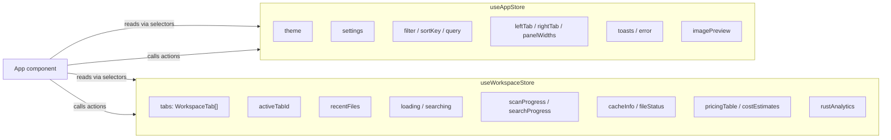
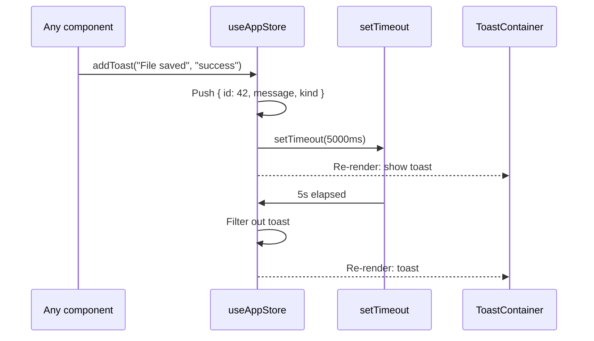
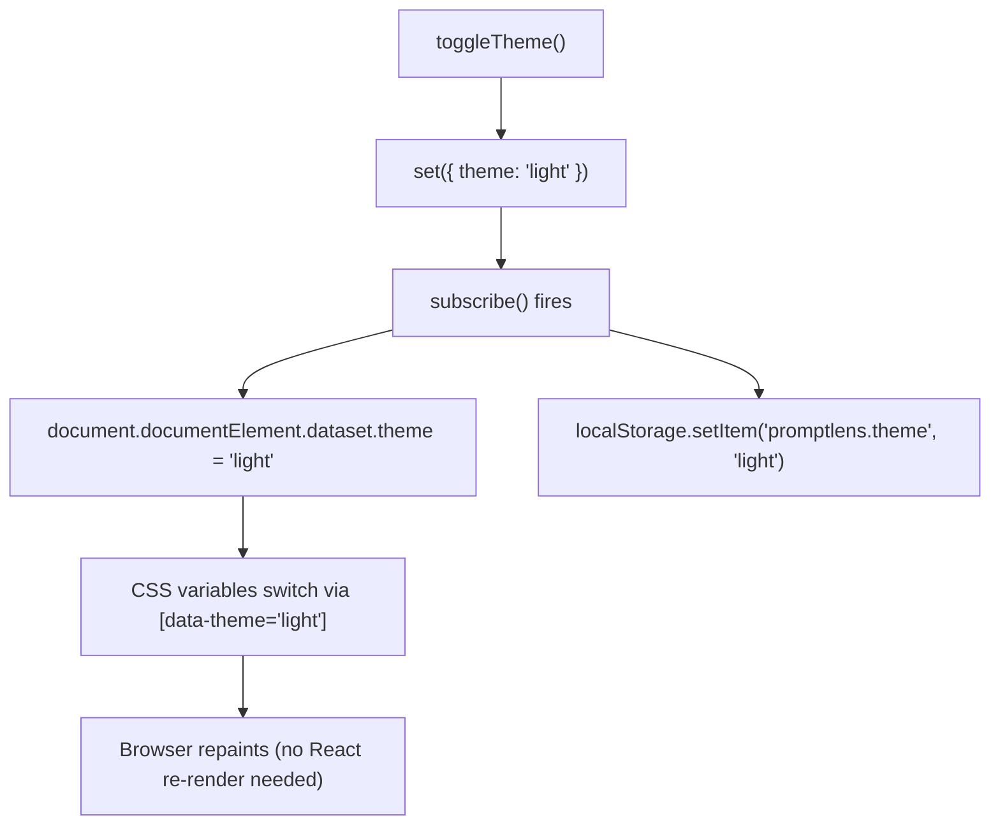
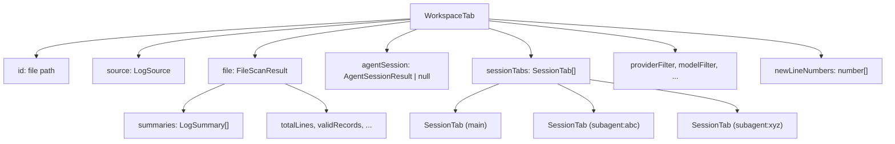
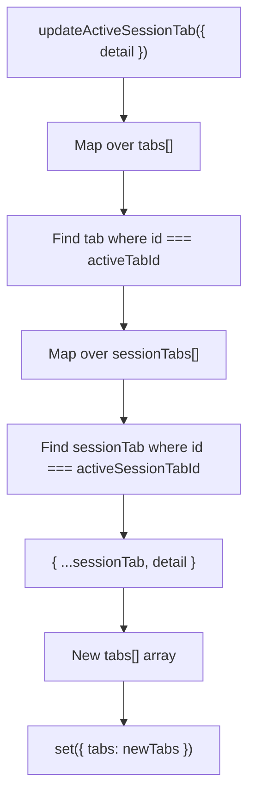
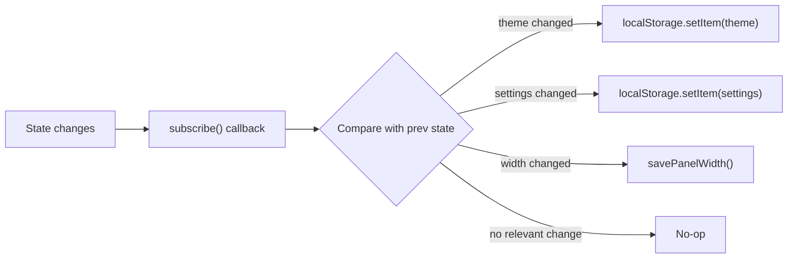
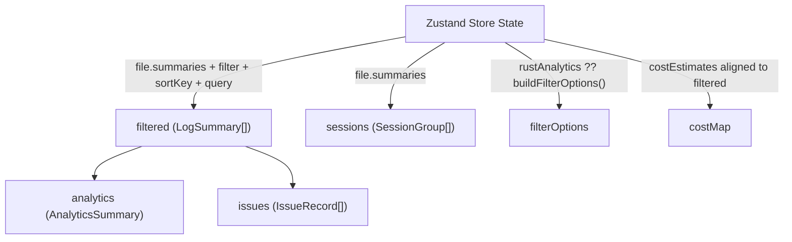
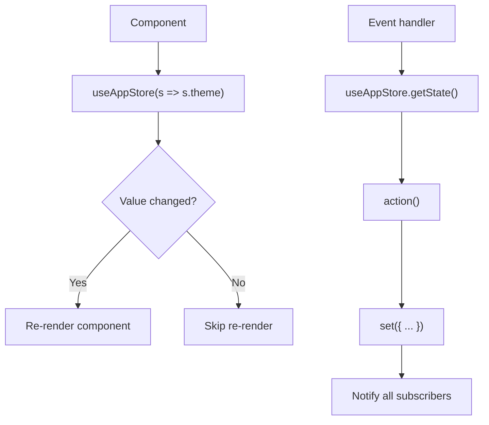

# 状态管理

PromptLens 使用 [Zustand](https://github.com/pmndrs/zustand) v5，包含两个独立的 store。所有应用状态都存储在这些 store 中 -- 组件不持有超出瞬态 UI 关注点（如下拉菜单打开/关闭）的本地状态。

## 双 Store 架构



### 为什么使用两个 Store？

这种分离遵循领域边界：

| Store | 领域 | 变更频率 | 持久化 |
|-------|--------|-----------------|-------------|
| `useAppStore` | UI 偏好、主题、过滤器 | 会话中很少变化 | localStorage |
| `useWorkspaceStore` | 文件数据、标签、异步操作 | 频繁变化 | localStorage（工作区路径） |

这种分离防止了仅 UI 更新（如切换标签）触发只关心文件数据的组件重新渲染，反之亦然。

### 考虑过的替代方案

| 方案 | 优点 | 缺点 | 未选择原因 |
|----------|------|------|----------------|
| 单 store | 简单，单一数据源 | 任何变化都触发所有组件重新渲染 | 粒度太粗 |
| React Context | 内置，无依赖 | 任何变化都重新渲染所有消费者 | 大规模性能问题 |
| Redux | 成熟生态系统 | 样板代码，对此应用过于复杂 | 太复杂 |
| Jotai | 原子状态 | 派生状态更难理解 | 对此数据形状不太自然 |

## App Store（`useAppStore`）

持有所有用户偏好和瞬态 UI 状态。

```typescript
// file: src/app/store.ts:91
interface AppState {
  // 主题
  theme: Theme;                              // "dark" | "light"

  // 用户设置
  settings: AppSettings;                     // { fontFamily, fontSize, codeFontFamily }
  messageViewMode: MessageViewMode;          // "preview" | "text" | "json"

  // UI 外壳
  settingsOpen: boolean;
  imagePreview: string | null;
  sourceConfirmDialog: SourceConfirmDialog | null;
  error: string | null;
  toasts: Toast[];
  liveMode: boolean;

  // 导航
  openSource: LogSource;
  leftPanelWidth: number;
  rightPanelWidth: number;
  leftTab: LeftTab;                          // "records" | "timeline" | "trace" | ...
  leftSortOrder: SortOrder;                  // "desc" | "asc"
  rightTab: RightTab;                        // "diff" | "tools" | "error" | "json" | "raw"

  // 过滤状态
  filter: Filter;                            // "all" | "error" | "success" | "image" | "tool"
  sortKey: SortKey;                          // "time" | "latency" | "tokens" | "model" | "status"
  query: string;
  latencyMin: string;
  tokensMin: string;

  // 瞬态
  selectedAgentEvent: AgentEvent | null;
  ready: boolean;
  fadeOut: boolean;
  tabSwitching: boolean;
}
```

### Store 创建

```typescript
// file: src/app/store.ts:147
export const useAppStore = create<AppState>((set, get) => ({
  theme: loadTheme(),
  settings: loadSettings(),
  messageViewMode: loadMessageViewMode(),
  // ... 所有初始值从 localStorage 加载

  setTheme: (t) => set({ theme: t }),
  setSettings: (s) => set({ settings: s }),
  toggleTheme: () => set((s) => ({ theme: s.theme === "dark" ? "light" : "dark" })),
  // ... 所有 actions
}));
```

### Toast 系统

Toast 使用自清洁模式。每个 toast 获得一个单调递增的 ID，并在 5 秒后自动移除：

```typescript
// file: src/app/store.ts:180
addToast: (message, kind = "info") => {
  const id = ++toastId;
  set((s) => ({ toasts: [...s.toasts, { id, message, kind }] }));
  setTimeout(() => set((s) => ({
    toasts: s.toasts.filter((t) => t.id !== id),
  })), 5000);
},
```



### 主题切换

主题更改同时在两个地方应用：Zustand store 和 DOM 属性：

```typescript
// file: src/app/store.ts:202
toggleTheme: () => set((s) => ({
  theme: s.theme === "dark" ? "light" : "dark",
})),
```

store 上的 `subscribe` 监听器持久化更改并更新 DOM：

```typescript
// file: src/app/store.ts:213
useAppStore.subscribe((state, prev) => {
  if (state.theme !== prev.theme) {
    document.documentElement.dataset.theme = state.theme;
    localStorage.setItem(THEME_KEY, state.theme);
  }
  if (state.settings !== prev.settings) {
    localStorage.setItem(SETTINGS_KEY, JSON.stringify(state.settings));
  }
  // ... 面板宽度、消息视图模式
});
```



## Workspace Store（`useWorkspaceStore`）

持有所有文件数据、标签状态和异步操作状态。

```typescript
// file: src/app/store.ts:234
interface WorkspaceState {
  tabs: WorkspaceTab[];
  activeTabId: string | null;
  recentFiles: string[];
  systemFonts: string[];
  loading: boolean;
  searching: boolean;
  scanProgress: ProgressEvent | null;
  searchProgress: ProgressEvent | null;
  cacheInfo: CacheInfo | null;
  fileStatus: FileStatus | null;
  pricingTable: ModelPricing[];
  costEstimates: CostEstimate[];
  rustAnalytics: ComputedAnalyticsRaw | null;
}
```

### WorkspaceTab 结构

每个打开的文件获得一个 `WorkspaceTab`，包含所有文件级状态：

```typescript
// file: src/app/types.ts（近似）
type WorkspaceTab = {
  id: string;                        // 文件路径
  source: LogSource;                 // "audit" | "claude_code" | "codex" | ...
  file: FileScanResult;              // 扫描结果 + 摘要
  agentSession: AgentSessionResult | null;
  sessionTabs: SessionTab[];         // 主标签 + 子代理标签
  activeSessionTabId: string;
  providerFilter: string;
  modelFilter: string;
  statusFilter: string;
  issueOnly: boolean;
  traceFilter: string;
  lastSearchIndexed: boolean | null;
  newLineNumbers: number[];
  lastScanMs: number | null;
  lastSearchMs: number | null;
};
```



### SessionTab 结构

工作区中的每个标签都可以有自己的选中记录和搜索状态：

```typescript
type SessionTab = {
  id: string;                        // "main" 或 "subagent:<agentId>"
  kind: SessionTabKind;              // "main" | "subagent"
  label: string;
  agentId?: string;
  selected: LogSummary | null;
  detail: RecordDetail | null;
  compareBase: RecordDetail | null;
  searchTerm: string;
  searchResults: SearchResult[];
};
```

### 更新嵌套标签状态

store 提供辅助 actions 用于更新活动标签，无需手动展开数组：

```typescript
// file: src/app/store.ts:300
updateActiveTab: (patch) =>
  set((s) => ({
    tabs: s.tabs.map((tab) =>
      tab.id === s.activeTabId ? { ...tab, ...patch } : tab,
    ),
  })),

updateActiveSessionTab: (patch) =>
  set((s) => ({
    tabs: s.tabs.map((tab) => {
      if (tab.id !== s.activeTabId) return tab;
      return {
        ...tab,
        sessionTabs: tab.sessionTabs.map((st) =>
          st.id === tab.activeSessionTabId ? { ...st, ...patch } : st,
        ),
      };
    }),
  })),
```



## 持久化策略

### localStorage 键

| 键 | 类型 | 内容 |
|---|---|---|
| `promptlens.theme` | `string` | `"dark"` 或 `"light"` |
| `promptlens.settings` | `JSON` | `{ fontFamily, fontSize, codeFontFamily }` |
| `promptlens.messageViewMode` | `string` | `"preview"`、`"text"` 或 `"json"` |
| `promptlens.panelWidth.left` | `number` | 左面板宽度（像素） |
| `promptlens.panelWidth.right` | `number` | 右面板宽度（像素） |
| `promptlens.workspace` | `JSON` | `{ paths[], sources[], activePath }` |
| `promptlens.recentFiles` | `JSON` | 最近文件路径（最多 8 条） |

### 持久化工作原理

持久化通过 `useAppStore.subscribe()` 实现 -- 一个在每次状态更新后运行的副作用监听器：

```typescript
// file: src/app/store.ts:213
useAppStore.subscribe((state, prev) => {
  if (state.theme !== prev.theme) {
    document.documentElement.dataset.theme = state.theme;
    localStorage.setItem(THEME_KEY, state.theme);
  }
  if (state.settings !== prev.settings) {
    localStorage.setItem(SETTINGS_KEY, JSON.stringify(state.settings));
  }
  if (state.messageViewMode !== prev.messageViewMode) {
    localStorage.setItem(MESSAGE_VIEW_MODE_KEY, state.messageViewMode);
  }
  if (state.leftPanelWidth !== prev.leftPanelWidth) {
    savePanelWidth("left", state.leftPanelWidth);
  }
  if (state.rightPanelWidth !== prev.rightPanelWidth) {
    savePanelWidth("right", state.rightPanelWidth);
  }
});
```



### 工作区持久化守卫

对于 workspace store，持久化通过 `restoredWorkspace` 标志进行守卫，以避免在初始加载期间覆盖保存的状态：

```typescript
// file: src/app/storage.ts（近似）
let restoredWorkspace = false;

useWorkspaceStore.subscribe((state) => {
  if (!restoredWorkspace) return;
  saveWorkspace(
    state.tabs.map((t) => ({ filePath: t.file.filePath, source: t.source })),
    state.activeTabId,
  );
});

export function markWorkspaceRestored() {
  restoredWorkspace = true;
}
```

如果没有这个守卫，初始的空状态会在保存的工作区路径加载之前覆盖它们。

## 派生状态

`App` 组件使用 `useMemo` 从 store 状态计算派生值。这是过滤、排序、分析和问题检测的主要机制。



`App` 中的关键派生计算：

```typescript
// 应用所有过滤器和排序
const filtered = useMemo(() => {
  return [...file.summaries]
    .filter((item) => { /* filter, provider, model, status, trace, latency, tokens, query */ })
    .sort((a, b) => compareSummary(a, b, sortKey));
}, [file, filter, sortKey, query, latencyMin, tokensMin,
    providerFilter, modelFilter, statusFilter, traceFilter, issueOnly]);

// 在过滤后的子集上计算分析
const analytics = useMemo(() => buildAnalytics(filtered), [filtered]);

// 检测异常
const issues = useMemo(() => detectIssues(filtered, analytics), [filtered, analytics]);

// 分组为会话
const sessions = useMemo(() => buildSessionGroups(file?.summaries ?? []), [file]);
```

### 为什么使用 useMemo 而非 Zustand Selectors？

像 `filtered` 这样的派生状态依赖于多个 store 值（`file.summaries`、`filter`、`sortKey`、`query` 等）。在 store 内计算它们需要：

1. 订阅所有依赖项
2. 任何依赖项变化时重新计算
3. 将结果存储在 store 中（用派生数据污染 store）

在组件中使用 `useMemo` 更简单，因为：
- 依赖数组显式声明所有输入
- React 的 `useMemo` 缓存结果，仅在依赖项变化时重新计算
- 派生值与其使用位置共同定位

## Store 访问模式

组件永远不会直接调用 `useAppStore()` 或 `useWorkspaceStore()`。相反，`App` 选择单个值并将它们作为 props 传递：

```typescript
// 在 App.tsx 中 -- 稳定的 selectors 防止重新渲染循环
const theme = useAppStore((s) => s.theme);
const filter = useAppStore((s) => s.filter);
const tabs = useWorkspaceStore((s) => s.tabs);
const loading = useWorkspaceStore((s) => s.loading);

// 通过 getState() 在回调中访问 actions
const ws = useWorkspaceStore.getState;
const app = useAppStore.getState;
```

对于命令式代码（事件处理器、效果），通过 `getState()` 访问 store：

```typescript
useEffect(() => {
  app().init();
}, []);
```



这种模式确保组件仅在其特定的状态切片变化时重新渲染，而不是在 store 的不相关部分更新时重新渲染。
