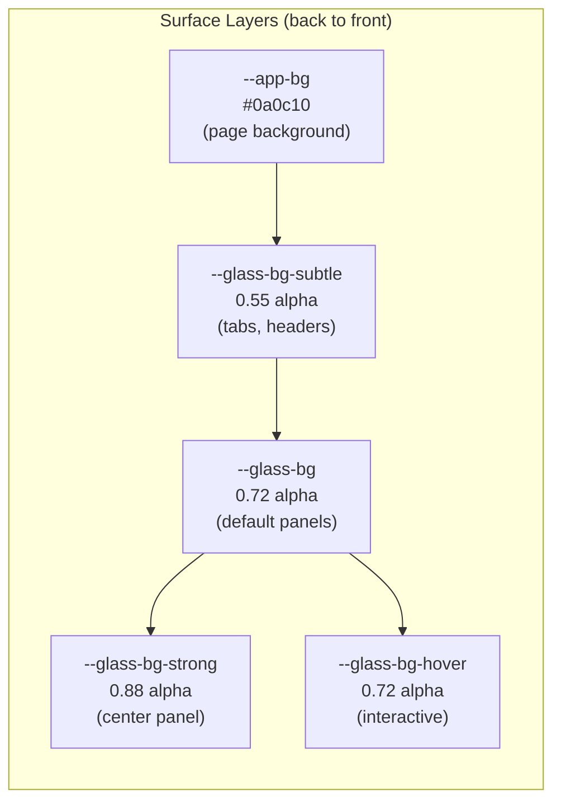
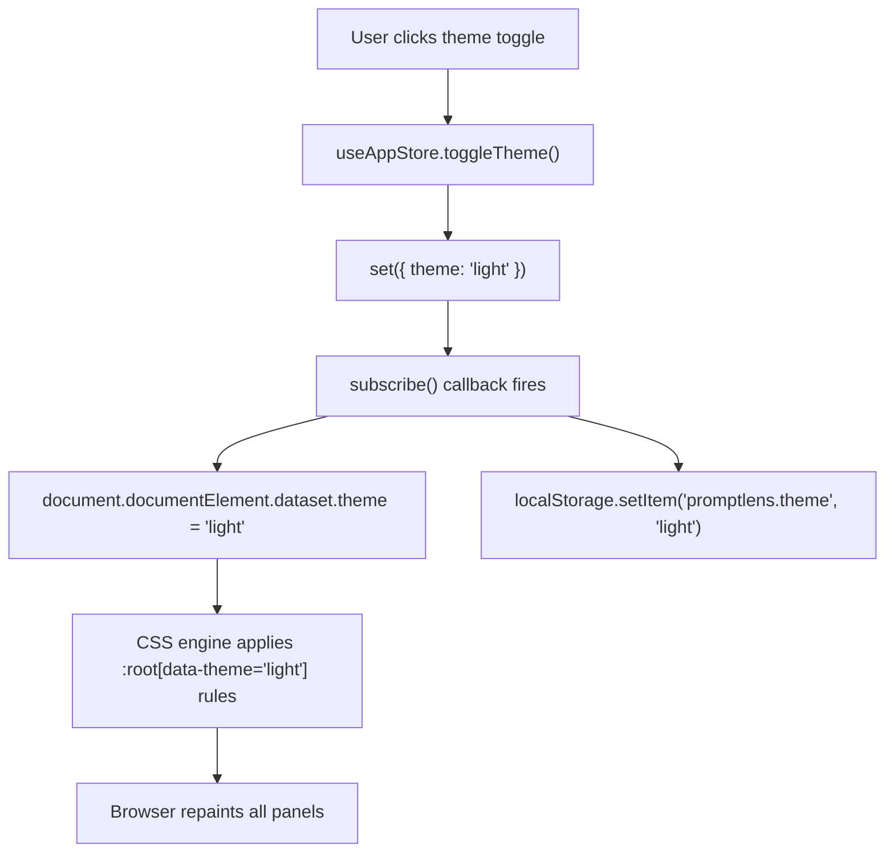
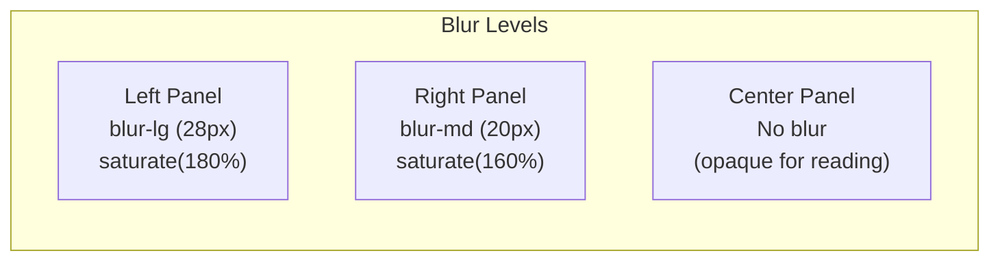
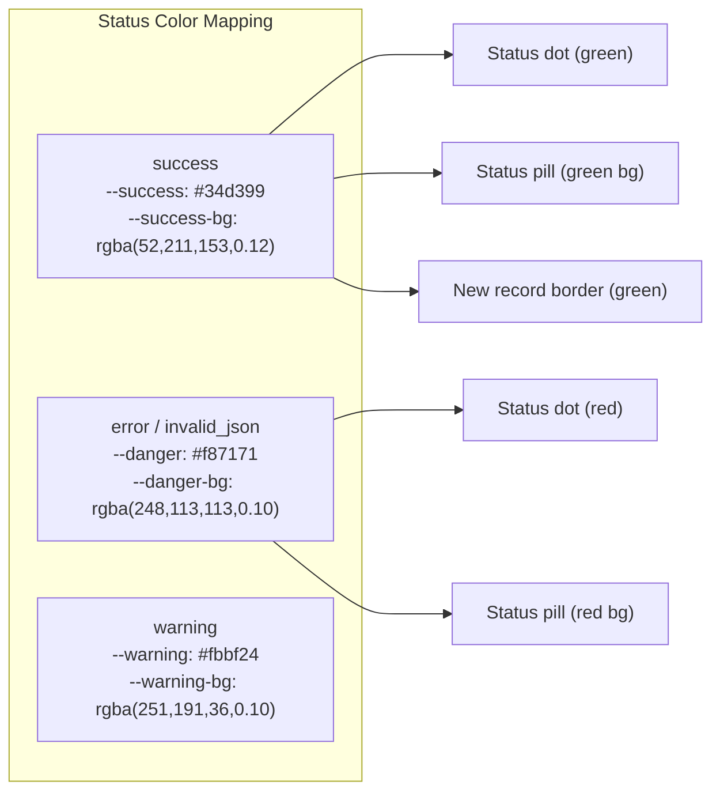
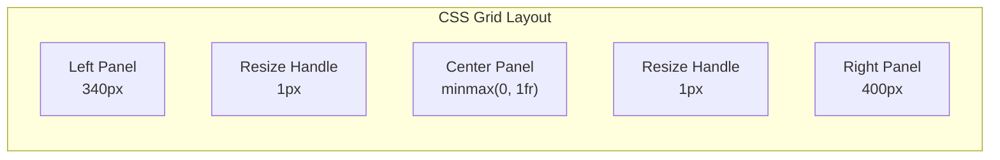

# 样式系统

PromptLens 使用纯 CSS 方案，没有 CSS-in-JS 库、没有 CSS Modules、没有工具类框架。所有样式组织为局部 CSS 文件，通过单一桶文件导入。

## CSS 架构

```mermaid
graph TD
    Barrel["src/styles.css<br/>(barrel file)"]
    Variables["variables.css<br/>Custom properties, themes"]
    Reset["reset.css<br/>Minimal normalize"]
    Layout["layout.css<br/>3-pane grid, resize handles"]
    Titlebar["titlebar.css<br/>macOS title bar"]
    Toolbar["toolbar.css<br/>Filter/sort toolbar"]
    List["list.css<br/>Virtual scroll list"]
    Detail["detail.css<br/>Message cards"]
    RightPanel["rightpanel.css<br/>Right panel tabs"]
    Tabs["tabs.css<br/>Workspace tabs"]
    Agent["agent.css<br/>Agent timeline"]
    Analytics["analytics.css<br/>Charts"]
    Diff["diff.css<br/>Text diff"]
    Sessions["sessions.css<br/>Session cards"]
    Search["search.css<br/>Search results"]
    Banners["banners.css<br/>Toasts, banners"]
    Loading["loading.css<br/>Progress overlay"]
    Media["media.css<br/>Image preview"]
    Metadata["metadata.css<br/>Key-value rows"]
    Misc["misc.css<br/>Landing, empty states"]

    Barrel --> Variables & Reset & Layout & Titlebar & Toolbar
    Barrel --> List & Detail & RightPanel & Tabs & Agent
    Barrel --> Analytics & Diff & Sessions & Search & Banners
    Barrel --> Loading & Media & Metadata & Misc
```



桶文件简单地导入每个局部文件：

```css
/* file: src/styles.css */
@import "./styles/variables.css";
@import "./styles/reset.css";
@import "./styles/layout.css";
@import "./styles/titlebar.css";
@import "./styles/toolbar.css";
@import "./styles/list.css";
@import "./styles/detail.css";
@import "./styles/rightpanel.css";
@import "./styles/tabs.css";
@import "./styles/agent.css";
@import "./styles/analytics.css";
@import "./styles/diff.css";
@import "./styles/sessions.css";
@import "./styles/search.css";
@import "./styles/banners.css";
@import "./styles/loading.css";
@import "./styles/media.css";
@import "./styles/metadata.css";
@import "./styles/misc.css";
```

### 为什么选择纯 CSS？

| 方案 | 优点 | 缺点 |
|----------|------|------|
| **纯 CSS（已选择）** | 零运行时成本，简单，浏览器原生 | 无作用域，手动命名约定 |
| CSS Modules | 有作用域的类名 | 构建步骤，更难共享变量 |
| Tailwind | 快速原型设计 | 大包体积，JSX 中类名泛滥 |
| styled-components | 有作用域，动态 | 运行时成本，包体积 |

纯 CSS 胜出是因为：
1. PromptLens 是桌面应用，包体积不太关键，但运行时性能对平滑滚动很重要
2. CSS 变量系统无需任何 JavaScript 运行时即可提供主题切换
3. 扁平的组件结构意味着命名冲突可控

## CSS 自定义属性（设计令牌）

所有视觉决策都表达为 `:root` 上的 CSS 自定义属性。通过在 `<html>` 上更改单个 `data-theme` 属性即可实现主题切换。

### 表面层

设计系统定义了四个从后到前的玻璃不透明度级别：

```css
/* file: src/styles/variables.css:9 */
:root {
  --app-bg: #0a0c10;                              /* 页面背景 */
  --glass-bg: rgba(22, 27, 36, 0.72);             /* 默认玻璃面板 */
  --glass-bg-strong: rgba(28, 33, 44, 0.88);      /* 高可读性面板 */
  --glass-bg-subtle: rgba(18, 22, 30, 0.55);      /* 外壳（标签、标题） */
  --glass-bg-hover: rgba(38, 44, 58, 0.72);       /* 交互式悬停 */
}
```



### 边框和边缘

```css
/* file: src/styles/variables.css:17 */
:root {
  --glass-border: rgba(255, 255, 255, 0.08);          /* 细微分隔线 */
  --glass-border-strong: rgba(255, 255, 255, 0.14);   /* 强调边框 */
  --glass-border-accent: rgba(91, 156, 246, 0.30);    /* 焦点/活动边框 */
}
```

### 阴影和深度

```css
/* file: src/styles/variables.css:23 */
:root {
  --glass-shadow: 0 2px 20px rgba(0, 0, 0, 0.35);
  --glass-shadow-lg: 0 8px 40px rgba(0, 0, 0, 0.45);
  --glass-highlight: inset 0 1px 0 rgba(255, 255, 255, 0.05);
  --glass-inset: inset 0 1px 3px rgba(0, 0, 0, 0.2);
}
```

### 排版颜色

```css
/* file: src/styles/variables.css:29 */
:root {
  --text-primary: #e8eaed;
  --text-secondary: #8b95a5;
  --text-tertiary: #5a6370;
  --text-inverse: #1d1d1f;
}
```

### 强调色和语义颜色

```css
/* file: src/styles/variables.css:35 */
:root {
  /* 品牌强调色 */
  --accent: #5b9cf6;
  --accent-hover: #7ab3ff;
  --accent-bg: rgba(91, 156, 246, 0.15);
  --accent-glow: 0 0 16px rgba(91, 156, 246, 0.20);

  /* 语义色 */
  --success: #34d399;
  --success-bg: rgba(52, 211, 153, 0.12);
  --danger: #f87171;
  --danger-bg: rgba(248, 113, 113, 0.10);
  --warning: #fbbf24;
  --warning-bg: rgba(251, 191, 36, 0.10);

  /* JSON 语法 */
  --json-key: #7cc4f7;
  --json-string: #9bd88f;
  --json-number: #f8c77e;
  --json-boolean: #c69cff;
}
```

### 模糊预设

```css
/* file: src/styles/variables.css:61 */
:root {
  --blur-sm: blur(12px);
  --blur-md: blur(20px);
  --blur-lg: blur(28px);
}
```

## 深色/浅色主题切换

主题通过在文档元素上设置 `data-theme` 来切换：

```html
<html data-theme="dark">   {* 深色主题（默认） *}
<html data-theme="light">  {* 浅色主题 *}
```

浅色主题使用属性选择器覆盖每个变量：

```css
/* file: src/styles/variables.css:78 */
:root[data-theme="light"] {
  color-scheme: light;

  --app-bg: #e8ecf1;
  --glass-bg: rgba(255, 255, 255, 0.55);
  --glass-bg-strong: rgba(255, 255, 255, 0.82);
  --glass-bg-subtle: rgba(255, 255, 255, 0.40);

  --glass-border: rgba(255, 255, 255, 0.60);
  --glass-border-strong: rgba(0, 0, 0, 0.08);

  --text-primary: #1d1d1f;
  --text-secondary: #6e7681;
  --text-tertiary: #9ca3af;

  --accent: #3478f6;
  --accent-hover: #2563eb;
  /* ... 所有其他覆盖 */
}
```

### 主题持久化流程



因为应用中的每种颜色都引用 CSS 变量，所以主题切换是瞬时的，零组件重新渲染 -- 浏览器仅通过 CSS 重绘。

### 深色 vs 浅色颜色对比

| 变量 | 深色 | 浅色 | 用途 |
|----------|------|-------|---------|
| `--app-bg` | `#0a0c10` | `#e8ecf1` | 页面背景 |
| `--glass-bg` | `rgba(22,27,36,0.72)` | `rgba(255,255,255,0.55)` | 面板背景 |
| `--glass-bg-strong` | `rgba(28,33,44,0.88)` | `rgba(255,255,255,0.82)` | 中面板 |
| `--text-primary` | `#e8eaed` | `#1d1d1f` | 主文本 |
| `--text-secondary` | `#8b95a5` | `#6e7681` | 次文本 |
| `--accent` | `#5b9cf6` | `#3478f6` | 品牌蓝 |
| `--success` | `#34d399` | `#34d399` | 成功绿（相同） |
| `--danger` | `#f87171` | `#f87171` | 错误红（相同） |

## 磨砂玻璃（Glassmorphism）

视觉语言是 macOS 风格的磨砂玻璃。每个面板使用 `backdrop-filter` 模糊其背后的内容，结合半透明背景。

```css
/* 侧边栏 -- 重度模糊 */
.list-pane {
  background: var(--glass-bg);
  backdrop-filter: var(--blur-lg) saturate(180%);
  -webkit-backdrop-filter: var(--blur-lg) saturate(180%);
}

/* 右面板 -- 中度模糊 */
.json-pane {
  background: var(--glass-bg);
  backdrop-filter: var(--blur-md) saturate(160%);
  -webkit-backdrop-filter: var(--blur-md) saturate(160%);
}

/* 中面板 -- 无模糊（不透明以保证可读性） */
.conversation-pane {
  background: var(--glass-bg-strong);
}
```



`--glass-bg-strong` 变量具有更高的 alpha 值（深色模式 0.88，浅色模式 0.82），使中面板几乎不透明以保证舒适的阅读体验。

### 为什么使用不同的模糊级别？

- **左面板（重度模糊）** -- 日志列表快速浏览；模糊创建视觉深度而不分散对中心的注意力
- **右面板（中度模糊）** -- 补充数据；适度模糊保持可读性同时显示深度
- **中面板（无模糊）** -- 用户阅读消息的主要内容区域；完全不透明以获得最大可读性

### 背景光晕

应用在玻璃面板后面渲染装饰性的背景渐变光晕：

```css
.app-bg-orbs {
  position: fixed;
  inset: 0;
  z-index: 0;
  background:
    radial-gradient(ellipse 600px 400px at 20% 30%, rgba(74, 123, 247, 0.08), transparent),
    radial-gradient(ellipse 500px 500px at 80% 70%, rgba(139, 92, 246, 0.06), transparent);
  pointer-events: none;
}
```

这些光晕创建了通过磨砂玻璃可见的彩色背景。

## 动态 CSS 变量

`App` 组件为用户可配置的字体设置运行时 CSS 变量：

```tsx
// file: src/app/App.tsx（近似）
<main
  className="app-shell"
  style={{
    "--app-font-family": settings.fontFamily,
    "--app-font-size": `${settings.fontSize}px`,
    "--code-font-family": settings.codeFontFamily,
  } as CSSProperties}
>
```

这些覆盖了 `:root` 中定义的默认值，并级联到所有子组件。

## 过渡动画

所有交互状态变化使用共享的缓动曲线：

```css
/* file: src/styles/variables.css:67 */
:root {
  --ease: cubic-bezier(0.25, 0.1, 0.25, 1);
}
```

| 元素 | 持续时间 | 属性 |
|---------|----------|----------|
| `.log-row` | 120ms | `background` |
| `.tab-button-base` | 150ms | `all` |
| 着陆页 | 400ms | `opacity` |
| 加载状态 | 500-800ms | `opacity, transform` |

持续时间保持较短（120-300ms）以保持响应感。较长的动画保留给着陆页淡入和加载状态过渡。

## 状态颜色系统

每种记录状态映射到一个语义颜色，在圆点、药丸、徽章和边框中一致使用：

```css
/* 状态圆点（日志列表中的 7px 圆圈） */
.status-dot.success { background: var(--success); }
.status-dot.error, .status-dot.invalid_json { background: var(--danger); }

/* 状态药丸（详情视图中的圆角徽章） */
.pill.success { background: var(--success-bg); border-color: var(--success-border); }
.pill.error { background: var(--danger-bg); border-color: var(--danger-border); }

/* 新记录高亮（增量扫描） */
.log-row.new-record {
  border-left: 3px solid var(--success);
  background: var(--success-bg);
}
```



## 面板布局

三面板布局使用 CSS Grid，由 JavaScript 控制显式像素宽度：

```css
.workspace {
  display: grid;
  /* 通过 style 属性动态设置模板 */
  /* 例如 "340px 1px minmax(0, 1fr) 1px 400px" */
}
```

`1px` 列是调整大小手柄。中面板使用 `minmax(0, 1fr)` 填充剩余空间。面板宽度被限制在 TypeScript 中定义的最小/最大值：

```typescript
export const LEFT_MIN = 260;
export const LEFT_MAX = 560;
export const LEFT_DEFAULT = 340;
export const RIGHT_MIN = 300;
export const RIGHT_MAX_RATIO = 0.6;
export const RIGHT_DEFAULT = 400;
export const CENTER_MIN = 200;
```



## 响应式行为

布局在传统意义上不是响应式的 -- PromptLens 是一个有最小窗口大小的桌面应用。但它通过按比例缩小面板来处理窗口调整大小：

```typescript
// 窗口调整大小时，按比例缩小面板
if (l + r + CENTER_MIN > available) {
  const deficit = l + r + CENTER_MIN - available;
  l = Math.max(LEFT_MIN, Math.round(l - deficit * (l / total)));
  r = Math.max(RIGHT_MIN, Math.round(r - deficit * (r / total)));
}
```

这确保中面板始终至少有 `CENTER_MIN`（200px）的空间，即使在小屏幕上也是如此。
