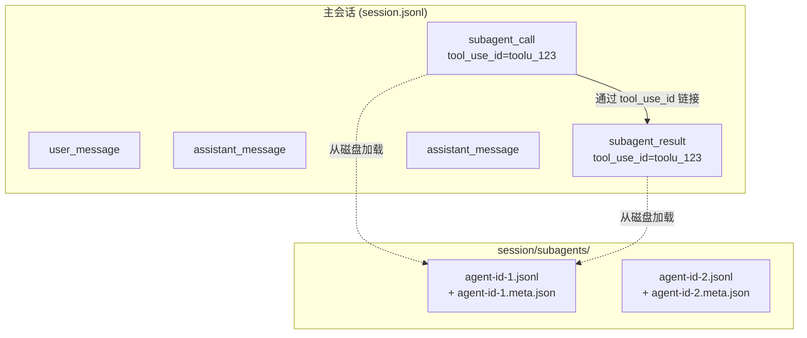
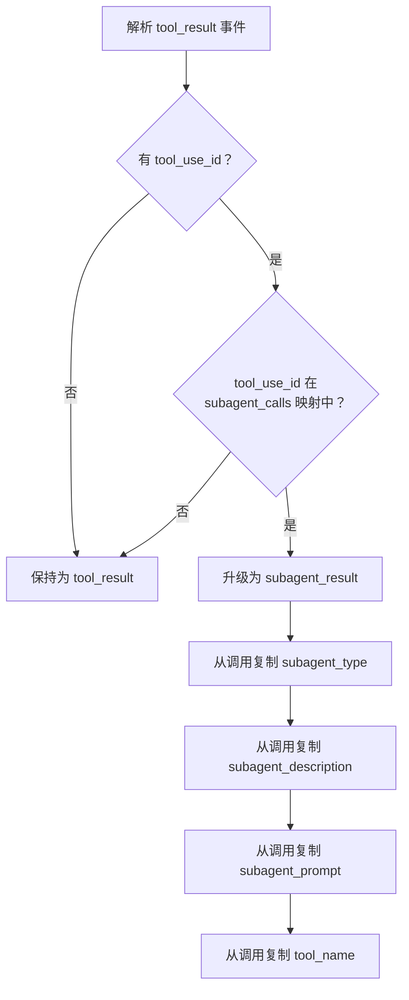
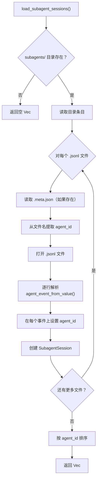
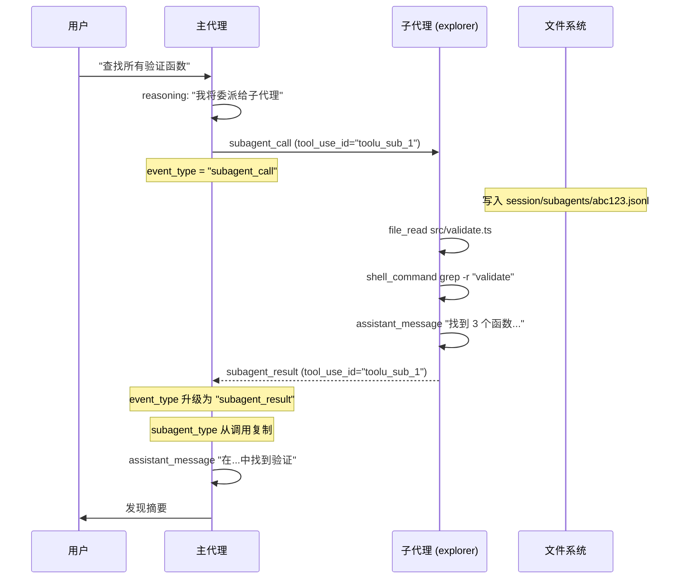
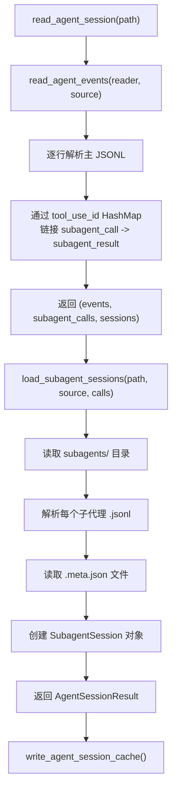

# 子代理会话

子代理会话代表由主编码代理生成的子代理的活动。在 Claude Code 中，当使用 `Task` 或 `Agent` 工具将工作委派给专门的子代理时会发生这种情况。PromptLens 将这些子代理调用链接到其结果，并加载其单独的 JSONL 日志文件。

## 子代理架构



## 调用/结果链接

当解析器遇到 `tool_result` 事件时，它检查 `tool_use_id` 是否匹配之前看到的 `subagent_call`。如果找到匹配：

1. `event_type` 从 `tool_result` 升级为 `subagent_result`
2. `subagent_type`、`subagent_description` 和 `subagent_prompt` 字段从调用复制到结果
3. 如果尚未设置，`tool_name` 也会被复制



### 链接实现

`read_agent_events()` 函数维护一个名为 `subagent_calls` 的 `HashMap<String, AgentEvent>`：

```rust
// file: src-tauri/src/commands.rs:296
// 当看到 subagent_call 时
if event.event_type == "subagent_call" {
    if let Some(tool_use_id) = &event.tool_use_id {
        subagent_calls.insert(tool_use_id.clone(), event.clone());
    }
}

// 当看到 tool_result 时
if event.event_type == "tool_result" {
    if let Some(call) = event.tool_use_id.as_ref()
        .and_then(|tool_use_id| subagent_calls.get(tool_use_id))
    {
        event.event_type = "subagent_result".to_string();
        event.tool_name = event.tool_name.or_else(|| call.tool_name.clone());
        event.subagent_type = event.subagent_type.or_else(|| call.subagent_type.clone());
        event.subagent_description = event.subagent_description
            .or_else(|| call.subagent_description.clone());
        event.subagent_prompt = event.subagent_prompt
            .or_else(|| call.subagent_prompt.clone());
    }
}
```

映射以 `tool_use_id` 为键，因为每个子代理调用都有唯一的工具使用 ID。这允许多个并发子代理调用被独立跟踪。会话 ID 也在解析期间收集到 `HashSet` 中：

```rust
// file: src-tauri/src/commands.rs:318
if let Some(session_id) = &event.session_id {
    sessions.insert(session_id.clone());
}
```

### 前端子代理任务构建

在前端，`buildSubagentTasks()` 函数从事件列表重建调用/结果对：

```tsx
// file: src/app/analytics.ts:278
export function buildSubagentTasks(events: AgentEvent[]): SubagentTask[] {
  const resultsByToolUseId = new Map<string, AgentEvent>();
  for (const event of events) {
    if (event.eventType !== "subagent_result") continue;
    if (event.toolUseId) resultsByToolUseId.set(event.toolUseId, event);
  }
  return events
    .filter((event) => event.eventType === "subagent_call")
    .map((call): SubagentTask => {
      const result = call.toolUseId ? resultsByToolUseId.get(call.toolUseId) : undefined;
      const status = result?.status === "error" ? "error" : result ? "completed" : "running";
      return {
        id: call.toolUseId || call.id,
        type: call.subagentType || "subagent",
        description: call.subagentDescription || call.preview || "Subagent task",
        prompt: call.subagentPrompt,
        call,
        result,
        status,
      };
    });
}
```

`SubagentTask` 类型跟踪每个子代理的生命周期：

```tsx
// file: src/app/types.ts:69
export type SubagentTask = {
  id: string;
  type: string;
  description: string;
  prompt?: string;
  call: AgentEvent;
  result?: AgentEvent;
  status: "running" | "completed" | "error";
};
```

## 子代理日志文件

### 目录结构

子代理日志存储在主会话文件旁边的目录结构中：

```
session.jsonl                    # 主会话日志
session/                         # 以主文件名命名的目录
  subagents/                     # 子代理日志目录
    agent-id-1.jsonl             # 子代理事件日志
    agent-id-1.meta.json         # 子代理元数据
    agent-id-2.jsonl
    agent-id-2.meta.json
```

目录路径从主文件派生：

```rust
// file: src-tauri/src/commands.rs:333
let session_dir = main_file_path
    .parent()                           // 父目录
    .map(|p| {
        let stem = main_file_path
            .file_stem()                // 不含扩展名的文件名
            .map(|s| s.to_string_lossy().to_string())
            .unwrap_or_default();
        p.join(stem)                    // <parent>/<stem>/
    })
    .filter(|d| d.is_dir());            // 仅当目录存在时

let subagents_dir = session_dir.join("subagents");
```

### 元文件格式

每个子代理 JSONL 文件可以有一个附带的 `.meta.json` 文件：

```json
{
  "agentType": "explorer",
  "description": "Find all validation functions in the codebase",
  "toolUseId": "toolu_sub_1"
}
```

| 字段 | 类型 | 描述 |
|------|------|------|
| `agentType` | `String` | 子代理类型（如 `explorer`、`general-purpose`） |
| `description` | `String` | 子代理任务的人类可读描述 |
| `toolUseId` | `String` | 父级 `subagent_call` 的 `tool_use_id` |

元文件在子代理加载期间读取。如果 `.meta.json` 文件缺失或格式错误，子代理会话仍会被加载但没有元数据字段：

```rust
// file: src-tauri/src/commands.rs:379
let meta_path = path.with_extension("meta.json");
let meta: Option<Value> = fs::read_to_string(&meta_path)
    .ok()
    .and_then(|s| serde_json::from_str(&s).ok());

let agent_type = meta.as_ref().and_then(|m| {
    m.get("agentType").and_then(Value::as_str).map(str::to_string)
});
```

### 加载过程



```rust
// file: src-tauri/src/commands.rs:328
fn load_subagent_sessions(
    main_file_path: &Path,
    source: LogSource,
    subagent_calls: &HashMap<String, AgentEvent>,
) -> Vec<SubagentSession> {
    // 1. 从主文件名派生会话目录路径
    // 2. 检查 subagents/ 子目录
    // 3. 迭代目录中的 .jsonl 文件
    // 4. 读取 .meta.json 获取元数据
    // 5. 使用 agent_event_from_value() 解析 JSONL 事件
    // 6. 从文件名在每个事件上设置 agent_id
    // 7. 创建 SubagentSession 对象
    // 8. 按 agent_id 排序
}
```

该函数还构建了从 `agent_id` 到 `subagent_call` 事件的查找表，实现主会话的子代理调用与子代理日志文件之间的交叉引用：

```rust
// file: src-tauri/src/commands.rs:359
let mut call_by_agent_id: HashMap<&str, &AgentEvent> = HashMap::new();
for call in subagent_calls.values() {
    if let Some(ref agent_id) = call.agent_id {
        call_by_agent_id.insert(agent_id.as_str(), call);
    }
}
```

## SubagentSession 结构

```rust
// file: src-tauri/src/types.rs:138
#[derive(Debug, Serialize, Deserialize, Clone)]
#[serde(rename_all = "camelCase")]
pub(crate) struct SubagentSession {
    pub(crate) agent_id: String,                    // 文件名（如 "agent-id-1"）
    pub(crate) agent_type: Option<String>,          // 来自 meta.json 的 agentType
    pub(crate) description: Option<String>,         // 来自 meta.json 的 description
    pub(crate) tool_use_id: Option<String>,         // 来自 meta.json 的 toolUseId
    pub(crate) events: Vec<AgentEvent>,             // 从 JSONL 解析的事件
}
```

## 示例：完整子代理流程



## 子代理标签导航

在 UI 中，子代理会话作为左面板中的单独标签出现。主会话的事件被过滤以排除 sidechain 和子代理事件，而每个子代理标签仅显示自己的事件：

```tsx
// file: src/app/App.tsx:90
const filteredAgentSession = useMemo(() => {
  if (!agentSession) return null;
  if (activeSessionTabId === "main") {
    return { ...agentSession, events: agentSession.events.filter(
      (e) => !e.isSidechain && !e.agentId
    )};
  }
  const sub = agentSession.subagentSessions.find(
    (s) => `subagent:${s.agentId}` === activeSessionTabId
  );
  if (!sub) return agentSession;
  return { ...agentSession, events: sub.events };
}, [agentSession, activeSessionTabId]);
```

子代理标签在源为代理会话时有条件渲染：

```tsx
// file: src/app/components/LeftPanel.tsx:149
{isAgentSession && (
  <button role="tab" className={...} onClick={() => setTab("subagents")} title="Subagents">
    <Bot size={14} />
  </button>
)}
```

## 数据流摘要



## 缓存交互

子代理会话包含在缓存的 `AgentSessionResult` 中，存储在 `agent_session_cache` SQLite 表中：

```rust
// file: src-tauri/src/commands.rs:247
let result = AgentSessionResult {
    file_path,
    source: source.as_str().to_string(),
    total_events: events.len(),
    sessions,
    events,
    subagent_sessions,  // 包含在缓存中
};
let _ = write_agent_session_cache(&result, metadata.len(), modified.as_deref());
```

缓存表使用 `(file_path, source)` 复合主键：

```rust
// file: src-tauri/src/cache.rs:44
"CREATE TABLE IF NOT EXISTS agent_session_cache (
    file_path TEXT NOT NULL,
    source TEXT NOT NULL,
    file_size INTEGER NOT NULL,
    modified TEXT,
    payload TEXT NOT NULL,
    updated_at INTEGER NOT NULL,
    PRIMARY KEY (file_path, source)
)"
```

这意味着子代理 JSONL 文件仅在主会话文件更改（大小或修改时间更改）时才会被重新解析。

## 限制

| 限制 | 描述 |
|------|------|
| 仅 Claude Code | 子代理支持特定于 Claude Code 的 Task/Agent 工具 |
| 基于目录 | 子代理日志必须在预期的目录结构中（`<stem>/subagents/`） |
| 无嵌套 | 子代理不能生成自己的子代理（仅一级深度） |
| 静态加载 | 所有子代理会话一次性加载，非增量 |
| 无交叉链接 | 子代理事件不链接回父级的 tool_use_id |

## 故障排除

| 问题 | 原因 | 解决方案 |
|------|------|----------|
| 子代理标签未出现 | 主 JSONL 旁边未找到 `subagents/` 目录 | 确保目录结构匹配 `<stem>/subagents/*.jsonl` |
| 子代理事件显示为 `tool_result` | 调用和结果之间的 `tool_use_id` 不匹配 | 验证主会话中的 `tool_use_id` 与子代理元文件匹配 |
| 空子代理会话 | JSONL 文件存在但不包含可解析事件 | 检查 JSONL 文件是否有有效的 JSON 行 |
| 元数据缺失 | `.meta.json` 文件未找到或格式错误 | 创建包含 `agentType`、`description` 和 `toolUseId` 字段的有效 `.meta.json` |
| 过时的子代理数据 | 子代理文件更改后缓存未失效 | 重新扫描主会话文件 (Ctrl+R) 以重新加载子代理会话 |

## 相关类型和命令

| 类型/命令 | 位置 | 用途 |
|-----------|------|------|
| `SubagentSession` 结构体 | `src-tauri/src/types.rs:138` | 持有子代理元数据和事件的 Rust 结构体 |
| `AgentSessionResult` 结构体 | `src-tauri/src/types.rs:128` | 包含主事件 + 子代理会话的顶层结果 |
| `SubagentTask` 类型 | `src/app/types.ts:69` | 前端类型，用于带状态的子代理调用/结果对 |
| `buildSubagentTasks()` | `src/app/analytics.ts:278` | 在前端从 AgentEvent[] 重建 SubagentTask[] |
| `load_subagent_sessions()` | `src-tauri/src/commands.rs:328` | 读取 subagents/ 目录的 Rust 函数 |
| `read_agent_session` | `src-tauri/src/commands.rs:223` | 触发完整会话 + 子代理加载的 Tauri 命令 |
