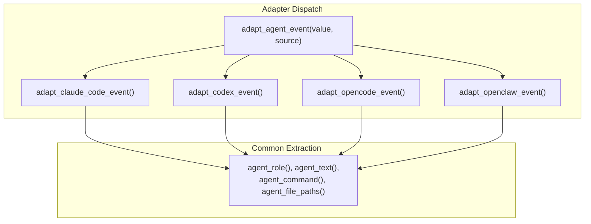

# 支持的代理工具

PromptLens 支持解析来自四个编码代理工具的会话日志。每个工具在 `agent_adapters.rs` 中都有专用适配器，将工具特定的 JSON 结构转换为统一的 `AgentEvent` 格式。

## 工具对比

| 功能 | Claude Code | Codex | OpenCode | OpenClaw |
|---------|------------|-------|----------|----------|
| 日志格式 | 基于消息 | 基于事件 | 基于部分 | 基于动作 |
| 关键字段 | `message.content[]` | `type` | `part` / `payload` | `action` / `event` |
| 会话 ID | `sessionId` | `session_id` | `session_id` | `session_id` |
| Sidechain 支持 | 是（`isSidechain`） | 否 | 否 | 否 |
| 子代理支持 | 是（`Task`、`Agent`） | 否 | 否 | 否 |
| 检查点类型 | 7 种特殊类型 | 4 种类型 | 快照 | 检查点 |
| 参数格式 | `input` 中的对象 | JSON 字符串 | `input` 中的对象 | `action` 中的对象 |



## Claude Code

Claude Code 产生基于消息的 JSONL 日志，每行是一个带角色和内容数组的消息。

### 日志结构

```json
{
  "type": "assistant",
  "sessionId": "session-abc123",
  "message": {
    "role": "assistant",
    "content": [
      {
        "type": "tool_use",
        "id": "toolu_123",
        "name": "Bash",
        "input": { "command": "npm test" }
      }
    ]
  }
}
```

### 适配器实现

```rust
// file: src-tauri/src/agent_adapters.rs:168
fn adapt_claude_code_event(value: &Value) -> AgentEventAdapterFields {
    let mut fields = AgentEventAdapterFields::default();
    let lowered_type = agent_record_type(value);

    // 先处理特殊记录类型
    if lowered_type == "file-history-snapshot" {
        fields.event_type = Some("checkpoint".to_string());
        return fields;
    }
    // ... 更多特殊类型

    // 处理 message.content[] 数组
    if let Some(message) = value.get("message") {
        if let Some(content) = message.get("content").and_then(Value::as_array) {
            for part in content {
                let part_type = part.get("type").and_then(Value::as_str).unwrap_or_default();
                if part_type == "tool_use" {
                    // 提取 tool_name、tool_use_id、input
                    // 检查 Task/Agent（子代理）、shell、文件工具
                } else if part_type == "tool_result" {
                    // 提取 tool_use_id，检查 is_error
                } else if part_type == "thinking" {
                    // 提取思考文本
                }
            }
        }
    }
}
```

### 特殊记录类型

| `type` | 描述 | 额外字段 |
|--------|-------------|--------------|
| `file-history-snapshot` | 文件状态快照 | -- |
| `queue-operation` | 队列状态变化 | `operation` |
| `system` | 系统消息 | `subtype`、`level` |
| `permission-mode` | 权限变化 | `permissionMode` |
| `last-prompt` | 最后用户提示 | `lastPrompt` |
| `ai-title` | 会话标题 | `title` |
| `agent-name` | 代理标识符 | `name` |

### 内容部分映射

| 内容 `type` | 事件类型 | 备注 |
|----------------|-----------|-------|
| `tool_use`（Bash） | `shell_command` | 提取 `input.command` |
| `tool_use`（Read/Write/Edit） | `file_read`/`file_write`/`file_edit` | 从 input 提取文件路径 |
| `tool_use`（Task/Agent） | `subagent_call` | 提取 `subagent_type`、`description`、`prompt` |
| `tool_use`（其他） | `tool_call` | 通用工具调用 |
| `tool_result` | `tool_result` | 从 content 提取文本 |
| `thinking` | `reasoning` | 提取思考文本 |
| `text` | （较低优先级） | 文本内容 |

### 子代理支持

Claude Code 是唯一支持子代理调用的工具。当检测到 `Task` 或 `Agent` tool_use 时：

```rust
// file: src-tauri/src/agent_adapters.rs:223
if matches!(fields.tool_name.as_deref(), Some("Task") | Some("Agent")) {
    fields.subagent_type = first_string(input, &["subagent_type", "subagentType"]);
    fields.subagent_description = first_string(input, &["description"]);
    fields.subagent_prompt = first_string(input, &["prompt"]);
}
```

1. 事件类型设置为 `subagent_call`
2. 从 input 中提取 `subagent_type`、`subagent_description` 和 `subagent_prompt`
3. 匹配的 `tool_result` 被升级为带有相同元数据的 `subagent_result`

## Codex

Codex 产生基于事件的 JSONL 日志，带有一个确定事件类别的 `type` 字段。

### 日志结构

```json
{
  "type": "function_call",
  "session_id": "session-xyz",
  "tool_name": "exec_command",
  "arguments": "{\"cmd\": \"cargo test\"}"
}
```

### 适配器实现

```rust
// file: src-tauri/src/agent_adapters.rs:92
fn adapt_codex_event(value: &Value) -> AgentEventAdapterFields {
    let payload = agent_payload(value);  // 可能展开 "payload" 键
    let lowered_type = agent_record_type(payload);

    fields.role = agent_role(payload).or_else(|| agent_role(value));

    // 解析 JSON 编码的参数
    if let Some(arguments) = payload.get("arguments") {
        if let Some(parsed) = parse_maybe_json(arguments) {
            fields.command = agent_command(&parsed);
            fields.file_paths = agent_file_paths(&parsed);
        }
    }
}
```

### 事件类型映射

| Codex `type` | 事件类型 | 备注 |
|---------------|-----------|-------|
| `message`（user） | `user_message` | 基于角色分发 |
| `message`（assistant） | `assistant_message` | 基于角色分发 |
| `user_message` | `user_message` | 直接映射 |
| `agent_message` | `assistant_message` | 直接映射 |
| `reasoning` | `reasoning` | 思考/推理步骤 |
| `function_call` | `shell_command` / `file_*` / `tool_call` | 按工具名称分类 |
| `custom_tool_call` | `shell_command` / `file_*` / `tool_call` | 按工具名称分类 |
| `function_call_output` | `tool_result` | 工具执行结果 |
| `custom_tool_call_output` | `tool_result` | 工具执行结果 |
| `patch_apply_end` | `patch` | 文件补丁已应用 |
| `task_started` / `task_complete` | `checkpoint` | 任务生命周期 |
| `turn_aborted` | `checkpoint` | 轮次生命周期 |
| `context_compacted` | `checkpoint` | 上下文管理 |

### 参数解析

Codex 将工具参数存储为 JSON 字符串。适配器解析这些以提取命令和文件路径：

```rust
// file: src-tauri/src/agent_adapters.rs:108
if let Some(arguments) = payload.get("arguments") {
    if let Some(parsed) = parse_maybe_json(arguments) {
        fields.command = agent_command(&parsed);
        fields.file_paths = agent_file_paths(&parsed);
    }
}
```

`parse_maybe_json` 函数同时处理字符串编码的 JSON 和原生 JSON 对象：

```rust
// file: src-tauri/src/agent_adapters.rs:374
fn parse_maybe_json(value: &Value) -> Option<Value> {
    match value {
        Value::String(text) => serde_json::from_str(text).ok(),
        Value::Object(_) | Value::Array(_) => Some(value.clone()),
        _ => None,
    }
}
```

## OpenCode

OpenCode 产生基于部分的 JSONL 日志，每行包装一个 `part` 或 `payload` 对象。

### 日志结构

```json
{
  "type": "part",
  "part": {
    "type": "tool",
    "tool": "read",
    "input": { "path": "src/main.ts" }
  }
}
```

### 适配器实现

```rust
// file: src-tauri/src/agent_adapters.rs:302
fn adapt_opencode_event(value: &Value) -> AgentEventAdapterFields {
    let part = value.get("part")
        .or_else(|| value.get("payload"))
        .unwrap_or(value);
    let lowered_type = agent_record_type(part);
    fields.role = agent_role(value).or_else(|| agent_role(part));
    fields.tool_name = first_string(part, &["tool", "tool_name", "toolName", "name"]);
    fields.command = agent_command(part);
    fields.file_paths = agent_file_paths(part);
    fields.text = agent_text(part).or_else(|| agent_text(value));
}
```

### 事件类型映射

| 部分 `type` | 事件类型 | 备注 |
|-------------|-----------|-------|
| 包含 `snapshot`/`checkpoint` | `checkpoint` | 状态快照 |
| 包含 `reason`/`thinking` | `reasoning` | 思考步骤 |
| 包含 `tool` + `result` | `tool_result` | 工具结果 |
| 有命令或 shell 工具 | `shell_command` | Shell 执行 |
| 有文件路径或文件工具 | `file_read`/`file_write`/`file_edit` | 文件操作 |
| 包含 `tool` | `tool_call` | 通用工具 |

## OpenClaw

OpenClaw 产生基于动作的 JSONL 日志，每行包含一个 `action` 或 `event` 对象。

### 日志结构

```json
{
  "action": {
    "kind": "patch",
    "diff": "@@ -1,5 +1,10 @@",
    "target_file": "src/lib.rs"
  }
}
```

### 适配器实现

```rust
// file: src-tauri/src/agent_adapters.rs:336
fn adapt_openclaw_event(value: &Value) -> AgentEventAdapterFields {
    let action = value.get("action")
        .or_else(|| value.get("event"))
        .unwrap_or(value);
    let lowered_type = agent_record_type(action);
    fields.role = agent_role(value).or_else(|| agent_role(action));
    fields.tool_name = first_string(action, &["tool", "tool_name", "toolName", "name", "kind"]);
}
```

### 事件类型映射

| 动作 `type` | 事件类型 | 备注 |
|---------------|-----------|-------|
| 包含 `checkpoint` | `checkpoint` | 状态检查点 |
| 包含 `patch` 或有 `diff` | `patch` | 文件补丁 |
| 包含 `result`/`observation` | `tool_result` | 工具结果 |
| 有命令或 shell 工具 | `shell_command` | Shell 执行 |
| 有文件路径或文件工具 | `file_*` | 文件操作 |

## 源检测

当未指定源时，PromptLens 从 JSON 结构自动检测工具。完整算法参见[自动检测](./auto-detection.md)。

### 快速检测规则

| 信号 | 检测到的源 |
|--------|----------------|
| `sessionId` + `message` | Claude Code |
| `isSidechain` | Claude Code |
| `type` = `user`/`assistant` + `content` 数组 | Claude Code |
| `exec_command` 工具名称 | Codex |
| 字符串包含 `codex` | Codex |
| 字符串包含 `opencode` | OpenCode |
| 字符串包含 `openclaw` | OpenClaw |
