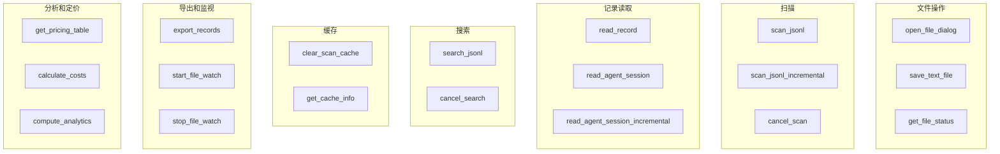
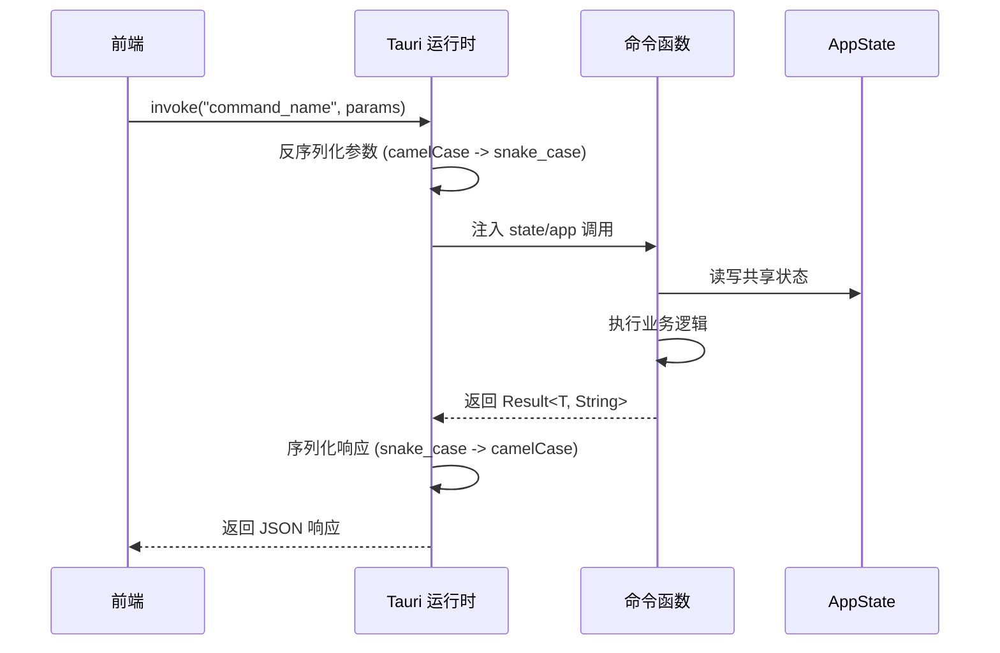

# Tauri IPC 命令

PromptLens 暴露了 **21 个 Tauri IPC 命令**，前端通过 `invoke()` 调用。每个命令是 `commands.rs` 中带有 `#[tauri::command]` 注解的 Rust 函数。命令涵盖文件操作、扫描、记录读取、搜索、缓存、导出、文件监视、定价和分析。

## 命令注册

所有命令在 `commands.rs` 中通过 `tauri::generate_handler!` 注册：

```rust
// file: src-tauri/src/commands.rs:592
pub fn run() {
    tauri::Builder::default()
        .manage(AppState::default())
        .invoke_handler(tauri::generate_handler![
            open_file_dialog, scan_jsonl, scan_jsonl_incremental,
            cancel_scan, clear_scan_cache, get_cache_info, get_file_status,
            save_text_file, export_records, read_record,
            read_agent_session, read_agent_session_incremental, detect_log_source,
            search_jsonl, cancel_search, list_system_fonts,
            get_pricing_table, calculate_costs,
            start_file_watch, stop_file_watch, compute_analytics
        ])
        .run(tauri::generate_context!())
        .expect("error while running PromptLens");
}
```

## 命令分类



## 完整命令参考

### 文件操作

| 命令 | 参数 | 返回值 | 描述 |
|------|------|--------|------|
| `open_file_dialog` | 无 | `Option<String>` | 打开原生文件选择器，支持 `.jsonl`、`.ndjson`、`.log` |
| `save_text_file` | `default_file_name`、`contents` | `Result<Option<String>>` | 通过原生保存对话框保存文本内容 |
| `get_file_status` | `file_path` | `FileStatus` | 检查文件存在性、大小和修改时间 |

### 扫描

| 命令 | 参数 | 返回值 | 描述 |
|------|------|--------|------|
| `scan_jsonl` | `file_path`、`log_source?` | `Result<FileScanResult>` | 带缓存检查的 JSONL 文件全量扫描 |
| `scan_jsonl_incremental` | `file_path`、`from_offset`、`from_line_number` | `Result<IncrementalScanResult>` | 仅扫描自上次扫描以来追加的字节 |
| `cancel_scan` | 无 | void | 设置 `cancel_scan` 标志以中断正在运行的扫描 |

### 记录读取

| 命令 | 参数 | 返回值 | 描述 |
|------|------|--------|------|
| `read_record` | `file_path`、`byte_offset`、`line_number` | `Result<RecordDetail>` | 通过字节偏移量 O(1) 读取单条记录 |
| `read_agent_session` | `file_path`、`log_source?` | `Result<AgentSessionResult>` | 解析完整代理会话，含事件链接 |
| `read_agent_session_incremental` | `file_path`、`from_offset`、`from_line_number`、`log_source?` | `Result<AgentSessionIncrementalResult>` | 解析追加的代理会话事件 |

### 搜索

| 命令 | 参数 | 返回值 | 描述 |
|------|------|--------|------|
| `search_jsonl` | `file_path`、`query`、`mode?` | `Result<SearchResponse>` | 支持子串、FTS 或正则模式的搜索 |
| `cancel_search` | 无 | void | 设置 `cancel_search` 标志以中断正在运行的搜索 |

### 缓存管理

| 命令 | 参数 | 返回值 | 描述 |
|------|------|--------|------|
| `clear_scan_cache` | 无 | `Result<()>` | 删除 SQLite 缓存数据库文件 |
| `get_cache_info` | 无 | `Result<CacheInfo>` | 返回缓存文件路径和存在状态 |

### 代理源检测

| 命令 | 参数 | 返回值 | 描述 |
|------|------|--------|------|
| `detect_log_source` | `file_path` | `Option<String>` | 读取前 20 行并对源类型进行投票 |

### 导出

| 命令 | 参数 | 返回值 | 描述 |
|------|------|--------|------|
| `export_records` | `ExportRecordsRequest` | `Result<Option<String>>` | 以 3 种格式之一导出选定记录 |

### 文件监视

| 命令 | 参数 | 返回值 | 描述 |
|------|------|--------|------|
| `start_file_watch` | `file_path` | `Result<()>` | 通过 `notify` 开始监视文件变更 |
| `stop_file_watch` | 无 | `Result<()>` | 停止活动文件监视器 |

### 定价和分析

| 命令 | 参数 | 返回值 | 描述 |
|------|------|--------|------|
| `get_pricing_table` | 无 | `Vec<ModelPricing>` | 返回完整的 18 模型定价表 |
| `calculate_costs` | `Vec<CostRequest>` | `Vec<CostEstimate>` | 计算给定模型的代币成本 |
| `compute_analytics` | `file_path` | `Result<ComputedAnalytics>` | 从缓存扫描结果计算分析 |

### 系统

| 命令 | 参数 | 返回值 | 描述 |
|------|------|--------|------|
| `list_system_fonts` | 无 | `Vec<String>` | 通过 `fc-list` 列出可用系统字体 |

## 关键命令实现

### read_record -- O(1) 字节偏移寻址

```rust
// file: src-tauri/src/commands.rs:106
fn read_record(
    file_path: String, byte_offset: u64, line_number: usize,
) -> Result<RecordDetail, String> {
    let file = File::open(&file_path)?;
    let mut reader = BufReader::new(file);
    reader.seek(SeekFrom::Start(byte_offset))?;
    let mut line = String::new();
    reader.read_line(&mut line)?;
    let trimmed = line.trim();
    match serde_json::from_str::<Value>(trimmed) {
        Ok(value) => {
            let summary = summary_from_value(&value, line_number, byte_offset, None);
            let normalized = normalize_call(&value, &summary);
            Ok(RecordDetail { summary, normalized: Some(normalized), raw: Some(value), parse_error: None })
        }
        Err(err) => Ok(RecordDetail { /* ... invalid_json ... */ })
    }
}
```

### read_agent_session -- 含子代理加载的完整会话

```rust
// file: src-tauri/src/commands.rs:223
pub(crate) fn read_agent_session(
    file_path: String, log_source: Option<String>,
) -> Result<AgentSessionResult, String> {
    // 检查缓存
    // 读取代理事件
    // 加载子代理 JSONL 文件
    // 写入缓存
}
```

## 事件发射器

| 事件 | 载荷 | 发射者 | 频率 |
|------|------|--------|------|
| `scan-progress` | `ProgressEvent { processed_bytes, total_bytes, line_number }` | `scan_jsonl` | 第 1 行，然后每 250 行 |
| `scan-chunk` | `ScanChunkPayload { file_path, summaries[], line_from, line_to }` | `scan_jsonl` | 每 500 行（批量摘要） |
| `search-progress` | `ProgressEvent` | `search_jsonl` | 每 250 行（行扫描）或每 100 个结果（索引） |
| `file-changed` | `String`（文件路径） | `FileWatcher` | 文件修改时防抖 500ms |

## 命令生命周期



每次命令调用都是独立且无状态的（除了共享的 `AppState`）。没有请求多路复用 -- 命令在 Tauri 线程池上顺序执行。
