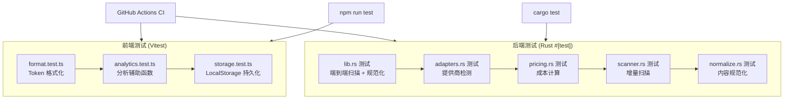
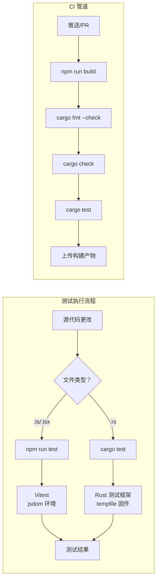

# 测试

PromptLens 同时拥有前端（Vitest）和后端（Rust `#[test]`）测试套件。测试在每次推送和拉取请求时自动在 CI 中运行。

## 测试策略





## 前端测试 (Vitest)

前端使用 **Vitest** 配合 jsdom 进行单元测试。

### 运行前端测试

```bash
# 运行所有测试一次
npm run test

# 以监视模式运行（文件更改时重新运行）
npm run test:watch

# 运行特定测试文件
npx vitest src/lib/format.test.ts

# 运行并生成覆盖率报告
npx vitest --coverage
```

### 测试文件

| 文件 | 描述 | 测试数量 |
|------|-------------|------------|
| `src/lib/format.test.ts` | 格式化工具测试（token 计数、日期、时长） | ~10 |
| `src/app/analytics.test.ts` | 分析计算辅助函数测试 | ~8 |
| `src/app/storage.test.ts` | localStorage 持久化辅助函数测试 | ~5 |

### 测试配置

Vitest 在 `vite.config.ts`（或 `vitest.config.ts`）中配置。关键设置：

| 设置 | 值 |
|---------|-------|
| 环境 | `jsdom` |
| 全局变量 | `true`（无需导入 `describe`、`it`、`expect`） |
| 设置文件 | `@testing-library/jest-dom` 提供 DOM 匹配器 |

`package.json` 中的测试脚本：
```json
// file: package.json:14
{
  "scripts": {
    "test": "vitest run",
    "test:watch": "vitest"
  }
}
```

### 编写前端测试

```typescript
// file: src/lib/format.test.ts（示例模式）
import { describe, it, expect } from "vitest";
import { formatTokens } from "./format";

describe("formatTokens", () => {
  it("格式化小数字不带后缀", () => {
    expect(formatTokens(500)).toBe("500");
  });

  it("格式化千位数字带 k 后缀", () => {
    expect(formatTokens(1500)).toBe("1.5k");
  });

  it("null 返回破折号", () => {
    expect(formatTokens(null)).toBe("-");
  });
});
```

使用 Testing Library 测试 React 组件：
```typescript
// 组件测试模式
import { render, screen } from "@testing-library/react";
import { describe, it, expect } from "vitest";

describe("ComponentName", () => {
  it("正确渲染", () => {
    render(<ComponentName prop="value" />);
    expect(screen.getByText("expected text")).toBeInTheDocument();
  });
});
```

## 后端测试 (Rust)

Rust 后端使用内置的 `#[test]` 框架，配合 `tempfile` 处理固件文件。

### 运行后端测试

```bash
cd src-tauri

# 运行所有测试
cargo test

# 运行并显示 stdout
cargo test -- --nocapture

# 按名称运行特定测试
cargo test scan_jsonl_tracks

# 在特定模块中运行测试
cargo test adapters::tests

# 列出所有测试但不运行
cargo test -- --list
```

### 测试模块

| 模块 | 测试数量 | 测试内容 |
|--------|-----------|----------------|
| `lib.rs` | 8+ | 端到端扫描、规范化、图片检测、代理会话 |
| `adapters.rs` | 4 | 提供商自动检测启发式算法（OpenAI、Gemini、Ollama、Anthropic） |
| `pricing.rs` | 5 | 定价表加载、精确/模糊匹配、未知模型、成本计算 |
| `normalize.rs` | （内联） | 摘要提取、内容规范化 |
| `scanner.rs` | （内联） | 增量扫描、偏移量跟踪 |

### 测试固件

测试固件文件位于 `src-tauri/fixtures/`：

| 固件文件 | 提供商 | 用途 |
|-------------|----------|---------|
| `openai_chat.json` | OpenAI | 聊天完成响应 |
| `anthropic_messages.json` | Anthropic | Messages API 响应 |
| `gemini_candidate.json` | Google Gemini | Candidate 响应 |
| `ollama_chat.json` | Ollama | 本地模型响应 |
| `agent_claude_code_session.jsonl` | Claude Code | 代理会话日志 |
| `agent_codex_session.jsonl` | Codex | 代理会话日志 |

### 编写后端测试

```rust
// file: src-tauri/src/pricing.rs:74-116
#[cfg(test)]
mod tests {
    use super::*;

    #[test]
    fn loads_pricing_table() {
        let table = load_pricing_table();
        assert!(table.len() >= 15);
        assert!(table.iter().any(|p| p.model == "gpt-4o"));
        assert!(table.iter().any(|p| p.model == "claude-sonnet-4"));
    }

    #[test]
    fn exact_model_match() {
        let table = load_pricing_table();
        let p = find_pricing("gpt-4o", &table).unwrap();
        assert_eq!(p.model, "gpt-4o");
    }

    #[test]
    fn fuzzy_model_match() {
        let table = load_pricing_table();
        let p = find_pricing("gpt-4o-2024-08-06", &table).unwrap();
        assert_eq!(p.model, "gpt-4o");
    }

    #[test]
    fn unknown_model_returns_zero() {
        let table = load_pricing_table();
        let cost = calculate_cost("unknown-model-xyz", Some(1000), Some(500), &table);
        assert_eq!(cost.total_cost, 0.0);
        assert!(cost.matched_pricing.is_none());
    }

    #[test]
    fn cost_calculation() {
        let table = load_pricing_table();
        let cost = calculate_cost("gpt-4o", Some(1_000_000), Some(1_000_000), &table);
        assert!((cost.input_cost - 2.50).abs() < 0.01);
        assert!((cost.output_cost - 10.00).abs() < 0.01);
        assert!((cost.total_cost - 12.50).abs() < 0.01);
    }
}
```

测试提供商检测：
```rust
// file: src-tauri/src/adapters.rs:38-62
#[cfg(test)]
mod tests {
    use super::*;
    use serde_json::json;

    #[test]
    fn detects_common_providers() {
        assert_eq!(
            detect_provider(&json!({"choices": []})).as_deref(),
            Some("openai")
        );
        assert_eq!(
            detect_provider(&json!({"candidates": []})).as_deref(),
            Some("gemini")
        );
        assert_eq!(
            detect_provider(&json!({"message": {}, "done": true})).as_deref(),
            Some("ollama")
        );
        assert_eq!(
            detect_provider(&json!({"content": [{"type": "text", "text": "ok"}]})).as_deref(),
            Some("anthropic")
        );
    }
}
```

### 使用 tempfile 进行扫描测试

```rust
// 使用临时文件的扫描测试模式
use tempfile::NamedTempFile;
use std::io::Write;
use serde_json::json;

#[test]
fn test_scan_with_temp_file() {
    let mut file = NamedTempFile::new().expect("temp file");
    writeln!(file, "{}", json!({"model": "gpt-4o"})).unwrap();
    writeln!(file, "not-json").unwrap();

    let result = scan_jsonl_inner(
        file.path().to_string_lossy().to_string(),
        None,
        None
    ).unwrap();

    assert_eq!(result.valid_records, 1);
    assert_eq!(result.invalid_records, 1);
}
```

### 隔离测试缓存

与 SQLite 缓存交互的后端测试将 `PROMPTLENS_CACHE_PATH` 设置为临时文件，并使用 `Mutex` 保护访问：

```rust
static TEST_CACHE_ENV: Mutex<()> = Mutex::new(());

#[test]
fn cached_scan_returns_hit() {
    let _guard = TEST_CACHE_ENV.lock().unwrap();
    let cache_file = NamedTempFile::new().unwrap();
    std::env::set_var("PROMPTLENS_CACHE_PATH", cache_file.path());
    // ... 测试逻辑 ...
    std::env::remove_var("PROMPTLENS_CACHE_PATH");
}
```

## CI 测试

两个测试套件在 GitHub Actions `build.yml` 工作流中自动运行：

```yaml
# file: .github/workflows/build.yml:71-79
- name: Rust checks
  working-directory: src-tauri
  run: |
    cargo fmt --check
    cargo check --target ${{ matrix.target }}

- name: Rust tests
  working-directory: src-tauri
  run: cargo test
```

| 步骤 | 命令 | 平台 |
|------|---------|----------|
| 前端构建 | `npm run build` | 全部 |
| Rust 格式化 | `cargo fmt --check` | 全部 |
| Rust 类型检查 | `cargo check --target <target>` | 全部 |
| Rust 测试 | `cargo test` | 全部 |

详见 [CI/CD](ci-cd) 页面了解完整工作流详情。

## 测试覆盖率

前端未配置覆盖率工具。Rust 覆盖率可通过以下方式生成：

```bash
# 需要 cargo-tarpaulin
cargo install cargo-tarpaulin
cd src-tauri
cargo tarpaulin --out Html
```

## 手动测试固件

生成大型 JSONL 文件用于手动测试：

```bash
# 生成约 100 行
npm run sample:large

# 生成自定义大小
node scripts/generate-large-sample.mjs 500 10
# 参数：[行数] [目标 MB]
```

## 测试最佳实践

| 实践 | 描述 |
|----------|-------------|
| 使用 `tempfile` | 永远不要将测试文件写入仓库；使用 `NamedTempFile` |
| 隔离缓存 | 使用 `PROMPTLENS_CACHE_PATH` 环境变量 + `Mutex` 保护 |
| 测试边界情况 | 包括无效 JSON、空文件、缺失字段 |
| 使用 `json!` 宏 | 使用 `serde_json::json!` 内联构建测试固件 |
| 运行 `--nocapture` | 使用 `cargo test -- --nocapture` 查看 `println!` 输出 |
| 清晰命名测试 | 使用描述性名称如 `fuzzy_model_match` |
