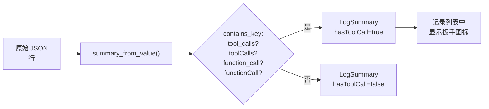
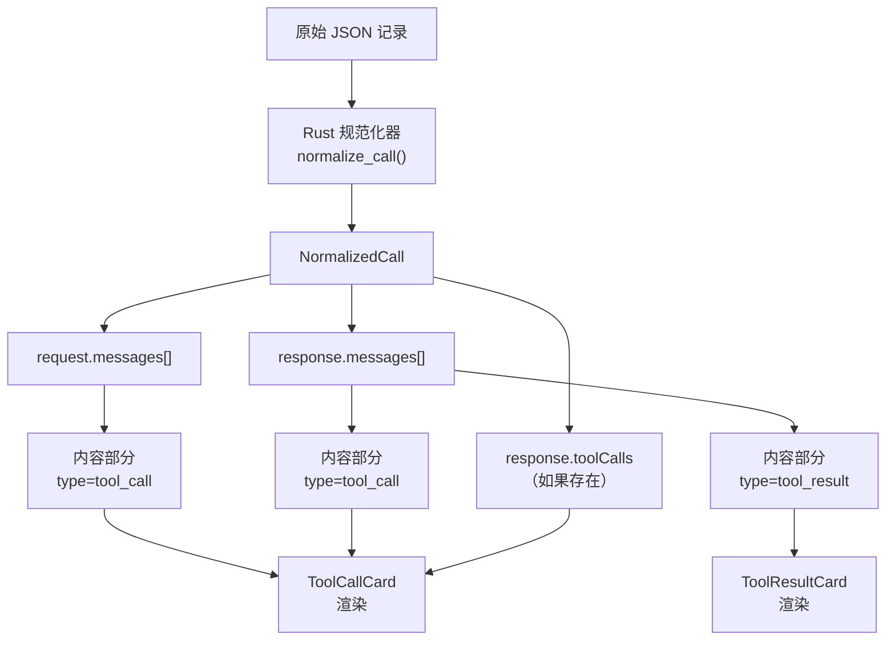
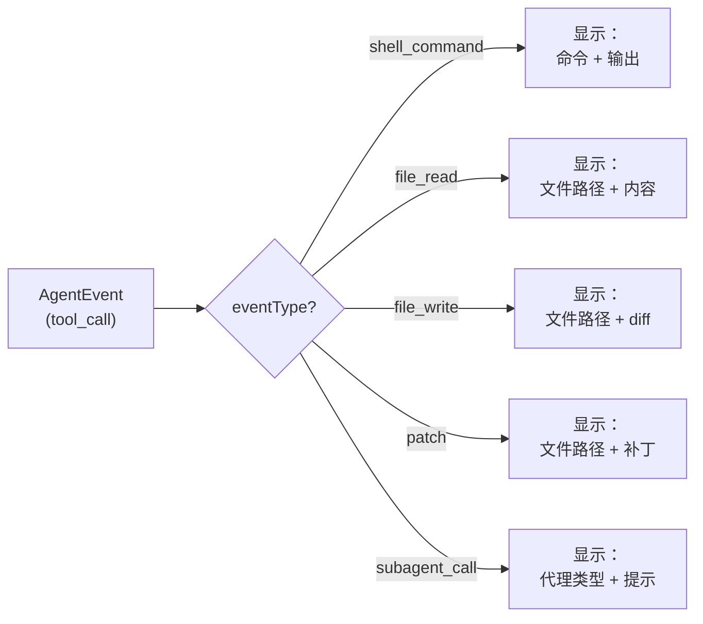
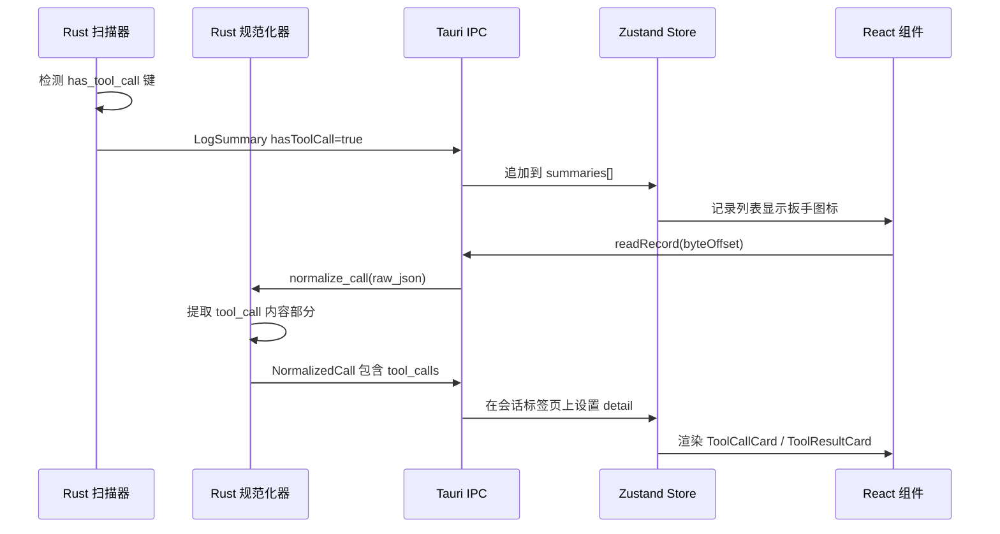
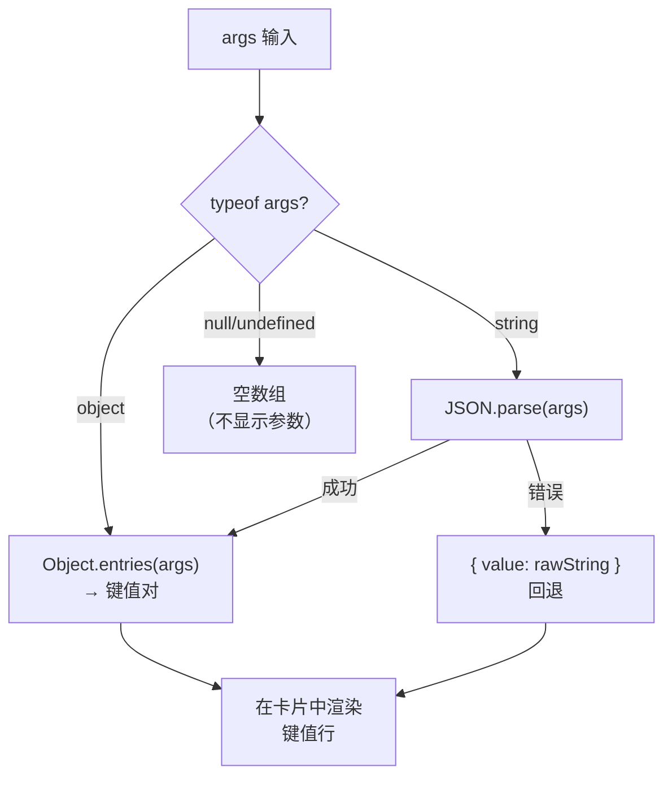

# 工具调用

PromptLens 为 LLM 对话中的工具调用和工具结果提供了结构化视图。工具是 LLM 可以调用的函数，用于执行搜索网页、读取文件或执行代码等操作。

## 工具调用检测

在扫描过程中，PromptLens 会标记包含工具调用的记录。检测逻辑检查 JSON 结构中的工具相关键：

```rust
// file: src-tauri/src/normalize.rs:74-77
has_tool_call: contains_key(
    value,
    &["tool_calls", "toolCalls", "function_call", "functionCall"],
),
```

`contains_key` 辅助函数递归搜索 JSON 值中的所有列出的键名：

```rust
// file: src-tauri/src/normalize.rs
fn contains_key(value: &Value, keys: &[&str]) -> bool {
    match value {
        Value::Object(map) => {
            map.keys().any(|k| keys.contains(&k.as_str()))
                || map.values().any(|v| contains_key(v, keys))
        }
        Value::Array(arr) => arr.iter().any(|v| contains_key(v, keys)),
        _ => false,
    }
}
```

包含工具调用的记录在记录列表中显示扳手图标。您可以使用状态过滤下拉菜单中的"Tools"选项来筛选工具调用记录。



## ToolCallCard

当消息包含 `tool_call` 内容部分时，PromptLens 将其渲染为 `ToolCallCard`：

```tsx
// file: src/app/components/CenterPanel.tsx:357
function ToolCallCard({ name, args }: { name?: string; args?: unknown }) {
  const parsed = parseArgs(args);
  const entries = parsed ? Object.entries(parsed) : [];
  return (
    <div className="tool-call-card">
      <div className="tool-call-header">
        <Wrench size={14} />
        <span className="tool-call-name">{name ?? "unknown"}</span>
      </div>
      {entries.length > 0 ? (
        <div className="tool-call-args">
          {entries.map(([key, value]) => (
            <div key={key} className="tool-call-kv">
              <span className="tool-call-key">{key}</span>
              <span className="tool-call-value">
                {typeof value === "object" ? JSON.stringify(value) : String(value)}
              </span>
            </div>
          ))}
        </div>
      ) : null}
    </div>
  );
}
```

```
+--------------------------------------------------+
| [wrench] get_weather                              |
+--------------------------------------------------+
| city         Paris                                |
| units        metric                               |
| format       detailed                             |
+--------------------------------------------------+
```

`parseArgs` 辅助函数处理多种参数格式：

- 如果 `args` 已经是对象，直接使用。
- 如果 `args` 是 JSON 字符串，通过 `JSON.parse()` 解析。
- 如果解析失败，原始字符串作为单个 `"value"` 条目返回。

## ToolResultCard

工具结果以可折叠卡片的形式显示：

```tsx
// file: src/app/components/CenterPanel.tsx:382
function ToolResultCard({ name, result }: { name?: string; result?: unknown }) {
  const [expanded, setExpanded] = useState(false);
  const text = typeof result === "string" ? result : safeJson(result);
  const preview = text.length > 120 ? text.slice(0, 120) + "..." : text;
  return (
    <div className="tool-result-card">
      <button className="tool-result-header" onClick={() => setExpanded((v) => !v)}>
        {expanded ? <ChevronDown size={14} /> : <ChevronRight size={14} />}
        <span className="tool-result-label">
          {name ? `${name} result` : "Result"}
        </span>
        {!expanded && <span className="tool-result-preview">{preview}</span>}
      </button>
      {expanded && (
        <pre className="tool-result-body">{highlightJson(safeJson(result))}</pre>
      )}
    </div>
  );
}
```

| 状态 | 显示内容 |
|------|---------|
| 折叠 | 显示工具名称 + 结果的前 120 个字符作为预览 |
| 展开 | 显示完整结果，带有 JSON 语法高亮（通过 `highlightJson()`） |

## 工具标签页（右侧面板）

右侧面板中的 **Tools** 标签页提供了所有工具调用和结果的结构化 JSON 视图：

```tsx
// file: src/app/components/RightPanel.tsx:138
function ToolCallsView({ detail, agentEvent }) {
  if (agentEvent) {
    const toolContext = {
      eventType: agentEvent.eventType,
      toolName: agentEvent.toolName,
      toolUseId: agentEvent.toolUseId,
      command: agentEvent.command,
      filePaths: agentEvent.filePaths,
      status: agentEvent.status,
      durationMs: agentEvent.durationMs,
      output: rawTextByKeys(agentEvent.raw, [
        "output", "stdout", "stderr", "result", "content",
      ]),
      raw: agentEvent.raw,
    };
    return <JsonCode value={toolContext} />;
  }
  // ... 标准工具调用视图
}
```

对于代理事件，工具标签页显示包含事件类型、工具名称、命令、文件路径、状态、持续时间和输出的结构化上下文对象。

## 工具调用数据流



## 工具内容规范化

Rust 规范化器处理各提供商的多种工具调用格式：

```rust
// file: src-tauri/src/normalize.rs:449-458
if matches!(
    value.get("type").and_then(Value::as_str),
    Some("tool_call") | Some("function_call") | Some("tool_use")
) {
    return vec![NormalizedContent::ToolCall {
        name: value
            .get("name")
            .or_else(|| value.get("id"))
            .and_then(Value::as_str)
            .map(str::to_string),
        arguments: value
            .get("arguments")
            .or_else(|| value.get("input"))
            .cloned(),
    }];
}
```

规范化器检查 `type` 字段的三个可能值（`tool_call`、`function_call`、`tool_use`）以覆盖所有支持的提供商。工具名称从 `name` 或 `id` 字段提取，参数从 `arguments` 或 `input` 提取。

| 提供商 | 工具调用格式 | 规范化为 |
|--------|------------|---------|
| OpenAI | `tool_calls[].function` | `ToolCall { name, arguments }` |
| Anthropic | `tool_use` 内容块 | `ToolCall { name, arguments }` |
| Gemini | Function call 部分 | `ToolCall { name, arguments }` |
| Ollama | `tool_calls` 数组 | `ToolCall { name, arguments }` |

## 工具结果规范化

工具结果遵循类似的规范化路径：

```rust
// file: src-tauri/src/normalize.rs
if matches!(
    value.get("type").and_then(Value::as_str),
    Some("tool_result") | Some("function_call_output") | Some("tool_result_content")
) {
    return vec![NormalizedContent::ToolResult {
        name: value.get("name").and_then(Value::as_str).map(str::to_string),
        result: value
            .get("content")
            .or_else(|| value.get("output"))
            .or_else(|| value.get("result"))
            .cloned(),
    }];
}
```

| 提供商 | 工具结果格式 | 规范化为 |
|--------|------------|---------|
| OpenAI | `tool` 角色消息 | `ToolResult { name, result }` |
| Anthropic | `tool_result` 内容块 | `ToolResult { name, result }` |
| Gemini | Function response 部分 | `ToolResult { name, result }` |

## 常见工具类型

| 提供商/代理 | 常见工具 |
|-----------|---------|
| OpenAI 函数调用 | API 请求中定义的自定义函数名 |
| Anthropic 工具使用 | `computer_use`、`text_editor`、`Bash`、`Task`、`Agent` |
| Codex | `exec_command`、`apply_patch` |
| Claude Code | `Bash`、`Read`、`Write`、`Edit`、`Task`、`Agent`、`Glob`、`Grep` |
| OpenCode | `read`、`write`、`edit`、`shell` |

## 代理会话中的工具调用

代理会话具有更丰富的工具交互。当您选择代理工具事件时，中心面板会显示包含命令、输出、文件路径和结构化工具结果内容的完整详情视图。



| 事件类型 | 代表含义 |
|---------|---------|
| `shell_command` | 执行了终端命令 |
| `file_read` | 读取了文件 |
| `file_write` | 写入了文件 |
| `patch` | 对文件应用了 diff/补丁 |
| `tool_call` | 调用了通用工具 |
| `tool_result` | 工具调用的结果 |
| `subagent_call` | 生成了子代理 |
| `subagent_result` | 子代理返回了结果 |

## 右侧面板的工具相关标签页

当选择工具相关消息时，右侧面板提供上下文敏感的标签页：

```ts
// file: src/app/types.ts
export type RightTab = "diff" | "tools" | "error" | "raw" | "json";
```

| 标签页 | 内容 |
|-------|------|
| **Tools** | 工具调用和结果的结构化视图（ToolCallsView） |
| **Raw** | 选中消息的原始 JSON 负载 |
| **JSON** | 美化打印的规范化 JSON |
| **Diff** | 并排比较（设置了比较基线时） |
| **Error** | 错误详情（记录具有错误状态时） |

## 调试工具调用问题

| 问题 | 可能原因 | 解决方案 |
|------|---------|---------|
| 工具调用未显示 | 记录未标记 `hasToolCall` | 检查 JSON 结构是否匹配预期格式 |
| 参数显示为原始字符串 | 参数是 JSON 字符串而非对象 | 卡片会回退显示原始字符串 |
| 工具结果被截断 | 结果超过 120 个字符 | 点击展开 ToolResultCard |
| 空的工具结果 | result 字段为 null 或缺失 | 检查原始 JSON 以确认结果的实际位置 |
| 错误的工具名称 | `name` 字段缺失；回退使用 `id` | 检查原始 JSON 确认哪个字段包含名称 |

## 工具调用渲染管道

从原始 JSON 到可视卡片的完整渲染管道：



## 工具调用内容部分

规范化后，工具调用作为消息数组中的类型化内容部分出现：

```ts
// 概念类型（来自规范化输出）
type NormalizedContent =
  | { type: "text"; text: string }
  | { type: "tool_call"; name?: string; arguments?: unknown }
  | { type: "tool_result"; name?: string; result?: unknown }
  | { type: "image"; source: string };
```

中心面板遍历内容部分，为每种类型渲染适当的组件：

```tsx
// MessageCard 中的概念渲染逻辑
{message.content.map((part, i) => {
  if (part.type === "text") return <MarkdownText key={i} text={part.text} />;
  if (part.type === "tool_call") return <ToolCallCard key={i} name={part.name} args={part.arguments} />;
  if (part.type === "tool_result") return <ToolResultCard key={i} name={part.name} result={part.result} />;
  if (part.type === "image") return <ImageCard key={i} src={part.source} />;
  return null;
})}
```

## 分析中的工具调用统计

包含工具调用的记录在分析摘要中被跟踪。每条 `LogSummary` 上的 `hasToolCall` 标志支持：

- 过滤记录列表仅显示工具调用记录（状态过滤器："Tools"）
- 在分析概览中统计工具调用记录
- 识别哪些模型最频繁使用工具调用

## 跨提供商比较工具调用

由于 PromptLens 将所有提供商的工具调用规范化为相同的 `ToolCall { name, arguments }` 结构，您可以：

1. 打开包含混合提供商工具调用的日志（例如 OpenAI + Anthropic）
2. 过滤到工具调用记录
3. 并排比较规范化后的工具调用结构
4. 使用 Diff 标签页比较特定的工具调用参数

## 工具调用参数处理

ToolCallCard 中的 `parseArgs` 辅助函数处理各种参数格式：



这确保来自不同提供商的工具调用 -- 可能将参数序列化为对象或 JSON 字符串 -- 始终能正确显示。

## 工具调用过滤工作流

分析工具调用的推荐工作流：

1. 打开您的审计日志。
2. 将状态过滤器设置为"Tools"以仅显示包含工具调用的记录。
3. 点击记录查看带有工具调用卡片的完整对话。
4. 切换到右侧面板的 Tools 标签页查看结构化 JSON 视图。
5. 使用搜索查找特定工具名称（例如搜索 "Bash" 或 "Read"）。
6. 将过滤后的工具调用记录导出为 JSONL 以进行进一步分析。

## 相关页面

- [代理会话](agent-sessions.md) -- 代理会话中的工具交互
- [查看对话](viewing-conversations.md) -- 消息卡片渲染和视图模式
- [搜索](search.md) -- 查找包含工具调用的记录
